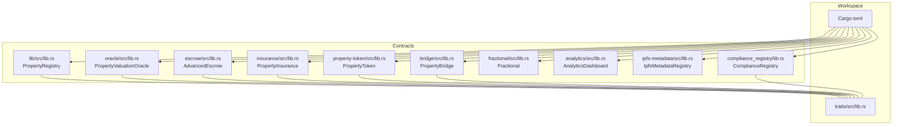
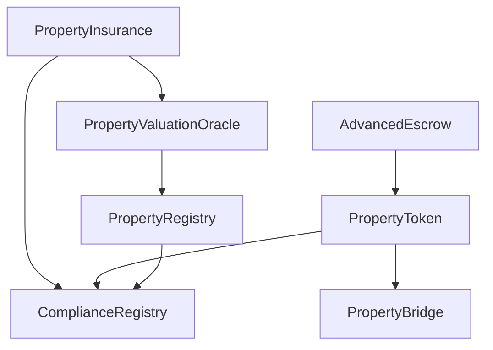
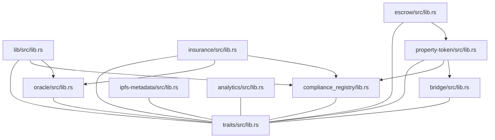

# API Reference

<cite>
**Referenced Files in This Document**
- [Cargo.toml](file://stellar-insured-contracts/Cargo.toml)
- [lib.rs](file://stellar-insured-contracts/contracts/lib/src/lib.rs)
- [lib.rs](file://stellar-insured-contracts/contracts/traits/src/lib.rs)
- [lib.rs](file://stellar-insured-contracts/contracts/escrow/src/lib.rs)
- [lib.rs](file://stellar-insured-contracts/contracts/insurance/src/lib.rs)
- [lib.rs](file://stellar-insured-contracts/contracts/property-token/src/lib.rs)
- [lib.rs](file://stellar-insured-contracts/contracts/bridge/src/lib.rs)
- [lib.rs](file://stellar-insured-contracts/contracts/fractional/src/lib.rs)
- [lib.rs](file://stellar-insured-contracts/contracts/analytics/src/lib.rs)
- [lib.rs](file://stellar-insured-contracts/contracts/ipfs-metadata/src/lib.rs)
- [lib.rs](file://stellar-insured-contracts/contracts/oracle/src/lib.rs)
- [lib.rs](file://stellar-insured-contracts/contracts/compliance_registry/lib.rs)
</cite>

## Table of Contents
1. [Introduction](#introduction)
2. [Project Structure](#project-structure)
3. [Core Components](#core-components)
4. [Architecture Overview](#architecture-overview)
5. [Detailed Component Analysis](#detailed-component-analysis)
6. [Dependency Analysis](#dependency-analysis)
7. [Performance Considerations](#performance-considerations)
8. [Troubleshooting Guide](#troubleshooting-guide)
9. [Conclusion](#conclusion)
10. [Appendices](#appendices)

## Introduction
This document provides a comprehensive API reference for the PropChain ecosystem of contracts built with Ink!/Soroban. It catalogs all public functions, parameters, return values, error codes, authorization requirements, state queries, event emissions, and performance characteristics across the Property Registry, Oracle, Escrow, Insurance, Property Token, Bridge, Fractional, Analytics, IPFS Metadata, and Compliance Registry contracts. It also includes migration notes and compatibility guidance derived from the codebase.

## Project Structure
The workspace is organized as a Rust/Cargo workspace with multiple contracts and shared traits. Contracts expose public messages and events, while shared traits define cross-contract interfaces and data models.

**Diagram sources**
- [Cargo.toml:1-45](file://stellar-insured-contracts/Cargo.toml#L1-L45)
- [lib.rs:1-120](file://stellar-insured-contracts/contracts/lib/src/lib.rs#L1-L120)
- [lib.rs:23-722](file://stellar-insured-contracts/contracts/traits/src/lib.rs#L23-L722)

**Section sources**
- [Cargo.toml:1-45](file://stellar-insured-contracts/Cargo.toml#L1-L45)

## Core Components
This section summarizes the primary contracts and their roles in the ecosystem.

- Property Registry (PropertyRegistry): Central registry for properties, approvals, badges, verifications, appeals, and governance controls.
- Property Valuation Oracle (PropertyValuationOracle): Aggregates valuations from multiple sources, emits confidence metrics, manages alerts, and supports AI integration.
- Escrow (AdvancedEscrow): Multi-signature, time-locked, document-custody-enabled escrow with dispute resolution.
- Property Insurance (PropertyInsurance): Risk pooling, policy lifecycle, claims processing, reinsurance, tokenization, and secondary market.
- Property Token (PropertyToken): ERC-721/1155-compatible token with property metadata, fractional shares, voting, trading, and cross-chain bridging.
- Property Bridge (PropertyBridge): Multi-signature cross-chain bridge orchestration with operators, timeouts, and recovery actions.
- Fractional: Lightweight portfolio aggregation and tax reporting helpers.
- Analytics (AnalyticsDashboard): Market metrics, trends, and gas optimization guidance.
- IPFS Metadata (IpfsMetadataRegistry): Metadata validation, document registration, pinning/unpinning, and access control.
- Compliance Registry (ComplianceRegistry): Jurisdiction-aware compliance, AML/sanctions checks, GDPR consent, and audit logs.

**Section sources**
- [lib.rs:50-120](file://stellar-insured-contracts/contracts/lib/src/lib.rs#L50-L120)
- [lib.rs:13-75](file://stellar-insured-contracts/contracts/oracle/src/lib.rs#L13-L75)
- [lib.rs:11-162](file://stellar-insured-contracts/contracts/escrow/src/lib.rs#L11-L162)
- [lib.rs:11-120](file://stellar-insured-contracts/contracts/insurance/src/lib.rs#L11-L120)
- [lib.rs:10-102](file://stellar-insured-contracts/contracts/property-token/src/lib.rs#L10-L102)
- [lib.rs:10-61](file://stellar-insured-contracts/contracts/bridge/src/lib.rs#L10-L61)
- [lib.rs:55-58](file://stellar-insured-contracts/contracts/fractional/src/lib.rs#L55-L58)
- [lib.rs:72-82](file://stellar-insured-contracts/contracts/analytics/src/lib.rs#L72-L82)
- [lib.rs:260-280](file://stellar-insured-contracts/contracts/ipfs-metadata/src/lib.rs#L260-L280)
- [lib.rs:213-241](file://stellar-insured-contracts/contracts/compliance_registry/lib.rs#L213-L241)

## Architecture Overview
The contracts communicate via shared traits and direct cross-contract calls. The Property Registry coordinates property state and compliance checks. Oracles provide valuations consumed by Insurance and Property Token. Bridges enable cross-chain token movement. Compliance Registry enforces regulatory checks across the ecosystem.

**Diagram sources**
- [lib.rs:750-800](file://stellar-insured-contracts/contracts/lib/src/lib.rs#L750-L800)
- [lib.rs:787-800](file://stellar-insured-contracts/contracts/oracle/src/lib.rs#L787-L800)
- [lib.rs:657-704](file://stellar-insured-contracts/contracts/insurance/src/lib.rs#L657-L704)
- [lib.rs:1207-1216](file://stellar-insured-contracts/contracts/property-token/src/lib.rs#L1207-L1216)
- [lib.rs:115-164](file://stellar-insured-contracts/contracts/bridge/src/lib.rs#L115-L164)
- [lib.rs:262-280](file://stellar-insured-contracts/contracts/escrow/src/lib.rs#L262-L280)
- [lib.rs:383-410](file://stellar-insured-contracts/contracts/compliance_registry/lib.rs#L383-L410)

## Detailed Component Analysis

### Property Registry API
- Purpose: Property lifecycle management, approvals, badges, verifications, appeals, pause/resume governance, and analytics.
- Authorization: Admin-only operations enforced via caller checks; state-modifying functions often require admin or specific role.
- Key Messages:
  - Constructors: new()
  - Property lifecycle: register_property(metadata), update_metadata(property_id, metadata), get_property(property_id)
  - Transfers: transfer_property(property_id, to), approve(property_id, to), get_approved(property_id)
  - Escrow: create_escrow(property_id, amount), release_escrow(escrow_id), refund_escrow(escrow_id)
  - Governance: pause_contract(reason), resume_contract(), add_pause_guardian(account), remove_pause_guardian(account)
  - Badges: issue_badge(property_id, badge_type, metadata_url), revoke_badge(property_id, badge_type), get_badge(property_id, badge_type)
  - Verifications: request_verification(property_id, badge_type, evidence_url), review_verification(request_id, approved), get_verification_request(request_id)
  - Appeals: submit_appeal(property_id, badge_type, reason), resolve_appeal(appeal_id, approved), get_appeal(appeal_id)
  - Queries: get_escrow(escrow_id), get_badge(property_id, badge_type), get_verification_request(request_id), get_appeal(appeal_id), get_pause_info()
- Events: Extensive event system for all major operations (indexed topics for efficient filtering).
- Complexity/Gas: Operations vary; batch operations emit batch events; pause/resume governance involves multi-step state transitions.

Authorization and access control:
- Admin-only: set_compliance_registry, set_oracle, set_fee_manager, pause_contract, resume_contract, add/remove pause_guardians, add/remove verifiers, set_fee_provider, set_oracle_provider.
- Role-based: Verifiers can manage badges and verifications; parties involved in transfers/approvals control approvals.

State queries:
- get_property, get_escrow, get_badge, get_verification_request, get_appeal, get_pause_info, get_gas_metrics, get_global_analytics.

Error codes:
- PropertyNotFound, Unauthorized, InvalidMetadata, NotCompliant, ComplianceCheckFailed, EscrowNotFound, EscrowAlreadyReleased, BadgeNotFound, InvalidBadgeType, BadgeAlreadyIssued, NotVerifier, AppealNotFound, InvalidAppealStatus, ComplianceRegistryNotSet, OracleError, ContractPaused, AlreadyPaused, NotPaused, ResumeRequestAlreadyActive, ResumeRequestNotFound, InsufficientApprovals, AlreadyApproved, NotAuthorizedToPause.

Example call patterns:
- Register property: register_property({location, size, legal_description, valuation, documents_url})
- Transfer property: transfer_property(property_id, recipient_account)
- Approve transfer: approve(property_id, Some(spender_account))
- Create escrow: create_escrow(property_id, amount)
- Issue badge: issue_badge(property_id, PremiumListing, metadata_url)

Event emission patterns:
- PropertyRegistered, PropertyTransferred, PropertyMetadataUpdated, ApprovalGranted, ApprovalCleared, EscrowCreated, EscrowReleased, EscrowRefunded, AdminChanged, BatchPropertyRegistered, BatchPropertyTransferred, BatchMetadataUpdated, BatchPropertyTransferredToMultiple, BadgeIssued, BadgeRevoked, VerificationRequested, VerificationReviewed, AppealSubmitted, AppealResolved, VerifierUpdated, ContractPaused, ResumeRequested, ResumeApproved, ContractResumed, PauseGuardianUpdated.

Migration/version compatibility:
- Version field maintained in storage; events include event_version for forward compatibility.

**Section sources**
- [lib.rs:750-800](file://stellar-insured-contracts/contracts/lib/src/lib.rs#L750-L800)
- [lib.rs:24-48](file://stellar-insured-contracts/contracts/lib/src/lib.rs#L24-L48)
- [lib.rs:350-750](file://stellar-insured-contracts/contracts/lib/src/lib.rs#L350-L750)

### Property Valuation Oracle API
- Purpose: Provide property valuations with confidence metrics, manage oracle sources, detect anomalies, and integrate AI models.
- Authorization: Admin-only for configuration; public getters for valuations.
- Key Messages:
  - get_valuation(property_id) -> PropertyValuation
  - get_valuation_with_confidence(property_id) -> ValuationWithConfidence
  - request_property_valuation(property_id) -> u64
  - batch_request_valuations(property_ids) -> Vec<u64>
  - update_property_valuation(property_id, valuation) -> ()
  - update_valuation_from_sources(property_id) -> ()
  - set_ai_valuation_contract(ai_contract) -> ()
  - get_ai_valuation_contract() -> Option<AccountId>
  - add_oracle_source(source) -> ()
  - update_source_reputation(source_id, success) -> ()
  - slash_source(source_id, penalty) -> ()
  - set_price_alert(property_id, threshold_percentage, alert_address) -> ()
  - set_location_adjustment(adjustment) -> ()
  - update_market_trend(trend) -> ()
  - get_comparable_properties(property_id, radius_km) -> Vec<ComparableProperty>
  - get_historical_valuations(property_id, limit) -> Vec<PropertyValuation>
  - get_market_volatility(property_type, location) -> VolatilityMetrics
- Events: ValuationUpdated, PriceAlertTriggered, OracleSourceAdded.
- Complexity/Gas: Aggregation and outlier detection involve iterative computations; confidence scoring uses statistical measures.

Authorization and access control:
- Admin-only: add_oracle_source, update_source_reputation, slash_source, set_ai_valuation_contract, set_location_adjustment, update_market_trend, set_price_alert.

State queries:
- get_property_valuation, get_valuation_with_confidence, get_historical_valuations, get_market_volatility.

Error codes:
- PropertyNotFound, InsufficientSources, InvalidValuation, Unauthorized, OracleSourceNotFound, InvalidParameters, PriceFeedError, AlertNotFound, InsufficientReputation, SourceAlreadyExists, RequestPending.

Example call patterns:
- Request valuation: request_property_valuation(property_id)
- Get confidence metrics: get_valuation_with_confidence(property_id)
- Add source: add_oracle_source({id, source_type, address, is_active, weight})

Event emission patterns:
- ValuationUpdated, PriceAlertTriggered, OracleSourceAdded.

Migration/version compatibility:
- Confidence metrics and volatility indices included in response structures; historical valuations preserved with bounded retention.

**Section sources**
- [lib.rs:105-128](file://stellar-insured-contracts/contracts/oracle/src/lib.rs#L105-L128)
- [lib.rs:130-260](file://stellar-insured-contracts/contracts/oracle/src/lib.rs#L130-L260)
- [lib.rs:262-310](file://stellar-insured-contracts/contracts/oracle/src/lib.rs#L262-L310)
- [lib.rs:366-387](file://stellar-insured-contracts/contracts/oracle/src/lib.rs#L366-L387)
- [lib.rs:388-427](file://stellar-insured-contracts/contracts/oracle/src/lib.rs#L388-L427)
- [lib.rs:429-448](file://stellar-insured-contracts/contracts/oracle/src/lib.rs#L429-L448)
- [lib.rs:450-463](file://stellar-insured-contracts/contracts/oracle/src/lib.rs#L450-L463)
- [lib.rs:787-800](file://stellar-insured-contracts/contracts/oracle/src/lib.rs#L787-L800)

### Escrow API
- Purpose: Secure property transfers with multi-signature, time locks, document verification, and dispute resolution.
- Authorization: Operator-only for signing and executing; participants sign approvals; admin overrides for emergencies.
- Key Messages:
  - Constructors: new(min_high_value_threshold)
  - create_escrow_advanced(property_id, amount, buyer, seller, participants, required_signatures, release_time_lock) -> u64
  - deposit_funds(escrow_id) -> payable
  - release_funds(escrow_id) -> ()
  - refund_funds(escrow_id) -> ()
  - upload_document(escrow_id, document_hash, document_type) -> ()
  - verify_document(escrow_id, document_hash) -> ()
  - add_condition(escrow_id, description) -> u64
  - mark_condition_met(escrow_id, condition_id) -> ()
  - sign_approval(escrow_id, approval_type) -> ()
  - raise_dispute(escrow_id, reason) -> ()
  - resolve_dispute(escrow_id, resolution) -> ()
  - emergency_override(escrow_id, release_to_seller) -> ()
  - get_escrow_details(escrow_id) -> EscrowData
- Events: EscrowCreated, FundsDeposited, FundsReleased, FundsRefunded, DocumentUploaded, DocumentVerified, ConditionAdded, ConditionMet, SignatureAdded, DisputeRaised, DisputeResolved, EmergencyOverride.
- Complexity/Gas: Multi-signature thresholds and document verification incur additional storage reads/writes.

Authorization and access control:
- Participants and buyers/sellers control operations; operators sign approvals; admin can emergency override.

State queries:
- get_escrow_details, get_disputes, get_documents, get_conditions, get_signatures.

Error codes:
- EscrowNotFound, Unauthorized, InvalidStatus, InsufficientFunds, ConditionsNotMet, SignatureThresholdNotMet, AlreadySigned, DocumentNotFound, DisputeActive, TimeLockActive, InvalidConfiguration, EscrowAlreadyFunded, ParticipantNotFound.

Example call patterns:
- Create escrow: create_escrow_advanced(property_id, amount, buyer, seller, [operators], required_signatures, release_time_lock)
- Sign release: sign_approval(escrow_id, Release)
- Upload document: upload_document(escrow_id, hash, "title_deed")

Event emission patterns:
- EscrowCreated, FundsDeposited, FundsReleased, FundsRefunded, DocumentUploaded, DocumentVerified, ConditionAdded, ConditionMet, SignatureAdded, DisputeRaised, DisputeResolved, EmergencyOverride.

**Section sources**
- [lib.rs:11-162](file://stellar-insured-contracts/contracts/escrow/src/lib.rs#L11-L162)
- [lib.rs:262-592](file://stellar-insured-contracts/contracts/escrow/src/lib.rs#L262-L592)

### Property Insurance API
- Purpose: Risk pooling, policy lifecycle, claims processing, reinsurance, tokenization, and secondary market.
- Authorization: Admin-only for pool management, fee rates, and dispute settings; assessors for claims; oracles for risk assessments.
- Key Messages:
  - Constructors: new(admin)
  - Pool management: create_risk_pool(name, coverage_type, max_coverage_ratio, reinsurance_threshold) -> u64, provide_pool_liquidity() -> payable
  - Risk assessment: update_risk_assessment(property_id, scores, valid_for_seconds) -> (), calculate_premium(property_id, coverage_amount, coverage_type) -> PremiumCalculation
  - Policy lifecycle: create_policy(property_id, coverage_type, coverage_amount, pool_id, duration_seconds, metadata_url) -> payable u64, cancel_policy(policy_id) -> ()
  - Claims: submit_claim(policy_id, claim_amount, description, evidence) -> u64, process_claim(claim_id, approved, oracle_report_url, rejection_reason) -> ()
  - Reinsurance: register_reinsurance(reinsurer, coverage_limit, retention_limit, premium_ceded_rate, coverage_types, duration_seconds) -> u64
  - Tokenization: list_token_for_sale(token_id, price) -> (), purchase_token(token_id) -> payable ()
  - Actuarial modeling: update_actuarial_model(coverage_type, loss_frequency, average_loss_severity, expected_loss_ratio, confidence_level, data_points) -> u64
  - Underwriting: set_underwriting_criteria(pool_id, ...) -> ()
  - Admin: authorize_oracle(oracle), authorize_assessor(assessor), set_platform_fee_rate(rate), set_claim_cooldown(period_seconds), set_dispute_window(seconds), set_arbiter(opt_account)
  - Disputes: move_to_dispute(claim_id) -> (), resolve_dispute(claim_id, approved) -> ()
  - Queries: get_policy(id), get_claim(id), get_pool(id), get_risk_assessment(property_id), get_policyholder_policies(holder), get_property_policies(property_id), get_policy_claims(policy_id), get_token(id), get_token_listings(), get_actuarial_model(id), get_reinsurance_agreement(id), get_underwriting_criteria(pool_id), get_liquidity_provider(pool_id, provider), get_policy_count(), get_claim_count(), get_admin(), get_dispute_window(), get_arbiter()
- Events: PolicyCreated, PolicyCancelled, ClaimSubmitted, ClaimApproved, ClaimRejected, PayoutExecuted, PoolCapitalized, ReinsuranceActivated, InsuranceTokenMinted, InsuranceTokenTransferred, RiskAssessmentUpdated, ClaimDisputed, DisputeResolved.
- Complexity/Gas: Premium calculations and pool capitalization involve arithmetic; claims processing includes multi-step state transitions.

Authorization and access control:
- Admin: pool management, fee rates, cooldown, dispute window, arbiter, oracle/assessor authorization.
- Authorized oracles/assessors: risk assessments and claims processing.

State queries:
- All query functions return structured data types (see Queries section).

Error codes:
- Unauthorized, PolicyNotFound, ClaimNotFound, PoolNotFound, PolicyAlreadyActive, PolicyExpired, PolicyInactive, InsufficientPremium, InsufficientPoolFunds, ClaimAlreadyProcessed, ClaimExceedsCoverage, InvalidParameters, OracleVerificationFailed, ReinsuranceCapacityExceeded, TokenNotFound, TransferFailed, CooldownPeriodActive, PropertyNotInsurable, DuplicateClaim, DisputeWindowExpired, InvalidDisputeTransition, InvalidEvidenceUri, InvalidEvidenceHash, InvalidEvidenceNonce.

Example call patterns:
- Create pool: create_risk_pool("Residential", Residential, 8000, 1000000)
- Calculate premium: calculate_premium(property_id, coverage_amount, Comprehensive)
- Submit claim: submit_claim(policy_id, claim_amount, description, {evidence_metadata})
- Process claim: process_claim(claim_id, true, "ipfs://report", "")

Event emission patterns:
- PolicyCreated, PolicyCancelled, ClaimSubmitted, ClaimApproved, ClaimRejected, PayoutExecuted, PoolCapitalized, ReinsuranceActivated, InsuranceTokenMinted, InsuranceTokenTransferred, RiskAssessmentUpdated, ClaimDisputed, DisputeResolved.

**Section sources**
- [lib.rs:528-562](file://stellar-insured-contracts/contracts/insurance/src/lib.rs#L528-L562)
- [lib.rs:568-651](file://stellar-insured-contracts/contracts/insurance/src/lib.rs#L568-L651)
- [lib.rs:657-704](file://stellar-insured-contracts/contracts/insurance/src/lib.rs#L657-L704)
- [lib.rs:706-751](file://stellar-insured-contracts/contracts/insurance/src/lib.rs#L706-L751)
- [lib.rs:757-864](file://stellar-insured-contracts/contracts/insurance/src/lib.rs#L757-L864)
- [lib.rs:867-902](file://stellar-insured-contracts/contracts/insurance/src/lib.rs#L867-L902)
- [lib.rs:908-998](file://stellar-insured-contracts/contracts/insurance/src/lib.rs#L908-L998)
- [lib.rs:1000-1076](file://stellar-insured-contracts/contracts/insurance/src/lib.rs#L1000-L1076)
- [lib.rs:1082-1116](file://stellar-insured-contracts/contracts/insurance/src/lib.rs#L1082-L1116)
- [lib.rs:1122-1212](file://stellar-insured-contracts/contracts/insurance/src/lib.rs#L1122-L1212)
- [lib.rs:1218-1250](file://stellar-insured-contracts/contracts/insurance/src/lib.rs#L1218-L1250)
- [lib.rs:1256-1285](file://stellar-insured-contracts/contracts/insurance/src/lib.rs#L1256-L1285)
- [lib.rs:1291-1324](file://stellar-insured-contracts/contracts/insurance/src/lib.rs#L1291-L1324)
- [lib.rs:1326-1450](file://stellar-insured-contracts/contracts/insurance/src/lib.rs#L1326-L1450)
- [lib.rs:1454-1566](file://stellar-insured-contracts/contracts/insurance/src/lib.rs#L1454-L1566)

### Property Token API
- Purpose: Tokenization of property ownership with fractional shares, voting, trading, dividends, and cross-chain bridging.
- Authorization: Admin and token owners control minting, approvals, and bridging; operators for compliance verification.
- Key Messages:
  - ERC-721: balance_of(owner), owner_of(token_id), transfer_from(from, to, token_id), approve(to, token_id), set_approval_for_all(operator, approved), get_approved(token_id), is_approved_for_all(owner, operator)
  - ERC-1155: balance_of_batch(accounts, ids) -> Vec<u128>, safe_batch_transfer_from(from, to, ids, amounts, data)
  - Property-specific: register_property_with_token(metadata) -> TokenId, batch_register_properties(metadata_list) -> Vec<TokenId>, attach_legal_document(token_id, document_hash, document_type) -> (), verify_compliance(token_id, verified) -> (), get_ownership_history(token_id) -> Option<Vec<OwnershipTransfer>>
  - Fractional: issue_shares(token_id, to, amount) -> (), redeem_shares(token_id, from, amount) -> (), transfer_shares(from, to, token_id, amount) -> (), deposit_dividends(token_id) -> payable (), withdraw_dividends(token_id) -> u128, create_proposal(token_id, quorum, description_hash) -> u64, vote(token_id, proposal_id, support) -> (), execute_proposal(token_id, proposal_id) -> bool, place_ask(token_id, price_per_share, amount) -> (), cancel_ask(token_id) -> (), buy_shares(token_id, seller, amount) -> payable (), get_last_trade_price(token_id) -> Option<u128>, get_portfolio(owner, token_ids) -> Vec<(TokenId, u128, u128)>, get_tax_record(owner, token_id) -> TaxRecord
  - Bridge: initiate_bridge_multisig(token_id, destination_chain, recipient, required_signatures, timeout_blocks) -> u64, sign_bridge_request(request_id, approve) -> (), monitor_bridge_status(request_id) -> Option<BridgeMonitoringInfo>, verify_bridge_transaction(transaction_hash, source_chain) -> bool, get_bridge_history(account) -> Vec<BridgeTransaction>, add_bridge_operator(operator) -> (), remove_bridge_operator(operator) -> (), is_bridge_operator(account) -> bool, get_bridge_operators() -> Vec<AccountId>, update_config(config) -> (), get_config() -> BridgeConfig, set_emergency_pause(paused) -> (), get_chain_info(chain_id) -> Option<ChainBridgeInfo>, update_chain_info(chain_id, info) -> (), estimate_bridge_gas(token_id, destination_chain) -> u64
  - Admin: set_compliance_registry(registry) -> ()
  - Queries: balance_of, owner_of, get_approved, is_approved_for_all, uri(token_id), total_shares(token_id), share_balance_of(owner, token_id), get_last_price(token_id), aggregate_portfolio(items) -> PortfolioAggregation, summarize_tax(dividends, proceeds) -> TaxReport
- Events: Transfer, Approval, ApprovalForAll, PropertyTokenMinted, LegalDocumentAttached, ComplianceVerified, TokenBridged, BridgeRequestCreated, BridgeRequestSigned, BridgeExecuted, BridgeFailed, BridgeRecovered, SharesIssued, SharesRedeemed, DividendsDeposited, DividendsWithdrawn, ProposalCreated, Voted, ProposalExecuted, AskPlaced, AskCancelled, SharesPurchased.
- Complexity/Gas: Batch operations and portfolio aggregation minimize per-item overhead; bridging incurs gas estimation and multi-signature overhead.

Authorization and access control:
- Admin: compliance registry, bridge operators, emergency pause, config updates.
- Token owners/operators: transfers, approvals, bridging, compliance verification.

State queries:
- All query functions return structured data types (see Queries section).

Error codes:
- TokenNotFound, Unauthorized, PropertyNotFound, InvalidMetadata, DocumentNotFound, ComplianceFailed, BridgeNotSupported, InvalidChain, BridgeLocked, InsufficientSignatures, RequestExpired, InvalidRequest, BridgePaused, GasLimitExceeded, MetadataCorruption, InvalidBridgeOperator, DuplicateBridgeRequest, BridgeTimeout, AlreadySigned, InsufficientBalance, InvalidAmount, ProposalNotFound, ProposalClosed, AskNotFound.

Example call patterns:
- Mint token: register_property_with_token({location, size, legal_description, valuation, documents_url})
- Issue shares: issue_shares(token_id, buyer, shares)
- Place ask: place_ask(token_id, price_per_share, amount)
- Initiate bridge: initiate_bridge_multisig(token_id, chain_id, recipient, required_signatures, timeout_blocks)

Event emission patterns:
- PropertyTokenMinted, LegalDocumentAttached, ComplianceVerified, TokenBridged, BridgeRequestCreated, BridgeRequestSigned, BridgeExecuted, BridgeFailed, BridgeRecovered, SharesIssued, SharesRedeemed, DividendsDeposited, DividendsWithdrawn, ProposalCreated, Voted, ProposalExecuted, AskPlaced, AskCancelled, SharesPurchased.

**Section sources**
- [lib.rs:477-547](file://stellar-insured-contracts/contracts/property-token/src/lib.rs#L477-L547)
- [lib.rs:549-700](file://stellar-insured-contracts/contracts/property-token/src/lib.rs#L549-L700)
- [lib.rs:702-767](file://stellar-insured-contracts/contracts/property-token/src/lib.rs#L702-L767)
- [lib.rs:769-789](file://stellar-insured-contracts/contracts/property-token/src/lib.rs#L769-L789)
- [lib.rs:791-800](file://stellar-insured-contracts/contracts/property-token/src/lib.rs#L791-L800)
- [lib.rs:1240-1314](file://stellar-insured-contracts/contracts/property-token/src/lib.rs#L1240-L1314)
- [lib.rs:1316-1377](file://stellar-insured-contracts/contracts/property-token/src/lib.rs#L1316-L1377)
- [lib.rs:1379-1418](file://stellar-insured-contracts/contracts/property-token/src/lib.rs#L1379-L1418)
- [lib.rs:1420-1451](file://stellar-insured-contracts/contracts/property-token/src/lib.rs#L1420-L1451)
- [lib.rs:1453-1467](file://stellar-insured-contracts/contracts/property-token/src/lib.rs#L1453-L1467)
- [lib.rs:1469-1559](file://stellar-insured-contracts/contracts/property-token/src/lib.rs#L1469-L1559)
- [lib.rs:1561-1592](file://stellar-insured-contracts/contracts/property-token/src/lib.rs#L1561-L1592)

### Property Bridge API
- Purpose: Orchestrates cross-chain property token transfers with multi-signature, timeouts, and recovery.
- Authorization: Admin-only for configuration and emergency pause; operators sign bridge requests.
- Key Messages:
  - Constructors: new(supported_chains, min_signatures, max_signatures, default_timeout, gas_limit)
  - initiate_bridge_multisig(token_id, destination_chain, recipient, required_signatures, timeout_blocks, metadata) -> u64
  - sign_bridge_request(request_id, approve) -> ()
  - execute_bridge(request_id) -> ()
  - recover_failed_bridge(request_id, recovery_action) -> ()
  - estimate_bridge_gas(token_id, destination_chain) -> u64
  - monitor_bridge_status(request_id) -> Option<BridgeMonitoringInfo>
  - verify_bridge_transaction(transaction_hash, source_chain) -> bool
  - get_bridge_history(account) -> Vec<BridgeTransaction>
  - add_bridge_operator(operator) -> (), remove_bridge_operator(operator) -> (), is_bridge_operator(account) -> bool, get_bridge_operators() -> Vec<AccountId>
  - update_config(config) -> (), get_config() -> BridgeConfig
  - set_emergency_pause(paused) -> (), get_chain_info(chain_id) -> Option<ChainBridgeInfo>, update_chain_info(chain_id, info) -> ()
- Events: BridgeRequestCreated, BridgeRequestSigned, BridgeExecuted, BridgeFailed, BridgeRecovered.
- Complexity/Gas: Gas estimation considers metadata size and chain multipliers; multi-signature collection adds overhead.

Authorization and access control:
- Admin: config updates, emergency pause, operator management.
- Operators: sign bridge requests.

State queries:
- monitor_bridge_status, verify_bridge_transaction, get_bridge_history, get_config, get_bridge_operators, get_chain_info.

Error codes:
- Unauthorized, TokenNotFound, InvalidChain, BridgeNotSupported, InsufficientSignatures, RequestExpired, AlreadySigned, InvalidRequest, BridgePaused, InvalidMetadata, DuplicateRequest, GasLimitExceeded.

Example call patterns:
- Initiate bridge: initiate_bridge_multisig(token_id, dest_chain, recipient, req_sigs, timeout_blocks, metadata)
- Sign request: sign_bridge_request(request_id, true)
- Execute bridge: execute_bridge(request_id)

Event emission patterns:
- BridgeRequestCreated, BridgeRequestSigned, BridgeExecuted, BridgeFailed, BridgeRecovered.

**Section sources**
- [lib.rs:115-164](file://stellar-insured-contracts/contracts/bridge/src/lib.rs#L115-L164)
- [lib.rs:166-233](file://stellar-insured-contracts/contracts/bridge/src/lib.rs#L166-L233)
- [lib.rs:235-282](file://stellar-insured-contracts/contracts/bridge/src/lib.rs#L235-L282)
- [lib.rs:284-347](file://stellar-insured-contracts/contracts/bridge/src/lib.rs#L284-L347)
- [lib.rs:349-404](file://stellar-insured-contracts/contracts/bridge/src/lib.rs#L349-L404)
- [lib.rs:406-422](file://stellar-insured-contracts/contracts/bridge/src/lib.rs#L406-L422)
- [lib.rs:424-441](file://stellar-insured-contracts/contracts/bridge/src/lib.rs#L424-L441)
- [lib.rs:443-453](file://stellar-insured-contracts/contracts/bridge/src/lib.rs#L443-L453)
- [lib.rs:455-459](file://stellar-insured-contracts/contracts/bridge/src/lib.rs#L455-L459)
- [lib.rs:461-498](file://stellar-insured-contracts/contracts/bridge/src/lib.rs#L461-L498)
- [lib.rs:500-510](file://stellar-insured-contracts/contracts/bridge/src/lib.rs#L500-L510)
- [lib.rs:512-528](file://stellar-insured-contracts/contracts/bridge/src/lib.rs#L512-L528)
- [lib.rs:530-550](file://stellar-insured-contracts/contracts/bridge/src/lib.rs#L530-L550)

### Fractional API
- Purpose: Lightweight helpers for portfolio aggregation and tax reporting.
- Key Messages:
  - set_last_price(token_id, price_per_share) -> ()
  - get_last_price(token_id) -> Option<u128>
  - aggregate_portfolio(items) -> PortfolioAggregation
  - summarize_tax(dividends, proceeds) -> TaxReport
- Complexity/Gas: Minimal; O(n) for aggregation and tax summarization.

Authorization and access control:
- No authorization required; public messages.

State queries:
- get_last_price, aggregate_portfolio, summarize_tax.

Example call patterns:
- Set last price: set_last_price(token_id, price_per_share)
- Aggregate portfolio: aggregate_portfolio([{token_id, shares, price_per_share}])

**Section sources**
- [lib.rs:60-118](file://stellar-insured-contracts/contracts/fractional/src/lib.rs#L60-L118)

### Analytics API
- Purpose: Market metrics, trends, and gas optimization guidance.
- Key Messages:
  - Constructors: new()
  - get_market_metrics() -> MarketMetrics
  - update_market_metrics(average_price, total_volume, properties_listed) -> ()
  - add_market_trend(trend) -> ()
  - get_historical_trends() -> Vec<MarketTrend>
  - generate_market_report() -> MarketReport
  - get_gas_optimization_recommendations() -> String
- Complexity/Gas: Simple storage updates and vector iteration.

Authorization and access control:
- Admin-only for metric updates.

State queries:
- get_market_metrics, get_historical_trends, generate_market_report.

**Section sources**
- [lib.rs:84-185](file://stellar-insured-contracts/contracts/analytics/src/lib.rs#L84-L185)

### IPFS Metadata API
- Purpose: Validate and register property metadata, manage documents, pinning, and access control.
- Authorization: Admin-only for configuration; write access requires permission; read access depends on permissions.
- Key Messages:
  - Constructors: new(), new_with_rules(rules)
  - validate_and_register_metadata(property_id, metadata) -> ()
  - validate_metadata(metadata) -> ()
  - validate_ipfs_cid(cid) -> ()
  - register_ipfs_document(property_id, ipfs_cid, document_type, content_hash, file_size, mime_type, is_encrypted) -> u64
  - pin_document(document_id) -> ()
  - unpin_document(document_id) -> ()
  - verify_content_hash(document_id, provided_hash) -> bool
  - grant_access(property_id, account, access_level) -> ()
  - revoke_access(property_id, account) -> ()
  - get_metadata(property_id) -> Option<PropertyMetadata>
  - get_document(document_id) -> Option<IpfsDocument>
  - get_property_documents(property_id) -> Vec<u64>
  - get_document_by_cid(ipfs_cid) -> Option<IpfsDocument>
- Events: MetadataValidated, DocumentUploaded, DocumentPinned, DocumentUnpinned, ContentHashVerified, IpfsNetworkFailure, MaliciousFileDetected.
- Complexity/Gas: Validation and hashing operations; pin/unpin updates totals.

Authorization and access control:
- Admin: registry configuration; property owners/admins for access grants; read/write checks enforced.

State queries:
- All query functions return structured data types (see Queries section).

Error codes:
- PropertyNotFound, Unauthorized, InvalidMetadata, RequiredFieldMissing, DataTypeMismatch, SizeLimitExceeded, InvalidIpfsCid, IpfsNetworkFailure, ContentHashMismatch, MaliciousFileDetected, FileTypeNotAllowed, EncryptionRequired, PinLimitExceeded, DocumentNotFound, DocumentAlreadyExists.

Example call patterns:
- Validate and register: validate_and_register_metadata(property_id, metadata)
- Register document: register_ipfs_document(property_id, cid, Deed, hash, size, "application/pdf", false)
- Pin document: pin_document(document_id)

Event emission patterns:
- MetadataValidated, DocumentUploaded, DocumentPinned, DocumentUnpinned, ContentHashVerified, IpfsNetworkFailure, MaliciousFileDetected.

**Section sources**
- [lib.rs:299-344](file://stellar-insured-contracts/contracts/ipfs-metadata/src/lib.rs#L299-L344)
- [lib.rs:350-377](file://stellar-insured-contracts/contracts/ipfs-metadata/src/lib.rs#L350-L377)
- [lib.rs:379-427](file://stellar-insured-contracts/contracts/ipfs-metadata/src/lib.rs#L379-L427)
- [lib.rs:429-457](file://stellar-insured-contracts/contracts/ipfs-metadata/src/lib.rs#L429-L457)
- [lib.rs:463-553](file://stellar-insured-contracts/contracts/ipfs-metadata/src/lib.rs#L463-L553)
- [lib.rs:555-648](file://stellar-insured-contracts/contracts/ipfs-metadata/src/lib.rs#L555-L648)
- [lib.rs:650-687](file://stellar-insured-contracts/contracts/ipfs-metadata/src/lib.rs#L650-L687)
- [lib.rs:693-727](file://stellar-insured-contracts/contracts/ipfs-metadata/src/lib.rs#L693-L727)
- [lib.rs:780-800](file://stellar-insured-contracts/contracts/ipfs-metadata/src/lib.rs#L780-L800)

### Compliance Registry API
- Purpose: Jurisdiction-aware compliance, AML/sanctions checks, GDPR consent, and audit logs.
- Authorization: Admin-only for configuration; verifiers perform checks.
- Key Messages:
  - Constructors: new()
  - add_verifier(verifier) -> ()
  - submit_verification(account, jurisdiction, kyc_hash, risk_level, document_type, biometric_method, risk_score) -> ()
  - require_compliance(account) -> Result<(), Error>
  - is_compliant(account) -> bool
  - update_aml_status(account, passed, risk_factors) -> ()
  - update_sanctions_status(account, passed, list_checked) -> ()
  - revoke_verification(account) -> ()
  - update_consent(account, consent) -> ()
  - check_data_retention(account) -> bool
  - request_data_deletion(account) -> ()
  - get_compliance_data(account) -> Option<ComplianceData>
- Events: VerificationUpdated, ComplianceCheckPerformed, ConsentUpdated, DataRetentionExpired, AuditLogCreated, VerificationRequestCreated, ServiceProviderRegistered.
- Complexity/Gas: Risk scoring and factor-based risk assignment; retention checks.

Authorization and access control:
- Admin: verifier management, consent updates for users; verifiers: compliance checks.

State queries:
- get_compliance_data, is_compliant, check_data_retention.

Error codes:
- NotAuthorized, NotVerified, VerificationExpired, HighRisk, ProhibitedJurisdiction, AlreadyVerified, ConsentNotGiven, DataRetentionExpired, InvalidRiskScore, InvalidDocumentType, JurisdictionNotSupported.

Example call patterns:
- Submit verification: submit_verification(account, US, kyc_hash, Medium, Passport, Fingerprint, 40)
- Require compliance: require_compliance(account)
- Update consent: update_consent(account, Given)

**Section sources**
- [lib.rs:383-410](file://stellar-insured-contracts/contracts/compliance_registry/lib.rs#L383-L410)
- [lib.rs:480-486](file://stellar-insured-contracts/contracts/compliance_registry/lib.rs#L480-L486)
- [lib.rs:488-562](file://stellar-insured-contracts/contracts/compliance_registry/lib.rs#L488-L562)
- [lib.rs:603-635](file://stellar-insured-contracts/contracts/compliance_registry/lib.rs#L603-L635)
- [lib.rs:643-681](file://stellar-insured-contracts/contracts/compliance_registry/lib.rs#L643-L681)
- [lib.rs:683-709](file://stellar-insured-contracts/contracts/compliance_registry/lib.rs#L683-L709)
- [lib.rs:711-730](file://stellar-insured-contracts/contracts/compliance_registry/lib.rs#L711-L730)
- [lib.rs:732-759](file://stellar-insured-contracts/contracts/compliance_registry/lib.rs#L732-L759)
- [lib.rs:761-770](file://stellar-insured-contracts/contracts/compliance_registry/lib.rs#L761-L770)
- [lib.rs:772-800](file://stellar-insured-contracts/contracts/compliance_registry/lib.rs#L772-L800)

## Dependency Analysis
Shared traits define cross-contract interfaces and data models used by multiple contracts. The Property Registry consumes Compliance and Oracle services; Insurance consumes Oracle and Compliance; Property Token integrates Compliance and Bridge; Escrow interacts with Property Token; Analytics provides market metrics; IPFS Metadata supports property documentation; Compliance Registry governs regulatory checks.

**Diagram sources**
- [lib.rs:23-722](file://stellar-insured-contracts/contracts/traits/src/lib.rs#L23-L722)
- [lib.rs:17-18](file://stellar-insured-contracts/contracts/lib/src/lib.rs#L17-L18)
- [lib.rs:14-21](file://stellar-insured-contracts/contracts/oracle/src/lib.rs#L14-L21)
- [lib.rs:11-12](file://stellar-insured-contracts/contracts/insurance/src/lib.rs#L11-L12)
- [lib.rs:6-8](file://stellar-insured-contracts/contracts/property-token/src/lib.rs#L6-L8)
- [lib.rs:6-8](file://stellar-insured-contracts/contracts/bridge/src/lib.rs#L6-L8)
- [lib.rs:5-8](file://stellar-insured-contracts/contracts/escrow/src/lib.rs#L5-L8)
- [lib.rs:3-4](file://stellar-insured-contracts/contracts/compliance_registry/lib.rs#L3-L4)
- [lib.rs:6-7](file://stellar-insured-contracts/contracts/ipfs-metadata/src/lib.rs#L6-L7)
- [lib.rs:5-7](file://stellar-insured-contracts/contracts/analytics/src/lib.rs#L5-L7)

**Section sources**
- [lib.rs:23-722](file://stellar-insured-contracts/contracts/traits/src/lib.rs#L23-L722)

## Performance Considerations
- Batch operations: Property Registry supports batch registration/transfers/metadata updates to reduce gas per item.
- Storage layout: Structs use explicit storage layouts to optimize memory and retrieval.
- Gas tracking: Property Registry tracks gas metrics for monitoring; Analytics provides recommendations.
- Multi-signature bridging: Gas estimation considers metadata size and chain multipliers.
- Confidence metrics: Oracle aggregates prices with outlier detection to reduce variability and improve accuracy.

[No sources needed since this section provides general guidance]

## Troubleshooting Guide
Common issues and resolutions:
- Unauthorized access: Ensure caller has required role (admin, verifier, token owner, operator).
- Compliance failures: Verify KYC/AML/sanctions checks and GDPR consent; check jurisdiction rules.
- Escrow errors: Confirm multi-signature thresholds, time locks, and dispute status.
- Insurance claims: Validate evidence metadata, policy status, and cooldown periods.
- Bridge failures: Check operator signatures, chain support, and emergency pause status.
- IPFS metadata: Validate CID formats, file sizes, and access permissions.

**Section sources**
- [lib.rs:21-48](file://stellar-insured-contracts/contracts/lib/src/lib.rs#L21-L48)
- [lib.rs:16-32](file://stellar-insured-contracts/contracts/escrow/src/lib.rs#L16-L32)
- [lib.rs:21-50](file://stellar-insured-contracts/contracts/insurance/src/lib.rs#L21-L50)
- [lib.rs:14-30](file://stellar-insured-contracts/contracts/bridge/src/lib.rs#L14-L30)
- [lib.rs:20-54](file://stellar-insured-contracts/contracts/ipfs-metadata/src/lib.rs#L20-L54)
- [lib.rs:244-258](file://stellar-insured-contracts/contracts/compliance_registry/lib.rs#L244-L258)

## Conclusion
The PropChain contract suite provides a robust, modular framework for property digitalization, valuation, financing, and compliance. Shared traits and cross-contract integrations enable scalable and interoperable functionality across registries, oracles, escrow systems, insurance, tokenization, and bridging. The APIs emphasize clear authorization patterns, comprehensive event emission, and state query capabilities to support efficient client integrations and regulatory compliance.

[No sources needed since this section summarizes without analyzing specific files]

## Appendices

### Migration and Compatibility Notes
- Property Registry: Maintains version and event versioning; backward-compatible event schemas with indexed topics.
- Oracle: Confidence metrics and volatility indices included in response structures; historical valuations retained with bounded size.
- Insurance: Dispute window and arbiter features introduced; claim processing supports under-review and dispute resolution states.
- Property Token: Bridge configuration and operator management; fractional shares and dividend accounting integrated.
- Compliance Registry: Enhanced risk factors, GDPR consent, and data retention policies; audit logs provide compliance trails.

**Section sources**
- [lib.rs:330-350](file://stellar-insured-contracts/contracts/lib/src/lib.rs#L330-L350)
- [lib.rs:345-364](file://stellar-insured-contracts/contracts/oracle/src/lib.rs#L345-L364)
- [lib.rs:1326-1450](file://stellar-insured-contracts/contracts/insurance/src/lib.rs#L1326-L1450)
- [lib.rs:484-492](file://stellar-insured-contracts/contracts/property-token/src/lib.rs#L484-L492)
- [lib.rs:320-382](file://stellar-insured-contracts/contracts/compliance_registry/lib.rs#L320-L382)