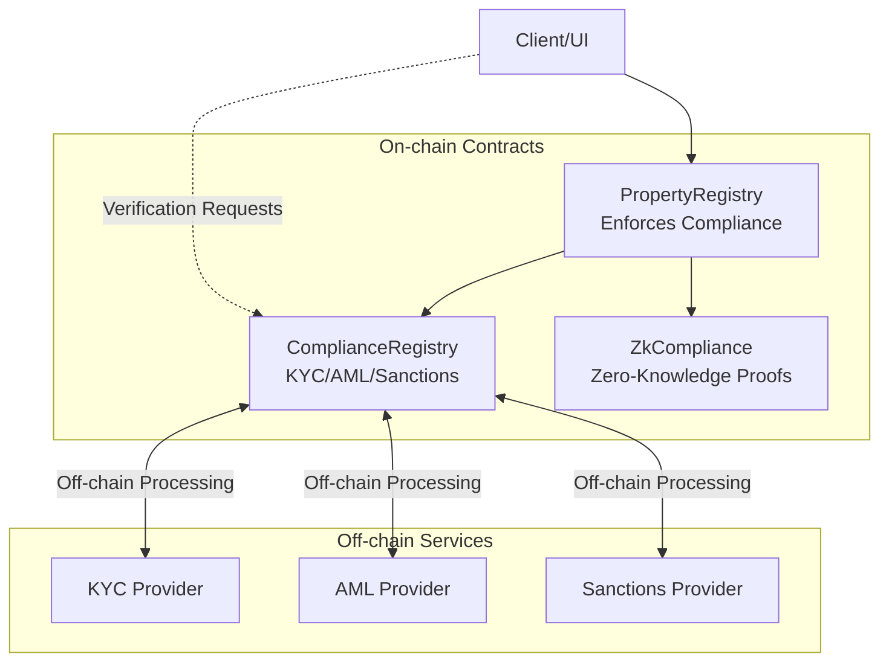
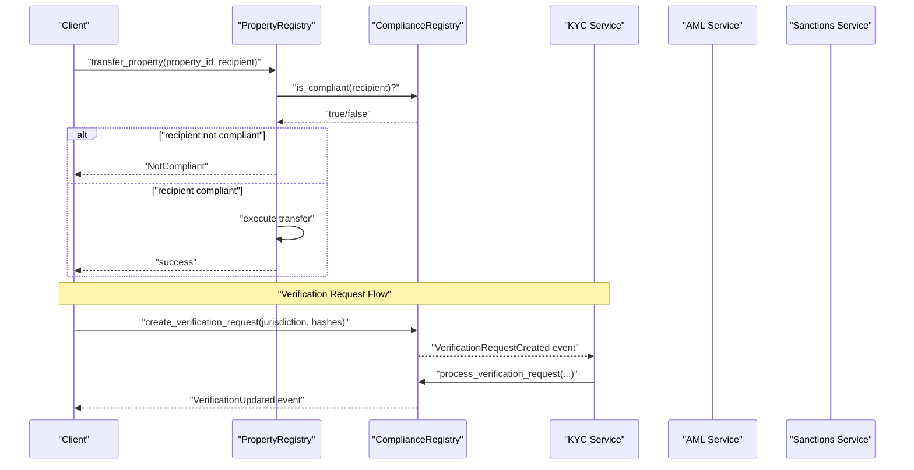
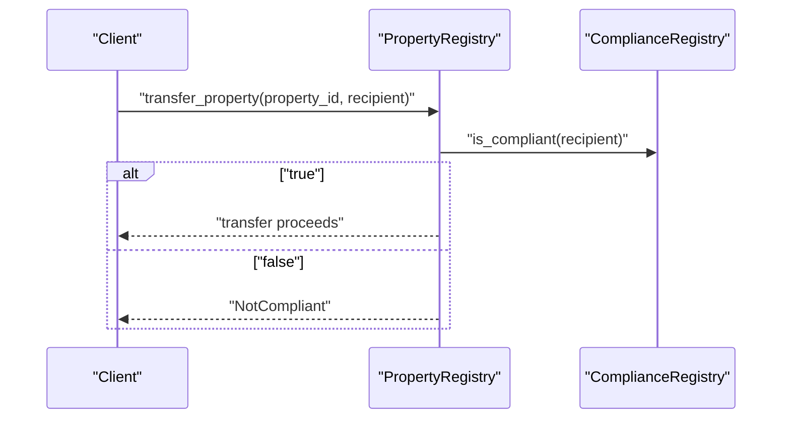
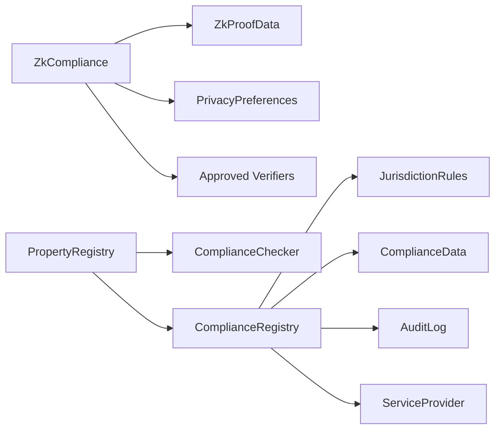

# Compliance & Verification APIs

<cite>
**Referenced Files in This Document**
- [compliance_registry/lib.rs](file://stellar-insured-contracts/contracts/compliance_registry/lib.rs)
- [compliance_registry/README.md](file://stellar-insured-contracts/contracts/compliance_registry/README.md)
- [zk-compliance/lib.rs](file://stellar-insured-contracts/contracts/zk-compliance/lib.rs)
- [compliance-integration.md](file://stellar-insured-contracts/docs/compliance-integration.md)
- [compliance-regulatory-framework.md](file://stellar-insured-contracts/docs/compliance-regulatory-framework.md)
- [compliance-completion-checklist.md](file://stellar-insured-contracts/docs/compliance-completion-checklist.md)
- [property-compliance-integration.md](file://stellar-insured-contracts/docs/property-compliance-integration.md)
- [lib/src/lib.rs](file://stellar-insured-contracts/contracts/lib/src/lib.rs)
</cite>

## Table of Contents
1. [Introduction](#introduction)
2. [Project Structure](#project-structure)
3. [Core Components](#core-components)
4. [Architecture Overview](#architecture-overview)
5. [Detailed Component Analysis](#detailed-component-analysis)
6. [Dependency Analysis](#dependency-analysis)
7. [Performance Considerations](#performance-considerations)
8. [Troubleshooting Guide](#troubleshooting-guide)
9. [Conclusion](#conclusion)
10. [Appendices](#appendices)

## Introduction
This document provides comprehensive API documentation for the compliance and verification interfaces powering KYC/AML verification, sanctions screening, and zero-knowledge (ZK) compliance systems. It covers identity validation, background checks, regulatory compliance status queries, data submission workflows, result interpretation, status updates, privacy-preserving features, and error handling for regulatory restrictions. It also documents integration patterns with property registries and off-chain services, along with examples of verification request processing and status reporting.

## Project Structure
The compliance system is implemented as two primary smart contracts:
- ComplianceRegistry: on-chain registry for multi-jurisdictional KYC/AML/sanctions, audit logs, workflow management, and regulatory reporting.
- ZkCompliance: on-chain ZK proof management and privacy-preserving compliance verification.

These contracts integrate with the PropertyRegistry to enforce compliance checks during property registration and transfers.

**Diagram sources**
- [compliance_registry/lib.rs:383-1294](file://stellar-insured-contracts/contracts/compliance_registry/lib.rs#L383-L1294)
- [zk-compliance/lib.rs:248-1301](file://stellar-insured-contracts/contracts/zk-compliance/lib.rs#L248-L1301)
- [lib/src/lib.rs:941-959](file://stellar-insured-contracts/contracts/lib/src/lib.rs#L941-L959)

**Section sources**
- [compliance_registry/README.md:1-33](file://stellar-insured-contracts/contracts/compliance_registry/README.md#L1-L33)
- [compliance-regulatory-framework.md:1-89](file://stellar-insured-contracts/docs/compliance-regulatory-framework.md#L1-L89)

## Core Components
- ComplianceRegistry
  - Manages jurisdiction-specific rules, verification requests, compliance data, audit logs, and regulatory reports.
  - Provides functions for KYC submission, AML/sanctions updates, consent management, and compliance checks.
  - Supports batch operations and workflow status queries.
- ZkCompliance
  - Stores and validates ZK proofs without revealing underlying data.
  - Offers privacy controls, dashboard views, and privacy-preserving reporting.
  - Enables anonymous compliance checks and certificate creation.

**Section sources**
- [compliance_registry/lib.rs:383-1294](file://stellar-insured-contracts/contracts/compliance_registry/lib.rs#L383-L1294)
- [zk-compliance/lib.rs:248-1301](file://stellar-insured-contracts/contracts/zk-compliance/lib.rs#L248-L1301)

## Architecture Overview
The system follows a hybrid on-chain/off-chain model:
- On-chain: stores immutable compliance state, rules, and ZK proof metadata.
- Off-chain: processes identity documents, biometrics, AML risk scoring, and sanctions screening; then submits results on-chain.
- PropertyRegistry integrates with ComplianceRegistry to enforce compliance before sensitive operations.

**Diagram sources**
- [lib/src/lib.rs:941-959](file://stellar-insured-contracts/contracts/lib/src/lib.rs#L941-L959)
- [compliance-integration.md:19-42](file://stellar-insured-contracts/docs/compliance-integration.md#L19-L42)
- [compliance_registry/lib.rs:917-960](file://stellar-insured-contracts/contracts/compliance_registry/lib.rs#L917-L960)

## Detailed Component Analysis

### ComplianceRegistry API
Core responsibilities:
- Multi-jurisdictional rules engine and transaction compliance checks.
- KYC verification submission and enhanced document/biometric risk scoring.
- AML risk factor updates and sanctions screening status.
- Consent management, GDPR data retention, and audit logging.
- Verification request lifecycle and batch processing.
- Compliance reporting and regulatory summaries.

Key data structures and enums:
- VerificationStatus, RiskLevel, DocumentType, BiometricMethod, SanctionsList, ConsentStatus, AMLRiskFactors, JurisdictionRules, ComplianceData, AuditLog, VerificationRequest, ServiceProvider.
- WorkflowStatus, ComplianceReport, RegulatoryReport, SanctionsScreeningSummary.

Events:
- VerificationUpdated, ComplianceCheckPerformed, ConsentUpdated, DataRetentionExpired, AuditLogCreated, VerificationRequestCreated, ServiceProviderRegistered.

Errors:
- NotAuthorized, NotVerified, VerificationExpired, HighRisk, ProhibitedJurisdiction, AlreadyVerified, ConsentNotGiven, DataRetentionExpired, InvalidRiskScore, InvalidDocumentType, JurisdictionNotSupported.

Representative API surface (message functions):
- Administrative
  - add_verifier(verifier)
  - update_jurisdiction_rules(jurisdiction, rules)
  - register_service_provider(provider, service_type)
  - set_zk_compliance_contract(zk_contract)
- Verification Lifecycle
  - create_verification_request(jurisdiction, document_hash, biometric_hash)
  - process_verification_request(request_id, kyc_hash, risk_level, document_type, biometric_method, risk_score)
  - submit_verification(account, jurisdiction, kyc_hash, risk_level, document_type, biometric_method, risk_score)
- Compliance Updates
  - update_aml_status(account, passed, risk_factors)
  - update_sanctions_status(account, passed, list_checked)
  - update_consent(account, consent)
  - revoke_verification(account)
  - store_encrypted_data_hash(account, data_hash)
- Compliance Checks
  - is_compliant(account) -> bool
  - require_compliance(account) -> Result
  - check_transaction_compliance(account, operation) -> Result
  - enhanced_compliance_check(account) -> Result
- Reporting and Monitoring
  - get_compliance_data(account) -> Option<ComplianceData>
  - get_audit_logs(account, limit) -> Vec<AuditLog>
  - get_compliance_report(account) -> Option<ComplianceReport>
  - get_verification_workflow_status(request_id) -> Option<WorkflowStatus>
  - get_regulatory_report(jurisdiction, period_start, period_end) -> RegulatoryReport
  - get_sanctions_screening_summary() -> SanctionsScreeningSummary
  - get_compliance_summary(accounts) -> Vec<(AccountId, bool)>
  - needs_reverification(account, days_threshold) -> bool
- Batch Operations
  - batch_aml_check(accounts, risk_factors_list) -> Result<Vec<bool>>
  - batch_sanctions_check(accounts, list_checked, results) -> Result<()>
- Utility
  - get_jurisdiction_rules(jurisdiction) -> Option<JurisdictionRules>
  - get_service_provider(provider) -> Option<ServiceProvider>
  - get_verification_request(request_id) -> Option<VerificationRequest>
  - get_zk_compliance_contract() -> Option<AccountId>

Operational flow highlights:
- Verification request creation emits VerificationRequestCreated; off-chain services process and call process_verification_request.
- AML and sanctions updates adjust risk levels and statuses; revoked verifications downgrade status.
- Compliance checks aggregate status, expiry, risk level, AML/sanctions flags, and GDPR consent.
- Jurisdiction rules govern operation-specific requirements (e.g., transfers require KYC/AML/Sanctions).

**Section sources**
- [compliance_registry/lib.rs:383-1294](file://stellar-insured-contracts/contracts/compliance_registry/lib.rs#L383-L1294)
- [compliance-integration.md:19-42](file://stellar-insured-contracts/docs/compliance-integration.md#L19-L42)
- [compliance-regulatory-framework.md:29-62](file://stellar-insured-contracts/docs/compliance-regulatory-framework.md#L29-L62)

### ZkCompliance API
Core responsibilities:
- ZK proof lifecycle: submission, verification, rejection, expiration.
- Privacy controls: consent, metadata encryption, privacy level settings.
- Dashboard and status summaries: active/expired/pending proofs, next verification due.
- Privacy-preserving reporting and anonymized statistics.
- Anonymous compliance checks and certificate generation.

Key data structures and enums:
- ZkProofStatus, ZkProofType, ZkProofData, PrivacyPreferences, ZkComplianceData, AuditLog, VerificationStats, PrivacyDashboard, ComplianceStatusSummary.

Events:
- ZkProofSubmitted, ZkProofVerified, ZkProofRejected, PrivacyPreferencesUpdated, ComplianceVerified, ZkComplianceUpdated.

Errors:
- NotAuthorized, ProofNotFound, InvalidProof, VerificationFailed, ExpiredProof, AlreadyVerified, InvalidInputs, PrivacyControlsViolation, StatsNotAvailable, InvalidPrivacyLevel.

Representative API surface (message functions):
- Proof Management
  - submit_zk_proof(proof_type, public_inputs, proof_data, metadata) -> Result<u64>
  - verify_zk_proof(account, proof_id, approve) -> Result<()>
  - is_zk_proof_valid(account, proof_type) -> bool
  - get_zk_proof(account, proof_id) -> Option<ZkProofData>
  - get_account_proofs(account) -> Vec<(u64, ZkProofData)>
- Compliance and Privacy
  - zk_compliance_check(account, required_proof_types) -> Result<()>
  - anonymous_compliance_check(account, required_proof_types) -> bool
  - verify_compliance_public_params(account, proof_type, public_params) -> Result<()>
  - create_compliance_certificate(account, certificate_type, expiration_days) -> Result<[u8; 32]>
  - update_privacy_preferences(allow_analytics, share_data_with_third_party, privacy_level, encrypted_metadata) -> Result<()>
  - set_privacy_controls(allow_analytics, share_data_with_third_party, privacy_level, consent_to_process, consent_to_store, encrypted_metadata) -> Result<()>
  - grant_proof_consent(proof_types) -> Result<()>
  - revoke_proof_consent(proof_types) -> Result<()>
- Dashboard and Reports
  - get_zk_compliance_data(account) -> Option<ZkComplianceData>
  - get_privacy_dashboard(account) -> PrivacyDashboard
  - get_compliance_status_summary(account) -> ComplianceStatusSummary
  - get_verification_stats() -> Result<&VerificationStats>
  - get_anonymized_compliance_stats() -> Result<Vec<u8>>
  - generate_privacy_preserving_report(report_type) -> Result<Vec<u8>>
  - get_audit_logs(account, limit) -> Vec<AuditLog>
- Identity and Financial Proofs
  - verify_identity_zk(age_requirement, country_code, proof_data) -> Result<()>
  - verify_financial_standing_zk(min_income_usd, proof_data) -> Result<()>
  - verify_accredited_investor_zk(proof_data) -> Result<()>
  - submit_confidential_transaction(transaction_type, amount, asset_type, proof_data) -> Result<()>
  - create_property_ownership_proof(property_id, proof_data) -> Result<()>
  - verify_property_ownership_zk(property_id, owner_public_key, proof_data) -> Result<()>
  - verify_address_ownership_zk(address_hash, proof_data) -> Result<()>
- Verifier Management
  - add_approved_verifier(verifier) -> Result<()>
  - remove_approved_verifier(verifier) -> Result<()>
- Internal helpers
  - perform_zk_verification(proof) -> Result<bool>
  - update_compliance_data(account) -> Result<()>
  - log_audit_event(account, proof_type, status, action) -> ()

Operational flow highlights:
- ZK proofs are submitted with public inputs and serialized proof data; verifiers approve or reject them.
- Anonymous compliance checks validate required proof types without exposing sensitive data.
- Privacy controls enable users to manage consent and metadata encryption; dashboards summarize proof states and compliance timelines.

**Section sources**
- [zk-compliance/lib.rs:248-1301](file://stellar-insured-contracts/contracts/zk-compliance/lib.rs#L248-L1301)
- [compliance-regulatory-framework.md:29-62](file://stellar-insured-contracts/docs/compliance-regulatory-framework.md#L29-L62)

### Integration with PropertyRegistry
PropertyRegistry integrates with ComplianceRegistry to enforce compliance:
- Cross-contract call to ComplianceChecker::is_compliant(account) before transfers and registrations.
- Optional registry configuration; if unset, transfers remain backward compatible.
- Error handling distinguishes NotCompliant vs. ComplianceCheckFailed.

**Diagram sources**
- [lib/src/lib.rs:941-959](file://stellar-insured-contracts/contracts/lib/src/lib.rs#L941-L959)
- [property-compliance-integration.md:76-102](file://stellar-insured-contracts/docs/property-compliance-integration.md#L76-L102)

**Section sources**
- [lib/src/lib.rs:941-959](file://stellar-insured-contracts/contracts/lib/src/lib.rs#L941-L959)
- [property-compliance-integration.md:1-238](file://stellar-insured-contracts/docs/property-compliance-integration.md#L1-L238)

## Dependency Analysis
- ComplianceRegistry depends on:
  - JurisdictionRules and ComplianceData structures for state.
  - Verifier permissions and service provider registry for off-chain integration.
  - Audit logs and retention policies for compliance and GDPR.
- ZkCompliance depends on:
  - ZK proof types and privacy preferences for verification workflows.
  - Approved verifiers and verification statistics for governance and reporting.
- PropertyRegistry depends on:
  - ComplianceChecker trait and optional registry address for enforcement.

**Diagram sources**
- [compliance_registry/lib.rs:213-241](file://stellar-insured-contracts/contracts/compliance_registry/lib.rs#L213-L241)
- [zk-compliance/lib.rs:98-118](file://stellar-insured-contracts/contracts/zk-compliance/lib.rs#L98-L118)
- [lib/src/lib.rs:941-959](file://stellar-insured-contracts/contracts/lib/src/lib.rs#L941-L959)

**Section sources**
- [compliance_registry/lib.rs:213-241](file://stellar-insured-contracts/contracts/compliance_registry/lib.rs#L213-L241)
- [zk-compliance/lib.rs:98-118](file://stellar-insured-contracts/contracts/zk-compliance/lib.rs#L98-L118)
- [lib/src/lib.rs:941-959](file://stellar-insured-contracts/contracts/lib/src/lib.rs#L941-L959)

## Performance Considerations
- Prefer batch operations for AML and sanctions checks to reduce gas costs.
- Cache jurisdiction rules and minimize repeated cross-contract calls.
- Use verification request flow for heavy off-chain processing to keep on-chain logic minimal.
- Employ privacy-preserving reporting and anonymized statistics to avoid exposing sensitive data.

[No sources needed since this section provides general guidance]

## Troubleshooting Guide
Common error categories and resolutions:
- Authorization
  - NotAuthorized: Ensure caller is owner or registered verifier/service provider.
- Verification State
  - NotVerified: Verify KYC submission, AML/sanctions completion, and consent.
  - VerificationExpired: Trigger re-verification workflow.
  - AlreadyVerified: Request was already processed; check workflow status.
- Risk and Jurisdiction
  - HighRisk: Review AML risk factors; consider downgrading risk or restricting operations.
  - ProhibitedJurisdiction/JurisdictionNotSupported: Align jurisdiction rules or restrict unsupported regions.
- Consent and Retention
  - ConsentNotGiven/DataRetentionExpired: Prompt user consent and ensure retention periods are met.
- ZK Compliance
  - ProofNotFound/InvalidProof/ExpiredProof: Validate proof inputs and expiration; resubmit if needed.
  - PrivacyControlsViolation: Ensure user consent and privacy level meet requirements.

Monitoring and diagnostics:
- Use get_compliance_report(account) for a consolidated view.
- Retrieve audit logs with get_audit_logs(account, limit) for detailed traces.
- Check workflow status via get_verification_workflow_status(request_id).

**Section sources**
- [compliance_registry/lib.rs:244-260](file://stellar-insured-contracts/contracts/compliance_registry/lib.rs#L244-L260)
- [zk-compliance/lib.rs:182-196](file://stellar-insured-contracts/contracts/zk-compliance/lib.rs#L182-L196)
- [compliance-integration.md:288-299](file://stellar-insured-contracts/docs/compliance-integration.md#L288-L299)

## Conclusion
The compliance and verification APIs provide a robust, multi-jurisdictional framework integrating KYC/AML/sanctions with privacy-preserving ZK capabilities. They support asynchronous verification workflows, comprehensive reporting, and seamless integration with PropertyRegistry to enforce regulatory compliance during property operations. The system balances strong regulatory adherence with user privacy and operational efficiency.

[No sources needed since this section summarizes without analyzing specific files]

## Appendices

### API Function Index
- ComplianceRegistry
  - Administrative: add_verifier, update_jurisdiction_rules, register_service_provider, set_zk_compliance_contract
  - Verification: create_verification_request, process_verification_request, submit_verification
  - Updates: update_aml_status, update_sanctions_status, update_consent, revoke_verification, store_encrypted_data_hash
  - Checks: is_compliant, require_compliance, check_transaction_compliance, enhanced_compliance_check
  - Reporting: get_compliance_data, get_audit_logs, get_compliance_report, get_verification_workflow_status, get_regulatory_report, get_sanctions_screening_summary, get_compliance_summary, needs_reverification
  - Batch: batch_aml_check, batch_sanctions_check
  - Utilities: get_jurisdiction_rules, get_service_provider, get_verification_request, get_zk_compliance_contract
- ZkCompliance
  - Proof: submit_zk_proof, verify_zk_proof, is_zk_proof_valid, get_zk_proof, get_account_proofs
  - Compliance: zk_compliance_check, anonymous_compliance_check, verify_compliance_public_params, create_compliance_certificate
  - Privacy: update_privacy_preferences, set_privacy_controls, grant_proof_consent, revoke_proof_consent
  - Dashboard/Reports: get_zk_compliance_data, get_privacy_dashboard, get_compliance_status_summary, get_verification_stats, get_anonymized_compliance_stats, generate_privacy_preserving_report, get_audit_logs
  - Identity/Finance: verify_identity_zk, verify_financial_standing_zk, verify_accredited_investor_zk, submit_confidential_transaction, create_property_ownership_proof, verify_property_ownership_zk, verify_address_ownership_zk
  - Verifiers: add_approved_verifier, remove_approved_verifier

**Section sources**
- [compliance_registry/lib.rs:383-1294](file://stellar-insured-contracts/contracts/compliance_registry/lib.rs#L383-L1294)
- [zk-compliance/lib.rs:248-1301](file://stellar-insured-contracts/contracts/zk-compliance/lib.rs#L248-L1301)

### Integration Examples
- Verification Request Flow
  - Client creates a verification request on-chain.
  - Off-chain KYC service listens for VerificationRequestCreated, processes verification, and submits results via process_verification_request.
- Property Transfer Compliance
  - PropertyRegistry checks recipient compliance via ComplianceChecker::is_compliant before executing transfer.
- Zero-Knowledge Compliance
  - Clients submit ZK proofs for identity, financial standing, or accredited investor status; ZkCompliance validates and records them without exposing underlying data.

**Section sources**
- [compliance-integration.md:19-42](file://stellar-insured-contracts/docs/compliance-integration.md#L19-L42)
- [property-compliance-integration.md:49-72](file://stellar-insured-contracts/docs/property-compliance-integration.md#L49-L72)
- [zk-compliance/lib.rs:272-373](file://stellar-insured-contracts/contracts/zk-compliance/lib.rs#L272-L373)