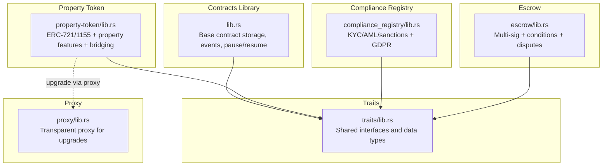
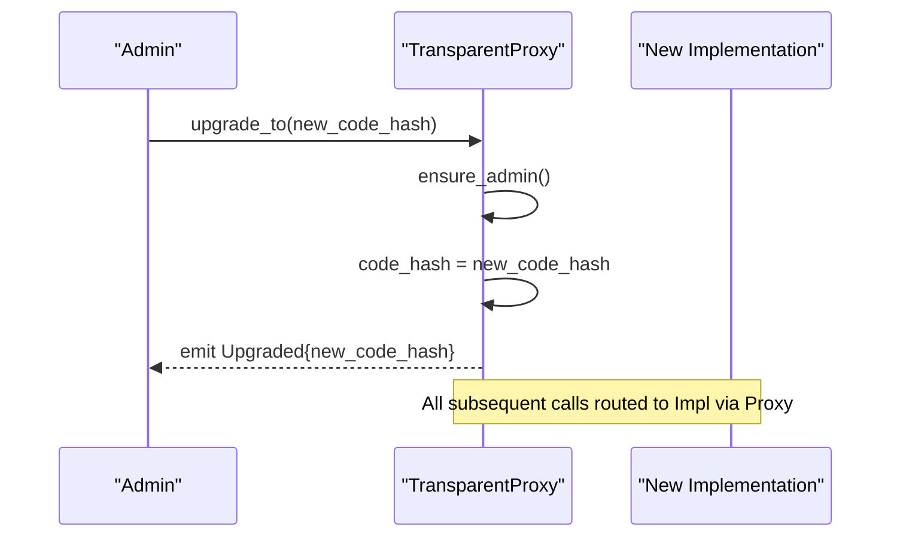
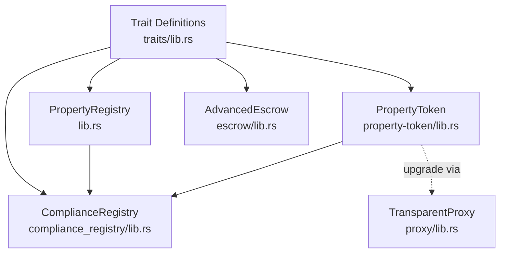
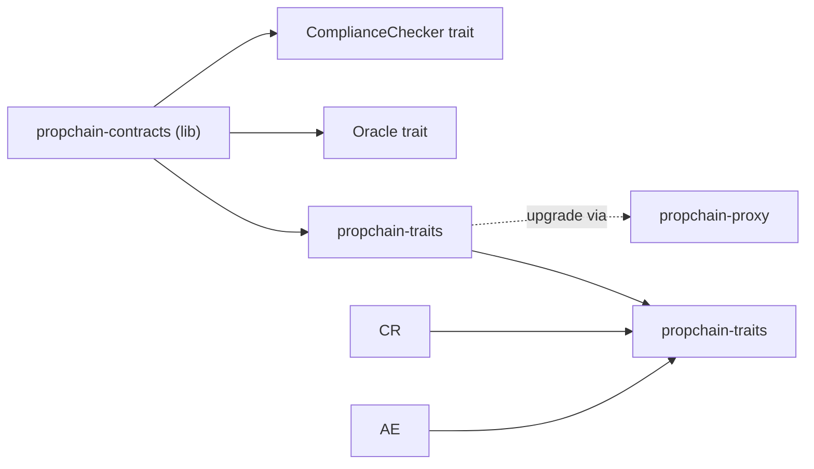

# Core Contract APIs

<cite>
**Referenced Files in This Document**
- [lib.rs](file://stellar-insured-contracts/contracts/lib/src/lib.rs)
- [Cargo.toml](file://stellar-insured-contracts/contracts/lib/Cargo.toml)
- [traits/lib.rs](file://stellar-insured-contracts/contracts/traits/src/lib.rs)
- [proxy/lib.rs](file://stellar-insured-contracts/contracts/proxy/src/lib.rs)
- [property-token/lib.rs](file://stellar-insured-contracts/contracts/property-token/src/lib.rs)
- [compliance_registry/lib.rs](file://stellar-insured-contracts/contracts/compliance_registry/lib.rs)
- [escrow/lib.rs](file://stellar-insured-contracts/contracts/escrow/src/lib.rs)
- [docs/contracts.md](file://stellar-insured-contracts/docs/contracts.md)
</cite>

## Table of Contents
1. [Introduction](#introduction)
2. [Project Structure](#project-structure)
3. [Core Components](#core-components)
4. [Architecture Overview](#architecture-overview)
5. [Detailed Component Analysis](#detailed-component-analysis)
6. [Dependency Analysis](#dependency-analysis)
7. [Performance Considerations](#performance-considerations)
8. [Troubleshooting Guide](#troubleshooting-guide)
9. [Conclusion](#conclusion)

## Introduction
This document provides comprehensive API documentation for the core contract interfaces in the PropChain ecosystem. It focuses on base contract functionality, shared trait definitions, and proxy pattern implementations that underpin all other contracts. The documentation covers initialization, upgrade mechanisms, shared utility functions, state management, access control patterns, and event emission interfaces used across the system. It also includes practical deployment and configuration guidance derived from the repository’s contracts and documentation.

## Project Structure
The core contracts are organized into modular crates:
- Base contracts library: central storage, events, pause/resume, and shared utilities
- Traits crate: shared interfaces and data structures used across contracts
- Proxy crate: transparent proxy for upgradability
- Property token contract: real estate token with bridging and governance features
- Compliance registry: regulatory and compliance orchestration
- Escrow: multi-signature, condition-based property transfer facilitation



**Diagram sources**
- [lib.rs:17-120](file://stellar-insured-contracts/contracts/lib/src/lib.rs#L17-L120)
- [traits/lib.rs:23-49](file://stellar-insured-contracts/contracts/traits/src/lib.rs#L23-L49)
- [proxy/lib.rs:19-25](file://stellar-insured-contracts/contracts/proxy/src/lib.rs#L19-L25)
- [property-token/lib.rs:47-102](file://stellar-insured-contracts/contracts/property-token/src/lib.rs#L47-L102)
- [compliance_registry/lib.rs:213-241](file://stellar-insured-contracts/contracts/compliance_registry/lib.rs#L213-L241)
- [escrow/lib.rs:135-162](file://stellar-insured-contracts/contracts/escrow/src/lib.rs#L135-L162)

**Section sources**
- [Cargo.toml:15-26](file://stellar-insured-contracts/contracts/lib/Cargo.toml#L15-L26)
- [traits/lib.rs:1-20](file://stellar-insured-contracts/contracts/traits/src/lib.rs#L1-L20)
- [proxy/lib.rs:1-10](file://stellar-insured-contracts/contracts/proxy/src/lib.rs#L1-L10)

## Core Components
This section summarizes the foundational building blocks used by all contracts.

- Base contract storage and events
  - Centralized storage for properties, escrows, badges, verifications, appeals, gas tracking, and pause state
  - Extensive event system with standardized topics and metadata for off-chain indexing
  - Pause/resume governance with multi-signature approvals and auto-resume logic
  - Dynamic fee integration via a fee manager contract reference
  - Oracle integration for property valuations

- Shared traits and data structures
  - Property registry trait with register/update/transfer/query operations
  - Oracle and OracleRegistry traits for valuation and price feed management
  - Escrow and AdvancedEscrow traits for secure property transfers
  - Property bridge and advanced bridge traits for cross-chain operations
  - ComplianceChecker trait for automated compliance enforcement
  - Rich data models for properties, valuations, bridging, and governance

- Proxy pattern for upgrades
  - Transparent proxy storing code hash and admin
  - Upgrade and admin change functions with events

- Property token contract
  - ERC-721 and ERC-1155 compatibility plus real estate-specific features
  - Cross-chain bridging with multi-signature requests
  - Governance, dividends, and share issuance/redemption
  - Compliance verification and legal document attachment

- Compliance registry
  - Jurisdiction-aware verification with risk scoring and GDPR consent
  - AML and sanctions screening with audit logs
  - Service provider integration and retention policies

- Escrow contract
  - Multi-signature approvals, conditions, and time locks
  - Document verification and dispute resolution
  - Audit trails and high-value thresholds

**Section sources**
- [lib.rs:50-97](file://stellar-insured-contracts/contracts/lib/src/lib.rs#L50-L97)
- [lib.rs:331-750](file://stellar-insured-contracts/contracts/lib/src/lib.rs#L331-L750)
- [lib.rs:997-1181](file://stellar-insured-contracts/contracts/lib/src/lib.rs#L997-L1181)
- [traits/lib.rs:23-721](file://stellar-insured-contracts/contracts/traits/src/lib.rs#L23-L721)
- [proxy/lib.rs:19-80](file://stellar-insured-contracts/contracts/proxy/src/lib.rs#L19-L80)
- [property-token/lib.rs:47-102](file://stellar-insured-contracts/contracts/property-token/src/lib.rs#L47-L102)
- [compliance_registry/lib.rs:213-241](file://stellar-insured-contracts/contracts/compliance_registry/lib.rs#L213-L241)
- [escrow/lib.rs:135-162](file://stellar-insured-contracts/contracts/escrow/src/lib.rs#L135-L162)

## Architecture Overview
The system follows a layered architecture:
- Shared traits define interfaces and data models used across contracts
- Base contracts provide common state, events, and governance utilities
- Specialized contracts implement domain-specific logic (tokens, bridging, compliance, escrow)
- Proxy enables safe upgrades by redirecting calls to new implementations

```mermaid
classDiagram
class PropertyRegistry {
+version() u32
+admin() AccountId
+set_oracle(addr)
+set_fee_manager(opt)
+get_dynamic_fee(op) u128
+update_valuation_from_oracle(id)
+change_admin(new)
+set_compliance_registry(opt)
+check_account_compliance(acc) bool
+ensure_not_paused()
+pause_contract(reason, duration)
+emergency_pause(reason)
+try_auto_resume()
+request_resume()
+approve_resume()
+register_property(meta) u64
+transfer_property(id,to)
+get_property(id) PropertyInfo?
+update_metadata(id,meta)
}
class PropertyToken {
+balance_of(owner) u32
+owner_of(id) AccountId?
+transfer_from(from,to,id)
+approve(to,id)
+set_approval_for_all(op,approved)
+get_approved(id) AccountId?
+is_approved_for_all(owner,op) bool
+balance_of_batch(accounts,ids) u128[]
+safe_batch_transfer_from(from,to,ids,amounts,data)
+uri(id) String?
+set_compliance_registry(addr)
+total_shares(id) u128
+share_balance_of(owner,id) u128
+issue_shares(id,to,amt)
+redeem_shares(id,from,amt)
+transfer_shares(from,to,id,amt)
+deposit_dividends(id){payable}
+withdraw_dividends(id) u128
+create_proposal(id,quorum,desc)
+vote(id,proposal,support)
+execute_proposal(id,proposal) bool
+place_ask(id,price,amt)
+cancel_ask(id)
+buy_shares(id,seller,amt){payable}
+get_last_trade_price(id) u128?
+get_portfolio(owner,ids)
+get_tax_record(owner,id)
+register_property_with_token(meta) TokenId
+batch_register_properties(list) TokenId[]
+attach_legal_document(id,hash,type)
+verify_compliance(id,status)
+get_ownership_history(id) OwnershipTransfer[]?
+initiate_bridge_multisig(id,dest,recipient,req,timeout)
+sign_bridge_request(req,approve)
+execute_bridge(req)
+monitor_bridge_status(req)
+recover_failed_bridge(req,action)
+estimate_bridge_gas(id,dest) u64
}
class ComplianceRegistry {
+add_verifier(addr)
+submit_verification(acc,jur,kyc,risk,doc,bio,risk_score)
+is_compliant(acc) bool
+require_compliance(acc)
+get_compliance_data(acc) ComplianceData?
+update_aml_status(acc,passed,factors)
+update_sanctions_status(acc,passed,list)
+revoke_verification(acc)
+update_consent(acc,consent)
+check_data_retention(acc) bool
+request_data_deletion(acc)
}
class AdvancedEscrow {
+create_escrow_advanced(prop,amt,buyer,seller,participants,req,lock)
+deposit_funds(id){payable}
+release_funds(id)
+refund_funds(id)
+upload_document(id,hash,type)
+verify_document(id,hash)
+add_condition(id,desc) u64
+mark_condition_met(id,cond)
+sign_approval(id,approval)
+raise_dispute(id,reason)
+resolve_dispute(id,resolution)
+emergency_override(id,toSeller)
}
class TransparentProxy {
+upgrade_to(newCodeHash)
+change_admin(newAdmin)
+code_hash() Hash
+admin() AccountId
}
PropertyRegistry --> ComplianceRegistry : "uses"
PropertyToken --> ComplianceRegistry : "uses"
PropertyToken --> TransparentProxy : "upgrades via"
```

**Diagram sources**
- [lib.rs:810-972](file://stellar-insured-contracts/contracts/lib/src/lib.rs#L810-L972)
- [property-token/lib.rs:548-1599](file://stellar-insured-contracts/contracts/property-token/src/lib.rs#L548-L1599)
- [compliance_registry/lib.rs:383-800](file://stellar-insured-contracts/contracts/compliance_registry/lib.rs#L383-L800)
- [escrow/lib.rs:262-800](file://stellar-insured-contracts/contracts/escrow/src/lib.rs#L262-L800)
- [proxy/lib.rs:39-80](file://stellar-insured-contracts/contracts/proxy/src/lib.rs#L39-L80)

## Detailed Component Analysis

### Base Contract Storage and Events
- Storage layout
  - Properties, owners, approvals, and reverse owner mapping
  - Escrows, gas tracking, compliance registry, badge system, verifications, appeals
  - Pause configuration and guardians, oracle, and fee manager references
  - Fractional ownership info
- Events
  - Structured event system with indexed topics, timestamps, block numbers, and versioning
  - Examples: ContractInitialized, PropertyRegistered, PropertyTransferred, EscrowCreated/Released/Refunded, AdminChanged, Batch events, Badge, Verification, Appeal, Pause/Resume lifecycle, and more
- Governance and pause/resume
  - Pause/resume with multi-sig approvals, auto-resume, and guardian roles
  - Admin change with event emission and transaction context
- Dynamic fee provider integration
  - Optional fee manager contract reference and dynamic fee retrieval
- Oracle integration
  - Cross-contract call to Oracle trait for property valuation updates

**Section sources**
- [lib.rs:50-97](file://stellar-insured-contracts/contracts/lib/src/lib.rs#L50-L97)
- [lib.rs:331-750](file://stellar-insured-contracts/contracts/lib/src/lib.rs#L331-L750)
- [lib.rs:810-972](file://stellar-insured-contracts/contracts/lib/src/lib.rs#L810-L972)
- [lib.rs:997-1181](file://stellar-insured-contracts/contracts/lib/src/lib.rs#L997-L1181)

### Shared Traits and Data Models
- Property registry trait
  - Register, transfer, get, and update property metadata
  - Approve and get approved account
- Oracle and OracleRegistry traits
  - Get valuation, confidence metrics, batch requests, historical valuations, and market volatility
  - Add/remove sources, reputation management, anomaly detection
- Escrow and AdvancedEscrow traits
  - Basic and advanced escrow operations with multi-signature, conditions, documents, disputes, and emergency overrides
- Property bridge and advanced bridge traits
  - Lock/mint/burn token bridging, multi-signature requests, monitoring, recovery, gas estimation, and history
- ComplianceChecker trait
  - Automated compliance checks for contract operations
- Data models
  - PropertyMetadata, PropertyInfo, PropertyValuation, ValuationWithConfidence, OracleSource, BridgeStatus, MultisigBridgeRequest, ComplianceData, EscrowData, and more

**Section sources**
- [traits/lib.rs:23-721](file://stellar-insured-contracts/contracts/traits/src/lib.rs#L23-L721)

### Proxy Pattern and Upgrade Mechanism
- Transparent proxy
  - Stores current implementation code hash and admin
  - Provides upgrade_to and change_admin functions guarded by admin-only checks
  - Emits Upgraded and AdminChanged events
- Upgrade flow
  - Admin invokes upgrade_to with new code hash
  - Subsequent calls route to the new implementation via the proxy
- Security and access control
  - ensure_admin enforces admin-only access for upgrade and admin change



**Diagram sources**
- [proxy/lib.rs:39-62](file://stellar-insured-contracts/contracts/proxy/src/lib.rs#L39-L62)

**Section sources**
- [proxy/lib.rs:19-80](file://stellar-insured-contracts/contracts/proxy/src/lib.rs#L19-L80)

### Property Token Contract API
- ERC-721 compatibility
  - balance_of, owner_of, transfer_from, approve, set_approval_for_all, get_approved, is_approved_for_all
- ERC-1155 compatibility
  - balance_of_batch, safe_batch_transfer_from
- Real estate and governance features
  - uri, set_compliance_registry, total_shares, share_balance_of
  - issue_shares, redeem_shares, transfer_shares
  - deposit_dividends, withdraw_dividends, get_last_trade_price, get_portfolio, get_tax_record
  - create_proposal, vote, execute_proposal
  - place_ask, cancel_ask, buy_shares
- Property-specific operations
  - register_property_with_token, batch_register_properties
  - attach_legal_document, verify_compliance, get_ownership_history
- Cross-chain bridging
  - initiate_bridge_multisig, sign_bridge_request, execute_bridge, monitor_bridge_status, recover_failed_bridge, estimate_bridge_gas

**Section sources**
- [property-token/lib.rs:548-1599](file://stellar-insured-contracts/contracts/property-token/src/lib.rs#L548-L1599)

### Compliance Registry API
- Verification and consent
  - add_verifier, submit_verification, update_consent, revoke_verification
- Compliance checks
  - is_compliant, require_compliance, get_compliance_data
- Risk and screening
  - update_aml_status, update_sanctions_status
- GDPR and retention
  - check_data_retention, request_data_deletion
- Jurisdiction rules and audit logs
  - JurisdictionRules, AuditLog, ServiceProvider, and related structures

**Section sources**
- [compliance_registry/lib.rs:383-800](file://stellar-insured-contracts/contracts/compliance_registry/lib.rs#L383-L800)

### Escrow Contract API
- Creation and funding
  - create_escrow_advanced, deposit_funds
- Release and refund
  - release_funds, refund_funds
- Documents and conditions
  - upload_document, verify_document, add_condition, mark_condition_met
- Multi-signature and governance
  - sign_approval, raise_dispute, resolve_dispute, emergency_override
- Audit and configuration
  - AuditEntry, MultiSigConfig, DisputeInfo, and internal audit logging

**Section sources**
- [escrow/lib.rs:262-800](file://stellar-insured-contracts/contracts/escrow/src/lib.rs#L262-L800)

### Conceptual Overview
The following diagram illustrates the conceptual relationship between contracts and their shared traits, highlighting how upgrades and integrations work across the system.



[No sources needed since this diagram shows conceptual workflow, not actual code structure]

## Dependency Analysis
- Crate dependencies
  - propchain-contracts depends on propchain-traits
  - All contracts use ink, scale, and scale-info
- Cross-contract calls
  - PropertyRegistry calls Oracle and ComplianceChecker traits
  - PropertyToken integrates with ComplianceRegistry and Oracle
  - Escrow supports multi-signature approvals across participants



**Diagram sources**
- [Cargo.toml:15-26](file://stellar-insured-contracts/contracts/lib/Cargo.toml#L15-L26)
- [traits/lib.rs:249-721](file://stellar-insured-contracts/contracts/traits/src/lib.rs#L249-L721)
- [proxy/lib.rs:1-10](file://stellar-insured-contracts/contracts/proxy/src/lib.rs#L1-L10)

**Section sources**
- [Cargo.toml:15-26](file://stellar-insured-contracts/contracts/lib/Cargo.toml#L15-L26)
- [traits/lib.rs:249-721](file://stellar-insured-contracts/contracts/traits/src/lib.rs#L249-L721)

## Performance Considerations
- Efficient storage patterns
  - Use Mapping for O(1) lookups; maintain reverse mappings for optimized queries
- Batch operations
  - Prefer safe_batch_transfer_from for ERC-1155 and batch_* operations for properties
- Gas optimization
  - Minimize storage writes; leverage event emission for off-chain indexing
  - Use pause/resume to prevent congestion during maintenance windows
- Dynamic fee integration
  - Delegate fee calculation to fee manager to enable market-based pricing

[No sources needed since this section provides general guidance]

## Troubleshooting Guide
- Unauthorized access
  - Ensure caller matches admin or authorized roles (e.g., badge verifiers, bridge operators)
- Compliance failures
  - Verify compliance registry is set and accounts meet requirements (KYC, AML, sanctions, GDPR consent)
- Bridge issues
  - Check emergency pause, supported chains, signature thresholds, and request expiration
- Escrow disputes and conditions
  - Confirm all conditions are met, required signatures collected, and no active disputes
- Pause/resume anomalies
  - Validate pause state, required approvals, and auto-resume timing

**Section sources**
- [lib.rs:974-1181](file://stellar-insured-contracts/contracts/lib/src/lib.rs#L974-L1181)
- [property-token/lib.rs:1469-1599](file://stellar-insured-contracts/contracts/property-token/src/lib.rs#L1469-L1599)
- [escrow/lib.rs:400-800](file://stellar-insured-contracts/contracts/escrow/src/lib.rs#L400-L800)
- [compliance_registry/lib.rs:603-635](file://stellar-insured-contracts/contracts/compliance_registry/lib.rs#L603-L635)

## Conclusion
The PropChain core contract APIs establish a robust, extensible foundation for real estate tokenization and management. Through shared traits, structured events, governance utilities, and a transparent proxy upgrade mechanism, the system ensures interoperability, security, and maintainability. Integrators can rely on standardized interfaces, comprehensive state management, and clear access control patterns to build secure and scalable applications across property registries, tokens, compliance, bridging, and escrow services.