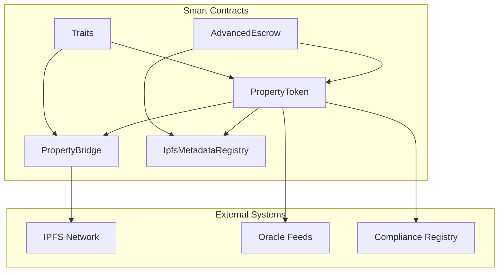
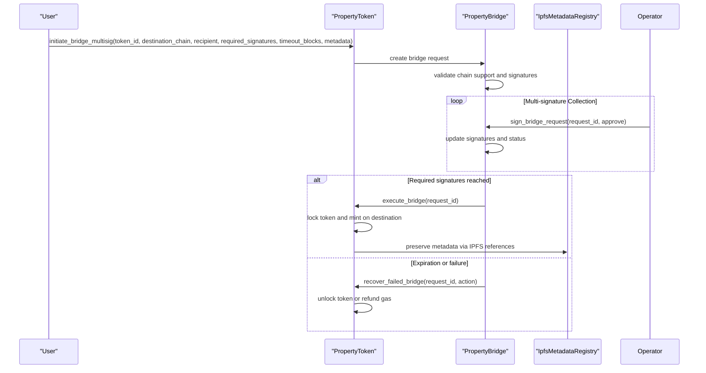
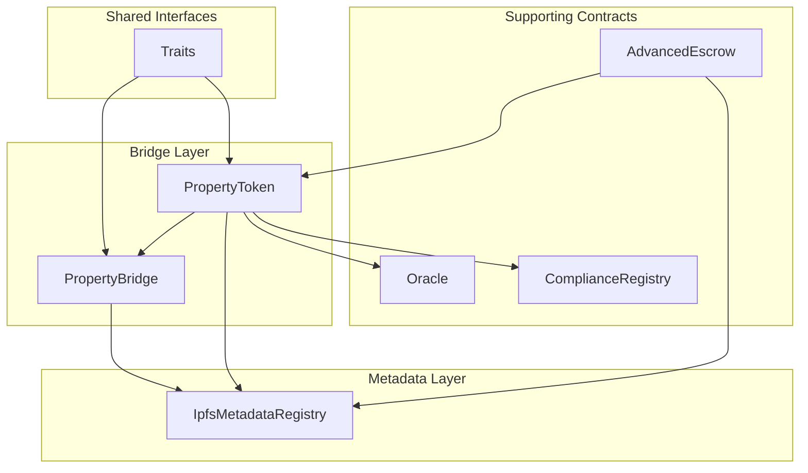

# Cross-Chain Bridge APIs

<cite>
**Referenced Files in This Document**
- [bridge/lib.rs](file://stellar-insured-contracts/contracts/bridge/src/lib.rs)
- [ipfs-metadata/lib.rs](file://stellar-insured-contracts/contracts/ipfs-metadata/src/lib.rs)
- [traits/lib.rs](file://stellar-insured-contracts/contracts/traits/src/lib.rs)
- [property-token/lib.rs](file://stellar-insured-contracts/contracts/property-token/src/lib.rs)
- [escrow/lib.rs](file://stellar-insured-contracts/contracts/escrow/src/lib.rs)
- [contracts.md](file://stellar-insured-contracts/docs/contracts.md)
- [architecture.md](file://stellar-insured-contracts/docs/architecture.md)
- [cross-chain-bridging.md](file://stellar-insured-contracts/docs/tutorials/cross-chain-bridging.md)
- [error-handling.md](file://stellar-insured-contracts/docs/error-handling.md)
- [Cargo.toml](file://stellar-insured-contracts/Cargo.toml)
</cite>

## Table of Contents
1. [Introduction](#introduction)
2. [Project Structure](#project-structure)
3. [Core Components](#core-components)
4. [Architecture Overview](#architecture-overview)
5. [Detailed Component Analysis](#detailed-component-analysis)
6. [Dependency Analysis](#dependency-analysis)
7. [Performance Considerations](#performance-considerations)
8. [Troubleshooting Guide](#troubleshooting-guide)
9. [Conclusion](#conclusion)
10. [Appendices](#appendices)

## Introduction
This document provides comprehensive API documentation for the cross-chain bridge and metadata management interfaces within the PropChain ecosystem. It covers asset transfer protocols, multi-signature operations, decentralized storage integration, and security mechanisms. The focus areas include:

- Cross-chain property token bridging with multi-signature approval workflows
- IPFS metadata management for property documentation storage, retrieval, and verification
- Asset preservation mechanisms, recovery procedures, and dispute resolution
- Network-specific configuration and interoperability requirements

## Project Structure
The PropChain system is composed of multiple interconnected smart contracts written in ink! for Substrate-based blockchains. The relevant modules for cross-chain bridging and metadata management include:

- PropertyBridge: Multi-signature cross-chain bridge contract
- PropertyToken: Property token contract with cross-chain support and bridge operations
- IpfsMetadataRegistry: Decentralized metadata registry with access control and validation
- Traits: Shared data structures and interfaces for cross-chain operations
- Escrow: Multi-signature and dispute resolution for high-value operations

**Diagram sources**
- [Cargo.toml:1-17](file://stellar-insured-contracts/Cargo.toml#L1-L17)
- [architecture.md:157-175](file://stellar-insured-contracts/docs/architecture.md#L157-L175)

**Section sources**
- [Cargo.toml:1-17](file://stellar-insured-contracts/Cargo.toml#L1-L17)
- [architecture.md:157-175](file://stellar-insured-contracts/docs/architecture.md#L157-L175)

## Core Components
This section outlines the primary components involved in cross-chain bridging and metadata management:

- PropertyBridge: Manages multi-signature bridge requests, validates chain support, estimates gas, and executes transfers
- PropertyToken: Implements token operations, cross-chain bridge lifecycle, and integrates with bridge contracts
- IpfsMetadataRegistry: Provides metadata validation, document registration, access control, and content verification
- Traits: Defines shared data structures, bridge interfaces, and operational statuses
- AdvancedEscrow: Supports multi-signature approvals, document custody, and dispute resolution

Key capabilities include:
- Multi-signature bridge initiation and execution
- Gas estimation and chain-specific configuration
- IPFS document validation and content hash verification
- Access control and administrative functions
- Error logging and monitoring for operational insights

**Section sources**
- [bridge/lib.rs:115-592](file://stellar-insured-contracts/contracts/bridge/src/lib.rs#L115-L592)
- [property-token/lib.rs:477-2300](file://stellar-insured-contracts/contracts/property-token/src/lib.rs#L477-L2300)
- [ipfs-metadata/lib.rs:299-939](file://stellar-insured-contracts/contracts/ipfs-metadata/src/lib.rs#L299-L939)
- [traits/lib.rs:415-663](file://stellar-insured-contracts/contracts/traits/src/lib.rs#L415-L663)

## Architecture Overview
The cross-chain bridge architecture employs a multi-signature consensus model to ensure secure asset transfers. The system integrates with IPFS for decentralized metadata storage and leverages shared traits for interoperability across contracts.

**Diagram sources**
- [cross-chain-bridging.md:20-76](file://stellar-insured-contracts/docs/tutorials/cross-chain-bridging.md#L20-L76)
- [bridge/lib.rs:166-347](file://stellar-insured-contracts/contracts/bridge/src/lib.rs#L166-L347)
- [property-token/lib.rs:1686-1707](file://stellar-insured-contracts/contracts/property-token/src/lib.rs#L1686-L1707)

## Detailed Component Analysis

### PropertyBridge API
The PropertyBridge contract manages cross-chain property token transfers through a multi-signature approval process. It supports request initiation, signature collection, execution, monitoring, and recovery.

Key functions:
- initiate_bridge_multisig: Creates a bridge request with specified parameters and metadata
- sign_bridge_request: Allows bridge operators to approve or reject requests
- execute_bridge: Completes the transfer upon reaching required signatures
- estimate_bridge_gas: Computes gas costs for destination chain operations
- monitor_bridge_status: Tracks request progress and status
- recover_failed_bridge: Handles expiration or failure scenarios
- add/remove bridge operators and admin controls

Operational flow:
1. Initiation: Caller specifies token, destination chain, recipient, required signatures, and timeout
2. Validation: Bridge checks chain support, signature thresholds, and authorization
3. Signature collection: Authorized operators approve or reject the request
4. Execution: Upon reaching required signatures, the bridge executes the transfer
5. Monitoring: Users can track status and progress
6. Recovery: Admin can unlock tokens, refund gas, or retry failed operations

Security features:
- Emergency pause capability for administrative control
- Signature threshold enforcement
- Request expiration handling
- Transaction verification records

**Section sources**
- [bridge/lib.rs:166-422](file://stellar-insured-contracts/contracts/bridge/src/lib.rs#L166-L422)
- [bridge/lib.rs:424-550](file://stellar-insured-contracts/contracts/bridge/src/lib.rs#L424-L550)
- [traits/lib.rs:482-526](file://stellar-insured-contracts/contracts/traits/src/lib.rs#L482-L526)

### PropertyToken Bridge Integration
The PropertyToken contract implements the bridge lifecycle, including token locking, cross-chain transfer, and recovery mechanisms. It maintains bridge state and integrates with the PropertyBridge for multi-signature operations.

Key capabilities:
- Token locking during bridging
- Cross-chain receive operations with metadata preservation
- Bridge status tracking and verification
- Gas estimation based on metadata complexity
- Administrative controls for bridge operators

Integration points:
- Initiates bridge requests and manages token state transitions
- Receives bridged tokens from destination chains
- Verifies bridge transactions and maintains history
- Supports recovery actions for failed operations

**Section sources**
- [property-token/lib.rs:1686-1707](file://stellar-insured-contracts/contracts/property-token/src/lib.rs#L1686-L1707)
- [property-token/lib.rs:1950-2016](file://stellar-insured-contracts/contracts/property-token/src/lib.rs#L1950-L2016)
- [property-token/lib.rs:1975-1986](file://stellar-insured-contracts/contracts/property-token/src/lib.rs#L1975-L1986)

### IPFS Metadata Management API
The IpfsMetadataRegistry provides comprehensive metadata management with validation, access control, and content verification capabilities.

Core functionalities:
- Metadata validation: Enforces structural and content rules
- Document registration: Stores IPFS references with metadata
- Access control: Manages permissions for property documents
- Content verification: Validates document integrity via content hashes
- Pinning/unpinning: Controls document availability on IPFS

Data structures:
- PropertyMetadata: Core property information with IPFS references
- IpfsDocument: Document metadata including CID, hash, and access controls
- ValidationRules: Configurable limits and restrictions
- AccessLevel: Permission levels (None, Read, Write, Admin)

Security mechanisms:
- Content hash verification prevents tampering
- Access control ensures authorized access
- Malicious file reporting and removal
- IPFS network failure handling

**Section sources**
- [ipfs-metadata/lib.rs:350-427](file://stellar-insured-contracts/contracts/ipfs-metadata/src/lib.rs#L350-L427)
- [ipfs-metadata/lib.rs:463-553](file://stellar-insured-contracts/contracts/ipfs-metadata/src/lib.rs#L463-L553)
- [ipfs-metadata/lib.rs:650-687](file://stellar-insured-contracts/contracts/ipfs-metadata/src/lib.rs#L650-L687)

### Multi-Signature Operations and Escrow Integration
The system leverages multi-signature approvals for high-value operations, integrating with the AdvancedEscrow contract for dispute resolution and document custody.

Key aspects:
- Multi-signature thresholds for bridge operations
- Escrow-based approvals for complex transfers
- Document hash verification for legal compliance
- Dispute resolution mechanisms with time locks
- Administrative overrides for emergency situations

**Section sources**
- [escrow/lib.rs:135-200](file://stellar-insured-contracts/contracts/escrow/src/lib.rs#L135-L200)
- [traits/lib.rs:331-398](file://stellar-insured-contracts/contracts/traits/src/lib.rs#L331-L398)

## Dependency Analysis
The cross-chain bridge system exhibits well-defined dependencies between components:

**Diagram sources**
- [traits/lib.rs:415-663](file://stellar-insured-contracts/contracts/traits/src/lib.rs#L415-L663)
- [architecture.md:157-175](file://stellar-insured-contracts/docs/architecture.md#L157-L175)

Dependency characteristics:
- Loose coupling through shared traits
- Clear separation of concerns between bridge, token, and metadata
- Extensive use of Mapping for efficient storage access
- Event-driven communication between components

**Section sources**
- [traits/lib.rs:415-663](file://stellar-insured-contracts/contracts/traits/src/lib.rs#L415-L663)
- [architecture.md:33-45](file://stellar-insured-contracts/docs/architecture.md#L33-L45)

## Performance Considerations
The system incorporates several performance optimizations:

Storage efficiency:
- Mapping-based data structures for O(1) access patterns
- Compact storage layouts to minimize gas costs
- Lazy loading for expensive computations

Gas optimization:
- Batch operations for multiple transfers
- Efficient data encoding using SCALE codec
- Minimal storage writes during normal operations

Scalability:
- Modular architecture allows independent scaling
- IPFS integration reduces on-chain storage requirements
- Event-based architecture enables off-chain indexing

## Troubleshooting Guide
Common issues and resolutions:

Bridge operation failures:
- Insufficient signatures: Verify required signature thresholds and operator availability
- Invalid chain: Check supported chains configuration
- Request expiration: Monitor timeout blocks and retry if needed
- Unauthorized access: Confirm bridge operator privileges

Metadata validation errors:
- Invalid IPFS CID: Verify CID format and network accessibility
- Content hash mismatch: Recheck document integrity and hash computation
- Access denied: Review permission levels and compliance status

Network and storage issues:
- IPFS network failures: Implement fallback mechanisms and retry logic
- Gas limit exceeded: Adjust gas limits and optimize metadata size
- Contract pausing: Monitor emergency pause status

**Section sources**
- [error-handling.md:326-391](file://stellar-insured-contracts/docs/error-handling.md#L326-L391)
- [bridge/lib.rs:18-30](file://stellar-insured-contracts/contracts/bridge/src/lib.rs#L18-L30)
- [ipfs-metadata/lib.rs:20-54](file://stellar-insured-contracts/contracts/ipfs-metadata/src/lib.rs#L20-L54)

## Conclusion
The PropChain cross-chain bridge and metadata management system provides a robust, secure, and scalable solution for property token transfers across multiple blockchain networks. Key strengths include:

- Multi-signature consensus ensuring security and trustlessness
- Decentralized metadata storage via IPFS for immutable documentation
- Comprehensive error handling and recovery mechanisms
- Well-defined interfaces enabling interoperability
- Strong security measures including access control and dispute resolution

The system demonstrates production readiness with extensive testing, monitoring capabilities, and clear operational procedures for both users and administrators.

## Appendices

### API Reference Summary

#### Cross-Chain Bridge Functions
- initiate_bridge_multisig: Initiate multi-signature bridge request
- sign_bridge_request: Approve or reject bridge request
- execute_bridge: Execute completed bridge transfer
- estimate_bridge_gas: Calculate gas costs for destination chain
- monitor_bridge_status: Track bridge operation progress
- recover_failed_bridge: Handle failed or expired operations

#### Metadata Management Functions
- validate_and_register_metadata: Validate and store property metadata
- register_ipfs_document: Register document with IPFS reference
- verify_content_hash: Verify document integrity via hash
- grant_access/revoke_access: Manage document access permissions
- handle_ipfs_failure: Handle network failures gracefully

#### Administrative Functions
- add_bridge_operator/remove_bridge_operator: Manage bridge operators
- update_validation_rules: Configure metadata validation rules
- set_emergency_pause: Pause bridge operations if needed
- report_malicious_file: Remove problematic documents

### Network Configuration Requirements
- Supported chains: Configurable list of interoperable networks
- Gas multipliers: Chain-specific gas cost adjustments
- Confirmation blocks: Minimum confirmations for each chain
- Signature thresholds: Adjustable multi-signature requirements

**Section sources**
- [bridge/lib.rs:530-550](file://stellar-insured-contracts/contracts/bridge/src/lib.rs#L530-L550)
- [ipfs-metadata/lib.rs:821-853](file://stellar-insured-contracts/contracts/ipfs-metadata/src/lib.rs#L821-L853)
- [contracts.md:67-85](file://stellar-insured-contracts/docs/contracts.md#L67-L85)