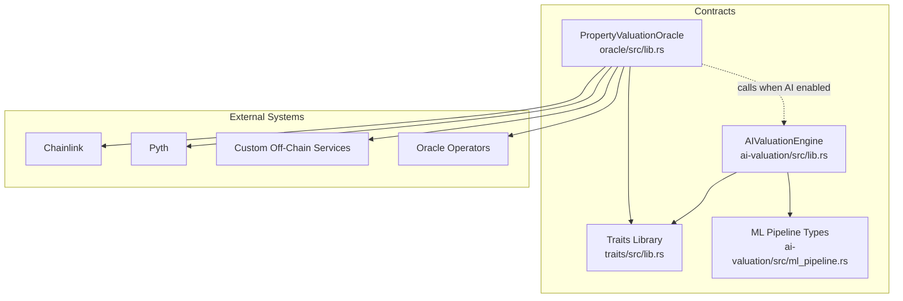
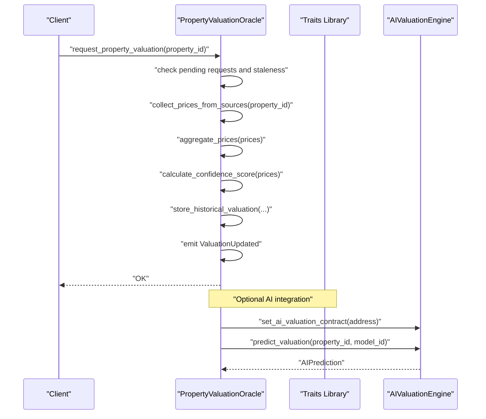
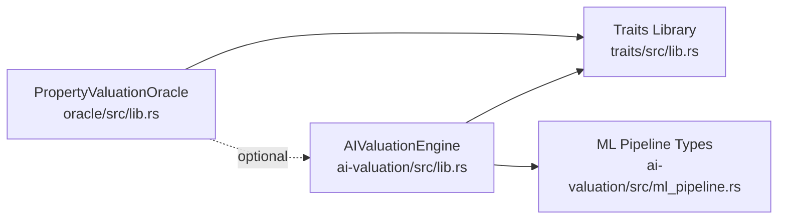

# Oracle Integration APIs

<cite>
**Referenced Files in This Document**
- [lib.rs](file://stellar-insured-contracts/contracts/oracle/src/lib.rs)
- [README.md](file://stellar-insured-contracts/contracts/oracle/README.md)
- [lib.rs](file://stellar-insured-contracts/contracts/traits/src/lib.rs)
- [lib.rs](file://stellar-insured-contracts/contracts/ai-valuation/src/lib.rs)
- [ml_pipeline.rs](file://stellar-insured-contracts/contracts/ai-valuation/src/ml_pipeline.rs)
</cite>

## Table of Contents
1. [Introduction](#introduction)
2. [Project Structure](#project-structure)
3. [Core Components](#core-components)
4. [Architecture Overview](#architecture-overview)
5. [Detailed Component Analysis](#detailed-component-analysis)
6. [Dependency Analysis](#dependency-analysis)
7. [Performance Considerations](#performance-considerations)
8. [Troubleshooting Guide](#troubleshooting-guide)
9. [Conclusion](#conclusion)
10. [Appendices](#appendices)

## Introduction
This document describes the oracle contract interfaces for property valuations within the PropChain ecosystem. It focuses on external data feed integration, price reference systems, and off-chain computation coordination. The documentation covers all oracle functions including data request mechanisms, external service integration, and result validation processes. It also includes examples of oracle data retrieval workflows, price feed configuration, reliability monitoring, security considerations, oracle selection criteria, redundancy strategies, failure handling procedures, and performance optimization techniques for data fetching and caching.

## Project Structure
The oracle integration spans three primary modules:
- Oracle contract: Implements property valuation retrieval, aggregation, confidence scoring, and administrative controls.
- Traits: Defines shared data structures, error types, and the Oracle and OracleRegistry interfaces.
- AI Valuation Engine: Provides AI-powered valuation capabilities and integrates with the Oracle contract for cross-contract calls.

**Diagram sources**
- [lib.rs:105-883](file://stellar-insured-contracts/contracts/oracle/src/lib.rs#L105-L883)
- [lib.rs:9-722](file://stellar-insured-contracts/contracts/traits/src/lib.rs#L9-L722)
- [lib.rs:105-795](file://stellar-insured-contracts/contracts/ai-valuation/src/lib.rs#L105-L795)
- [ml_pipeline.rs:1-326](file://stellar-insured-contracts/contracts/ai-valuation/src/ml_pipeline.rs#L1-L326)

**Section sources**
- [lib.rs:105-883](file://stellar-insured-contracts/contracts/oracle/src/lib.rs#L105-L883)
- [lib.rs:249-311](file://stellar-insured-contracts/contracts/traits/src/lib.rs#L249-L311)
- [lib.rs:105-795](file://stellar-insured-contracts/contracts/ai-valuation/src/lib.rs#L105-L795)

## Core Components
- PropertyValuationOracle: Central contract for retrieving and updating property valuations, aggregating prices from multiple sources, detecting anomalies, and emitting events.
- Oracle trait: Standardized interface for getting valuations, requesting valuations, and accessing historical and volatility metrics.
- OracleRegistry trait: Administrative interface for adding/removing sources, reputation management, slashing, and anomaly detection.
- AIValuationEngine: Optional AI-backed valuation engine that can be invoked by the Oracle contract for AI-driven predictions.

Key capabilities:
- Multi-source price feeds (Chainlink, Pyth, Custom, Manual, AIModel).
- Weighted aggregation with outlier detection and confidence scoring.
- Historical tracking and volatility metrics.
- Price alerts and anomaly detection.
- Reputation and slashing for oracle sources.
- Batching of valuation requests.

**Section sources**
- [lib.rs:105-883](file://stellar-insured-contracts/contracts/oracle/src/lib.rs#L105-L883)
- [lib.rs:249-311](file://stellar-insured-contracts/contracts/traits/src/lib.rs#L249-L311)
- [README.md:36-189](file://stellar-insured-contracts/contracts/oracle/README.md#L36-L189)

## Architecture Overview
The Oracle contract orchestrates data acquisition from configured sources, validates freshness, aggregates prices, computes confidence metrics, and stores valuations with historical tracking. Administrative functions manage sources, reputation, and penalties. Optionally, the Oracle can coordinate with the AI Valuation Engine for AI-powered valuations.

**Diagram sources**
- [lib.rs:196-225](file://stellar-insured-contracts/contracts/oracle/src/lib.rs#L196-L225)
- [lib.rs:474-542](file://stellar-insured-contracts/contracts/oracle/src/lib.rs#L474-L542)
- [lib.rs:389-403](file://stellar-insured-contracts/contracts/oracle/src/lib.rs#L389-L403)
- [lib.rs:320-365](file://stellar-insured-contracts/contracts/ai-valuation/src/lib.rs#L320-L365)

**Section sources**
- [lib.rs:196-225](file://stellar-insured-contracts/contracts/oracle/src/lib.rs#L196-L225)
- [lib.rs:474-542](file://stellar-insured-contracts/contracts/oracle/src/lib.rs#L474-L542)
- [lib.rs:320-365](file://stellar-insured-contracts/contracts/ai-valuation/src/lib.rs#L320-L365)

## Detailed Component Analysis

### Oracle Contract API
The Oracle contract exposes functions to query valuations, trigger updates, configure sources, and manage operational parameters.

- Retrieval APIs
  - get_property_valuation(property_id): Retrieves the latest PropertyValuation.
  - get_valuation_with_confidence(property_id): Returns valuation plus volatility and confidence interval.
  - get_historical_valuations(property_id, limit): Returns recent historical valuations.
  - get_market_volatility(property_type, location): Returns volatility metrics for a region and property type.

- Update APIs
  - update_property_valuation(property_id, valuation): Admin-only update with validation and alerting.
  - update_valuation_from_sources(property_id): Triggers aggregation from active sources.
  - request_property_valuation(property_id): Initiates a new valuation request with rate limiting.
  - batch_request_valuations(property_ids): Efficiently batches multiple requests.

- Administrative APIs
  - add_oracle_source(source): Registers a new oracle source (admin).
  - set_location_adjustment(adjustment): Applies geographic adjustments (admin).
  - update_market_trend(trend): Updates market trend data (admin).
  - update_source_reputation(source_id, success): Adjusts source reputation (admin).
  - slash_source(source_id, penalty): Penalizes misbehaving sources (admin).
  - set_ai_valuation_contract(ai_contract): Sets AI contract address (admin).
  - get_ai_valuation_contract(): Returns AI contract address.

- OracleRegistry APIs
  - add_source(source), remove_source(source_id), update_reputation(source_id, success),
  - get_reputation(source_id), slash_source(source_id, penalty), detect_anomalies(property_id, new_valuation).

- Events
  - ValuationUpdated, PriceAlertTriggered, OracleSourceAdded.

- Data Structures
  - PropertyValuation, ValuationWithConfidence, OracleSource, PriceData, PriceAlert, LocationAdjustment, MarketTrend, VolatilityMetrics.

Integration points:
- External price feeds: Implemented via get_price_from_source for Chainlink, Pyth, Substrate, Custom, Manual, and AIModel.
- AI integration: When AI contract is set, AIModel sources call the AI engine for predictions.

Security and reliability:
- Access control: Admin-only functions enforce authorization.
- Freshness checks: is_price_fresh validates timestamps against max_price_staleness.
- Outlier detection: filter_outliers removes extreme deviations.
- Reputation and slashing: Automated deactivation and penalties reduce risk from poor sources.
- Anomaly detection: is_anomaly flags large single-period changes.

**Section sources**
- [lib.rs:130-194](file://stellar-insured-contracts/contracts/oracle/src/lib.rs#L130-L194)
- [lib.rs:196-260](file://stellar-insured-contracts/contracts/oracle/src/lib.rs#L196-L260)
- [lib.rs:262-310](file://stellar-insured-contracts/contracts/oracle/src/lib.rs#L262-L310)
- [lib.rs:311-397](file://stellar-insured-contracts/contracts/oracle/src/lib.rs#L311-L397)
- [lib.rs:389-403](file://stellar-insured-contracts/contracts/oracle/src/lib.rs#L389-L403)
- [lib.rs:405-448](file://stellar-insured-contracts/contracts/oracle/src/lib.rs#L405-L448)
- [lib.rs:450-463](file://stellar-insured-contracts/contracts/oracle/src/lib.rs#L450-L463)
- [lib.rs:787-832](file://stellar-insured-contracts/contracts/oracle/src/lib.rs#L787-L832)
- [lib.rs:834-876](file://stellar-insured-contracts/contracts/oracle/src/lib.rs#L834-L876)
- [lib.rs:474-542](file://stellar-insured-contracts/contracts/oracle/src/lib.rs#L474-L542)
- [lib.rs:549-576](file://stellar-insured-contracts/contracts/oracle/src/lib.rs#L549-L576)
- [lib.rs:578-622](file://stellar-insured-contracts/contracts/oracle/src/lib.rs#L578-L622)
- [lib.rs:631-681](file://stellar-insured-contracts/contracts/oracle/src/lib.rs#L631-L681)
- [lib.rs:683-706](file://stellar-insured-contracts/contracts/oracle/src/lib.rs#L683-L706)
- [lib.rs:708-719](file://stellar-insured-contracts/contracts/oracle/src/lib.rs#L708-L719)
- [lib.rs:743-769](file://stellar-insured-contracts/contracts/oracle/src/lib.rs#L743-L769)
- [lib.rs:771-779](file://stellar-insured-contracts/contracts/oracle/src/lib.rs#L771-L779)
- [README.md:36-189](file://stellar-insured-contracts/contracts/oracle/README.md#L36-L189)

### Oracle Trait and Registry Interfaces
The traits define standardized interfaces for oracle operations and registry management, enabling interoperability and consistent client integration.

- Oracle trait methods:
  - get_valuation(property_id)
  - get_valuation_with_confidence(property_id)
  - request_valuation(property_id)
  - batch_request_valuations(property_ids)
  - get_historical_valuations(property_id, limit)
  - get_market_volatility(property_type, location)

- OracleRegistry trait methods:
  - add_source(source), remove_source(source_id)
  - update_reputation(source_id, success), get_reputation(source_id)
  - slash_source(source_id, penalty_amount)
  - detect_anomalies(property_id, new_valuation)

These traits are implemented by the PropertyValuationOracle, ensuring a uniform API surface.

**Section sources**
- [lib.rs:249-311](file://stellar-insured-contracts/contracts/traits/src/lib.rs#L249-L311)
- [lib.rs:787-876](file://stellar-insured-contracts/contracts/oracle/src/lib.rs#L787-L876)

### AI Valuation Engine Integration
The AI Valuation Engine provides AI-driven predictions and can be coordinated with the Oracle contract. When configured, AIModel sources in the Oracle can call the AI engine for predictions.

Key capabilities:
- Model registration and updates with performance metrics.
- Feature extraction and prediction generation.
- Ensemble predictions combining multiple models.
- Bias detection and fairness monitoring.
- Drift detection and A/B testing support.
- Pause/resume and admin controls.

Integration with Oracle:
- Oracle can set/get AI contract address.
- Oracle can request AI predictions when AIModel sources are active.

**Section sources**
- [lib.rs:105-795](file://stellar-insured-contracts/contracts/ai-valuation/src/lib.rs#L105-L795)
- [ml_pipeline.rs:1-326](file://stellar-insured-contracts/contracts/ai-valuation/src/ml_pipeline.rs#L1-L326)
- [lib.rs:389-403](file://stellar-insured-contracts/contracts/oracle/src/lib.rs#L389-L403)
- [lib.rs:526-541](file://stellar-insured-contracts/contracts/oracle/src/lib.rs#L526-L541)

### Data Structures and Types
Shared data structures define the canonical representation of valuations, sources, alerts, and metrics.

- PropertyValuation: valuation amount, confidence score, sources used, timestamps, method.
- ValuationWithConfidence: includes volatility index and confidence interval.
- OracleSource: id, type, address, activity, weight, last_updated.
- PriceData: price, timestamp, source id.
- PriceAlert: property_id, threshold%, alert_address, last_triggered, is_active.
- LocationAdjustment: location_code, adjustment%, last_updated, confidence_score.
- MarketTrend: property_type, location, trend%, period_months, last_updated.
- VolatilityMetrics: property_type, location, volatility_index, average_price_change, period_days, last_updated.

**Section sources**
- [lib.rs:106-247](file://stellar-insured-contracts/contracts/traits/src/lib.rs#L106-L247)

### External Data Feed Integration
The Oracle contract supports multiple oracle source types. The integration point for external feeds is implemented in get_price_from_source, which currently returns placeholder errors for Chainlink, Pyth, Substrate, Manual, and Custom. For AIModel sources, it calls the AI valuation contract if configured.

Implementation guidance:
- Chainlink/Pyth/Substrate: Replace placeholder errors with actual off-chain call logic to fetch price feeds.
- Custom: Allow custom contracts to provide price data conforming to PriceData.
- Manual: Administrative updates only.
- AIModel: Cross-contract call to AI engine for predictions.

**Section sources**
- [lib.rs:498-542](file://stellar-insured-contracts/contracts/oracle/src/lib.rs#L498-L542)

### Price Reference Systems and Aggregation
The Oracle contract aggregates prices from active sources using weighted averages and outlier detection. Confidence scoring considers both source count and price variance.

Processing logic:
- collect_prices_from_sources: Iterates active sources and collects fresh PriceData entries.
- filter_outliers: Computes mean and standard deviation, filters values beyond threshold standard deviations.
- aggregate_prices: Computes weighted average using source weights.
- calculate_confidence_score: Combines source count and coefficient of variation.
- calculate_volatility: Computes average absolute change over historical valuations.
- calculate_confidence_interval: Derives min/max range from valuation and confidence score.

**Section sources**
- [lib.rs:474-496](file://stellar-insured-contracts/contracts/oracle/src/lib.rs#L474-L496)
- [lib.rs:578-622](file://stellar-insured-contracts/contracts/oracle/src/lib.rs#L578-L622)
- [lib.rs:549-576](file://stellar-insured-contracts/contracts/oracle/src/lib.rs#L549-L576)
- [lib.rs:631-681](file://stellar-insured-contracts/contracts/oracle/src/lib.rs#L631-L681)
- [lib.rs:683-706](file://stellar-insured-contracts/contracts/oracle/src/lib.rs#L683-L706)
- [lib.rs:708-719](file://stellar-insured-contracts/contracts/oracle/src/lib.rs#L708-L719)

### Reliability Monitoring and Alerts
The Oracle contract provides:
- Price alerts: set_price_alert configures threshold-based notifications.
- Historical tracking: store_historical_valuation maintains up to 100 previous valuations.
- Anomaly detection: is_anomaly flags large single-period changes unless volatility is high.
- Reputation and slashing: update_source_reputation and slash_source penalize poor performers.
- Pending request management: request_property_valuation enforces staleness limits.

**Section sources**
- [lib.rs:366-387](file://stellar-insured-contracts/contracts/oracle/src/lib.rs#L366-L387)
- [lib.rs:727-741](file://stellar-insured-contracts/contracts/oracle/src/lib.rs#L727-L741)
- [lib.rs:311-327](file://stellar-insured-contracts/contracts/oracle/src/lib.rs#L311-L327)
- [lib.rs:262-310](file://stellar-insured-contracts/contracts/oracle/src/lib.rs#L262-L310)
- [lib.rs:228-260](file://stellar-insured-contracts/contracts/oracle/src/lib.rs#L228-L260)

### Security Considerations
- Access control: Administrative functions require admin authorization.
- Price validation: Staleness checks and outlier detection mitigate stale or manipulated data.
- Fallback mechanisms: Multiple oracle sources reduce single points of failure.
- Rate limiting: Pending request timestamps prevent rapid updates.
- Reputation and slashing: Automated deactivation and penalties for underperforming or malicious sources.
- AI safety: Bias detection and fairness monitoring in AI engine.

**Section sources**
- [lib.rs:467-472](file://stellar-insured-contracts/contracts/oracle/src/lib.rs#L467-L472)
- [lib.rs:544-547](file://stellar-insured-contracts/contracts/oracle/src/lib.rs#L544-L547)
- [lib.rs:578-622](file://stellar-insured-contracts/contracts/oracle/src/lib.rs#L578-L622)
- [README.md:159-165](file://stellar-insured-contracts/contracts/oracle/README.md#L159-L165)
- [lib.rs:457-482](file://stellar-insured-contracts/contracts/ai-valuation/src/lib.rs#L457-L482)

### Oracle Selection Criteria and Redundancy Strategies
Selection criteria:
- Source weight: Reflects trust and contribution to aggregation.
- Reputation score: Dynamically managed by update_source_reputation.
- Freshness: is_price_fresh ensures recent data.
- Diversity: Mix of Chainlink, Pyth, Custom, Manual, and AIModel sources.

Redundancy strategies:
- Multiple active sources: min_sources_required enforces minimum viable set.
- Outlier filtering: Improves robustness against bad actors.
- Automatic deactivation: Low reputation triggers removal from active_sources.

**Section sources**
- [lib.rs:56-62](file://stellar-insured-contracts/contracts/oracle/src/lib.rs#L56-L62)
- [lib.rs:119-121](file://stellar-insured-contracts/contracts/oracle/src/lib.rs#L119-L121)
- [lib.rs:410-418](file://stellar-insured-contracts/contracts/oracle/src/lib.rs#L410-L418)
- [lib.rs:280-287](file://stellar-insured-contracts/contracts/oracle/src/lib.rs#L280-L287)

### Failure Handling Procedures
Common failure scenarios and handling:
- InsufficientSources: Triggered when fewer than min_sources_required prices are collected.
- PriceFeedError: Placeholder for external feed failures; replace with actual error propagation.
- RequestPending: Prevents overlapping requests within max_price_staleness.
- OracleSourceNotFound: Occurs when source weight lookup fails.
- Unauthorized: Admin-only operations reject non-admin callers.

Mitigation:
- Retry logic at the client level for transient failures.
- Monitor PriceFeedError occurrences and adjust source weights/reputation.
- Enforce staleness and outlier thresholds to avoid propagating bad data.

**Section sources**
- [lib.rs:10-21](file://stellar-insured-contracts/contracts/oracle/src/lib.rs#L10-L21)
- [lib.rs:205-207](file://stellar-insured-contracts/contracts/oracle/src/lib.rs#L205-L207)
- [lib.rs:507-541](file://stellar-insured-contracts/contracts/oracle/src/lib.rs#L507-L541)
- [lib.rs:233-236](file://stellar-insured-contracts/contracts/oracle/src/lib.rs#L233-L236)
- [lib.rs:268-270](file://stellar-insured-contracts/contracts/oracle/src/lib.rs#L268-L270)
- [lib.rs:624-629](file://stellar-insured-contracts/contracts/oracle/src/lib.rs#L624-L629)

### Performance Optimization Techniques
Optimization strategies:
- Caching: Comparable properties cache and feature cache TTL in AI engine reduce repeated computations.
- Batching: batch_request_valuations minimizes transaction overhead.
- Weighted aggregation: Efficiently combines multiple sources with minimal recomputation.
- Fixed-point arithmetic: Confidence and volatility calculations use integer math to avoid floating costs.
- Outlier filtering: Reduces variance and improves confidence without expensive operations.

**Section sources**
- [lib.rs:450-463](file://stellar-insured-contracts/contracts/oracle/src/lib.rs#L450-L463)
- [lib.rs:135-136](file://stellar-insured-contracts/contracts/ai-valuation/src/lib.rs#L135-L136)
- [lib.rs:578-622](file://stellar-insured-contracts/contracts/oracle/src/lib.rs#L578-L622)
- [lib.rs:631-681](file://stellar-insured-contracts/contracts/oracle/src/lib.rs#L631-L681)

## Dependency Analysis
The Oracle contract depends on the traits library for shared types and interfaces. The AI engine depends on the traits library and ML pipeline types. The Oracle optionally depends on the AI engine for AIModel sources.

**Diagram sources**
- [lib.rs:10-12](file://stellar-insured-contracts/contracts/oracle/src/lib.rs#L10-L12)
- [lib.rs:1-12](file://stellar-insured-contracts/contracts/traits/src/lib.rs#L1-L12)
- [lib.rs:1-12](file://stellar-insured-contracts/contracts/ai-valuation/src/lib.rs#L1-L12)
- [ml_pipeline.rs:1-8](file://stellar-insured-contracts/contracts/ai-valuation/src/ml_pipeline.rs#L1-L8)

**Section sources**
- [lib.rs:10-12](file://stellar-insured-contracts/contracts/oracle/src/lib.rs#L10-L12)
- [lib.rs:1-12](file://stellar-insured-contracts/contracts/traits/src/lib.rs#L1-L12)
- [lib.rs:1-12](file://stellar-insured-contracts/contracts/ai-valuation/src/lib.rs#L1-L12)
- [ml_pipeline.rs:1-8](file://stellar-insured-contracts/contracts/ai-valuation/src/ml_pipeline.rs#L1-L8)

## Performance Considerations
- Prefer weighted aggregation with outlier filtering to minimize variance and improve confidence.
- Use batching for multiple property requests to reduce gas and latency.
- Cache frequently accessed data (comparable properties, features) with TTL to avoid redundant computations.
- Monitor staleness thresholds to prevent outdated valuations from being used.
- Implement efficient outlier detection using integer arithmetic to avoid heavy operations.

[No sources needed since this section provides general guidance]

## Troubleshooting Guide
Common issues and resolutions:
- Property not found: Ensure property_id exists in storage; check get_property_valuation.
- Insufficient sources: Add more active sources or reduce min_sources_required temporarily.
- Price feed errors: Verify external feed addresses and network connectivity; check get_price_from_source.
- Unauthorized access: Confirm caller is admin for admin-only functions.
- Stale prices: Increase frequency of update_valuation_from_sources or reduce max_price_staleness.
- Anomaly flagged: Investigate large single-period changes; review market volatility and outlier thresholds.

**Section sources**
- [lib.rs:10-21](file://stellar-insured-contracts/contracts/oracle/src/lib.rs#L10-L21)
- [lib.rs:134-139](file://stellar-insured-contracts/contracts/oracle/src/lib.rs#L134-L139)
- [lib.rs:205-207](file://stellar-insured-contracts/contracts/oracle/src/lib.rs#L205-L207)
- [lib.rs:498-542](file://stellar-insured-contracts/contracts/oracle/src/lib.rs#L498-L542)
- [lib.rs:267-270](file://stellar-insured-contracts/contracts/oracle/src/lib.rs#L267-L270)
- [lib.rs:544-547](file://stellar-insured-contracts/contracts/oracle/src/lib.rs#L544-L547)
- [lib.rs:311-327](file://stellar-insured-contracts/contracts/oracle/src/lib.rs#L311-L327)

## Conclusion
The PropertyValuationOracle provides a robust, extensible framework for property valuations with multi-source price feeds, statistical aggregation, confidence scoring, and administrative controls. By leveraging external data sources, AI engines, and strong security measures, the system ensures reliable, transparent, and auditable valuations suitable for financial applications.

[No sources needed since this section summarizes without analyzing specific files]

## Appendices

### API Reference Summary
- Oracle trait: get_valuation, get_valuation_with_confidence, request_valuation, batch_request_valuations, get_historical_valuations, get_market_volatility.
- OracleRegistry trait: add_source, remove_source, update_reputation, get_reputation, slash_source, detect_anomalies.
- Oracle contract functions: retrieval, update, administrative, and alert management.

**Section sources**
- [lib.rs:249-311](file://stellar-insured-contracts/contracts/traits/src/lib.rs#L249-L311)
- [lib.rs:787-876](file://stellar-insured-contracts/contracts/oracle/src/lib.rs#L787-L876)
- [README.md:36-189](file://stellar-insured-contracts/contracts/oracle/README.md#L36-L189)