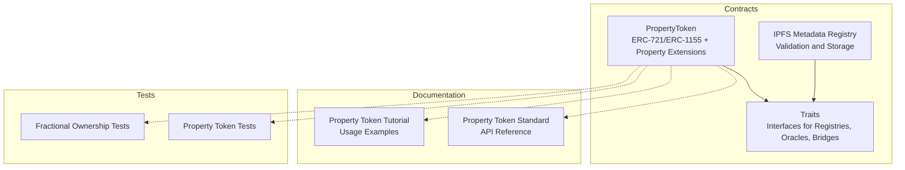
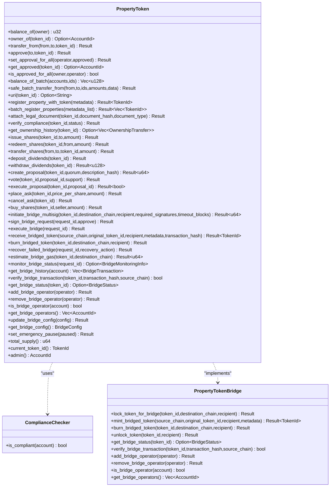
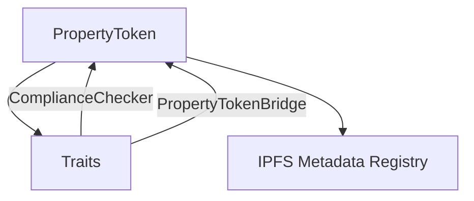

# Property Management APIs

<cite>
**Referenced Files in This Document**
- [lib.rs](file://stellar-insured-contracts/contracts/property-token/src/lib.rs)
- [lib.rs](file://stellar-insured-contracts/contracts/traits/src/lib.rs)
- [lib.rs](file://stellar-insured-contracts/contracts/ipfs-metadata/src/lib.rs)
- [property_token_standard.md](file://stellar-insured-contracts/docs/property_token_standard.md)
- [property_token_tutorial.md](file://stellar-insured-contracts/docs/tutorials/property_token_tutorial.md)
- [property_token_tests.rs](file://stellar-insured-contracts/tests/property_token_tests.rs)
- [fractional_ownership_tests.rs](file://stellar-insured-contracts/tests/fractional_ownership_tests.rs)
</cite>

## Table of Contents
1. [Introduction](#introduction)
2. [Project Structure](#project-structure)
3. [Core Components](#core-components)
4. [Architecture Overview](#architecture-overview)
5. [Detailed Component Analysis](#detailed-component-analysis)
6. [Dependency Analysis](#dependency-analysis)
7. [Performance Considerations](#performance-considerations)
8. [Troubleshooting Guide](#troubleshooting-guide)
9. [Conclusion](#conclusion)
10. [Appendices](#appendices)

## Introduction
This document provides comprehensive API documentation for the property management contract interfaces within the Stellar Soroban-based PropChain ecosystem. It focuses on property token creation, fractional ownership management, and property metadata handling. The documentation covers property registration, token minting, ownership transfers, fractional share management, query functions, error handling patterns, and state validation requirements. It also includes examples of property creation workflows, ownership transfer processes, and fractional share calculations, along with guidelines for metadata schemas and parameter validation.

## Project Structure
The property management functionality spans several contracts and supporting modules:
- Property token contract implementing dual ERC-721/ERC-1155 compatibility with real estate enhancements
- Traits defining shared interfaces for property registries, oracles, and bridges
- IPFS metadata registry for validating and storing property metadata with IPFS integration
- Tests validating core workflows and edge cases

**Diagram sources**
- [lib.rs:10-102](file://stellar-insured-contracts/contracts/property-token/src/lib.rs#L10-102)
- [lib.rs:23-480](file://stellar-insured-contracts/contracts/traits/src/lib.rs#L23-480)
- [lib.rs:10-200](file://stellar-insured-contracts/contracts/ipfs-metadata/src/lib.rs#L10-200)
- [property_token_standard.md:1-426](file://stellar-insured-contracts/docs/property_token_standard.md#L1-426)
- [property_token_tutorial.md:1-542](file://stellar-insured-contracts/docs/tutorials/property_token_tutorial.md#L1-542)
- [property_token_tests.rs:1-323](file://stellar-insured-contracts/tests/property_token_tests.rs#L1-323)
- [fractional_ownership_tests.rs:1-87](file://stellar-insured-contracts/tests/fractional_ownership_tests.rs#L1-87)

**Section sources**
- [lib.rs:10-102](file://stellar-insured-contracts/contracts/property-token/src/lib.rs#L10-102)
- [lib.rs:23-480](file://stellar-insured-contracts/contracts/traits/src/lib.rs#L23-480)
- [lib.rs:10-200](file://stellar-insured-contracts/contracts/ipfs-metadata/src/lib.rs#L10-200)

## Core Components
This section outlines the primary components and their responsibilities:
- PropertyToken: Implements property token lifecycle, ownership, fractional shares, governance, trading, and cross-chain bridging
- Traits: Defines interfaces for property registries, compliance checkers, oracles, and bridges
- IPFS Metadata Registry: Provides metadata validation and storage with IPFS integration

Key capabilities:
- Property registration and token minting with metadata
- Ownership transfers (ERC-721) and batch transfers (ERC-1155)
- Fractional share issuance, transfers, redemption, and dividend distribution
- Governance via proposals and voting
- Trading via limit orders and marketplace-like mechanics
- Cross-chain bridging with multi-signature support and recovery actions
- Compliance verification and enforcement
- Comprehensive query functions for balances, ownership, history, and bridge status

**Section sources**
- [lib.rs:477-2300](file://stellar-insured-contracts/contracts/property-token/src/lib.rs#L477-2300)
- [lib.rs:23-722](file://stellar-insured-contracts/contracts/traits/src/lib.rs#L23-722)
- [lib.rs:350-513](file://stellar-insured-contracts/contracts/ipfs-metadata/src/lib.rs#L350-513)

## Architecture Overview
The PropertyToken contract integrates multiple standards and extensions:
- ERC-721: Non-fungible token ownership and transfers
- ERC-1155: Multi-token support and batch operations
- Property-specific extensions: metadata, legal documents, ownership history, compliance
- Fractional ownership: shares, dividends, governance, trading
- Cross-chain bridging: multi-signature requests, locking, execution, recovery
- Compliance integration: external compliance checker interface

**Diagram sources**
- [lib.rs:477-2300](file://stellar-insured-contracts/contracts/property-token/src/lib.rs#L477-2300)
- [lib.rs:715-722](file://stellar-insured-contracts/contracts/traits/src/lib.rs#L715-722)
- [lib.rs:415-480](file://stellar-insured-contracts/contracts/traits/src/lib.rs#L415-480)

## Detailed Component Analysis

### Property Registration and Token Minting
- register_property_with_token(metadata): Registers a property and mints a token, initializes balances, ownership history, compliance flags, and legal documents count
- batch_register_properties(metadata_list): Batch registers multiple properties in a single transaction for gas efficiency
- uri(token_id): Returns metadata URI for token metadata (IPFS-based)

Parameter validation rules:
- PropertyMetadata fields must meet size and type constraints
- Location and legal_description are required
- Size and valuation must be within configured bounds
- IPFS CIDs (when present) must conform to CIDv0 or CIDv1 formats

Examples:
- Basic property creation workflow with metadata registration and ownership initialization
- Batch registration for multiple properties

**Section sources**
- [lib.rs:1240-1314](file://stellar-insured-contracts/contracts/property-token/src/lib.rs#L1240-1314)
- [lib.rs:1316-1377](file://stellar-insured-contracts/contracts/property-token/src/lib.rs#L1316-1377)
- [lib.rs:769-780](file://stellar-insured-contracts/contracts/property-token/src/lib.rs#L769-780)
- [lib.rs:381-427](file://stellar-insured-contracts/contracts/ipfs-metadata/src/lib.rs#L381-427)

### Ownership Transfers (ERC-721)
- balance_of(owner): Returns number of tokens owned by an account
- owner_of(token_id): Returns the owner of a specific token
- transfer_from(from,to,token_id): Transfers a token with authorization checks
- approve(to,token_id): Approves an account to transfer a specific token
- set_approval_for_all(operator,approved): Sets/unsets operator approval
- get_approved(token_id): Retrieves approved account for a token
- is_approved_for_all(owner,operator): Checks operator approval status

Authorization and validation:
- Caller must be owner or approved operator
- Token existence is validated
- Approvals are cleared after transfer

Examples:
- Direct transfer between parties
- Using approvals for third-party transfers
- Batch transfers (ERC-1155)

**Section sources**
- [lib.rs:549-700](file://stellar-insured-contracts/contracts/property-token/src/lib.rs#L549-700)
- [lib.rs:717-767](file://stellar-insured-contracts/contracts/property-token/src/lib.rs#L717-767)
- [property_token_tests.rs:44-103](file://stellar-insured-contracts/tests/property_token_tests.rs#L44-103)

### Fractional Ownership Management
- issue_shares(token_id,to,amount): Issues new fractional shares (admin or owner)
- redeem_shares(token_id,from,amount): Redeems shares (caller must be holder or approved)
- transfer_shares(from,to,token_id,amount): Transfers fractional shares with compliance checks
- share_balance_of(owner,token_id): Returns share balance for an owner
- total_shares(token_id): Returns total outstanding shares for a token
- deposit_dividends(token_id): Deposits dividends (payable) distributed pro-rata
- withdraw_dividends(token_id): Withdraws owed dividends
- create_proposal(token_id,quorum,description_hash): Creates governance proposal
- vote(token_id,proposal_id,support): Casts votes weighted by share balance
- execute_proposal(token_id,proposal_id): Executes passed proposals
- place_ask(token_id,price_per_share,amount): Places sell order (escrowed)
- cancel_ask(token_id): Cancels sell order and releases escrowed shares
- buy_shares(token_id,seller,amount): Executes purchase with compliance checks
- get_last_trade_price(token_id): Returns last trade price
- get_portfolio(owner,token_ids): Aggregates portfolio holdings
- get_tax_record(owner,token_id): Retrieves tax records

Fractional share calculations:
- Dividends per share accumulation scaled by fixed precision
- Share-weighted voting power
- Pro-rata dividend distribution based on share balance

Examples:
- Issuing and transferring shares
- Dividend flow and withdrawal
- Trading shares via limit orders
- Governance participation and execution

**Section sources**
- [lib.rs:801-1194](file://stellar-insured-contracts/contracts/property-token/src/lib.rs#L801-1194)
- [fractional_ownership_tests.rs:17-84](file://stellar-insured-contracts/tests/fractional_ownership_tests.rs#L17-84)

### Cross-Chain Bridging
- initiate_bridge_multisig(token_id,destination_chain,recipient,required_signatures,timeout_blocks): Initiates bridge with multi-signature requirement
- sign_bridge_request(request_id,approve): Operators sign bridge requests
- execute_bridge(request_id): Executes bridge after required signatures
- receive_bridged_token(source_chain,original_token_id,recipient,metadata,transaction_hash): Receives bridged token on destination chain
- burn_bridged_token(token_id,destination_chain,recipient): Burns bridged token when returning
- recover_failed_bridge(request_id,recovery_action): Admin-recover failed bridges
- estimate_bridge_gas(token_id,destination_chain): Estimates gas usage
- monitor_bridge_status(request_id): Monitors bridge request progress
- get_bridge_history(account): Retrieves bridge transaction history
- verify_bridge_transaction(token_id,transaction_hash,source_chain): Verifies transaction hash
- get_bridge_status(token_id): Checks bridge status for a token
- add/remove_bridge_operator(operator): Manages bridge operators
- is_bridge_operator(account): Checks operator status
- get_bridge_operators(): Lists operators
- update_bridge_config(config): Updates bridge configuration
- get_bridge_config(): Retrieves current configuration
- set_emergency_pause(paused): Pauses/resumes bridge operations

Bridge security and validation:
- Multi-signature requirement with configurable thresholds
- Compliance verification before bridging
- Transaction hash verification
- Recovery actions for failed operations
- Gas estimation and limits

Examples:
- Initiating multi-signature bridge requests
- Signing and executing bridge operations
- Receiving and burning bridged tokens
- Monitoring and recovering failed bridges

**Section sources**
- [lib.rs:1469-2085](file://stellar-insured-contracts/contracts/property-token/src/lib.rs#L1469-2085)
- [lib.rs:482-526](file://stellar-insured-contracts/contracts/traits/src/lib.rs#L482-526)

### Property Metadata Handling
- attach_legal_document(token_id,document_hash,document_type): Attaches legal documents to property tokens
- verify_compliance(token_id,verification_status): Verifies compliance for tokens
- get_ownership_history(token_id): Retrieves complete ownership history
- set_compliance_registry(registry): Sets external compliance registry
- pass_compliance(account): Checks compliance via registry (if configured)

Metadata schemas and validation:
- PropertyMetadata includes location, size, legal description, valuation, and optional IPFS document references
- IPFS metadata registry validates metadata structure, sizes, types, and IPFS CIDs
- Document types include deeds, surveys, inspections, insurance, tax records, and others

Examples:
- Attaching legal documents to tokens
- Compliance verification workflow
- Ownership history retrieval

**Section sources**
- [lib.rs:1379-1467](file://stellar-insured-contracts/contracts/property-token/src/lib.rs#L1379-1467)
- [lib.rs:24-49](file://stellar-insured-contracts/contracts/traits/src/lib.rs#L24-49)
- [lib.rs:350-513](file://stellar-insured-contracts/contracts/ipfs-metadata/src/lib.rs#L350-513)

### Query Functions
- balance_of(owner): ERC-721 balance
- owner_of(token_id): ERC-721 owner
- get_approved(token_id): Approved account
- is_approved_for_all(owner,operator): Operator approval status
- balance_of_batch(accounts,ids): ERC-1155 batch balances
- uri(token_id): Token metadata URI
- share_balance_of(owner,token_id): Fractional share balance
- total_shares(token_id): Total outstanding shares
- get_last_trade_price(token_id): Last trade price
- get_portfolio(owner,token_ids): Portfolio aggregation
- get_tax_record(owner,token_id): Tax records
- get_ownership_history(token_id): Ownership history
- get_bridge_status(token_id): Bridge status
- get_bridge_history(account): Bridge history
- get_bridge_operators(): Bridge operators
- get_bridge_config(): Bridge configuration
- total_supply(): Total token supply
- current_token_id(): Current token counter
- admin(): Admin account

Examples:
- Querying balances and ownership
- Retrieving portfolio and tax records
- Checking bridge status and history

**Section sources**
- [lib.rs:549-1205](file://stellar-insured-contracts/contracts/property-token/src/lib.rs#L549-1205)
- [lib.rs:1950-2085](file://stellar-insured-contracts/contracts/property-token/src/lib.rs#L1950-2085)

### Error Handling Patterns and State Validation
- Error enum covers unauthorized access, token not found, invalid metadata, compliance failures, bridge errors, and more
- State validation ensures token existence, sufficient balances, proper approvals, and compliance checks
- Access control restricts administrative functions and bridge operations
- Monitoring and error logging track operational issues

Examples:
- Unauthorized transfer attempts
- Non-existent token operations
- Compliance verification failures
- Bridge invalid chain and signature requirements

**Section sources**
- [lib.rs:17-45](file://stellar-insured-contracts/contracts/property-token/src/lib.rs#L17-45)
- [lib.rs:2204-2299](file://stellar-insured-contracts/contracts/property-token/src/lib.rs#L2204-2299)
- [property_token_tests.rs:305-323](file://stellar-insured-contracts/tests/property_token_tests.rs#L305-323)

## Dependency Analysis
The PropertyToken contract depends on:
- Traits module for interfaces (PropertyRegistry, ComplianceChecker, PropertyTokenBridge, Oracle)
- IPFS metadata registry for metadata validation and storage
- Ink! framework for smart contract development

**Diagram sources**
- [lib.rs:1207-1216](file://stellar-insured-contracts/contracts/property-token/src/lib.rs#L1207-1216)
- [lib.rs:715-722](file://stellar-insured-contracts/contracts/traits/src/lib.rs#L715-722)
- [lib.rs:415-480](file://stellar-insured-contracts/contracts/traits/src/lib.rs#L415-480)

**Section sources**
- [lib.rs:1207-1216](file://stellar-insured-contracts/contracts/property-token/src/lib.rs#L1207-1216)
- [lib.rs:715-722](file://stellar-insured-contracts/contracts/traits/src/lib.rs#L715-722)

## Performance Considerations
- Batch operations: Use batch_register_properties and balance_of_batch to reduce gas costs
- Fractional shares: Efficient pro-rata calculations with fixed-point arithmetic
- Bridge gas estimation: Use estimate_bridge_gas to pre-validate gas limits
- Monitoring: Track error rates and recent errors for operational insights
- Storage patterns: Minimize repeated reads/writes by batching state updates

[No sources needed since this section provides general guidance]

## Troubleshooting Guide
Common issues and resolutions:
- TokenNotFound: Verify token exists and has not been burned
- Unauthorized: Check caller ownership or approval status
- ComplianceFailed: Ensure compliance verification before bridging and trading
- InvalidAmount: Validate amounts are greater than zero and sufficient for transfers/redemptions
- InsufficientBalance: Confirm sufficient share or token balance
- InvalidChain: Ensure destination chain is supported
- InsufficientSignatures: Collect required multi-signatures for bridge operations
- RequestExpired: Submit bridge requests before expiration
- BridgePaused: Resume bridge operations after emergency pause lifted

**Section sources**
- [lib.rs:17-45](file://stellar-insured-contracts/contracts/property-token/src/lib.rs#L17-45)
- [property_token_tests.rs:305-323](file://stellar-insured-contracts/tests/property_token_tests.rs#L305-323)

## Conclusion
The PropertyToken contract provides a robust, standards-compliant foundation for property tokenization with comprehensive real estate features. It supports property registration, ownership transfers, fractional ownership, governance, trading, and cross-chain bridging. The integration with traits and IPFS metadata ensures extensibility, compliance, and scalable metadata handling. The extensive test coverage and documented workflows demonstrate reliability and ease of integration.

[No sources needed since this section summarizes without analyzing specific files]

## Appendices

### API Reference Index
- Property Registration: register_property_with_token, batch_register_properties, uri
- Ownership Transfers: balance_of, owner_of, transfer_from, approve, set_approval_for_all, get_approved, is_approved_for_all, balance_of_batch, safe_batch_transfer_from
- Fractional Ownership: issue_shares, redeem_shares, transfer_shares, share_balance_of, total_shares, deposit_dividends, withdraw_dividends, create_proposal, vote, execute_proposal
- Trading: place_ask, cancel_ask, buy_shares, get_last_trade_price, get_portfolio, get_tax_record
- Cross-Chain Bridging: initiate_bridge_multisig, sign_bridge_request, execute_bridge, receive_bridged_token, burn_bridged_token, recover_failed_bridge, estimate_bridge_gas, monitor_bridge_status, get_bridge_history, verify_bridge_transaction, get_bridge_status, add/remove_bridge_operator, is_bridge_operator, get_bridge_operators, update_bridge_config, get_bridge_config, set_emergency_pause
- Metadata and Compliance: attach_legal_document, verify_compliance, get_ownership_history, set_compliance_registry, pass_compliance
- Query Functions: total_supply, current_token_id, admin

**Section sources**
- [lib.rs:477-2300](file://stellar-insured-contracts/contracts/property-token/src/lib.rs#L477-2300)
- [lib.rs:23-722](file://stellar-insured-contracts/contracts/traits/src/lib.rs#L23-722)
- [lib.rs:350-513](file://stellar-insured-contracts/contracts/ipfs-metadata/src/lib.rs#L350-513)