# Transaction Processing APIs

<cite>
**Referenced Files in This Document**
- [lib.rs](file://stellar-insured-contracts/contracts/escrow/src/lib.rs)
- [tests.rs](file://stellar-insured-contracts/contracts/escrow/src/tests.rs)
- [Cargo.toml](file://stellar-insured-contracts/contracts/escrow/Cargo.toml)
- [README.md](file://stellar-insured-contracts/contracts/escrow/README.md)
- [lib.rs](file://stellar-insured-contracts/contracts/fees/src/lib.rs)
- [Cargo.toml](file://stellar-insured-contracts/contracts/fees/Cargo.toml)
- [README.md](file://stellar-insured-contracts/contracts/fees/README.md)
- [lib.rs](file://stellar-insured-contracts/contracts/traits/src/lib.rs)
- [escrow-system.md](file://stellar-insured-contracts/docs/tutorials/escrow-system.md)
- [dynamic-fees-and-market.md](file://stellar-insured-contracts/docs/dynamic-fees-and-market.md)
</cite>

## Table of Contents
1. [Introduction](#introduction)
2. [Project Structure](#project-structure)
3. [Core Components](#core-components)
4. [Architecture Overview](#architecture-overview)
5. [Detailed Component Analysis](#detailed-component-analysis)
6. [Dependency Analysis](#dependency-analysis)
7. [Performance Considerations](#performance-considerations)
8. [Troubleshooting Guide](#troubleshooting-guide)
9. [Conclusion](#conclusion)
10. [Appendices](#appendices)

## Introduction
This document provides comprehensive API documentation for transaction processing interfaces focused on the PropChain ecosystem, specifically the advanced escrow system and dynamic fee management. It covers:
- Escrow management APIs: creation, multi-signature approvals, release/refund conditions, dispute resolution, and emergency overrides.
- Fee calculation APIs: dynamic fee computation, congestion-based adjustments, premium auction mechanics, validator incentives, and reporting.
- State management for escrow contracts, fee tracking, and settlement operations.
- Timeout mechanisms, cancellation procedures, and emergency withdrawal functions.

The documentation is designed for both technical and non-technical audiences, with diagrams, examples, and troubleshooting guidance.

## Project Structure
The relevant modules for transaction processing are organized as follows:
- Escrow contract: Advanced escrow with multi-signature, document custody, conditions, disputes, and audit trails.
- Fee contract: Dynamic fee calculation, automated fee adjustment, premium auctions, and reward distribution.
- Traits: Shared interfaces for operations, fee types, and integration contracts.

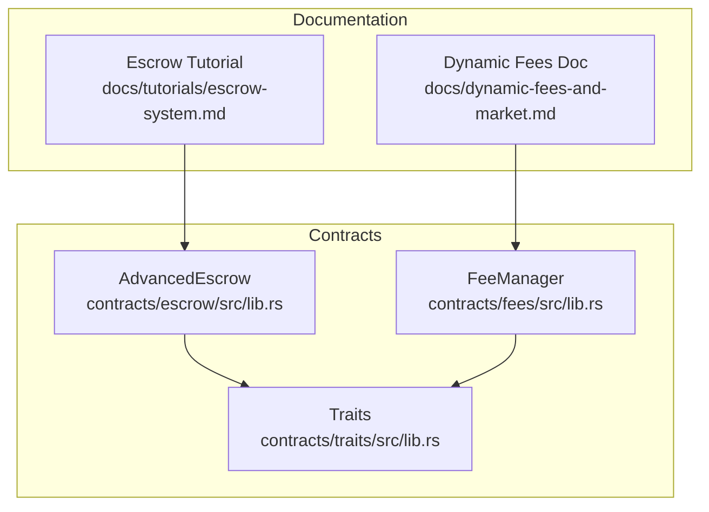

**Diagram sources**
- [lib.rs:137-162](file://stellar-insured-contracts/contracts/escrow/src/lib.rs#L137-L162)
- [lib.rs:158-190](file://stellar-insured-contracts/contracts/fees/src/lib.rs#L158-L190)
- [lib.rs:669-692](file://stellar-insured-contracts/contracts/traits/src/lib.rs#L669-L692)
- [escrow-system.md:1-633](file://stellar-insured-contracts/docs/tutorials/escrow-system.md#L1-L633)
- [dynamic-fees-and-market.md:1-80](file://stellar-insured-contracts/docs/dynamic-fees-and-market.md#L1-L80)

**Section sources**
- [Cargo.toml:1-37](file://stellar-insured-contracts/contracts/escrow/Cargo.toml#L1-L37)
- [Cargo.toml:1-26](file://stellar-insured-contracts/contracts/fees/Cargo.toml#L1-L26)

## Core Components
- AdvancedEscrow (Escrow contract):
  - Manages escrow lifecycle: creation, funding, multi-signature approvals, release/refund, document uploads/verification, condition tracking, dispute handling, and emergency overrides.
  - Provides query functions for escrow details, documents, conditions, disputes, audit logs, multi-sig configs, and signature counts.
- FeeManager (Fee contract):
  - Computes dynamic fees based on congestion and demand, supports automated fee adjustment, premium auctions, validator rewards, and reporting.
  - Exposes read-only fee estimates and reports for transparency and optimization.

**Section sources**
- [lib.rs:137-162](file://stellar-insured-contracts/contracts/escrow/src/lib.rs#L137-L162)
- [lib.rs:905-986](file://stellar-insured-contracts/contracts/escrow/src/lib.rs#L905-L986)
- [lib.rs:158-190](file://stellar-insured-contracts/contracts/fees/src/lib.rs#L158-L190)
- [lib.rs:339-423](file://stellar-insured-contracts/contracts/fees/src/lib.rs#L339-L423)

## Architecture Overview
The transaction processing architecture integrates escrow and fee management with shared traits and documentation-driven workflows.

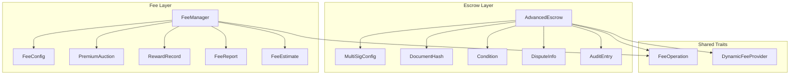

**Diagram sources**
- [lib.rs:75-162](file://stellar-insured-contracts/contracts/escrow/src/lib.rs#L75-L162)
- [lib.rs:158-190](file://stellar-insured-contracts/contracts/fees/src/lib.rs#L158-L190)
- [lib.rs:669-692](file://stellar-insured-contracts/contracts/traits/src/lib.rs#L669-L692)

## Detailed Component Analysis

### AdvancedEscrow API Reference
The AdvancedEscrow contract provides a comprehensive set of messages for secure property transactions with multi-signature support and dispute resolution.

- Construction and Admin
  - new(min_high_value_threshold: u128) -> Self
  - set_admin(new_admin: AccountId) -> Result<(), Error>
  - get_admin() -> AccountId
  - get_high_value_threshold() -> u128

- Escrow Lifecycle
  - create_escrow_advanced(property_id: u64, amount: u128, buyer: AccountId, seller: AccountId, participants: Vec<AccountId>, required_signatures: u8, release_time_lock: Option<u64>) -> Result<u64, Error>
  - deposit_funds(escrow_id: u64) -> Result<(), Error>
  - release_funds(escrow_id: u64) -> Result<(), Error>
  - refund_funds(escrow_id: u64) -> Result<(), Error>

- Multi-Signature and Approvals
  - sign_approval(escrow_id: u64, approval_type: ApprovalType) -> Result<(), Error>
  - get_signature_count(escrow_id: u64, approval_type: ApprovalType) -> u8
  - get_multi_sig_config(escrow_id: u64) -> Option<MultiSigConfig>

- Documents and Conditions
  - upload_document(escrow_id: u64, document_hash: Hash, document_type: String) -> Result<(), Error>
  - verify_document(escrow_id: u64, document_hash: Hash) -> Result<(), Error>
  - add_condition(escrow_id: u64, description: String) -> Result<u64, Error>
  - mark_condition_met(escrow_id: u64, condition_id: u64) -> Result<(), Error>
  - check_all_conditions_met(escrow_id: u64) -> Result<bool, Error>
  - get_documents(escrow_id: u64) -> Vec<DocumentHash>
  - get_conditions(escrow_id: u64) -> Vec<Condition>

- Disputes and Emergency Overrides
  - raise_dispute(escrow_id: u64, reason: String) -> Result<(), Error>
  - get_dispute(escrow_id: u64) -> Option<DisputeInfo>
  - resolve_dispute(escrow_id: u64, resolution: String) -> Result<(), Error>
  - emergency_override(escrow_id: u64, release_to_seller: bool) -> Result<(), Error>

- Queries and Utilities
  - get_escrow(escrow_id: u64) -> Option<EscrowData>
  - get_audit_trail(escrow_id: u64) -> Vec<AuditEntry>

- Events
  - EscrowCreated, FundsDeposited, FundsReleased, FundsRefunded, DocumentUploaded, DocumentVerified, ConditionAdded, ConditionMet, SignatureAdded, DisputeRaised, DisputeResolved, EmergencyOverride

- Errors
  - EscrowNotFound, Unauthorized, InvalidStatus, InsufficientFunds, ConditionsNotMet, SignatureThresholdNotMet, AlreadySigned, DocumentNotFound, DisputeActive, TimeLockActive, InvalidConfiguration, EscrowAlreadyFunded, ParticipantNotFound

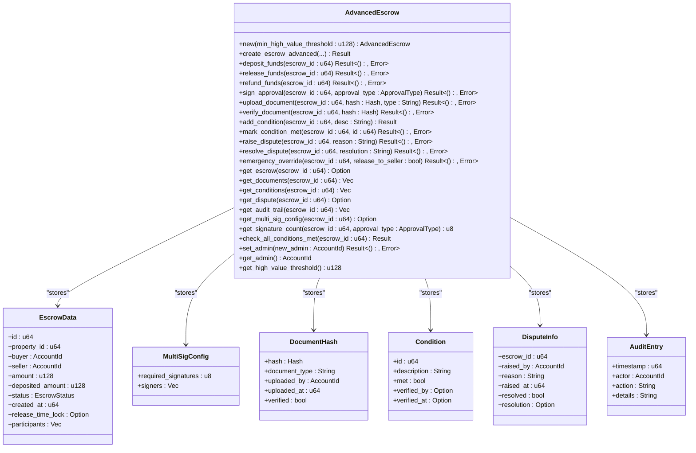

**Diagram sources**
- [lib.rs:137-162](file://stellar-insured-contracts/contracts/escrow/src/lib.rs#L137-L162)
- [lib.rs:62-130](file://stellar-insured-contracts/contracts/escrow/src/lib.rs#L62-L130)
- [lib.rs:79-82](file://stellar-insured-contracts/contracts/escrow/src/lib.rs#L79-L82)
- [lib.rs:108-119](file://stellar-insured-contracts/contracts/escrow/src/lib.rs#L108-L119)
- [lib.rs:121-130](file://stellar-insured-contracts/contracts/escrow/src/lib.rs#L121-L130)

**Section sources**
- [lib.rs:262-1026](file://stellar-insured-contracts/contracts/escrow/src/lib.rs#L262-L1026)
- [tests.rs:19-567](file://stellar-insured-contracts/contracts/escrow/src/tests.rs#L19-L567)

### Escrow Workflows and Examples

#### Escrow Setup Procedure
- Create an advanced escrow with multi-signature participants and optional time lock.
- Deposit funds to reach the target amount; escrow becomes active upon full funding.
- Upload and verify supporting documents; add conditions that must be met before release.
- Collect required signatures for release or refund; release funds to the seller or refund to the buyer accordingly.

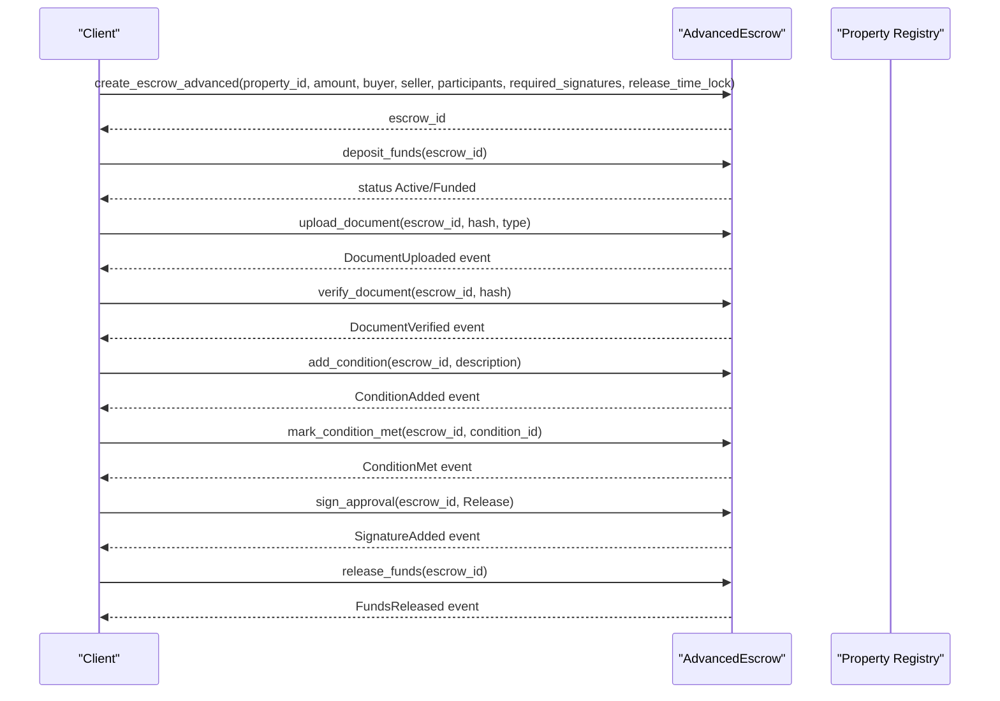

**Diagram sources**
- [lib.rs:282-356](file://stellar-insured-contracts/contracts/escrow/src/lib.rs#L282-L356)
- [lib.rs:358-398](file://stellar-insured-contracts/contracts/escrow/src/lib.rs#L358-L398)
- [lib.rs:513-612](file://stellar-insured-contracts/contracts/escrow/src/lib.rs#L513-L612)
- [lib.rs:614-707](file://stellar-insured-contracts/contracts/escrow/src/lib.rs#L614-L707)
- [lib.rs:709-758](file://stellar-insured-contracts/contracts/escrow/src/lib.rs#L709-L758)
- [lib.rs:400-464](file://stellar-insured-contracts/contracts/escrow/src/lib.rs#L400-L464)

**Section sources**
- [escrow-system.md:271-385](file://stellar-insured-contracts/docs/tutorials/escrow-system.md#L271-L385)
- [tests.rs:25-110](file://stellar-insured-contracts/contracts/escrow/src/tests.rs#L25-L110)

#### Payment Release Workflow
- Ensure all conditions are met and multi-signature threshold is satisfied.
- Verify time lock expiration if configured.
- Execute release to the seller; escrow status updates to Released.

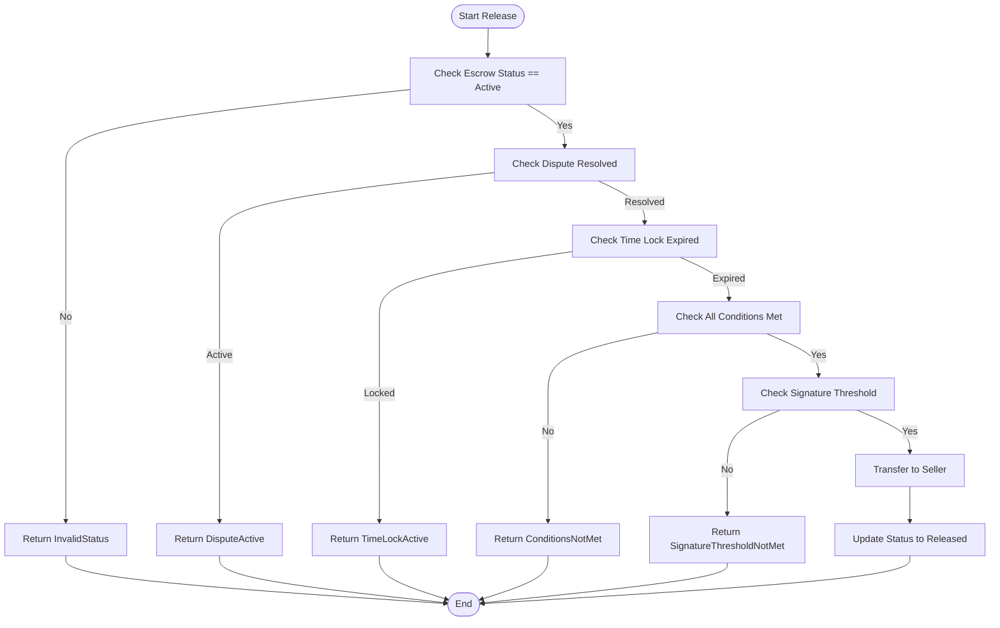

**Diagram sources**
- [lib.rs:400-464](file://stellar-insured-contracts/contracts/escrow/src/lib.rs#L400-L464)
- [lib.rs:418-433](file://stellar-insured-contracts/contracts/escrow/src/lib.rs#L418-L433)

#### Dispute Resolution Mechanism
- Buyer or seller can raise a dispute; admin can resolve it, updating status back to Active.
- Disputes block release until resolved.

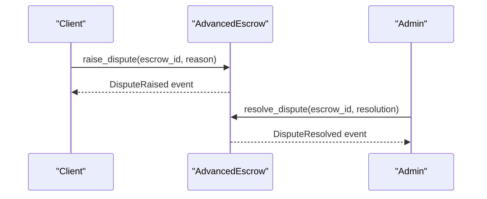

**Diagram sources**
- [lib.rs:760-809](file://stellar-insured-contracts/contracts/escrow/src/lib.rs#L760-L809)
- [lib.rs:811-844](file://stellar-insured-contracts/contracts/escrow/src/lib.rs#L811-L844)

**Section sources**
- [lib.rs:760-844](file://stellar-insured-contracts/contracts/escrow/src/lib.rs#L760-L844)
- [tests.rs:307-388](file://stellar-insured-contracts/contracts/escrow/src/tests.rs#L307-L388)

#### Emergency Override Function
- Admin can override and release funds to either buyer or seller under emergency conditions.

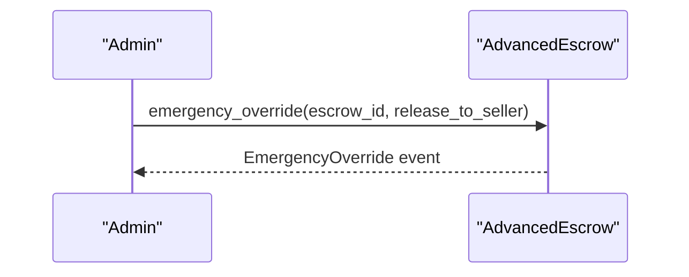

**Diagram sources**
- [lib.rs:847-901](file://stellar-insured-contracts/contracts/escrow/src/lib.rs#L847-L901)

**Section sources**
- [lib.rs:847-901](file://stellar-insured-contracts/contracts/escrow/src/lib.rs#L847-L901)

### Fee Calculation APIs

#### Dynamic Fee Calculation
- compute_dynamic_fee(config: &FeeConfig, congestion_index: u32, demand_factor_bp: u32) -> u128
- calculate_fee(operation: FeeOperation) -> u128
- congestion_index() -> u32
- demand_factor_bp() -> u32

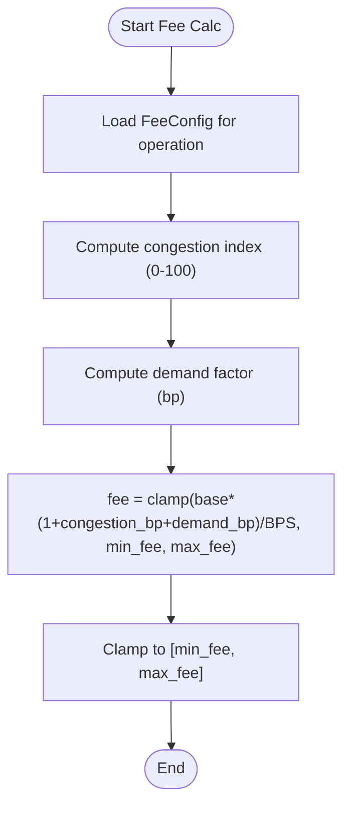

**Diagram sources**
- [lib.rs:246-265](file://stellar-insured-contracts/contracts/fees/src/lib.rs#L246-L265)
- [lib.rs:339-346](file://stellar-insured-contracts/contracts/fees/src/lib.rs#L339-L346)
- [lib.rs:316-335](file://stellar-insured-contracts/contracts/fees/src/lib.rs#L316-L335)

#### Automated Fee Adjustment
- update_fee_params() -> Result<(), FeeError>
- set_operation_config(operation: FeeOperation, config: FeeConfig) -> Result<(), FeeError>

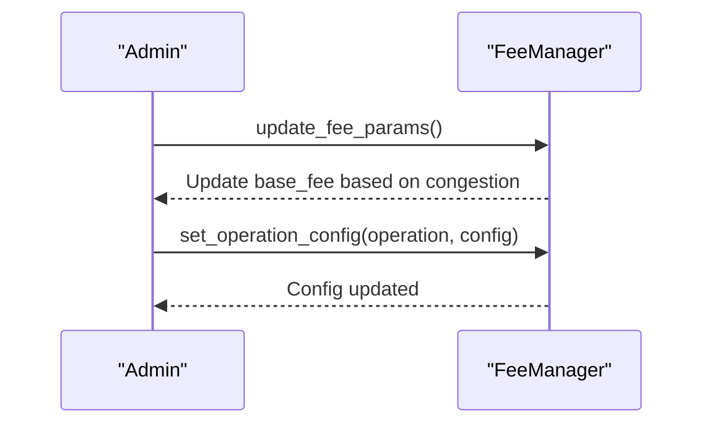

**Diagram sources**
- [lib.rs:374-402](file://stellar-insured-contracts/contracts/fees/src/lib.rs#L374-L402)
- [lib.rs:404-423](file://stellar-insured-contracts/contracts/fees/src/lib.rs#L404-L423)

#### Premium Auction Mechanism
- create_premium_auction(property_id: u64, min_bid: u128, duration_seconds: u64) -> Result<u64, FeeError>
- place_bid(auction_id: u64, amount: u128) -> Result<(), FeeError>
- settle_auction(auction_id: u64) -> Result<(), FeeError>

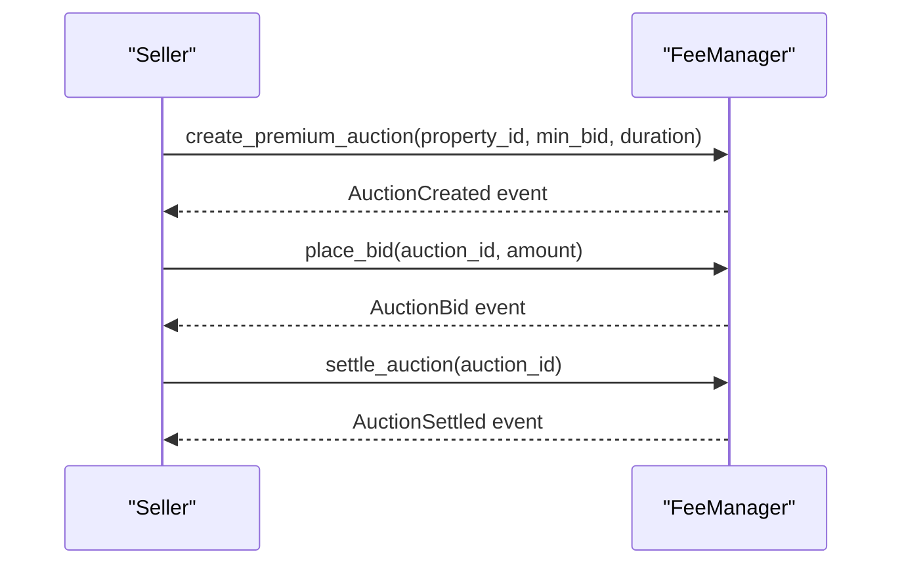

**Diagram sources**
- [lib.rs:427-464](file://stellar-insured-contracts/contracts/fees/src/lib.rs#L427-L464)
- [lib.rs:466-506](file://stellar-insured-contracts/contracts/fees/src/lib.rs#L466-L506)
- [lib.rs:508-535](file://stellar-insured-contracts/contracts/fees/src/lib.rs#L508-L535)

#### Incentives and Distribution
- add_validator(account: AccountId) -> Result<(), FeeError>
- remove_validator(account: AccountId) -> Result<(), FeeError>
- set_distribution_rates(validator_share_bp: u32, treasury_share_bp: u32) -> Result<(), FeeError>
- distribute_fees() -> Result<(), FeeError>
- claim_rewards() -> Result<u128, FeeError>
- pending_reward(account: AccountId) -> u128

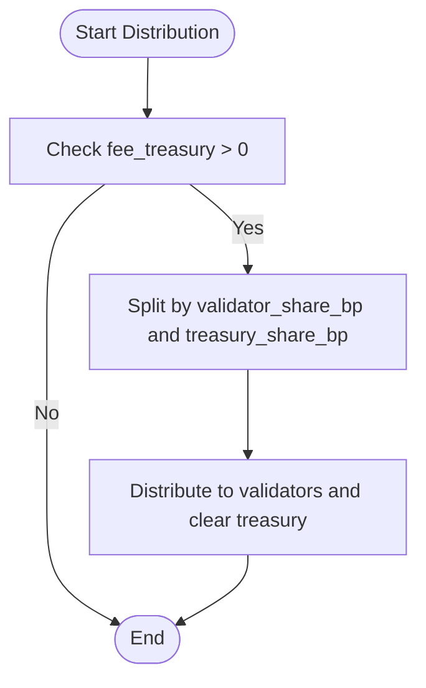

**Diagram sources**
- [lib.rs:549-614](file://stellar-insured-contracts/contracts/fees/src/lib.rs#L549-L614)

#### Market-Based Price Discovery and Reporting
- get_recommended_fee(operation: FeeOperation) -> u128
- get_fee_estimate(operation: FeeOperation) -> FeeEstimate
- get_fee_report() -> FeeReport
- get_fee_recommendations() -> Vec<String>

**Section sources**
- [lib.rs:654-730](file://stellar-insured-contracts/contracts/fees/src/lib.rs#L654-L730)
- [lib.rs:691-746](file://stellar-insured-contracts/contracts/fees/src/lib.rs#L691-L746)

## Dependency Analysis
The contracts depend on shared traits and each other as follows:

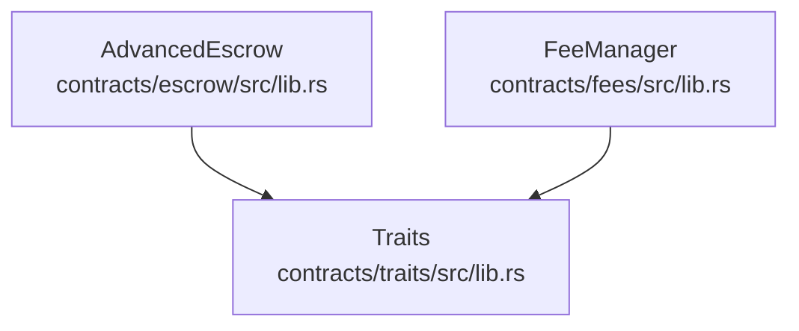

**Diagram sources**
- [Cargo.toml](file://stellar-insured-contracts/contracts/escrow/Cargo.toml#L18)
- [Cargo.toml](file://stellar-insured-contracts/contracts/fees/Cargo.toml#L12)
- [lib.rs:669-692](file://stellar-insured-contracts/contracts/traits/src/lib.rs#L669-L692)

**Section sources**
- [Cargo.toml:14-18](file://stellar-insured-contracts/contracts/escrow/Cargo.toml#L14-L18)
- [Cargo.toml:8-12](file://stellar-insured-contracts/contracts/fees/Cargo.toml#L8-L12)

## Performance Considerations
- Storage efficiency: Use minimal storage writes; batch operations where possible.
- Congestion handling: Dynamic fees automatically adjust to network load; consider batching during peak congestion.
- Gas optimization: Prefer read-only queries for fee estimates; avoid unnecessary state mutations.
- Audit logging: Maintain compact logs; paginate queries for large histories.

[No sources needed since this section provides general guidance]

## Troubleshooting Guide
Common issues and resolutions:
- EscrowNotFound: Ensure the escrow_id exists and is initialized.
- Unauthorized: Verify caller permissions (buyer/seller for certain actions, admin for dispute resolution/emergency override).
- InvalidStatus: Confirm escrow is in the expected state (e.g., Active for release).
- ConditionsNotMet: Ensure all added conditions are marked as met by authorized participants.
- SignatureThresholdNotMet: Verify required signatures are collected for the approval type.
- DisputeActive: Resolve disputes before releasing or refunding.
- TimeLockActive: Wait until the configured time lock expires.
- InsufficientFunds: Ensure contract has sufficient balance for transfers.
- DocumentNotFound: Verify document hash exists and is uploaded/verified.
- InvalidConfiguration: Check required signatures and participant lists.

**Section sources**
- [lib.rs:18-32](file://stellar-insured-contracts/contracts/escrow/src/lib.rs#L18-L32)
- [lib.rs:400-464](file://stellar-insured-contracts/contracts/escrow/src/lib.rs#L400-L464)
- [lib.rs:760-844](file://stellar-insured-contracts/contracts/escrow/src/lib.rs#L760-L844)

## Conclusion
The PropChain transaction processing APIs provide a robust, secure, and transparent framework for property-related financial operations:
- AdvancedEscrow enables multi-signature, condition-based, and dispute-aware fund management with comprehensive auditability.
- FeeManager offers congestion-responsive, market-based fee calculation with premium auction and validator reward mechanisms.
Together, these components support reliable, scalable, and compliant transaction workflows across the ecosystem.

[No sources needed since this section summarizes without analyzing specific files]

## Appendices

### API Parameter Validation for Fee Calculation
- FeeConfig validation:
  - min_fee <= max_fee
  - base_fee should be within [min_fee, max_fee]
  - congestion sensitivity and demand factor within acceptable ranges
- Operation-specific configs:
  - Validate per-operation FeeConfig before setting
- Auction validation:
  - min_bid must be positive
  - bids must exceed current_bid and meet min_bid
  - auction must not be settled or ended

**Section sources**
- [lib.rs:404-423](file://stellar-insured-contracts/contracts/fees/src/lib.rs#L404-L423)
- [lib.rs:466-506](file://stellar-insured-contracts/contracts/fees/src/lib.rs#L466-L506)
- [lib.rs:508-535](file://stellar-insured-contracts/contracts/fees/src/lib.rs#L508-L535)

### State Management and Settlement Operations
- Escrow states: Created, Funded, Active, Released, Refunded, Disputed, Cancelled.
- Fee tracking: fee_treasury accumulation, total_fees_collected, total_distributed.
- Settlement operations: release_funds, refund_funds, settle_auction, distribute_fees.

**Section sources**
- [lib.rs:38-46](file://stellar-insured-contracts/contracts/escrow/src/lib.rs#L38-L46)
- [lib.rs:400-511](file://stellar-insured-contracts/contracts/escrow/src/lib.rs#L400-L511)
- [lib.rs:508-614](file://stellar-insured-contracts/contracts/fees/src/lib.rs#L508-L614)

### Timeout Mechanisms and Cancellation Procedures
- Time locks: release_time_lock enforced via timestamp checks.
- Disputes: block release until resolved; admin can resolve.
- Emergency override: admin can override under emergency conditions.

**Section sources**
- [lib.rs:418-433](file://stellar-insured-contracts/contracts/escrow/src/lib.rs#L418-L433)
- [lib.rs:760-844](file://stellar-insured-contracts/contracts/escrow/src/lib.rs#L760-L844)
- [lib.rs:847-901](file://stellar-insured-contracts/contracts/escrow/src/lib.rs#L847-L901)