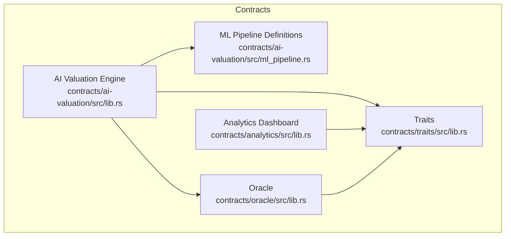
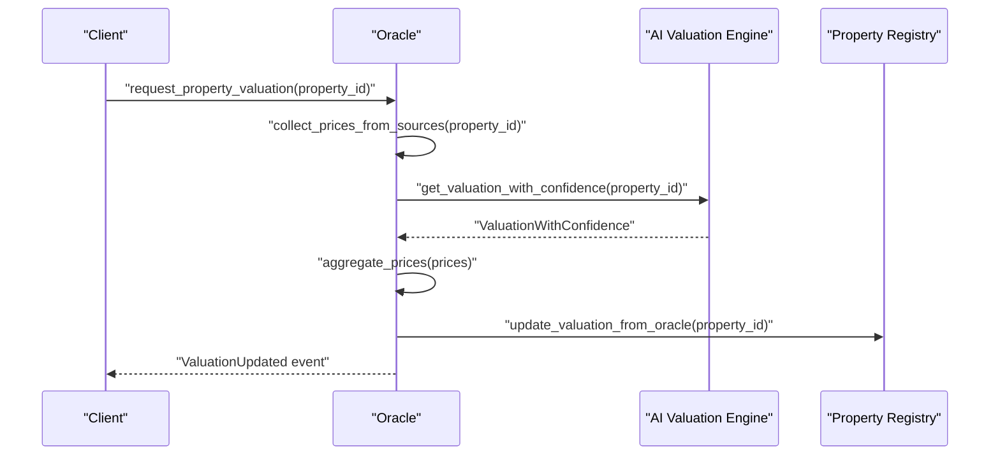
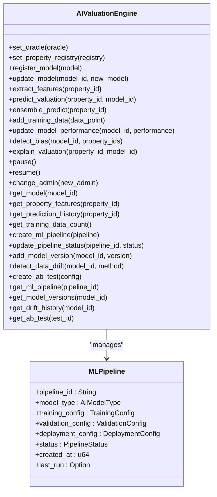
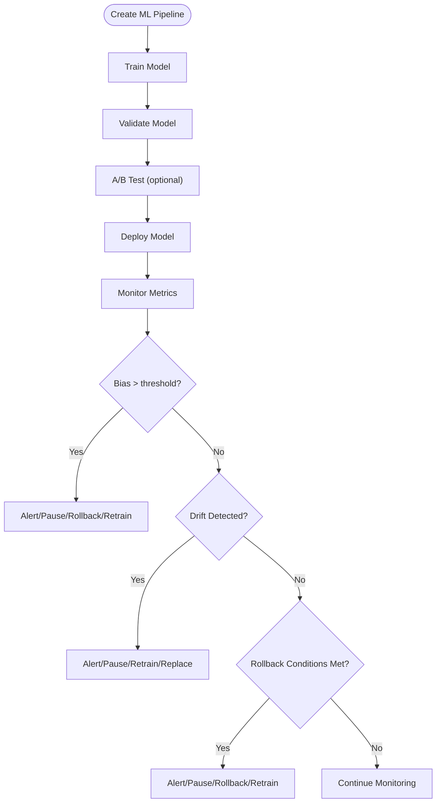
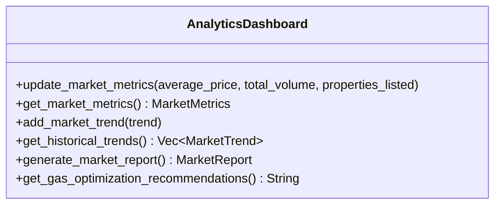
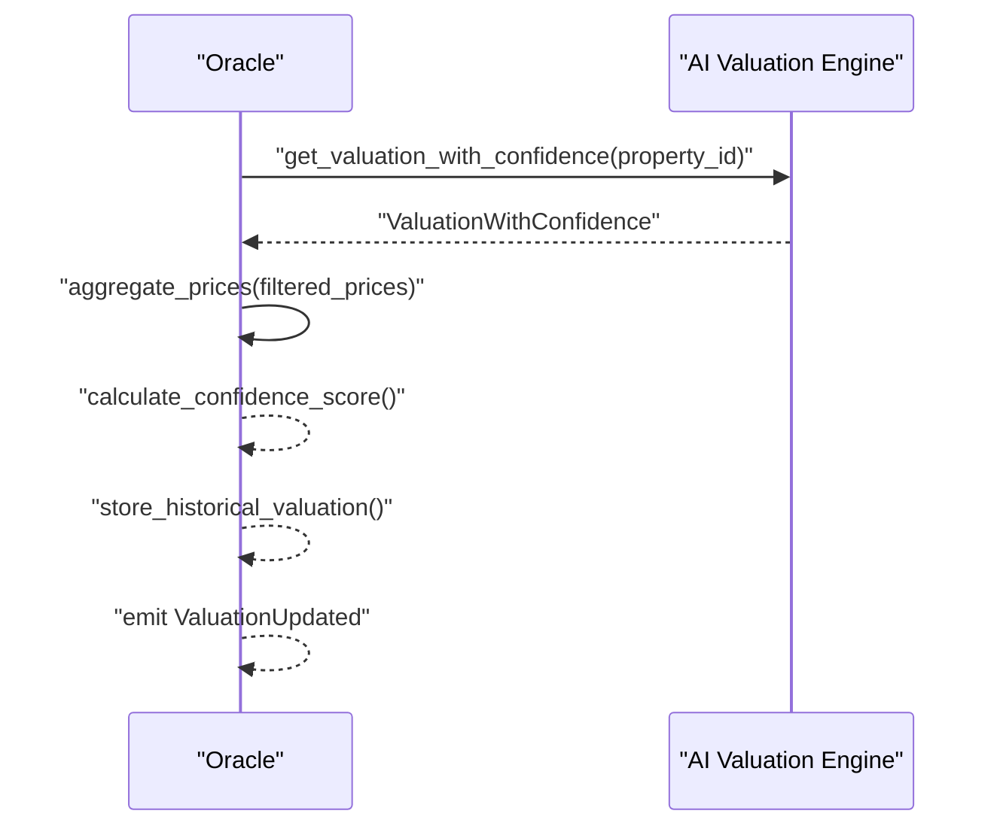
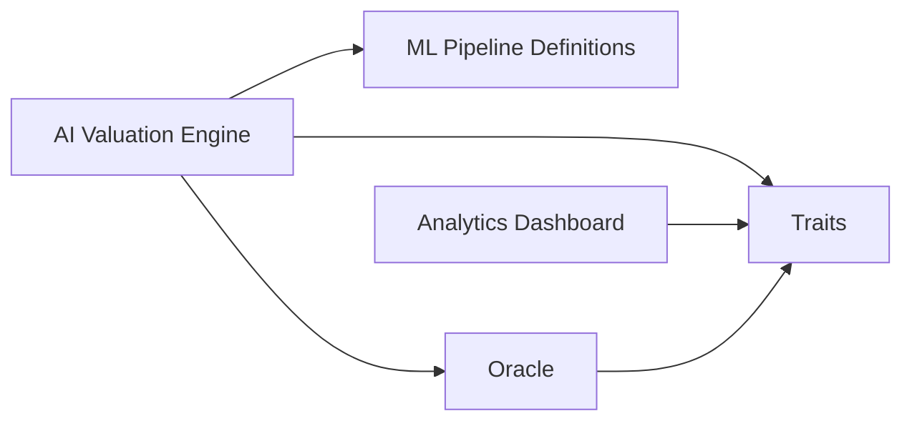

# Valuation & Analytics APIs

<cite>
**Referenced Files in This Document**
- [lib.rs](file://stellar-insured-contracts/contracts/ai-valuation/src/lib.rs)
- [ml_pipeline.rs](file://stellar-insured-contracts/contracts/ai-valuation/src/ml_pipeline.rs)
- [tests.rs](file://stellar-insured-contracts/contracts/ai-valuation/src/tests.rs)
- [ai-valuation-system.md](file://stellar-insured-contracts/docs/ai-valuation-system.md)
- [ai-valuation-tutorial.md](file://stellar-insured-contracts/docs/tutorials/ai-valuation-tutorial.md)
- [lib.rs](file://stellar-insured-contracts/contracts/analytics/src/lib.rs)
- [lib.rs](file://stellar-insured-contracts/contracts/oracle/src/lib.rs)
- [lib.rs](file://stellar-insured-contracts/contracts/traits/src/lib.rs)
- [Cargo.toml](file://stellar-insured-contracts/Cargo.toml)
</cite>

## Table of Contents
1. [Introduction](#introduction)
2. [Project Structure](#project-structure)
3. [Core Components](#core-components)
4. [Architecture Overview](#architecture-overview)
5. [Detailed Component Analysis](#detailed-component-analysis)
6. [Dependency Analysis](#dependency-analysis)
7. [Performance Considerations](#performance-considerations)
8. [Troubleshooting Guide](#troubleshooting-guide)
9. [Conclusion](#conclusion)
10. [Appendices](#appendices)

## Introduction
This document provides comprehensive API documentation for the AI valuation and analytics contract interfaces in the PropChain ecosystem. It covers machine learning model integration, property pricing algorithms, and performance metrics. It also documents valuation functions (property assessment requests, model prediction APIs, and price update mechanisms), analytics query functions (market trends, performance statistics, and valuation accuracy metrics), examples of AI model training integration, prediction result interpretation, and bias detection mechanisms. Additionally, it outlines model versioning, update procedures, fallback strategies, performance monitoring APIs, and anomaly detection capabilities.

## Project Structure
The AI valuation and analytics system spans multiple contracts and shared traits:
- AI Valuation Engine: Implements property valuation using ML models, ensemble predictions, bias detection, and drift monitoring.
- ML Pipeline Infrastructure: Defines training, validation, deployment, fairness, and monitoring configurations.
- Analytics Dashboard: Provides market metrics, trend analysis, and reporting.
- Oracle Integration: Aggregates AI valuations with other sources and exposes confidence metrics.
- Shared Traits: Defines common data structures and enums used across contracts.

**Diagram sources**
- [lib.rs:104-141](file://stellar-insured-contracts/contracts/ai-valuation/src/lib.rs#L104-L141)
- [ml_pipeline.rs:5-66](file://stellar-insured-contracts/contracts/ai-valuation/src/ml_pipeline.rs#L5-L66)
- [lib.rs:72-82](file://stellar-insured-contracts/contracts/analytics/src/lib.rs#L72-L82)
- [lib.rs:24-75](file://stellar-insured-contracts/contracts/oracle/src/lib.rs#L24-L75)
- [lib.rs:106-133](file://stellar-insured-contracts/contracts/traits/src/lib.rs#L106-L133)

**Section sources**
- [Cargo.toml:1-17](file://stellar-insured-contracts/Cargo.toml#L1-L17)

## Core Components
- AI Valuation Engine: Storage for models, performance metrics, cached features, predictions, training data, ML pipelines, model versions, A/B tests, drift results, and configuration parameters. Emits events for model registration, predictions, updates, bias detection, and training data addition.
- ML Pipeline Infrastructure: Defines training/validation/deployment configurations, fairness constraints, rollback conditions, monitoring thresholds, and drift detection methods.
- Analytics Dashboard: Stores current market metrics, historical trends, and generates market reports.
- Oracle Integration: Aggregates valuations from multiple sources, including AI models, with confidence intervals and anomaly detection.
- Shared Traits: Provides common structures (PropertyValuation, ValuationWithConfidence, PropertyFeatures, etc.) and enumerations (ValuationMethod, OracleSourceType, etc.).

**Section sources**
- [lib.rs:104-141](file://stellar-insured-contracts/contracts/ai-valuation/src/lib.rs#L104-L141)
- [ml_pipeline.rs:5-66](file://stellar-insured-contracts/contracts/ai-valuation/src/ml_pipeline.rs#L5-L66)
- [lib.rs:72-82](file://stellar-insured-contracts/contracts/analytics/src/lib.rs#L72-L82)
- [lib.rs:24-75](file://stellar-insured-contracts/contracts/oracle/src/lib.rs#L24-L75)
- [lib.rs:106-133](file://stellar-insured-contracts/contracts/traits/src/lib.rs#L106-L133)

## Architecture Overview
The AI valuation system integrates with the Oracle to provide aggregated valuations with confidence metrics. The AI engine supports multiple model types, ensemble predictions, bias detection, and drift monitoring. The analytics dashboard provides market insights and trend analysis.

**Diagram sources**
- [lib.rs:228-260](file://stellar-insured-contracts/contracts/oracle/src/lib.rs#L228-L260)
- [lib.rs:498-542](file://stellar-insured-contracts/contracts/oracle/src/lib.rs#L498-L542)
- [lib.rs:320-365](file://stellar-insured-contracts/contracts/ai-valuation/src/lib.rs#L320-L365)
- [lib.rs:196-225](file://stellar-insured-contracts/contracts/oracle/src/lib.rs#L196-L225)

## Detailed Component Analysis

### AI Valuation Engine API
Key message functions and data structures:
- Data Structures
  - PropertyFeatures: Location score, size, age, condition, amenities, market trend, comparable average, economic indicators.
  - AIModel: Model identity, type, version, accuracy, training data size, last updated, activation flag, ensemble weight.
  - AIPrediction: Predicted value, confidence score, uncertainty range, model ID, features used, bias/fairness scores.
  - EnsemblePrediction: Final valuation, ensemble confidence, individual predictions, consensus score, explanation.
  - TrainingDataPoint: Property ID, features, actual value, timestamp, data source.
  - ModelPerformance: MAE, RMSE, MAPE, R-squared, prediction count, last evaluated.
  - MLPipeline, TrainingConfig, ValidationConfig, DeploymentConfig, PipelineStatus, RegularizationType, FeatureSelectionMethod, ValidationMetric, BiasTest, FairnessConstraint, FairnessType, EnforcementLevel, RollbackCondition, RollbackType, RollbackAction, MonitoringConfig, AlertThreshold, MonitoringMetric, AlertSeverity, ModelVersion, ModelMetrics, DeploymentStatus, DriftDetectionResult, DriftDetectionMethod, DriftRecommendation, ABTestConfig, ABTestResult, TestRecommendation.

- Administrative Functions
  - set_oracle(account): Sets the oracle contract address.
  - set_property_registry(account): Sets the property registry contract address.
  - register_model(model): Registers a new AI model (admin-only).
  - update_model(model_id, new_model): Updates an existing model (admin-only).
  - create_ml_pipeline(pipeline): Creates an ML pipeline (admin-only).
  - update_pipeline_status(pipeline_id, status): Updates pipeline status (admin-only).
  - add_model_version(model_id, version): Adds a model version (admin-only).
  - create_ab_test(config): Creates an A/B test configuration (admin-only).
  - pause()/resume(): Pauses or resumes the contract (admin-only).
  - change_admin(new_admin): Changes admin (admin-only).

- Valuation Functions
  - extract_features(property_id): Extracts or retrieves cached features for a property.
  - predict_valuation(property_id, model_id): Generates a single model prediction with confidence and bias checks.
  - ensemble_predict(property_id): Computes ensemble prediction using active models and calculates consensus.
  - explain_valuation(property_id, model_id): Produces a human-readable explanation of the valuation.
  - get_model_performance(model_id): Retrieves performance metrics for a model.
  - detect_bias(model_id, property_ids): Computes average bias score across predictions.
  - detect_data_drift(model_id, method): Detects concept/data drift and returns recommendation.
  - add_training_data(data_point): Adds training data for model improvement (admin-only).
  - update_model_performance(model_id, performance): Updates performance metrics (admin-only).

- Query Functions
  - admin(): Returns the admin account.
  - get_model(model_id): Retrieves a registered model.
  - get_property_features(property_id): Returns cached features.
  - get_prediction_history(property_id): Returns prediction history for validation.
  - get_training_data_count(): Returns number of training data points.
  - get_ml_pipeline(pipeline_id): Retrieves an ML pipeline.
  - get_model_versions(model_id): Returns model version history.
  - get_drift_history(model_id): Returns drift detection history.
  - get_ab_test(test_id): Retrieves A/B test configuration.

- Events
  - ModelRegistered, PredictionGenerated, ModelUpdated, BiasDetected, TrainingDataAdded.

- Errors
  - Unauthorized, ModelNotFound, PropertyNotFound, InvalidModel, InsufficientData, LowConfidence, BiasDetected, ContractPaused, OracleNotSet, PropertyRegistryNotSet, FeatureExtractionFailed, PredictionFailed, InvalidParameters.

**Diagram sources**
- [lib.rs:216-795](file://stellar-insured-contracts/contracts/ai-valuation/src/lib.rs#L216-L795)
- [ml_pipeline.rs:5-66](file://stellar-insured-contracts/contracts/ai-valuation/src/ml_pipeline.rs#L5-L66)

**Section sources**
- [lib.rs:216-795](file://stellar-insured-contracts/contracts/ai-valuation/src/lib.rs#L216-L795)
- [ml_pipeline.rs:5-326](file://stellar-insured-contracts/contracts/ai-valuation/src/ml_pipeline.rs#L5-L326)

### ML Pipeline Configuration and Monitoring
- TrainingConfig: Learning rate, batch size, epochs, validation split, early stopping, regularization, feature selection.
- ValidationConfig: Cross-validation folds, test split, metrics, bias tests, fairness constraints.
- DeploymentConfig: Accuracy/bias/confidence thresholds, rollback conditions, monitoring configuration.
- MonitoringConfig: Performance/bias/drift monitoring flags, alert thresholds, monitoring frequency.
- RollbackCondition: Types (accuracy drop, bias increase, confidence drop, error rate increase, prediction volatility), thresholds, time windows, actions.
- DriftDetectionResult: Drift detected, drift score, affected features, detection method, timestamp, recommendation.
- ABTestConfig: Test ID, control/treatment models, traffic split, duration, success metrics, significance threshold, minimum sample size.

**Diagram sources**
- [ml_pipeline.rs:172-326](file://stellar-insured-contracts/contracts/ai-valuation/src/ml_pipeline.rs#L172-L326)
- [lib.rs:597-631](file://stellar-insured-contracts/contracts/ai-valuation/src/lib.rs#L597-L631)

**Section sources**
- [ml_pipeline.rs:172-326](file://stellar-insured-contracts/contracts/ai-valuation/src/ml_pipeline.rs#L172-L326)
- [lib.rs:597-631](file://stellar-insured-contracts/contracts/ai-valuation/src/lib.rs#L597-L631)

### Analytics Dashboard API
- Data Structures
  - MarketMetrics: Average price, total volume, properties listed.
  - MarketTrend: Period start/end, price/volume change percentages.
  - MarketReport: Generated timestamp, metrics, trend, insights.
- Administrative Functions
  - update_market_metrics(average_price, total_volume, properties_listed): Updates current market metrics (admin-only).
- Query Functions
  - get_market_metrics(): Returns current market metrics.
  - add_market_trend(trend): Adds historical trend data (admin-only).
  - get_historical_trends(): Returns historical trends.
  - generate_market_report(): Generates a market report combining current metrics and latest trend.
  - get_gas_optimization_recommendations(): Returns gas optimization tips.

**Diagram sources**
- [lib.rs:84-185](file://stellar-insured-contracts/contracts/analytics/src/lib.rs#L84-L185)

**Section sources**
- [lib.rs:84-185](file://stellar-insured-contracts/contracts/analytics/src/lib.rs#L84-L185)

### Oracle Integration and Aggregation
- Oracle supports multiple sources including AI models.
- AI model integration adds a new OracleSourceType::AIModel and a new ValuationMethod::AIValuation.
- The Oracle collects prices from active sources, filters outliers, and computes a weighted average with confidence metrics.
- Anomaly detection compares recent changes against volatility thresholds.

**Diagram sources**
- [lib.rs:498-542](file://stellar-insured-contracts/contracts/oracle/src/lib.rs#L498-L542)
- [lib.rs:320-365](file://stellar-insured-contracts/contracts/ai-valuation/src/lib.rs#L320-L365)
- [lib.rs:549-576](file://stellar-insured-contracts/contracts/oracle/src/lib.rs#L549-L576)

**Section sources**
- [lib.rs:498-542](file://stellar-insured-contracts/contracts/oracle/src/lib.rs#L498-L542)
- [lib.rs:549-576](file://stellar-insured-contracts/contracts/oracle/src/lib.rs#L549-L576)
- [lib.rs:121-133](file://stellar-insured-contracts/contracts/traits/src/lib.rs#L121-L133)
- [lib.rs:207-220](file://stellar-insured-contracts/contracts/traits/src/lib.rs#L207-L220)

## Dependency Analysis
- AI Valuation Engine depends on:
  - ML Pipeline definitions for training, validation, deployment, fairness, monitoring, and drift detection.
  - Oracle contract for market data integration.
  - Property registry for metadata.
  - Shared traits for common structures and enums.
- Analytics Dashboard depends on shared traits for market metrics and trends.
- Oracle depends on shared traits for common structures and enums.

**Diagram sources**
- [lib.rs:1-12](file://stellar-insured-contracts/contracts/ai-valuation/src/lib.rs#L1-L12)
- [ml_pipeline.rs:1-4](file://stellar-insured-contracts/contracts/ai-valuation/src/ml_pipeline.rs#L1-L4)
- [lib.rs:5-6](file://stellar-insured-contracts/contracts/analytics/src/lib.rs#L5-L6)
- [lib.rs](file://stellar-insured-contracts/contracts/oracle/src/lib.rs#L11)
- [lib.rs:1-6](file://stellar-insured-contracts/contracts/traits/src/lib.rs#L1-L6)

**Section sources**
- [lib.rs:1-12](file://stellar-insured-contracts/contracts/ai-valuation/src/lib.rs#L1-L12)
- [ml_pipeline.rs:1-4](file://stellar-insured-contracts/contracts/ai-valuation/src/ml_pipeline.rs#L1-L4)
- [lib.rs:5-6](file://stellar-insured-contracts/contracts/analytics/src/lib.rs#L5-L6)
- [lib.rs](file://stellar-insured-contracts/contracts/oracle/src/lib.rs#L11)
- [lib.rs:1-6](file://stellar-insured-contracts/contracts/traits/src/lib.rs#L1-L6)

## Performance Considerations
- Caching: Feature extraction results and comparable property data are cached with TTL to reduce recomputation.
- Prediction History: Stored for validation and bias analysis.
- Storage Efficiency: Uses ink! Mapping for efficient storage and retrieval.
- Batch Operations: Supports batched valuation requests and training data additions.
- Monitoring: Real-time performance metrics, alert thresholds, and resource usage tracking.

[No sources needed since this section provides general guidance]

## Troubleshooting Guide
Common issues and resolutions:
- Low Confidence Predictions: Verify training data quality, feature extraction, confidence thresholds, and consider retraining with more data.
- High Bias Scores: Review training data distribution, implement fairness constraints, use bias mitigation techniques, and perform regular bias audits.
- Data Drift Detected: Analyze affected features, update feature engineering, retrain models with recent data, and adjust model weights.
- Poor Model Performance: Increase training data size, improve feature engineering, try different model types, and tune hyperparameters.
- Contract Paused: Resume the contract to restore operations.
- Unauthorized Access: Ensure only admin can perform privileged operations.

**Section sources**
- [lib.rs:184-214](file://stellar-insured-contracts/contracts/ai-valuation/src/lib.rs#L184-L214)
- [lib.rs:503-517](file://stellar-insured-contracts/contracts/ai-valuation/src/lib.rs#L503-L517)
- [ai-valuation-tutorial.md:397-424](file://stellar-insured-contracts/docs/tutorials/ai-valuation-tutorial.md#L397-L424)

## Conclusion
The AI valuation and analytics system provides a robust, auditable, and transparent framework for property valuations powered by machine learning. It integrates seamlessly with the Oracle for aggregated valuations with confidence metrics, includes comprehensive bias detection and fairness enforcement, and offers extensive monitoring and alerting capabilities. The system supports model versioning, A/B testing, and drift detection to ensure reliable and fair valuations over time.

[No sources needed since this section summarizes without analyzing specific files]

## Appendices

### API Reference Summary

- AI Valuation Engine
  - Administrative
    - set_oracle(account)
    - set_property_registry(account)
    - register_model(model)
    - update_model(model_id, new_model)
    - create_ml_pipeline(pipeline)
    - update_pipeline_status(pipeline_id, status)
    - add_model_version(model_id, version)
    - create_ab_test(config)
    - pause(), resume()
    - change_admin(new_admin)
  - Valuation
    - extract_features(property_id)
    - predict_valuation(property_id, model_id)
    - ensemble_predict(property_id)
    - explain_valuation(property_id, model_id)
    - detect_bias(model_id, property_ids)
    - detect_data_drift(model_id, method)
    - add_training_data(data_point)
    - update_model_performance(model_id, performance)
  - Queries
    - admin()
    - get_model(model_id)
    - get_property_features(property_id)
    - get_prediction_history(property_id)
    - get_training_data_count()
    - get_ml_pipeline(pipeline_id)
    - get_model_versions(model_id)
    - get_drift_history(model_id)
    - get_ab_test(test_id)

- Analytics Dashboard
  - update_market_metrics(average_price, total_volume, properties_listed)
  - get_market_metrics()
  - add_market_trend(trend)
  - get_historical_trends()
  - generate_market_report()
  - get_gas_optimization_recommendations()

- Oracle Integration
  - request_property_valuation(property_id)
  - batch_request_valuations(property_ids)
  - update_property_valuation(property_id, valuation)
  - update_valuation_from_sources(property_id)
  - get_property_valuation(property_id)
  - get_valuation_with_confidence(property_id)
  - set_ai_valuation_contract(address)
  - get_ai_valuation_contract()
  - add_oracle_source(source)
  - update_market_trend(trend)
  - set_location_adjustment(adjustment)
  - set_price_alert(property_id, threshold_percentage, alert_address)
  - is_anomaly(property_id, new_valuation)

**Section sources**
- [lib.rs:240-254](file://stellar-insured-contracts/contracts/ai-valuation/src/lib.rs#L240-L254)
- [lib.rs:256-298](file://stellar-insured-contracts/contracts/ai-valuation/src/lib.rs#L256-L298)
- [lib.rs:300-365](file://stellar-insured-contracts/contracts/ai-valuation/src/lib.rs#L300-L365)
- [lib.rs:366-421](file://stellar-insured-contracts/contracts/ai-valuation/src/lib.rs#L366-L421)
- [lib.rs:423-449](file://stellar-insured-contracts/contracts/ai-valuation/src/lib.rs#L423-L449)
- [lib.rs:457-482](file://stellar-insured-contracts/contracts/ai-valuation/src/lib.rs#L457-L482)
- [lib.rs:597-631](file://stellar-insured-contracts/contracts/ai-valuation/src/lib.rs#L597-L631)
- [lib.rs:100-119](file://stellar-insured-contracts/contracts/analytics/src/lib.rs#L100-L119)
- [lib.rs:121-138](file://stellar-insured-contracts/contracts/analytics/src/lib.rs#L121-L138)
- [lib.rs:140-169](file://stellar-insured-contracts/contracts/analytics/src/lib.rs#L140-L169)
- [lib.rs:227-260](file://stellar-insured-contracts/contracts/oracle/src/lib.rs#L227-L260)
- [lib.rs:196-225](file://stellar-insured-contracts/contracts/oracle/src/lib.rs#L196-L225)
- [lib.rs:388-403](file://stellar-insured-contracts/contracts/oracle/src/lib.rs#L388-L403)
- [lib.rs:405-427](file://stellar-insured-contracts/contracts/oracle/src/lib.rs#L405-L427)
- [lib.rs:441-448](file://stellar-insured-contracts/contracts/oracle/src/lib.rs#L441-L448)
- [lib.rs:366-387](file://stellar-insured-contracts/contracts/oracle/src/lib.rs#L366-L387)
- [lib.rs:311-327](file://stellar-insured-contracts/contracts/oracle/src/lib.rs#L311-L327)

### Examples and Tutorials
- Tutorial: AI Valuation System Tutorial provides step-by-step deployment, model registration, training data ingestion, prediction generation (single and ensemble), ML pipeline setup, performance monitoring, A/B testing, bias detection, and integration with the property registry.
- System Documentation: AI Valuation System documentation details architecture, data structures, integration with the Oracle system, usage examples, ML pipeline configuration, security and compliance, performance considerations, and future enhancements.

**Section sources**
- [ai-valuation-tutorial.md:1-433](file://stellar-insured-contracts/docs/tutorials/ai-valuation-tutorial.md#L1-L433)
- [ai-valuation-system.md:1-288](file://stellar-insured-contracts/docs/ai-valuation-system.md#L1-L288)