# Contract Architecture

<cite>
**Referenced Files in This Document**
- [Cargo.toml](file://stellar-insured-contracts/Cargo.toml)
- [architecture.md](file://stellar-insured-contracts/docs/architecture.md)
- [contracts.md](file://stellar-insured-contracts/docs/contracts.md)
- [security_pipeline.md](file://stellar-insured-contracts/docs/security_pipeline.md)
- [best-practices.md](file://stellar-insured-contracts/docs/best-practices.md)
- [lib.rs](file://stellar-insured-contracts/contracts/lib/src/lib.rs)
- [lib.rs](file://stellar-insured-contracts/contracts/property-token/src/lib.rs)
- [lib.rs](file://stellar-insured-contracts/contracts/escrow/src/lib.rs)
- [lib.rs](file://stellar-insured-contracts/contracts/compliance_registry/lib.rs)
- [lib.rs](file://stellar-insured-contracts/contracts/insurance/src/lib.rs)
- [lib.rs](file://stellar-insured-contracts/contracts/bridge/src/lib.rs)
- [lib.rs](file://stellar-insured-contracts/contracts/oracle/src/lib.rs)
- [lib.rs](file://stellar-insured-contracts/contracts/proxy/src/lib.rs)
- [lib.rs](file://stellar-insured-contracts/contracts/traits/src/lib.rs)
- [lib.rs](file://stellar-insured-contracts/contracts/fractional/src/lib.rs)
</cite>

## Table of Contents
1. [Introduction](#introduction)
2. [Project Structure](#project-structure)
3. [Core Components](#core-components)
4. [Architecture Overview](#architecture-overview)
5. [Detailed Component Analysis](#detailed-component-analysis)
6. [Dependency Analysis](#dependency-analysis)
7. [Performance Considerations](#performance-considerations)
8. [Security Architecture](#security-architecture)
9. [Event Emission System](#event-emission-system)
10. [Upgrade and Proxy Mechanisms](#upgrade-and-proxy-mechanisms)
11. [Scalability and Monitoring](#scalability-and-monitoring)
12. [Integration and Extensibility](#integration-and-extensibility)
13. [Troubleshooting Guide](#troubleshooting-guide)
14. [Conclusion](#conclusion)

## Introduction
This document presents the architectural design of the PropChain smart contract system, a comprehensive real estate tokenization platform built on the Substrate blockchain using the ink! smart contract language. The system integrates multiple specialized contracts for property registration, tokenization, escrow, compliance, insurance, bridging, and oracle-driven valuations. It emphasizes modular design, transparent governance, robust security controls, and scalable operations across multiple chains.

## Project Structure
The workspace is organized as a Rust workspace with multiple member crates grouped by domain functionality:
- Core library and shared traits define common data structures, events, and interfaces used across contracts.
- Domain-specific contracts implement specialized capabilities: property token, escrow, compliance registry, insurance, bridge, oracle, fractional ownership, and proxy.
- Documentation covers architecture, contracts, best practices, security pipeline, and operational guidelines.
- Scripts and CI workflows automate building, testing, auditing, and deployment.

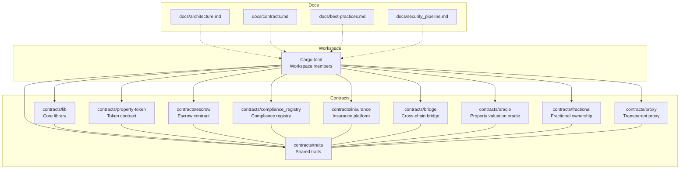

**Diagram sources**
- [Cargo.toml:1-45](file://stellar-insured-contracts/Cargo.toml#L1-L45)

**Section sources**
- [Cargo.toml:1-45](file://stellar-insured-contracts/Cargo.toml#L1-L45)

## Core Components
The system comprises several core contracts, each implementing a distinct aspect of the real estate ecosystem:

- Property Registry: Central registry for property metadata, ownership, approvals, badges, verifications, appeals, and pause/resume governance.
- Property Token: ERC-721/1155-compatible token contract with property metadata, compliance flags, legal documents, bridging, fractional shares, and governance events.
- Escrow: Advanced escrow with multi-signature approvals, time locks, conditions, dispute resolution, and audit trails.
- Compliance Registry: Jurisdiction-aware KYC/AML/sanctions compliance with GDPR consent, risk scoring, and audit logs.
- Insurance: Decentralized insurance platform with risk pools, claims, reinsurance, and dispute resolution.
- Bridge: Multi-signature cross-chain property token transfer with monitoring and recovery actions.
- Oracle: Property valuation oracle with multiple sources, confidence metrics, anomaly detection, and AI integration.
- Fractional: Lightweight fractional ownership aggregation and tax reporting helpers.
- Proxy: Transparent proxy for upgradable contract implementations.

**Section sources**
- [architecture.md:9-101](file://stellar-insured-contracts/docs/architecture.md#L9-L101)
- [lib.rs:50-97](file://stellar-insured-contracts/contracts/lib/src/lib.rs#L50-L97)
- [lib.rs:47-102](file://stellar-insured-contracts/contracts/property-token/src/lib.rs#L47-L102)
- [lib.rs:11-162](file://stellar-insured-contracts/contracts/escrow/src/lib.rs#L11-L162)
- [lib.rs:213-241](file://stellar-insured-contracts/contracts/compliance_registry/lib.rs#L213-L241)
- [lib.rs:12-379](file://stellar-insured-contracts/contracts/insurance/src/lib.rs#L12-L379)
- [lib.rs:32-61](file://stellar-insured-contracts/contracts/bridge/src/lib.rs#L32-L61)
- [lib.rs:22-75](file://stellar-insured-contracts/contracts/oracle/src/lib.rs#L22-L75)
- [lib.rs:55-58](file://stellar-insured-contracts/contracts/fractional/src/lib.rs#L55-L58)

## Architecture Overview
The system follows a modular, layered architecture:
- Shared traits define interfaces and data models used across contracts.
- Core contracts encapsulate domain logic with explicit state management and event emission.
- Orchestration occurs through cross-contract calls and shared registries.
- Governance and security are enforced via role-based access control, pause mechanisms, and multi-signature workflows.

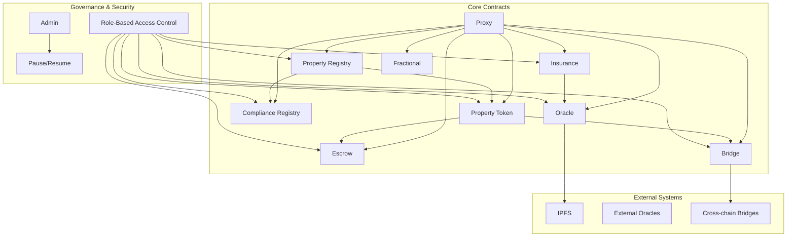

**Diagram sources**
- [architecture.md:47-101](file://stellar-insured-contracts/docs/architecture.md#L47-L101)
- [lib.rs:50-97](file://stellar-insured-contracts/contracts/lib/src/lib.rs#L50-L97)
- [lib.rs:19-25](file://stellar-insured-contracts/contracts/proxy/src/lib.rs#L19-L25)

## Detailed Component Analysis

### Property Registry
The Property Registry centralizes property lifecycle management with:
- Storage for properties, owners, approvals, escrows, badges, verifications, appeals, and pause state.
- Events for property registration, transfers, metadata updates, approvals, and governance actions.
- Compliance integration and optional oracle/fee manager linkage.

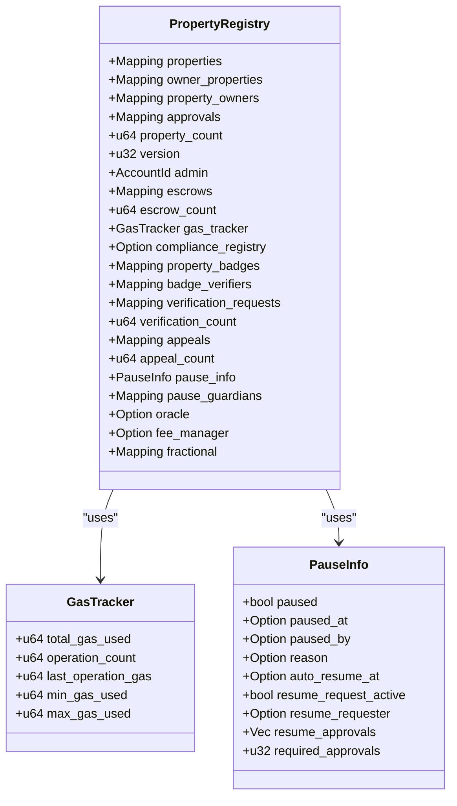

**Diagram sources**
- [lib.rs:50-97](file://stellar-insured-contracts/contracts/lib/src/lib.rs#L50-L97)
- [lib.rs:180-204](file://stellar-insured-contracts/contracts/lib/src/lib.rs#L180-L204)
- [lib.rs:312-329](file://stellar-insured-contracts/contracts/lib/src/lib.rs#L312-L329)

**Section sources**
- [lib.rs:50-97](file://stellar-insured-contracts/contracts/lib/src/lib.rs#L50-L97)
- [lib.rs:331-750](file://stellar-insured-contracts/contracts/lib/src/lib.rs#L331-L750)

### Property Token
The Property Token implements ERC-721/1155 compatibility with real estate enhancements:
- Token ownership, approvals, and batch operations.
- Property metadata, compliance flags, legal documents.
- Cross-chain bridging with multi-signature requests and recovery actions.
- Fractional shares, dividends, voting, and tax reporting.

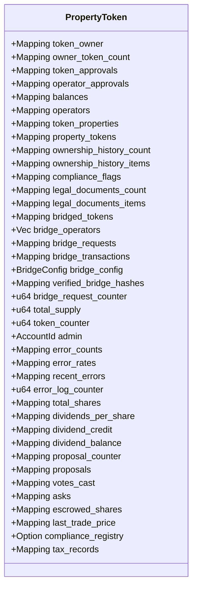

**Diagram sources**
- [lib.rs:47-102](file://stellar-insured-contracts/contracts/property-token/src/lib.rs#L47-L102)

**Section sources**
- [lib.rs:47-102](file://stellar-insured-contracts/contracts/property-token/src/lib.rs#L47-L102)
- [lib.rs:260-476](file://stellar-insured-contracts/contracts/property-token/src/lib.rs#L260-L476)

### Escrow
The Advanced Escrow supports multi-signature approvals, time locks, conditions, disputes, and audit trails:
- EscrowData with status tracking and participant management.
- MultiSigConfig for required signatures and signers.
- Document hashes and conditions with verification and met tracking.
- Disputes and emergency overrides.

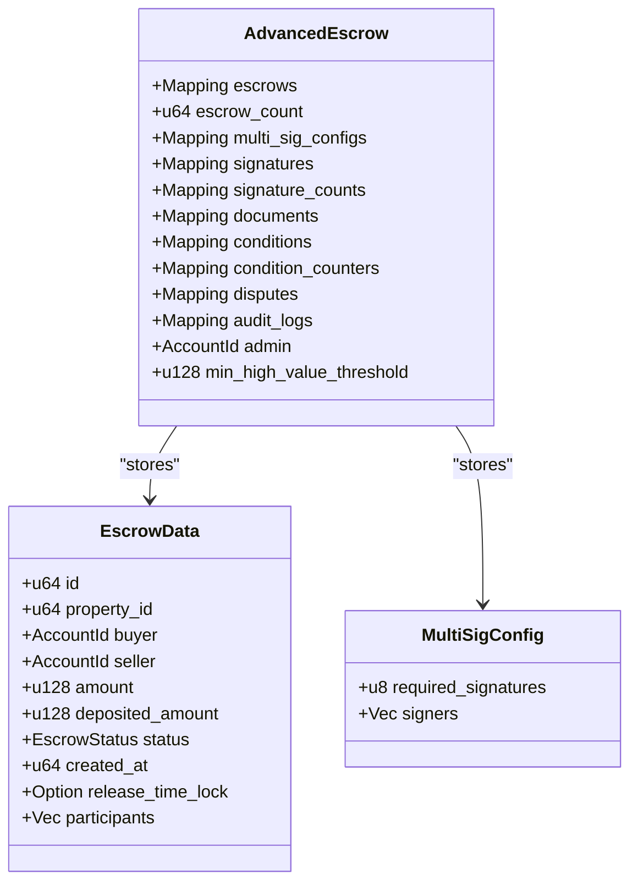

**Diagram sources**
- [lib.rs:135-162](file://stellar-insured-contracts/contracts/escrow/src/lib.rs#L135-L162)
- [lib.rs:58-73](file://stellar-insured-contracts/contracts/escrow/src/lib.rs#L58-L73)

**Section sources**
- [lib.rs:135-162](file://stellar-insured-contracts/contracts/escrow/src/lib.rs#L135-L162)
- [lib.rs:164-800](file://stellar-insured-contracts/contracts/escrow/src/lib.rs#L164-L800)

### Compliance Registry
The Compliance Registry manages KYC/AML/sanctions and GDPR consent:
- Jurisdiction-specific rules and risk factors.
- Verification status tracking and audit logs.
- Consent management and data retention enforcement.
- Integration with Property Token and Property Registry.

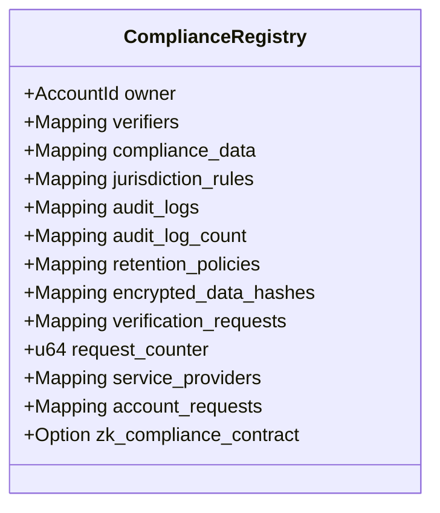

**Diagram sources**
- [lib.rs:213-241](file://stellar-insured-contracts/contracts/compliance_registry/lib.rs#L213-L241)

**Section sources**
- [lib.rs:383-800](file://stellar-insured-contracts/contracts/compliance_registry/lib.rs#L383-L800)

### Insurance
The Insurance platform provides risk pooling, claims management, and reinsurance:
- RiskPool with capital, exposure limits, and liquidity provider tracking.
- InsurancePolicy and InsuranceClaim with status tracking and evidence metadata.
- ReinsuranceAgreement and ActuarialModel for risk modeling.
- Dispute resolution and governance controls.

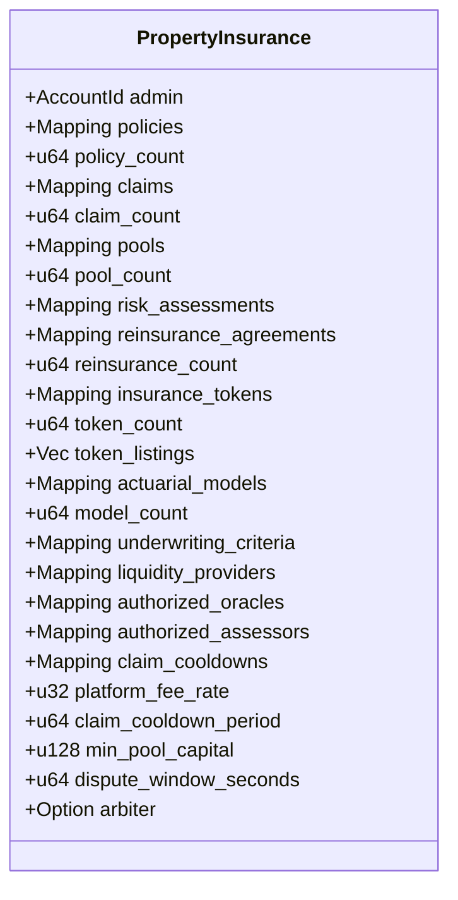

**Diagram sources**
- [lib.rs:322-379](file://stellar-insured-contracts/contracts/insurance/src/lib.rs#L322-L379)

**Section sources**
- [lib.rs:528-800](file://stellar-insured-contracts/contracts/insurance/src/lib.rs#L528-L800)

### Bridge
The Bridge enables multi-signature cross-chain property token transfers:
- MultisigBridgeRequest with required signatures and expiration.
- BridgeTransaction tracking and verification.
- Gas estimation and monitoring with recovery actions.

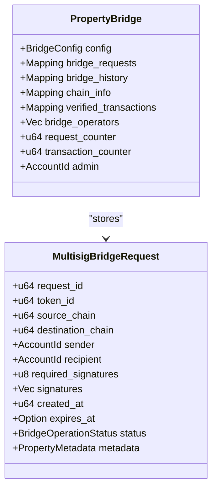

**Diagram sources**
- [lib.rs:32-61](file://stellar-insured-contracts/contracts/bridge/src/lib.rs#L32-L61)
- [lib.rs:612-631](file://stellar-insured-contracts/contracts/bridge/src/lib.rs#L612-L631)

**Section sources**
- [lib.rs:115-592](file://stellar-insured-contracts/contracts/bridge/src/lib.rs#L115-L592)

### Oracle
The Oracle aggregates property valuations from multiple sources with confidence metrics:
- PropertyValuation with confidence and volatility.
- OracleSource reputation and slashing.
- Price alerts and anomaly detection.

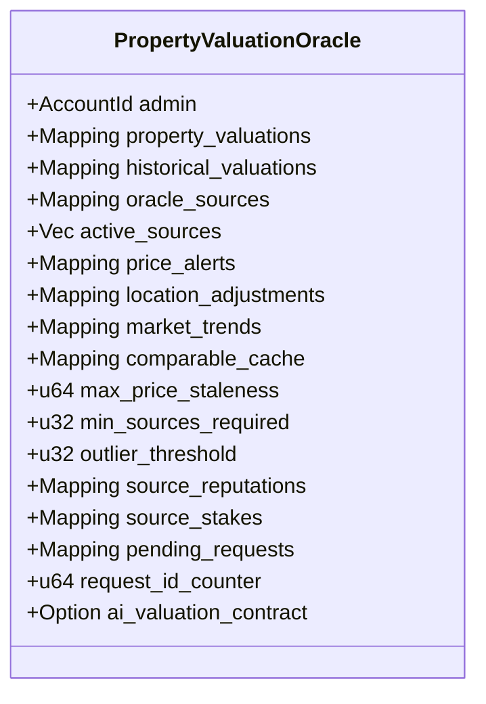

**Diagram sources**
- [lib.rs:22-75](file://stellar-insured-contracts/contracts/oracle/src/lib.rs#L22-L75)

**Section sources**
- [lib.rs:105-785](file://stellar-insured-contracts/contracts/oracle/src/lib.rs#L105-L785)

### Fractional
The Fractional contract provides lightweight aggregation and reporting:
- PortfolioItem aggregation with last prices.
- TaxReport summarization for dividends and proceeds.

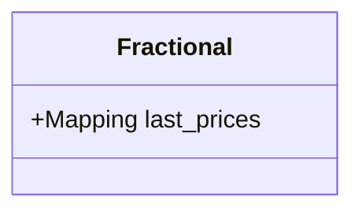

**Diagram sources**
- [lib.rs:55-58](file://stellar-insured-contracts/contracts/fractional/src/lib.rs#L55-L58)

**Section sources**
- [lib.rs:60-118](file://stellar-insured-contracts/contracts/fractional/src/lib.rs#L60-L118)

### Proxy
The Transparent Proxy enables upgradability by delegating calls to an implementation contract:
- Admin-controlled upgrade and admin change.
- Event emission for upgrades and admin changes.

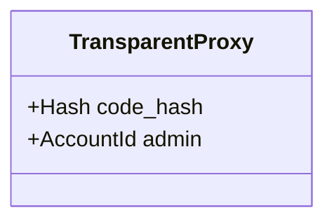

**Diagram sources**
- [lib.rs:19-25](file://stellar-insured-contracts/contracts/proxy/src/lib.rs#L19-L25)

**Section sources**
- [lib.rs:39-80](file://stellar-insured-contracts/contracts/proxy/src/lib.rs#L39-L80)

## Dependency Analysis
Contracts depend on shared traits and each other through cross-contract calls and registries:
- Shared traits define common types, events, and interfaces used by all contracts.
- Property Token depends on Compliance Registry and Oracle for compliance and valuation.
- Property Registry coordinates with Compliance Registry and Oracle.
- Insurance integrates with Oracle for risk assessment.
- Bridge interacts with Property Token for locking/minting and with external chains.
- Proxy enables upgradable deployments of core contracts.

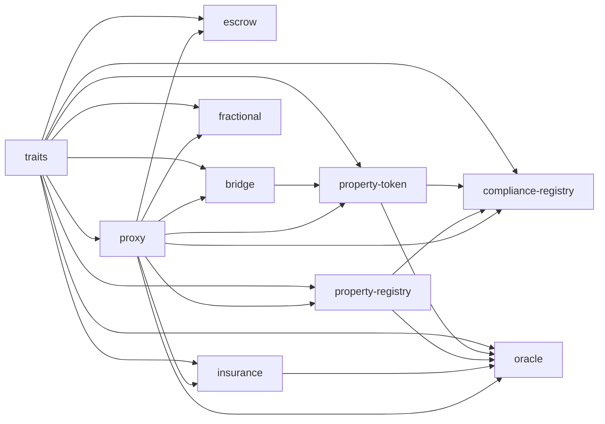

**Diagram sources**
- [lib.rs:23-722](file://stellar-insured-contracts/contracts/traits/src/lib.rs#L23-L722)
- [lib.rs:50-97](file://stellar-insured-contracts/contracts/lib/src/lib.rs#L50-L97)
- [lib.rs:47-102](file://stellar-insured-contracts/contracts/property-token/src/lib.rs#L47-L102)
- [lib.rs:11-162](file://stellar-insured-contracts/contracts/escrow/src/lib.rs#L11-L162)
- [lib.rs:213-241](file://stellar-insured-contracts/contracts/compliance_registry/lib.rs#L213-L241)
- [lib.rs:322-379](file://stellar-insured-contracts/contracts/insurance/src/lib.rs#L322-L379)
- [lib.rs:32-61](file://stellar-insured-contracts/contracts/bridge/src/lib.rs#L32-L61)
- [lib.rs:22-75](file://stellar-insured-contracts/contracts/oracle/src/lib.rs#L22-L75)
- [lib.rs:55-58](file://stellar-insured-contracts/contracts/fractional/src/lib.rs#L55-L58)
- [lib.rs:19-25](file://stellar-insured-contracts/contracts/proxy/src/lib.rs#L19-L25)

**Section sources**
- [lib.rs:23-722](file://stellar-insured-contracts/contracts/traits/src/lib.rs#L23-L722)

## Performance Considerations
- Efficient storage: Mappings for O(1) lookups; compact encodings; lazy evaluation for expensive computations.
- Batch operations: Use batch transfer and batch bridge operations to reduce gas.
- Off-chain storage: Store large metadata on IPFS and keep only hashes on-chain.
- Caching: On-chain gas tracking and off-chain indexing for complex queries.
- Gas optimization: Minimize state writes, use minimal storage operations, and leverage event-based cache invalidation.

[No sources needed since this section provides general guidance]

## Security Architecture
- Role-based access control: Admin, agents, owners, and public roles with permission matrices.
- Multi-signature workflows: Required approvals for high-value operations and emergency overrides.
- Pause/resume governance: Controlled pausing with guardian approvals and auto-resume windows.
- Compliance enforcement: Mandatory checks before transfers and operations.
- Reentrancy protection: Guard patterns to prevent recursive calls.
- Slashing and reputation: Oracle source reputation and stake-based penalties.
- Formal verification: Kani proofs for critical properties.
- Automated security pipeline: Static analysis, dependency scanning, and vulnerability checks.

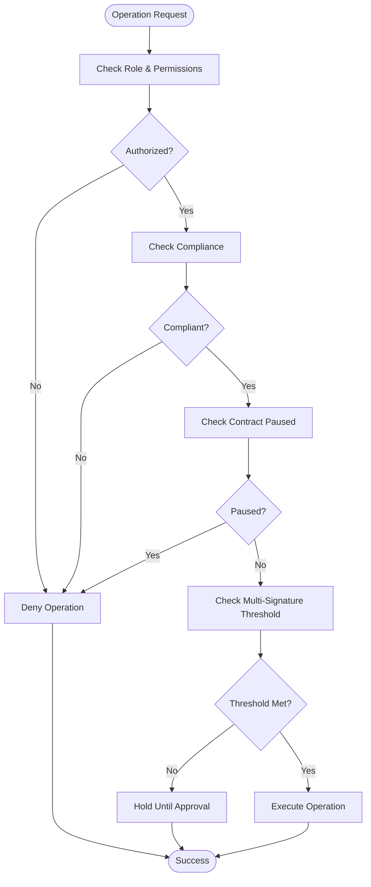

**Diagram sources**
- [architecture.md:203-266](file://stellar-insured-contracts/docs/architecture.md#L203-L266)
- [lib.rs:312-329](file://stellar-insured-contracts/contracts/lib/src/lib.rs#L312-L329)

**Section sources**
- [architecture.md:203-266](file://stellar-insured-contracts/docs/architecture.md#L203-L266)
- [security_pipeline.md:1-58](file://stellar-insured-contracts/docs/security_pipeline.md#L1-L58)

## Event Emission System
All contracts emit structured events for transparency and off-chain indexing:
- Property Registry: Registration, transfer, metadata updates, approvals, badges, verifications, appeals, and governance events.
- Property Token: Transfers, approvals, minting, legal documents, compliance verification, bridging, and governance events.
- Escrow: Creation, funding, release/refund, document upload/verification, conditions, signatures, disputes, and emergency overrides.
- Compliance Registry: Verification updates, compliance checks, consent updates, retention expiration, and audit logs.
- Insurance: Policy creation/cancellation, claims submission/approval/rejection/payout, pool capitalization, reinsurance activation, token minting/transfers, risk assessment updates, and dispute resolution.
- Bridge: Request creation/signing, execution, failure, recovery, and monitoring events.
- Oracle: Valuation updates, price alerts, and source additions.
- Fractional: Last price updates, portfolio aggregation, and tax report summaries.

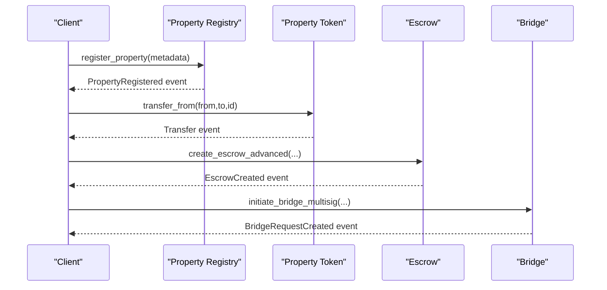

**Diagram sources**
- [lib.rs:331-575](file://stellar-insured-contracts/contracts/lib/src/lib.rs#L331-L575)
- [lib.rs:260-476](file://stellar-insured-contracts/contracts/property-token/src/lib.rs#L260-L476)
- [lib.rs:164-260](file://stellar-insured-contracts/contracts/escrow/src/lib.rs#L164-L260)
- [lib.rs:63-113](file://stellar-insured-contracts/contracts/bridge/src/lib.rs#L63-L113)

**Section sources**
- [lib.rs:331-750](file://stellar-insured-contracts/contracts/lib/src/lib.rs#L331-L750)
- [lib.rs:260-476](file://stellar-insured-contracts/contracts/property-token/src/lib.rs#L260-L476)
- [lib.rs:164-260](file://stellar-insured-contracts/contracts/escrow/src/lib.rs#L164-L260)
- [lib.rs:63-113](file://stellar-insured-contracts/contracts/bridge/src/lib.rs#L63-L113)
- [lib.rs:77-103](file://stellar-insured-contracts/contracts/oracle/src/lib.rs#L77-L103)
- [lib.rs:382-522](file://stellar-insured-contracts/contracts/insurance/src/lib.rs#L382-L522)

## Upgrade and Proxy Mechanisms
The system employs a transparent proxy pattern for upgradable implementations:
- TransparentProxy stores the current implementation code hash and admin.
- Admin-only upgrades replace the implementation and emit an Upgraded event.
- Admin changes are similarly restricted and emit an AdminChanged event.
- Contracts can be upgraded independently or as part of a coordinated upgrade strategy.

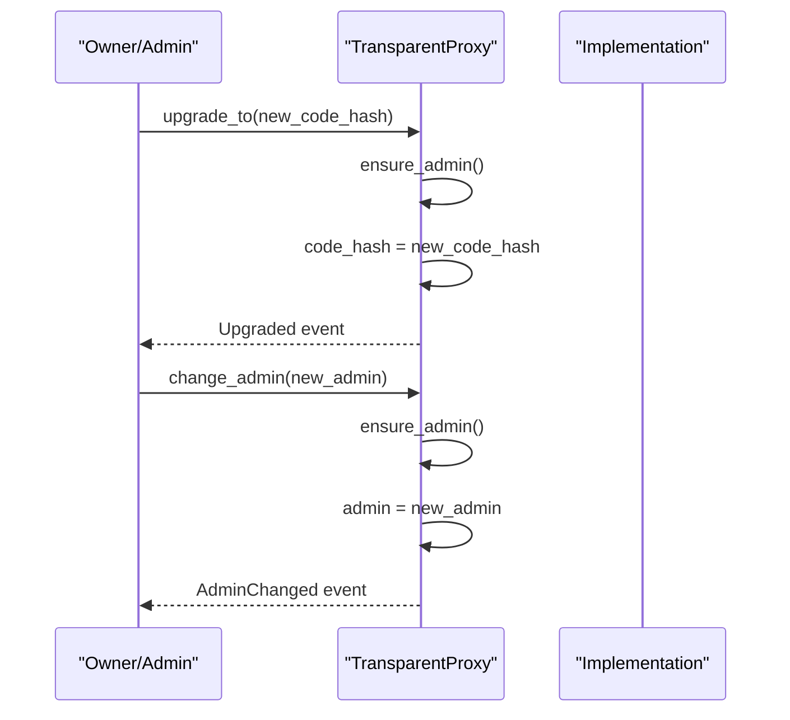

**Diagram sources**
- [lib.rs:39-80](file://stellar-insured-contracts/contracts/proxy/src/lib.rs#L39-L80)

**Section sources**
- [lib.rs:39-80](file://stellar-insured-contracts/contracts/proxy/src/lib.rs#L39-L80)
- [architecture.md:323-348](file://stellar-insured-contracts/docs/architecture.md#L323-L348)

## Scalability and Monitoring
- Scalability solutions: Layer 2 integration, rollups, sidechains, and cross-chain compatibility.
- Monitoring: On-chain gas tracking, performance metrics, health checks, and off-chain alerting.
- Gas optimization: Efficient data structures, batch operations, lazy evaluation, and minimal storage writes.
- Observability: Comprehensive event emission, error logging, and audit trails.

**Section sources**
- [architecture.md:365-431](file://stellar-insured-contracts/docs/architecture.md#L365-L431)
- [lib.rs:180-204](file://stellar-insured-contracts/contracts/lib/src/lib.rs#L180-L204)
- [best-practices.md:25-45](file://stellar-insured-contracts/docs/best-practices.md#L25-L45)

## Integration and Extensibility
- Shared traits enable new contracts to integrate seamlessly with existing components.
- Cross-contract calls facilitate orchestration between Property Token, Registry, Compliance, Insurance, and Bridge.
- Modular design allows incremental feature addition and independent upgrades.
- Best practices emphasize compliance checks, multi-signature workflows, and gas-efficient operations.

**Section sources**
- [lib.rs:23-722](file://stellar-insured-contracts/contracts/traits/src/lib.rs#L23-L722)
- [best-practices.md:47-56](file://stellar-insured-contracts/docs/best-practices.md#L47-L56)

## Troubleshooting Guide
Common issues and resolutions:
- Compliance failures: Ensure accounts meet jurisdictional requirements and GDPR consent is valid.
- Escrow disputes: Use dispute resolution workflows and emergency overrides when applicable.
- Bridge failures: Monitor request status, verify signatures, and apply recovery actions as admin.
- Oracle anomalies: Check source reputation, slashing thresholds, and confidence metrics.
- Gas optimization: Batch operations, minimize state changes, and use off-chain metadata.

**Section sources**
- [lib.rs:603-635](file://stellar-insured-contracts/contracts/compliance_registry/lib.rs#L603-L635)
- [lib.rs:760-800](file://stellar-insured-contracts/contracts/escrow/src/lib.rs#L760-L800)
- [lib.rs:349-404](file://stellar-insured-contracts/contracts/bridge/src/lib.rs#L349-L404)
- [lib.rs:311-327](file://stellar-insured-contracts/contracts/oracle/src/lib.rs#L311-L327)
- [best-practices.md:22-45](file://stellar-insured-contracts/docs/best-practices.md#L22-L45)

## Conclusion
The PropChain smart contract system demonstrates a mature, modular architecture designed for real estate tokenization. Its layered design, robust governance, comprehensive event emission, and upgrade mechanisms provide a solid foundation for scalable, secure, and interoperable property ecosystems. By adhering to best practices and leveraging the shared traits and proxy infrastructure, developers can extend the system while maintaining consistency and reliability.