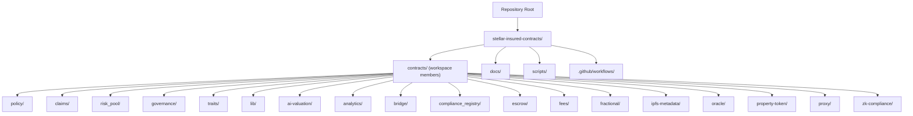

# Contributing Guidelines

<cite>
**Referenced Files in This Document**
- [README.md](file://README.md)
- [.github/workflows/ci.yml](file://.github/workflows/ci.yml)
- [.github/workflows/test-coverage.yml](file://.github/workflows/test-coverage.yml)
- [.github/workflows/security.yml](file://.github/workflows/security.yml)
- [.pre-commit-config.yaml](file://.pre-commit-config.yaml)
- [rustfmt.toml](file://rustfmt.toml)
- [clippy.toml](file://clippy.toml)
- [deny.toml](file://deny.toml)
- [SECURITY.md](file://SECURITY.md)
- [docs/testing-guide.md](file://docs/testing-guide.md)
- [docs/best-practices.md](file://docs/best-practices.md)
- [docs/architecture.md](file://docs/architecture.md)
- [docs/compliance-integration.md](file://docs/compliance-integration.md)
- [docs/security_pipeline.md](file://docs/security_pipeline.md)
- [scripts/setup-pre-commit.sh](file://scripts/setup-pre-commit.sh)
- [scripts/run_tests_with_coverage.sh](file://scripts/run_tests_with_coverage.sh)
- [scripts/test.sh](file://scripts/test.sh)
- [Cargo.toml](file://Cargo.toml)
</cite>

## Table of Contents
1. [Introduction](#introduction)
2. [Project Structure](#project-structure)
3. [Development Workflow](#development-workflow)
4. [Code Standards and Formatting](#code-standards-and-formatting)
5. [Pre-commit Hooks and Dependency Policy](#pre-commit-hooks-and-dependency-policy)
6. [Testing Requirements](#testing-requirements)
7. [Code Review and Quality Gates](#code-review-and-quality-gates)
8. [Documentation Requirements](#documentation-requirements)
9. [Architectural Decision Records (ADRs)](#architectural-decision-records-adrs)
10. [Security Considerations and Vulnerability Reporting](#security-considerations-and-vulnerability-reporting)
11. [Community Standards and Communication](#community-standards-and-communication)
12. [Conclusion](#conclusion)

## Introduction
This document provides comprehensive contributing guidelines for developers working on the Stellar Insured contracts. It covers the development workflow, code standards, testing requirements, review processes, documentation expectations, security practices, and community norms. The goal is to ensure consistent, secure, and maintainable contributions across the repository.

## Project Structure
The repository is organized around a Rust workspace containing multiple smart contracts and shared libraries. Key areas include:
- Workspace root with top-level configuration and scripts
- Contracts under stellar-insured-contracts/contracts grouped by domain (policy, claims, risk_pool, governance, etc.)
- Shared library modules and traits
- Documentation under stellar-insured-contracts/docs
- Scripts under stellar-insured-contracts/scripts for building, testing, and deployment
- GitHub Actions workflows under .github/workflows for CI, testing, security, and release automation

**Section sources**
- [README.md:141-150](file://README.md#L141-L150)

## Development Workflow
- Fork the repository and create a branch per contract or feature area.
- Keep branches focused and small to facilitate reviews.
- Add comprehensive tests for all logic changes.
- Submit Pull Requests with clear descriptions and rationale.

**Section sources**
- [README.md:207-216](file://README.md#L207-L216)

## Code Standards and Formatting
- Rust formatting: Enforced via rustfmt with repository-wide configuration.
- Linting: Clippy is configured to treat warnings as errors for strictness.
- Formatting and linting are executed in CI to ensure consistency.

Recommended local commands:
- cargo fmt --all -- --check
- cargo clippy --all-targets --all-features -- -D warnings

**Section sources**
- [.github/workflows/ci.yml:44-48](file://.github/workflows/ci.yml#L44-L48)
- [rustfmt.toml](file://rustfmt.toml)
- [clippy.toml](file://clippy.toml)

## Pre-commit Hooks and Dependency Policy
- Pre-commit hooks are supported and can be installed via the provided script.
- Dependency policy enforcement is handled by cargo-deny and cargo-audit in CI.
- The deny.toml configuration governs allowed/denied crates and categories.

Setup steps:
- Install pre-commit hooks using the setup script.
- Ensure cargo-deny and cargo-audit are available locally if running checks manually.

**Section sources**
- [.pre-commit-config.yaml](file://.pre-commit-config.yaml)
- [scripts/setup-pre-commit.sh](file://scripts/setup-pre-commit.sh)
- [.github/workflows/security.yml:164-168](file://.github/workflows/security.yml#L164-L168)
- [deny.toml](file://deny.toml)

## Testing Requirements
- Unit tests: Run with cargo test across all workspace features. Some contracts exclude specific modules during CI runs.
- Integration tests: Dedicated suites for property registry, property token, and cross-contract integration.
- Coverage: Optional coverage collection is supported via scripts and CI jobs.
- Local testing: Use provided scripts to run targeted tests and coverage reports.

CI coverage:
- Unit tests for most workspace members
- Integration tests for selected modules
- Contract builds and size verification for bridge
- Coverage job (test-coverage.yml) for coverage metrics

**Section sources**
- [.github/workflows/ci.yml:50-67](file://.github/workflows/ci.yml#L50-L67)
- [.github/workflows/test-coverage.yml](file://.github/workflows/test-coverage.yml)
- [scripts/test.sh](file://scripts/test.sh)
- [scripts/run_tests_with_coverage.sh](file://scripts/run_tests_with_coverage.sh)
- [docs/testing-guide.md](file://docs/testing-guide.md)

## Code Review and Quality Gates
- CI enforces formatting, linting, unit/integration tests, and security checks.
- Security gate: cargo-audit and cargo-deny scans are performed.
- Documentation validation: PRs are checked for required documentation updates and module completeness.
- Build verification: All contracts must build successfully in release mode.
- Branch deployment: Automated deployment to testnet occurs on develop branch pushes.

Quality gates summary:
- rustfmt and clippy pass
- unit and integration tests pass
- security audit and deny checks pass
- documentation completeness verified
- build artifacts generated and validated

**Section sources**
- [.github/workflows/ci.yml:13-48](file://.github/workflows/ci.yml#L13-L48)
- [.github/workflows/security.yml:141-177](file://.github/workflows/security.yml#L141-L177)
- [.github/workflows/ci.yml:312-342](file://.github/workflows/ci.yml#L312-L342)
- [.github/workflows/ci.yml:178-226](file://.github/workflows/ci.yml#L178-L226)
- [.github/workflows/ci.yml:235-272](file://.github/workflows/ci.yml#L235-L272)

## Documentation Requirements
- Update inline documentation and comments for changed logic.
- Maintain and update architectural and design documents.
- Ensure README reflects major changes and new capabilities.
- Compliance-related documentation must be kept current with integration updates.

**Section sources**
- [docs/architecture.md](file://docs/architecture.md)
- [docs/compliance-integration.md](file://docs/compliance-integration.md)
- [docs/best-practices.md](file://docs/best-practices.md)
- [README.md:179-186](file://README.md#L179-L186)

## Architectural Decision Records (ADRs)
- ADRs are maintained under docs/adr to capture significant architectural decisions.
- New ADRs should be created for major changes affecting system design, integration patterns, or security posture.
- Reference existing ADRs when proposing changes to ensure continuity and traceability.

**Section sources**
- [docs/architecture.md](file://docs/architecture.md)

## Security Considerations and Vulnerability Reporting
- Security scanning: cargo-audit and cargo-deny are integrated into CI.
- Security-focused pipeline: dedicated workflow validates dependencies and detects vulnerabilities.
- Vulnerability reporting: follow the process outlined in SECURITY.md for responsible disclosure.
- Best practices: adhere to security guidelines and keep dependencies up to date.

**Section sources**
- [.github/workflows/security.yml:141-177](file://.github/workflows/security.yml#L141-L177)
- [SECURITY.md](file://SECURITY.md)
- [docs/security_pipeline.md](file://docs/security_pipeline.md)

## Community Standards and Communication
- Follow the project’s code of conduct and community guidelines.
- Engage constructively in discussions, PR reviews, and issue triage.
- Use appropriate channels for questions, feedback, and coordination.

[No sources needed since this section provides general guidance]

## Conclusion
By following these guidelines—adhering to code standards, maintaining rigorous testing and security practices, and ensuring documentation and ADR completeness—you help uphold the quality and reliability of the Stellar Insured contracts. Thank you for contributing to a secure and transparent ecosystem.