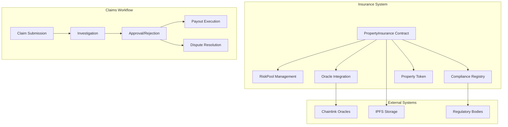
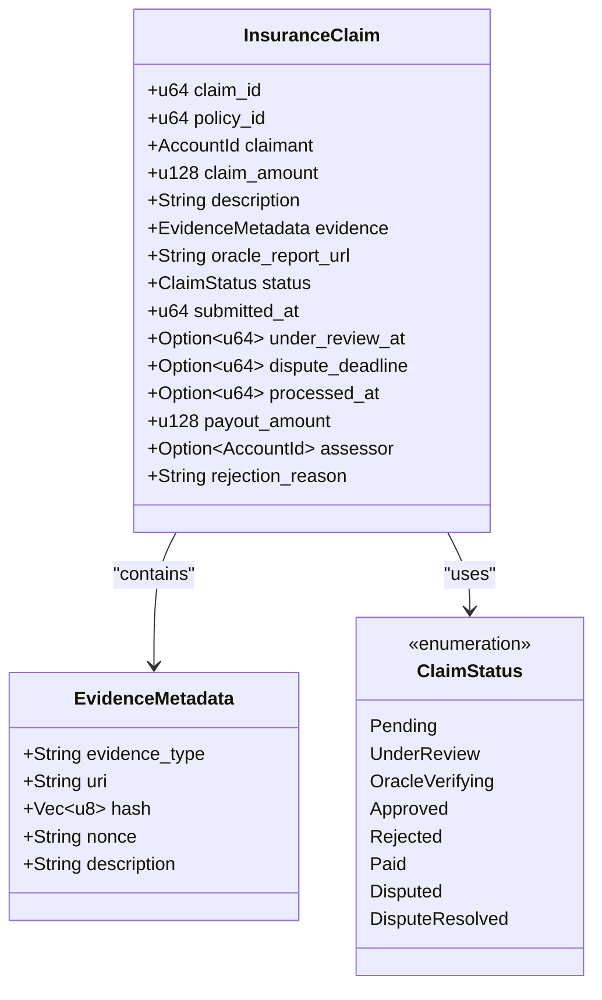
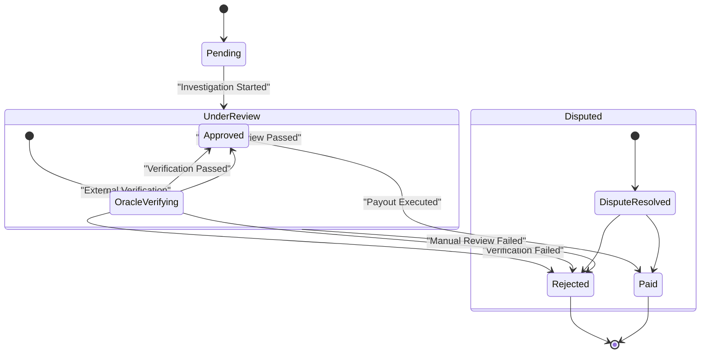
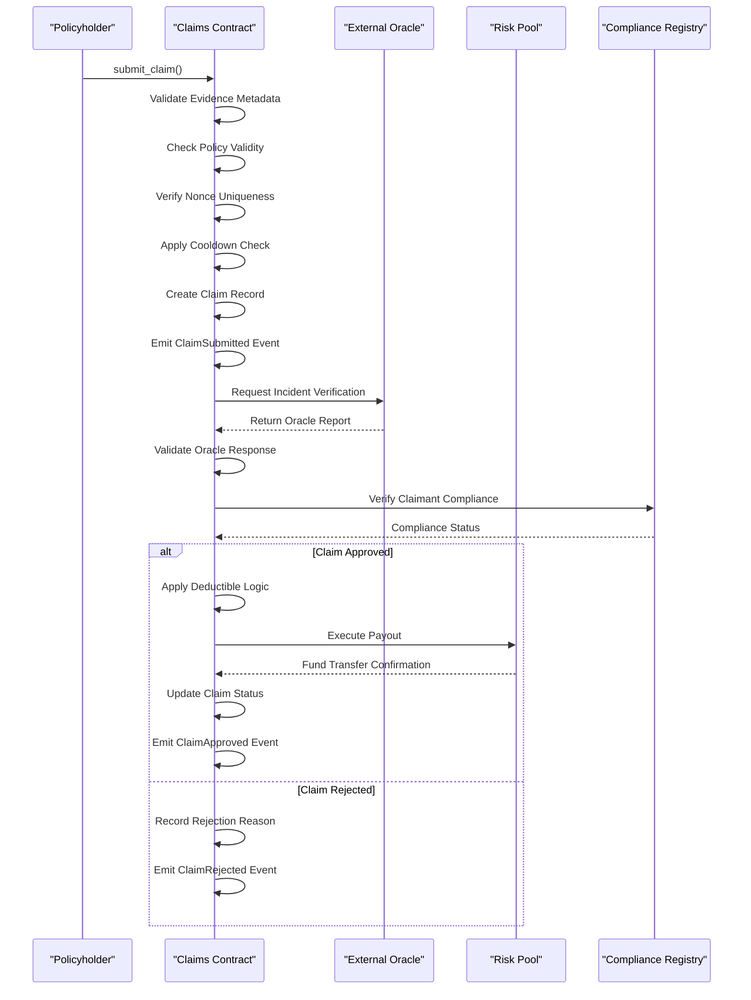
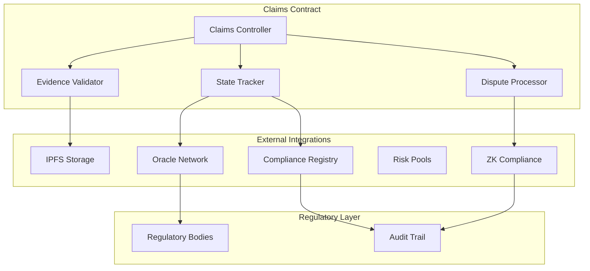
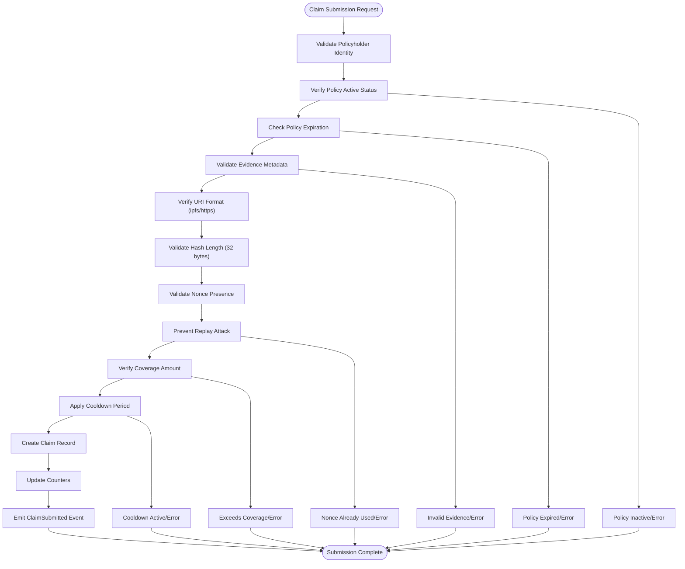
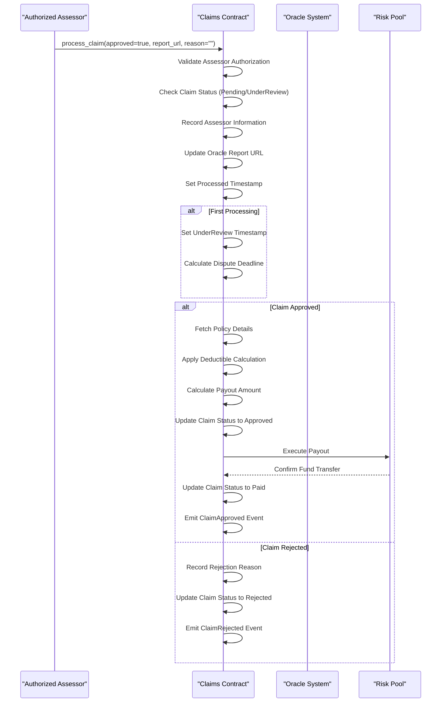
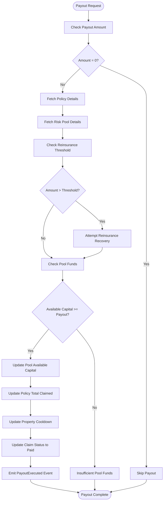
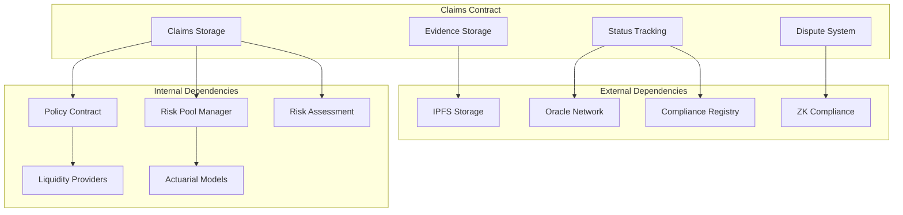
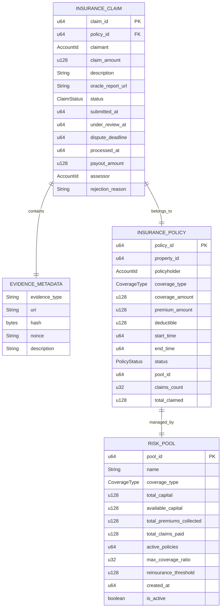

# Claims Contract

<cite>
**Referenced Files in This Document**
- [lib.rs](file://stellar-insured-contracts/contracts/insurance/src/lib.rs)
- [README.md](file://README.md)
- [contracts.md](file://stellar-insured-contracts/docs/contracts.md)
</cite>

## Table of Contents
1. [Introduction](#introduction)
2. [Project Structure](#project-structure)
3. [Core Components](#core-components)
4. [Architecture Overview](#architecture-overview)
5. [Detailed Component Analysis](#detailed-component-analysis)
6. [Dependency Analysis](#dependency-analysis)
7. [Performance Considerations](#performance-considerations)
8. [Troubleshooting Guide](#troubleshooting-guide)
9. [Conclusion](#conclusion)

## Introduction
This document provides comprehensive technical documentation for the Claims contract within the Stellar Insured platform. The Claims contract manages the full lifecycle of insurance claims, from initial submission through investigation, approval/rejection, and final payout execution. It integrates with external oracles for incident verification, enforces compliance checks, and coordinates with Risk Pools for fund allocation.

The Claims contract implements a multi-stage workflow with strict state transitions, evidence validation, and dispute resolution mechanisms. It supports various claim types including property damage, theft, and natural disasters, while maintaining robust security controls against replay attacks and unauthorized access.

## Project Structure
The Claims contract is part of the Property Insurance system, which includes interconnected contracts for policy management, risk assessment, and compliance verification.



**Diagram sources**
- [lib.rs:1-1873](file://stellar-insured-contracts/contracts/insurance/src/lib.rs#L1-1873)
- [README.md:28-35](file://README.md#L28-L35)

**Section sources**
- [README.md:1-35](file://README.md#L1-L35)
- [contracts.md:87-105](file://stellar-insured-contracts/docs/contracts.md#L87-L105)

## Core Components

### Claim Data Model
The Claims contract defines a comprehensive claim structure with essential fields for tracking and processing:



**Diagram sources**
- [lib.rs:181-197](file://stellar-insured-contracts/contracts/insurance/src/lib.rs#L181-L197)
- [lib.rs:124-135](file://stellar-insured-contracts/contracts/insurance/src/lib.rs#L124-L135)
- [lib.rs:108-117](file://stellar-insured-contracts/contracts/insurance/src/lib.rs#L108-L117)

### Claim Status Transitions
The Claims contract implements a strict finite state machine for claim processing:



**Diagram sources**
- [lib.rs:108-117](file://stellar-insured-contracts/contracts/insurance/src/lib.rs#L108-L117)

**Section sources**
- [lib.rs:181-197](file://stellar-insured-contracts/contracts/insurance/src/lib.rs#L181-L197)
- [lib.rs:108-117](file://stellar-insured-contracts/contracts/insurance/src/lib.rs#L108-L117)

## Architecture Overview

### Claims Processing Pipeline
The Claims contract orchestrates a sophisticated multi-layered processing pipeline:



**Diagram sources**
- [lib.rs:973-1162](file://stellar-insured-contracts/contracts/insurance/src/lib.rs#L973-L1162)
- [lib.rs:1766-1827](file://stellar-insured-contracts/contracts/insurance/src/lib.rs#L1766-L1827)

### Integration Architecture
The Claims contract integrates with multiple external systems for comprehensive verification:



**Diagram sources**
- [lib.rs:1-1873](file://stellar-insured-contracts/contracts/insurance/src/lib.rs#L1-1873)

**Section sources**
- [lib.rs:973-1162](file://stellar-insured-contracts/contracts/insurance/src/lib.rs#L973-L1162)
- [lib.rs:1766-1827](file://stellar-insured-contracts/contracts/insurance/src/lib.rs#L1766-L1827)

## Detailed Component Analysis

### Claim Submission Process
The claim submission process implements comprehensive validation and security measures:



**Diagram sources**
- [lib.rs:973-1079](file://stellar-insured-contracts/contracts/insurance/src/lib.rs#L973-L1079)

### Investigation and Approval Workflow
The investigation process combines automated verification with manual oversight:



**Diagram sources**
- [lib.rs:1082-1162](file://stellar-insured-contracts/contracts/insurance/src/lib.rs#L1082-L1162)
- [lib.rs:1766-1827](file://stellar-insured-contracts/contracts/insurance/src/lib.rs#L1766-L1827)

### Payout Execution Engine
The payout system implements sophisticated fund management with risk controls:



**Diagram sources**
- [lib.rs:1766-1827](file://stellar-insured-contracts/contracts/insurance/src/lib.rs#L1766-L1827)

**Section sources**
- [lib.rs:973-1162](file://stellar-insured-contracts/contracts/insurance/src/lib.rs#L973-L1162)
- [lib.rs:1766-1827](file://stellar-insured-contracts/contracts/insurance/src/lib.rs#L1766-L1827)

### Dispute Resolution Mechanism
The Claims contract implements a comprehensive dispute resolution system:

```mermaid
stateDiagram-v2
[*] --> Active : Claim Submitted
Active --> UnderReview : Investigation Started
UnderReview --> Disputed : Dispute Raised
Disputed --> DisputeResolved : Arbiter Decision
DisputeResolved --> Paid : Approved
DisputeResolved --> Rejected : Denied
note right of Disputed : Dispute Window : 7 days<br/>Arbiter Authority<br/>Policyholder Appeal
note right of DisputeResolved : Final Resolution<br/>Automated Payout or Rejection
```

**Diagram sources**
- [lib.rs:1535-1572](file://stellar-insured-contracts/contracts/insurance/src/lib.rs#L1535-L1572)

**Section sources**
- [lib.rs:1535-1572](file://stellar-insured-contracts/contracts/insurance/src/lib.rs#L1535-L1572)

## Dependency Analysis

### Claims Contract Dependencies
The Claims contract interacts with multiple system components through well-defined interfaces:



**Diagram sources**
- [lib.rs:1-1873](file://stellar-insured-contracts/contracts/insurance/src/lib.rs#L1-1873)

### Data Flow Patterns
The Claims contract follows established patterns for data persistence and retrieval:



**Diagram sources**
- [lib.rs:181-197](file://stellar-insured-contracts/contracts/insurance/src/lib.rs#L181-L197)
- [lib.rs:159-175](file://stellar-insured-contracts/contracts/insurance/src/lib.rs#L159-L175)
- [lib.rs:203-216](file://stellar-insured-contracts/contracts/insurance/src/lib.rs#L203-L216)

**Section sources**
- [lib.rs:1-1873](file://stellar-insured-contracts/contracts/insurance/src/lib.rs#L1-1873)

## Performance Considerations

### Gas Optimization Strategies
The Claims contract implements several optimization techniques for cost-effective operation:

1. **Efficient Storage Layout**: Uses compact storage structures with minimal memory footprint
2. **Batch Operations**: Supports batch processing for multiple claims and policies
3. **Lazy Evaluation**: Defers expensive computations until necessary
4. **Cache Management**: Maintains hot data in frequently accessed storage slots

### Scalability Features
- **Modular Design**: Separate concerns for claims, policies, and risk management
- **Event-Driven Architecture**: Reduces computational overhead through event emission
- **Index Management**: Optimized lookup patterns for claim and policy queries
- **Resource Limits**: Built-in caps on pool exposure and claim processing

### Security Optimizations
- **Nonce Validation**: Prevents replay attacks through unique nonce tracking
- **Authorization Checks**: Multi-level permission system for claim processing
- **Input Validation**: Comprehensive validation for all external inputs
- **State Consistency**: Atomic operations for claim state transitions

## Troubleshooting Guide

### Common Claim Processing Issues

#### Evidence Validation Failures
**Symptoms**: Claims consistently rejected during submission
**Causes**: 
- Invalid URI format (not starting with ipfs:// or https://)
- Hash length not equal to 32 bytes
- Empty or missing nonce value
- Duplicate nonce detected

**Resolutions**:
1. Verify evidence metadata format compliance
2. Ensure unique nonce values per claim submission
3. Check IPFS content availability and accessibility
4. Validate hash computation accuracy

#### Funding Shortage Errors
**Symptoms**: Payout execution fails with insufficient funds
**Causes**:
- Risk pool insufficient capital
- Reinsurance threshold exceeded
- Pool exposure limits reached

**Resolutions**:
1. Increase pool liquidity through additional capital providers
2. Adjust coverage amounts to fit pool capacity
3. Implement reinsurance agreements for large claims
4. Monitor pool utilization ratios

#### Authorization Problems
**Symptoms**: Claims rejected with unauthorized access errors
**Causes**:
- Non-policyholder attempting claim submission
- Unauthenticated assessors processing claims
- Missing oracle authorization

**Resolutions**:
1. Verify policyholder identity and ownership
2. Register authorized assessors through admin functions
3. Configure oracle addresses for verification
4. Check compliance registry status

**Section sources**
- [lib.rs:23-54](file://stellar-insured-contracts/contracts/insurance/src/lib.rs#L23-L54)
- [lib.rs:989-1005](file://stellar-insured-contracts/contracts/insurance/src/lib.rs#L989-L1005)

## Conclusion

The Claims contract represents a sophisticated, enterprise-grade solution for insurance claims processing on the Stellar blockchain. Its comprehensive feature set includes advanced validation mechanisms, multi-layered verification processes, and robust security controls.

Key strengths of the implementation include:

- **Comprehensive Evidence Management**: Structured evidence validation prevents fraud while enabling efficient processing
- **Flexible Integration**: Seamless integration with external oracles and compliance systems
- **Robust Security**: Multi-layered authorization and replay attack prevention
- **Scalable Architecture**: Modular design supporting high-volume claim processing
- **Transparent Operations**: Complete audit trail through comprehensive event emission

The contract successfully balances security, efficiency, and regulatory compliance while maintaining flexibility for future enhancements. Its integration with the broader Property Insurance ecosystem creates a cohesive platform for comprehensive property risk management.

Future enhancements could include expanded claim types, enhanced AI-powered fraud detection, and additional integration points with emerging DeFi protocols.