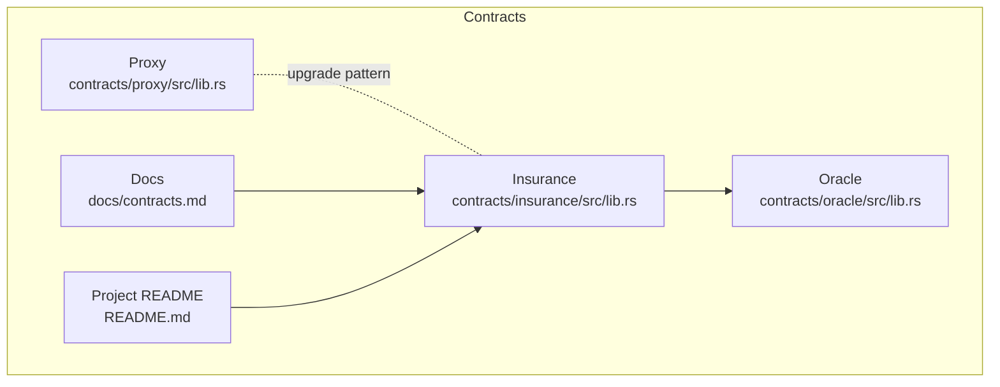
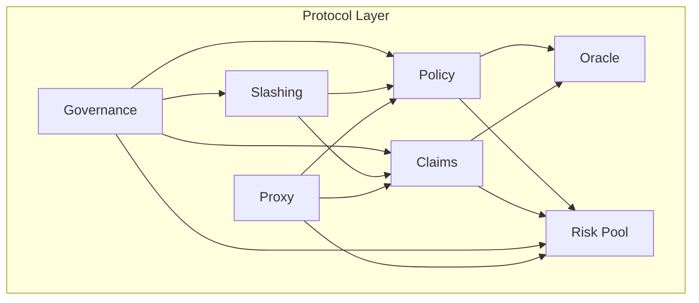
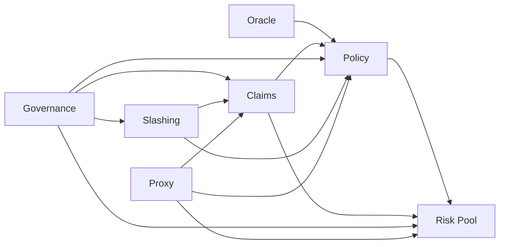
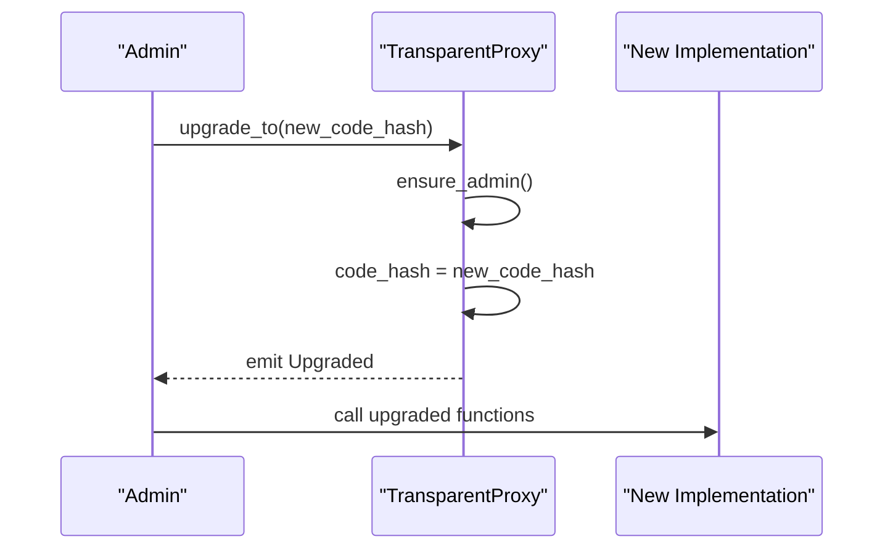

# Core Contracts

<cite>
**Referenced Files in This Document**
- [lib.rs](file://stellar-insured-contracts/contracts/insurance/src/lib.rs)
- [lib.rs](file://stellar-insured-contracts/contracts/proxy/src/lib.rs)
- [README.md](file://README.md)
- [contracts.md](file://stellar-insured-contracts/docs/contracts.md)
- [lib.rs](file://stellar-insured-contracts/contracts/oracle/src/lib.rs)
</cite>

## Table of Contents
1. [Introduction](#introduction)
2. [Project Structure](#project-structure)
3. [Core Components](#core-components)
4. [Architecture Overview](#architecture-overview)
5. [Detailed Component Analysis](#detailed-component-analysis)
6. [Dependency Analysis](#dependency-analysis)
7. [Performance Considerations](#performance-considerations)
8. [Troubleshooting Guide](#troubleshooting-guide)
9. [Conclusion](#conclusion)
10. [Appendices](#appendices)

## Introduction
This document provides comprehensive documentation for the core insurance contracts system in the PropChain ecosystem. It focuses on the five main contracts: Policy, Claims, Risk Pool, Governance, and Slashing. It explains each contract’s purpose, key functions, state management, interdependencies, initialization parameters, function signatures, return values, state transitions, authorization requirements, security mechanisms, upgradeability, and proxy patterns. Practical examples of contract interactions and common usage patterns are included to help developers integrate and operate the system effectively.

## Project Structure
The core contracts are implemented in the PropChain repository under the contracts directory. The primary insurance contract is located at contracts/insurance/src/lib.rs. Proxy contracts are located at contracts/proxy/src/lib.rs. The README provides an overview of the five main contracts and their roles. Additional supporting contracts (e.g., Oracle) are present and interact with the insurance system.

**Diagram sources**
- [lib.rs](file://stellar-insured-contracts/contracts/insurance/src/lib.rs)
- [lib.rs](file://stellar-insured-contracts/contracts/proxy/src/lib.rs)
- [README.md](file://README.md)
- [contracts.md](file://stellar-insured-contracts/docs/contracts.md)

**Section sources**
- [README.md](file://README.md)
- [contracts.md](file://stellar-insured-contracts/docs/contracts.md)

## Core Components
This section summarizes the five main contracts and their responsibilities within the insurance ecosystem.

- Policy: Manages insurance policies for properties, including creation, cancellation, and lifecycle tracking.
- Claims: Handles claim submission, review, approval/rejection, and payouts.
- Risk Pool: Manages liquidity capital, exposure limits, and claims settlement funding.
- Governance: Enables decentralized decision-making via proposals and voting.
- Slashing: Implements on-chain penalties for malicious or negligent actors.

These contracts interact closely: the Policy contract relies on Risk Pool capital and Oracle assessments; Claims interacts with Risk Pool for payouts and may trigger reinsurance; Governance governs protocol parameters and can propose Slashing actions; Slashing affects actor behavior and incentives.

**Section sources**
- [README.md](file://README.md)
- [contracts.md](file://stellar-insured-contracts/docs/contracts.md)

## Architecture Overview
The insurance ecosystem follows a modular architecture with clear separation of concerns:
- Policy and Claims manage product and claims workflows.
- Risk Pool manages financial capital and liquidity.
- Oracle provides risk assessments and valuations used by Policy and Claims.
- Governance defines protocol parameters and enforces decisions.
- Slashing ensures behavioral integrity by penalizing violations.
- Proxy enables upgradeability of core contracts.

**Diagram sources**
- [lib.rs](file://stellar-insured-contracts/contracts/insurance/src/lib.rs)
- [lib.rs](file://stellar-insured-contracts/contracts/proxy/src/lib.rs)
- [lib.rs](file://stellar-insured-contracts/contracts/oracle/src/lib.rs)
- [README.md](file://README.md)

## Detailed Component Analysis

### Policy Contract
Purpose:
- Issue and manage insurance policies for properties.
- Integrate risk assessments and pricing.
- Track policyholder ownership and policy lifecycle.

Key functions and parameters:
- Initialization: admin account.
- create_policy(property_id, coverage_type, coverage_amount, pool_id, duration_seconds, metadata_url) -> Result<u64, InsuranceError>
- cancel_policy(policy_id) -> Result<(), InsuranceError>
- calculate_premium(property_id, coverage_amount, coverage_type) -> Result<PremiumCalculation, InsuranceError>
- authorize_oracle(oracle) -> Result<(), InsuranceError>
- authorize_assessor(assessor) -> Result<(), InsuranceError>
- set_platform_fee_rate(rate) -> Result<(), InsuranceError>
- set_claim_cooldown(period_seconds) -> Result<(), InsuranceError>

State management:
- Policies: Mapping<u64, InsurancePolicy>.
- Policyholder and property indices: policyholder_policies, property_policies.
- Policy counts and metadata URLs.

Authorization:
- Admin-only functions: create_risk_pool, register_reinsurance, set_platform_fee_rate, set_claim_cooldown, authorize_oracle, authorize_assessor, set_underwriting_criteria, set_dispute_window, set_arbiter, register_reinsurance.
- Caller must be policyholder or admin for cancel_policy.

Security mechanisms:
- Premium validation, pool capital checks, risk assessment validity, cooldown enforcement, and evidence metadata validation for claims.

State transitions:
- PolicyStatus: Active -> Cancelled (cancel_policy), Active -> Claimed (after full claims payout).

Return values:
- Policy ID on successful creation; unit on other operations; Option<T> for queries.

Practical examples:
- Create a policy with a risk pool and premium payment.
- Cancel a policy before expiration.
- Calculate premium based on risk assessment and coverage type.

**Section sources**
- [lib.rs](file://stellar-insured-contracts/contracts/insurance/src/lib.rs)
- [contracts.md](file://stellar-insured-contracts/docs/contracts.md)

### Claims Contract
Purpose:
- Enable claim submission, review, and settlement.
- Integrate with Oracle reports and assessors.
- Support dispute resolution with time-bound windows.

Key functions and parameters:
- submit_claim(policy_id, claim_amount, description, evidence) -> Result<u64, InsuranceError>
- process_claim(claim_id, approved, oracle_report_url, rejection_reason) -> Result<(), InsuranceError>
- move_to_dispute(claim_id) -> Result<(), InsuranceError>
- resolve_dispute(claim_id, approved) -> Result<(), InsuranceError>
- set_dispute_window(window_seconds) -> Result<(), InsuranceError>
- set_arbiter(arbiter) -> Result<(), InsuranceError>

State management:
- Claims: Mapping<u64, InsuranceClaim>.
- Policy-to-claims index: policy_claims.
- Dispute deadlines and assessor assignments.

Authorization:
- Authorized assessors or admin can process claims.
- Claimant, admin, or arbiter can initiate disputes.

Security mechanisms:
- Evidence metadata validation (URI scheme, hash length, nonce).
- Dispute window enforcement and deadline tracking.
- Deductible application and payout execution.

State transitions:
- ClaimStatus: Pending -> UnderReview -> Approved/Rejected -> Paid/Disputed -> DisputeResolved.

Return values:
- Claim ID on successful submission; unit on processing; Option<T> for queries.

Practical examples:
- Submit a claim with structured evidence metadata.
- Approve or reject a claim after review and Oracle report.
- Initiate and resolve a dispute within the window.

**Section sources**
- [lib.rs](file://stellar-insured-contracts/contracts/insurance/src/lib.rs)
- [contracts.md](file://stellar-insured-contracts/docs/contracts.md)

### Risk Pool Contract
Purpose:
- Manage liquidity capital for claims settlement.
- Enforce exposure ratios and thresholds.
- Track provider participation and rewards.

Key functions and parameters:
- create_risk_pool(name, coverage_type, max_coverage_ratio, reinsurance_threshold) -> Result<u64, InsuranceError>
- provide_pool_liquidity(pool_id) -> Result<(), InsuranceError>
- register_reinsurance(reinsurer, coverage_limit, retention_limit, premium_ceded_rate, coverage_types, duration_seconds) -> Result<u64, InsuranceError>
- try_reinsurance_recovery(claim_id, policy_id, amount) -> Result<(), InsuranceError>

State management:
- Pools: Mapping<u64, RiskPool>.
- Liquidity providers: liquidity_providers, pool_providers.
- Reinsurance agreements: reinsurance_agreements.

Authorization:
- Admin-only pool creation and reinsurance registration.

Security mechanisms:
- Exposure cap based on available capital and max_coverage_ratio.
- Threshold-based reinsurance activation.

State transitions:
- Pool capital increases with deposits; decreases with payouts; tracks active policies and claims paid.

Return values:
- Pool ID on creation; unit on liquidity provision; Option<T> for queries.

Practical examples:
- Create a risk pool for a specific coverage type.
- Deposit liquidity to earn rewards.
- Trigger reinsurance for large claims exceeding retention.

**Section sources**
- [lib.rs](file://stellar-insured-contracts/contracts/insurance/src/lib.rs)
- [contracts.md](file://stellar-insured-contracts/docs/contracts.md)

### Governance Contract
Purpose:
- Enable decentralized governance via proposals and voting.
- Govern protocol parameters and enforce decisions.

Key functions and parameters:
- initialize(admin, token_contract, voting_period_days, min_voting_percentage, min_quorum_percentage, slashing_contract) -> ...
- create_proposal(title, description, execution_data, threshold_percentage) -> ...
- vote(proposal_id, vote_weight, is_yes) -> ...
- finalize_proposal(proposal_id) -> ...
- execute_proposal(proposal_id) -> ...
- create_slashing_proposal(target, role, reason, amount, evidence, threshold) -> ...
- execute_slashing_proposal(proposal_id) -> ...

State management:
- Proposal storage and voting records.
- Quorum and threshold enforcement.

Authorization:
- Voting requires eligible token holders; execution requires passing thresholds.

Security mechanisms:
- Time-bound voting periods, quorum requirements, and threshold checks.

State transitions:
- Proposal lifecycle: Draft -> Active -> Finalized -> Executed.

Return values:
- Proposal IDs and voting statistics.

Practical examples:
- Create a proposal to adjust platform fee rates.
- Vote on proposals and execute approved changes.
- Create and execute a slashing proposal against a misbehaving actor.

**Section sources**
- [README.md](file://README.md)
- [contracts.md](file://stellar-insured-contracts/docs/contracts.md)

### Slashing Contract
Purpose:
- Implement on-chain penalties for malicious or negligent actors.
- Redirect slashed funds to risk pool, treasury, or compensation fund.

Key functions and parameters:
- initialize(admin, governance_contract, risk_pool_contract) -> ...
- configure_penalty_parameters(role, reason, percentage, destination, multiplier, cooldown) -> ...
- slash_funds(target, role, reason, amount) -> ...
- add_slashable_role(role) -> ...
- remove_slashable_role(role) -> ...
- get_slashing_history(target, role) -> ...
- get_violation_count(target, role) -> ...
- can_be_slashed(target, role) -> ...
- pause() / unpause() -> ...

State management:
- Penalty configurations per role and reason.
- Violation history and repeat-offender tracking.

Authorization:
- Admin-only configuration and pausing; governance-driven proposals for execution.

Security mechanisms:
- Configurable penalties, cooldowns, and multipliers; progressiveness for repeat offenses.

State transitions:
- Violation recorded; funds slashed according to configured parameters.

Return values:
- Status booleans and history arrays.

Practical examples:
- Configure penalties for Oracle providers and claim submitters.
- Slash a provider for submitting invalid data.
- Track repeat offenders and enforce progressive penalties.

**Section sources**
- [README.md](file://README.md)
- [contracts.md](file://stellar-insured-contracts/docs/contracts.md)

### Oracle Contract
Purpose:
- Provide property valuations and risk assessments used by Policy and Claims.
- Support confidence metrics, anomaly detection, and reputation management.

Key functions and parameters:
- get_property_valuation(property_id) -> Result<PropertyValuation, OracleError>
- get_valuation_with_confidence(property_id) -> Result<ValuationWithConfidence, OracleError>
- update_property_valuation(property_id, valuation) -> Result<(), OracleError>
- update_valuation_from_sources(property_id) -> Result<(), OracleError>
- add_oracle_source(source) -> Result<(), OracleError>
- set_ai_valuation_contract(ai_contract) -> Result<(), OracleError>
- slash_source(source_id, penalty) -> Result<(), OracleError>
- set_price_alert(property_id, threshold_percentage, alert_address) -> Result<(), OracleError>

State management:
- Property valuations and historical records.
- Source weights, reputations, and stakes.
- Alerts and market trends.

Authorization:
- Admin-only updates and source management.

Security mechanisms:
- Reputation and stake-based penalties for poor-quality sources.

State transitions:
- Valuation updated with confidence metrics; alerts triggered on significant changes.

Return values:
- Valuation objects and confidence metrics.

Practical examples:
- Update a property valuation from multiple sources.
- Configure price alerts and monitor anomalies.
- Slash a source for consistently providing bad data.

**Section sources**
- [lib.rs](file://stellar-insured-contracts/contracts/oracle/src/lib.rs)
- [contracts.md](file://stellar-insured-contracts/docs/contracts.md)

## Dependency Analysis
Interdependencies among contracts:
- Policy depends on Oracle for risk assessments and on Risk Pool for capital availability.
- Claims depends on Policy for policy details, Oracle for reports, and Risk Pool for payouts.
- Governance governs parameters affecting Policy, Claims, and Risk Pool.
- Slashing influences actor behavior and can impact Oracle and Risk Pool participation.
- Proxy enables upgradeability of core contracts without disrupting external integrations.

**Diagram sources**
- [lib.rs](file://stellar-insured-contracts/contracts/insurance/src/lib.rs)
- [lib.rs](file://stellar-insured-contracts/contracts/proxy/src/lib.rs)
- [lib.rs](file://stellar-insured-contracts/contracts/oracle/src/lib.rs)
- [README.md](file://README.md)

**Section sources**
- [lib.rs](file://stellar-insured-contracts/contracts/insurance/src/lib.rs)
- [lib.rs](file://stellar-insured-contracts/contracts/proxy/src/lib.rs)
- [lib.rs](file://stellar-insured-contracts/contracts/oracle/src/lib.rs)
- [README.md](file://README.md)

## Performance Considerations
- Use efficient storage patterns (Mappings) to minimize gas and storage costs.
- Batch operations where possible (e.g., batch valuation requests).
- Validate inputs early to avoid unnecessary computations.
- Monitor and tune exposure ratios and reinsurance thresholds to balance risk and capital efficiency.
- Keep historical data sizes bounded to maintain query performance.

[No sources needed since this section provides general guidance]

## Troubleshooting Guide
Common issues and resolutions:
- Unauthorized operations: Ensure caller has required permissions (admin, authorized oracle, authorized assessor).
- Insufficient funds: Verify pool capital meets exposure caps and claim thresholds.
- Invalid parameters: Check evidence metadata, coverage amounts, and policy durations.
- Dispute window expired: Ensure disputes are raised within the configured time window.
- Oracle verification failures: Confirm Oracle reports and reputation scores meet expectations.

**Section sources**
- [lib.rs](file://stellar-insured-contracts/contracts/insurance/src/lib.rs)
- [README.md](file://README.md)

## Conclusion
The PropChain core contracts form a robust, interoperable ecosystem for decentralized property insurance. The Policy, Claims, Risk Pool, Governance, and Slashing contracts collaborate to enable secure, transparent, and efficient insurance operations. Oracle integration ensures accurate risk assessments and valuations. Proxy-based upgradeability supports future enhancements without disrupting existing integrations. By following the documented interfaces, state transitions, and security mechanisms, developers can confidently build on top of this foundation.

[No sources needed since this section summarizes without analyzing specific files]

## Appendices

### Function Signatures and Return Values (Selected)
- Policy.create_policy(...): Returns Result<u64, InsuranceError>; creates a new policy and mints an insurance token.
- Claims.submit_claim(...): Returns Result<u64, InsuranceError>; validates evidence and creates a claim.
- Claims.process_claim(...): Returns Result<(), InsuranceError>; approves or rejects a claim.
- Risk Pool.create_risk_pool(...): Returns Result<u64, InsuranceError>; initializes a new risk pool.
- Governance.create_proposal(...): Returns ...; creates a governance proposal.
- Slashing.slash_funds(...): Returns Result<(), InsuranceError>; applies penalties to a target.

**Section sources**
- [lib.rs](file://stellar-insured-contracts/contracts/insurance/src/lib.rs)
- [README.md](file://README.md)

### Upgradeability and Proxy Patterns
- Transparent proxy pattern: The Proxy contract stores the current implementation code hash and admin address, emitting Upgraded and AdminChanged events.
- Upgrade flow: Admin upgrades the implementation via upgrade_to, then all calls route to the new logic.
- Benefits: Zero-downtime upgrades, controlled access, and event-driven transparency.

**Diagram sources**
- [lib.rs](file://stellar-insured-contracts/contracts/proxy/src/lib.rs)

**Section sources**
- [lib.rs](file://stellar-insured-contracts/contracts/proxy/src/lib.rs)