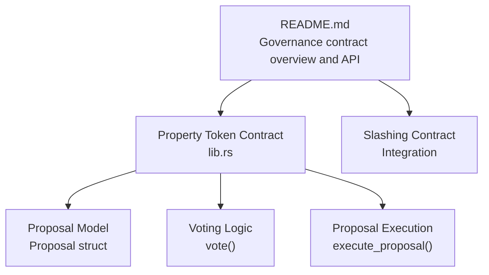
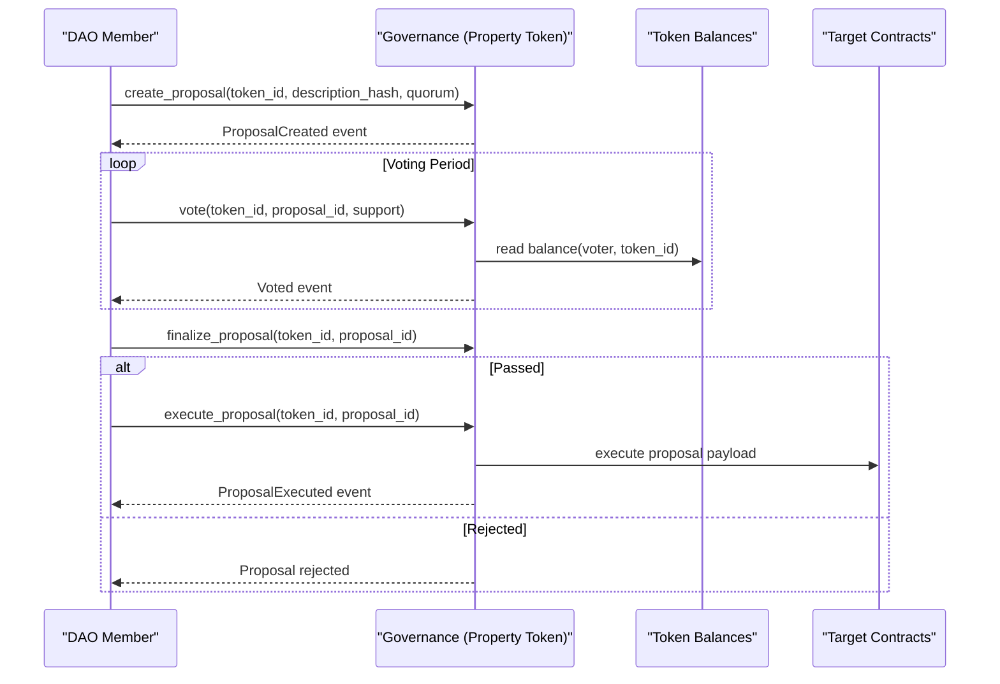
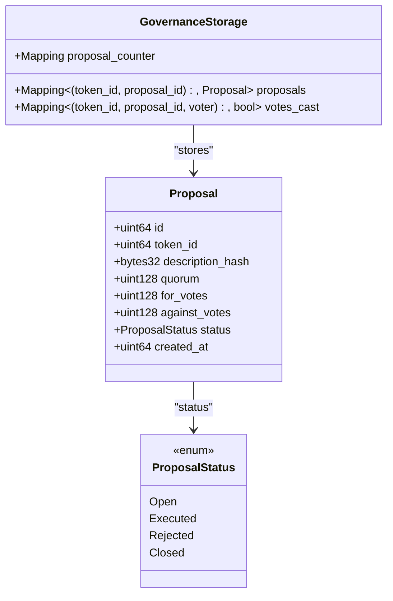
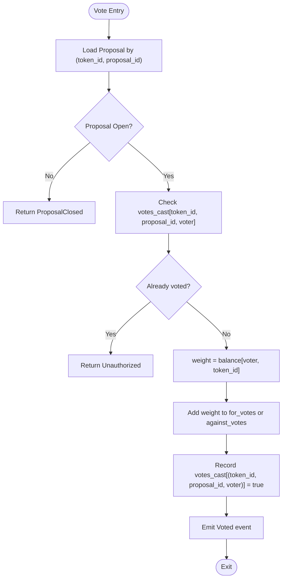
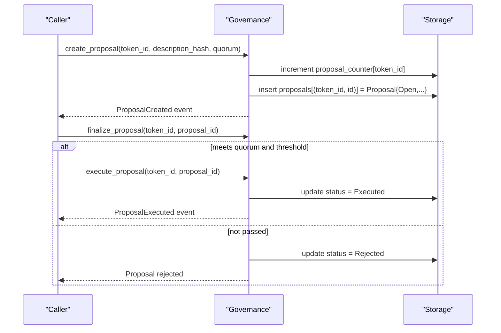
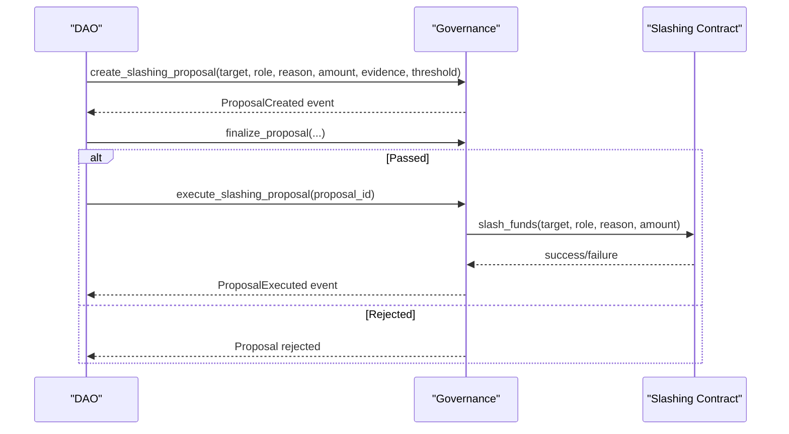
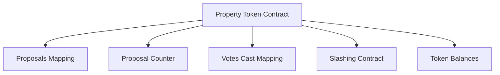

# Governance Contract

<cite>
**Referenced Files in This Document**
- [README.md](file://README.md)
- [lib.rs](file://stellar-insured-contracts/contracts/property-token/src/lib.rs)
</cite>

## Table of Contents
1. [Introduction](#introduction)
2. [Project Structure](#project-structure)
3. [Core Components](#core-components)
4. [Architecture Overview](#architecture-overview)
5. [Detailed Component Analysis](#detailed-component-analysis)
6. [Dependency Analysis](#dependency-analysis)
7. [Performance Considerations](#performance-considerations)
8. [Troubleshooting Guide](#troubleshooting-guide)
9. [Conclusion](#conclusion)

## Introduction
This document describes the Governance contract for the insurance ecosystem, focusing on decentralized decision-making, proposal creation, voting mechanics, quorum and threshold requirements, and execution procedures. It also documents the governance data model, voting weight calculation, delegation via token holdings, and integration points with other contracts such as the slashing mechanism. Examples of governance workflows illustrate major system changes, emergency procedures, and community-driven improvements.

## Project Structure
The Governance contract is part of the broader Stellar Insured smart contracts suite. The repository organizes contracts by domain (policy, claims, risk pool, governance, etc.). The Governance contract is referenced in the top-level README as a professional DAO governance system integrated with the ecosystem’s token and slashing mechanisms.

**Diagram sources**
- [README.md:86-106](file://README.md#L86-L106)
- [lib.rs:198-224](file://stellar-insured-contracts/contracts/property-token/src/lib.rs#L198-L224)
- [lib.rs:983-1031](file://stellar-insured-contracts/contracts/property-token/src/lib.rs#L983-L1031)

**Section sources**
- [README.md:86-106](file://README.md#L86-L106)
- [README.md:141](file://README.md#L141)

## Core Components
- Governance contract interface and capabilities:
  - Proposal creation with title, description, and execution data
  - Voting period enforcement and strict time-based voting
  - Proposal storage schema using Soroban-compatible data structures
  - Read-only queries for proposal data and statistics
  - Key functions: initialize, create_proposal, get_proposal, vote, finalize_proposal, execute_proposal, create_slashing_proposal, execute_slashing_proposal, get_active_proposals, get_proposal_stats, get_all_proposals, get_vote_record
- Governance data model:
  - Proposal struct with id, token_id, description hash, quorum, vote tallies, status, and created timestamp
  - ProposalStatus enum with Open, Executed, Rejected, Closed
  - Storage mappings for proposals, proposal counters, and per-vote tracking
- Voting mechanics:
  - Voting weight equals token balance for the relevant token_id
  - Duplicate vote prevention per voter per proposal
  - Vote tallying for “for” and “against” with saturating addition to prevent overflow
- Execution pipeline:
  - finalize_proposal validates quorum and thresholds
  - execute_proposal executes passed proposals

**Section sources**
- [README.md:86-106](file://README.md#L86-L106)
- [lib.rs:198-224](file://stellar-insured-contracts/contracts/property-token/src/lib.rs#L198-L224)
- [lib.rs:957-1031](file://stellar-insured-contracts/contracts/property-token/src/lib.rs#L957-L1031)

## Architecture Overview
The Governance contract is implemented in the Property Token contract module and uses token balances as the basis for voting power. Proposals are scoped to token_id to enable governance per property token. The contract emits events for proposal creation, voting, and execution to support transparency and external indexing.

**Diagram sources**
- [README.md:95-106](file://README.md#L95-L106)
- [lib.rs:198-224](file://stellar-insured-contracts/contracts/property-token/src/lib.rs#L198-L224)
- [lib.rs:957-1031](file://stellar-insured-contracts/contracts/property-token/src/lib.rs#L957-L1031)

## Detailed Component Analysis

### Governance Data Model
The governance data model centers around a Proposal entity and related state.

**Diagram sources**
- [lib.rs:198-224](file://stellar-insured-contracts/contracts/property-token/src/lib.rs#L198-L224)
- [lib.rs:94-96](file://stellar-insured-contracts/contracts/property-token/src/lib.rs#L94-L96)

**Section sources**
- [lib.rs:198-224](file://stellar-insured-contracts/contracts/property-token/src/lib.rs#L198-L224)
- [lib.rs:94-96](file://stellar-insured-contracts/contracts/property-token/src/lib.rs#L94-L96)

### Voting Mechanism and Weight Calculation
- Voting weight equals the token holder’s balance for the specific token_id.
- Duplicate votes are prevented using a votes_cast mapping keyed by (token_id, proposal_id, voter).
- Vote tallies use saturating addition to avoid overflow.

**Diagram sources**
- [lib.rs:983-1022](file://stellar-insured-contracts/contracts/property-token/src/lib.rs#L983-L1022)

**Section sources**
- [lib.rs:983-1022](file://stellar-insured-contracts/contracts/property-token/src/lib.rs#L983-L1022)

### Proposal Lifecycle and Execution
- Proposal creation sets initial state to Open with zero vote tallies and a specified quorum.
- finalize_proposal enforces quorum and threshold checks (threshold typically defined as a percentage of total eligible votes).
- execute_proposal executes the proposal payload when passed and updates status to Executed.

**Diagram sources**
- [lib.rs:957-981](file://stellar-insured-contracts/contracts/property-token/src/lib.rs#L957-L981)
- [lib.rs:1024-1031](file://stellar-insured-contracts/contracts/property-token/src/lib.rs#L1024-L1031)

**Section sources**
- [lib.rs:957-981](file://stellar-insured-contracts/contracts/property-token/src/lib.rs#L957-L981)
- [lib.rs:1024-1031](file://stellar-insured-contracts/contracts/property-token/src/lib.rs#L1024-L1031)

### Delegation and Voting Power Distribution
- Voting power is directly proportional to token holdings for the relevant token_id.
- There is no explicit delegation mechanism in the referenced code; delegation would require an external mechanism or extension to the current model.

**Section sources**
- [lib.rs:1005](file://stellar-insured-contracts/contracts/property-token/src/lib.rs#L1005)

### Proposal Types and Execution Targets
- The Governance contract supports creating proposals with execution data payloads. The referenced API indicates a generic execution_data parameter and a threshold_percentage for passing criteria.
- Execution targets depend on the proposal payload; the Governance contract itself delegates execution to target contracts or functions via the provided execution data.

**Section sources**
- [README.md:95-106](file://README.md#L95-L106)

### Integration with Slashing Contract
- The Governance contract integrates with the Slashing contract to create and execute slashing proposals for malicious or negligent actors, including governance participants.
- Slashing proposals follow the same lifecycle: create_slashing_proposal, finalize, and execute_slashing_proposal.

**Diagram sources**
- [README.md:78-85](file://README.md#L78-L85)
- [README.md:101-102](file://README.md#L101-L102)

**Section sources**
- [README.md:78-85](file://README.md#L78-L85)
- [README.md:101-102](file://README.md#L101-L102)

## Dependency Analysis
- Governance depends on:
  - Token contract for balance-based voting power
  - Slashing contract for governance-sanctioned penalties
  - Target contracts/functions referenced by proposal execution payloads
- Storage dependencies:
  - proposals mapping keyed by (token_id, proposal_id)
  - proposal_counter mapping keyed by token_id
  - votes_cast mapping keyed by (token_id, proposal_id, voter)

**Diagram sources**
- [lib.rs:94-96](file://stellar-insured-contracts/contracts/property-token/src/lib.rs#L94-L96)
- [lib.rs:957-1031](file://stellar-insured-contracts/contracts/property-token/src/lib.rs#L957-L1031)
- [README.md:78-85](file://README.md#L78-L85)

**Section sources**
- [lib.rs:94-96](file://stellar-insured-contracts/contracts/property-token/src/lib.rs#L94-L96)
- [lib.rs:957-1031](file://stellar-insured-contracts/contracts/property-token/src/lib.rs#L957-L1031)
- [README.md:78-85](file://README.md#L78-L85)

## Performance Considerations
- Voting weight retrieval and vote tallying are O(1) operations using mappings.
- Saturation arithmetic prevents overflow during tallies.
- Event emission supports efficient off-chain indexing and reduces client-side computation.

[No sources needed since this section provides general guidance]

## Troubleshooting Guide
Common issues and resolutions:
- Proposal not found: Ensure the (token_id, proposal_id) exists and was created via create_proposal.
- Proposal closed: Voting is only accepted for Open proposals; check finalize_proposal outcomes.
- Duplicate vote: Each voter can vote once per proposal; verify votes_cast mapping.
- Unauthorized: Only token owners (by balance) can vote; verify token_id and voter address.
- Execution failure: Confirm the proposal met quorum and threshold; verify the execution payload and target contracts.

**Section sources**
- [lib.rs:990-1004](file://stellar-insured-contracts/contracts/property-token/src/lib.rs#L990-L1004)
- [lib.rs:983-1022](file://stellar-insured-contracts/contracts/property-token/src/lib.rs#L983-L1022)

## Conclusion
The Governance contract provides a robust, token-weighted, on-chain decision-making framework for the insurance ecosystem. It supports proposal creation, transparent voting, quorum and threshold enforcement, and execution of passed proposals. Integration with the Slashing contract enables governance to enforce behavioral standards. The design leverages token balances for voting power and emits events for transparency, forming a solid foundation for decentralized governance.