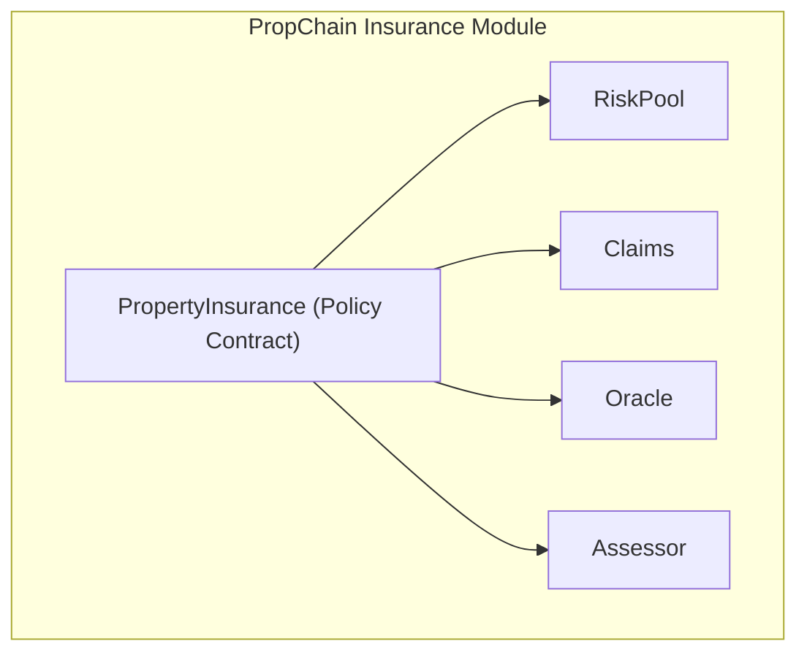
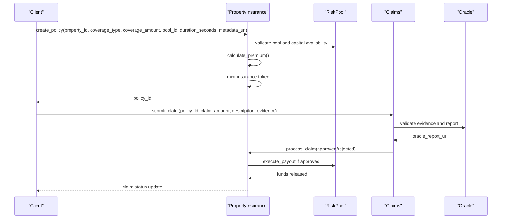
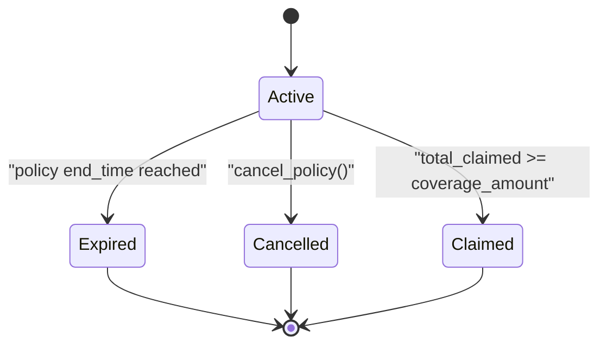
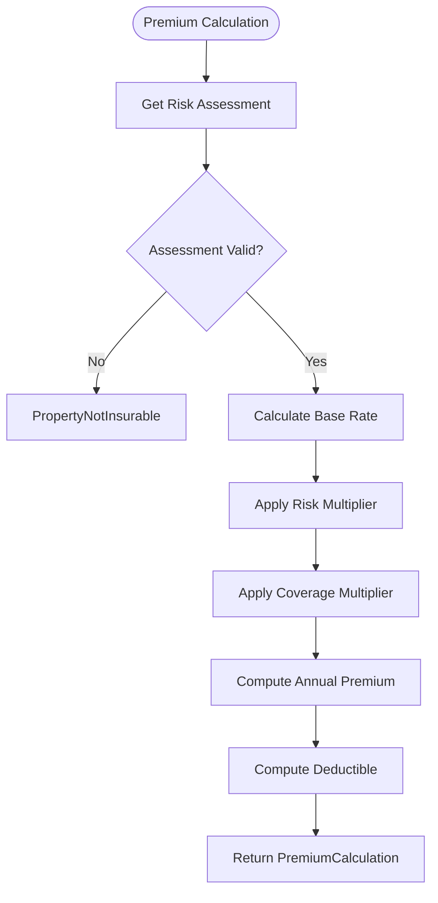
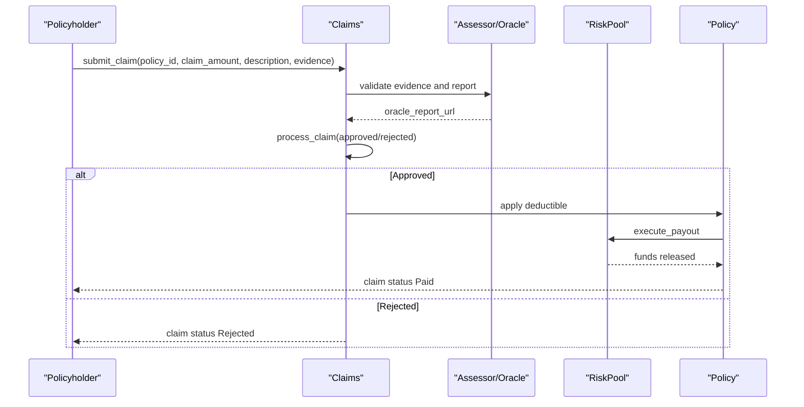
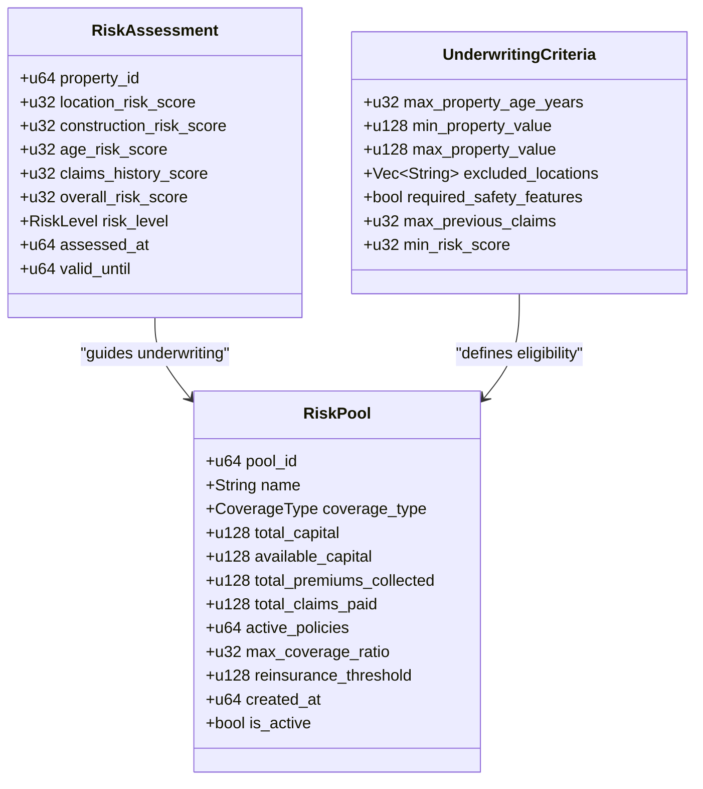
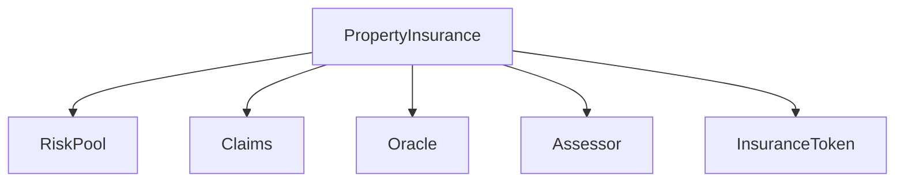

# Policy Contract

<cite>
**Referenced Files in This Document**
- [lib.rs](file://stellar-insured-contracts/contracts/insurance/src/lib.rs)
- [README.md](file://README.md)
- [insurance-integration.md](file://stellar-insured-contracts/docs/tutorials/insurance-integration.md)
- [contracts.md](file://stellar-insured-contracts/docs/contracts.md)
</cite>

## Table of Contents
1. [Introduction](#introduction)
2. [Project Structure](#project-structure)
3. [Core Components](#core-components)
4. [Architecture Overview](#architecture-overview)
5. [Detailed Component Analysis](#detailed-component-analysis)
6. [Dependency Analysis](#dependency-analysis)
7. [Performance Considerations](#performance-considerations)
8. [Troubleshooting Guide](#troubleshooting-guide)
9. [Conclusion](#conclusion)

## Introduction
This document provides comprehensive documentation for the Policy contract that manages insurance policy lifecycle and administration. The contract supports policy creation, premium calculation, coverage terms management, and policy state transitions. It integrates with Risk Pool for coverage funding and with Claims for claim processing. The documentation covers authorization requirements, role-based access control, policy metadata storage, policy ID generation, and policy search/filter capabilities.

## Project Structure
The Policy contract resides within the insurance module of the PropChain ecosystem. The contract is implemented as a Rust ink! smart contract and exposes a set of public messages for policy lifecycle management.

**Diagram sources**
- [lib.rs:1326-1351](file://stellar-insured-contracts/contracts/insurance/src/lib.rs#L1326-L1351)

**Section sources**
- [README.md:11-27](file://README.md#L11-L27)

## Core Components
The Policy contract is centered around the `PropertyInsurance` struct, which manages policies, claims, risk pools, and related administrative functions. Key components include:

- Storage mappings for policies, claims, risk pools, and liquidity providers
- Policy lifecycle management functions (create, cancel)
- Premium calculation engine
- Claims processing pipeline
- Risk assessment and underwriting criteria
- Role-based access control (admin, oracles, assessors)
- Secondary market tokenization for policies

**Section sources**
- [lib.rs:326-395](file://stellar-insured-contracts/contracts/insurance/src/lib.rs#L326-L395)
- [lib.rs:559-597](file://stellar-insured-contracts/contracts/insurance/src/lib.rs#L559-L597)

## Architecture Overview
The Policy contract orchestrates policy creation and management while interacting with external systems for risk assessment, funding, and claims processing.

**Diagram sources**
- [lib.rs:794-900](file://stellar-insured-contracts/contracts/insurance/src/lib.rs#L794-L900)
- [lib.rs:944-1111](file://stellar-insured-contracts/contracts/insurance/src/lib.rs#L944-L1111)
- [lib.rs:1679-1740](file://stellar-insured-contracts/contracts/insurance/src/lib.rs#L1679-L1740)

## Detailed Component Analysis

### Policy Lifecycle Management
The Policy contract provides functions to manage the complete lifecycle of an insurance policy:

- `create_policy`: Creates a new policy with specified coverage terms and premium payment
- `cancel_policy`: Cancels an active policy (policyholder or admin)
- `get_policy`: Retrieves policy details by policy ID
- `get_policyholder_policies`: Lists all policies for a given policyholder
- `get_property_policies`: Lists all policies for a given property

**Diagram sources**
- [lib.rs:69-76](file://stellar-insured-contracts/contracts/insurance/src/lib.rs#L69-L76)
- [lib.rs:902-937](file://stellar-insured-contracts/contracts/insurance/src/lib.rs#L902-L937)

**Section sources**
- [lib.rs:794-900](file://stellar-insured-contracts/contracts/insurance/src/lib.rs#L794-L900)
- [lib.rs:902-937](file://stellar-insured-contracts/contracts/insurance/src/lib.rs#L902-L937)
- [lib.rs:1491-1525](file://stellar-insured-contracts/contracts/insurance/src/lib.rs#L1491-L1525)

### Premium Calculation Engine
Premium calculation considers risk assessment, coverage type, and coverage amount to determine the annual premium and deductible.

**Diagram sources**
- [lib.rs:742-786](file://stellar-insured-contracts/contracts/insurance/src/lib.rs#L742-L786)

**Section sources**
- [lib.rs:742-786](file://stellar-insured-contracts/contracts/insurance/src/lib.rs#L742-L786)

### Claims Processing Pipeline
Claims processing involves submission, review, approval/rejection, and payout execution with integration to risk pools and optional reinsurance.

**Diagram sources**
- [lib.rs:944-1111](file://stellar-insured-contracts/contracts/insurance/src/lib.rs#L944-L1111)
- [lib.rs:1679-1740](file://stellar-insured-contracts/contracts/insurance/src/lib.rs#L1679-L1740)

**Section sources**
- [lib.rs:944-1111](file://stellar-insured-contracts/contracts/insurance/src/lib.rs#L944-L1111)
- [lib.rs:1679-1740](file://stellar-insured-contracts/contracts/insurance/src/lib.rs#L1679-L1740)

### Risk Assessment and Underwriting
Risk assessment determines the overall risk score and level, which influences premium calculations. Underwriting criteria define eligibility requirements for policies within specific risk pools.

**Diagram sources**
- [lib.rs:222-232](file://stellar-insured-contracts/contracts/insurance/src/lib.rs#L222-L232)
- [lib.rs:298-306](file://stellar-insured-contracts/contracts/insurance/src/lib.rs#L298-L306)
- [lib.rs:203-216](file://stellar-insured-contracts/contracts/insurance/src/lib.rs#L203-L216)

**Section sources**
- [lib.rs:692-739](file://stellar-insured-contracts/contracts/insurance/src/lib.rs#L692-L739)
- [lib.rs:1291-1320](file://stellar-insured-contracts/contracts/insurance/src/lib.rs#L1291-L1320)

### Role-Based Access Control
The contract implements role-based access control for sensitive operations:

- Admin: Can create risk pools, authorize oracles/assessors, set platform fees, configure dispute windows, and manage reinsurance agreements
- Oracles: Can update risk assessments and actuarial models
- Assessors: Can process claims and approve/reject them
- Policyholders: Can create policies and cancel active policies

**Section sources**
- [lib.rs:1326-1351](file://stellar-insured-contracts/contracts/insurance/src/lib.rs#L1326-L1351)
- [lib.rs:1035-1111](file://stellar-insured-contracts/contracts/insurance/src/lib.rs#L1035-L1111)

### Policy Metadata and ID Generation
- Policy metadata is stored via IPFS URIs and associated with each policy
- Policy IDs are auto-generated sequential numbers
- Secondary market tokenization enables policy transfer and trading

**Section sources**
- [lib.rs:158-175](file://stellar-insured-contracts/contracts/insurance/src/lib.rs#L158-L175)
- [lib.rs:854-873](file://stellar-insured-contracts/contracts/insurance/src/lib.rs#L854-L873)
- [lib.rs:1648-1677](file://stellar-insured-contracts/contracts/insurance/src/lib.rs#L1648-L1677)

## Dependency Analysis
The Policy contract depends on and interacts with several external components:

**Diagram sources**
- [lib.rs:341-366](file://stellar-insured-contracts/contracts/insurance/src/lib.rs#L341-L366)
- [lib.rs:1648-1677](file://stellar-insured-contracts/contracts/insurance/src/lib.rs#L1648-L1677)

**Section sources**
- [lib.rs:326-395](file://stellar-insured-contracts/contracts/insurance/src/lib.rs#L326-L395)

## Performance Considerations
- Premium calculation uses integer arithmetic to avoid precision loss
- Risk scoring employs precomputed multipliers for efficient computation
- Claims processing includes cooldown periods to prevent spam
- Reinsurance integration reduces single-point-of-failure risks
- Event emission is used for efficient off-chain indexing

## Troubleshooting Guide
Common issues and their resolutions:

- `PolicyNotFound`: Ensure the policy ID exists and is accessible
- `InsufficientPremium`: Verify the transferred amount meets the calculated premium
- `Unauthorized`: Check caller roles (admin, policyholder, authorized oracle/assessor)
- `PropertyNotInsurable`: Confirm risk assessment exists and is valid
- `ClaimExceedsCoverage`: Ensure claim amount does not exceed remaining coverage
- `CooldownPeriodActive`: Wait for the configured cooldown period to expire

**Section sources**
- [lib.rs:23-54](file://stellar-insured-contracts/contracts/insurance/src/lib.rs#L23-L54)
- [lib.rs:836-841](file://stellar-insured-contracts/contracts/insurance/src/lib.rs#L836-L841)

## Conclusion
The Policy contract provides a robust foundation for insurance policy management on the Stellar blockchain. Its modular design, comprehensive access control, and integration with risk pools and claims processing enable secure and efficient insurance operations. The contract's emphasis on risk assessment, transparent premium calculation, and secondary market tokenization supports both traditional insurance and innovative DeFi applications.