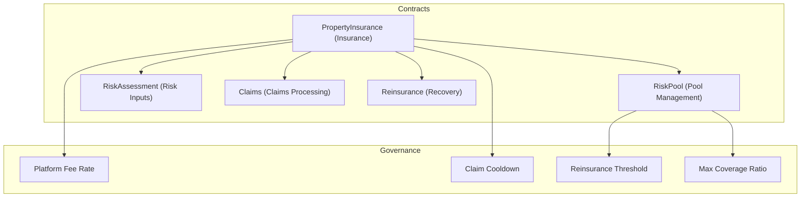
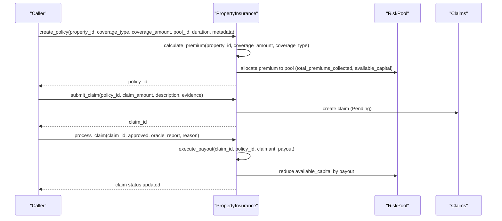
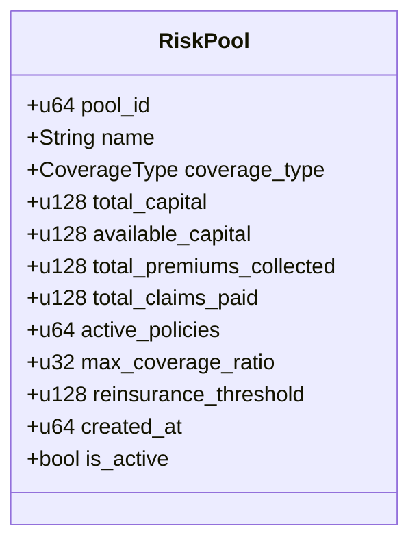
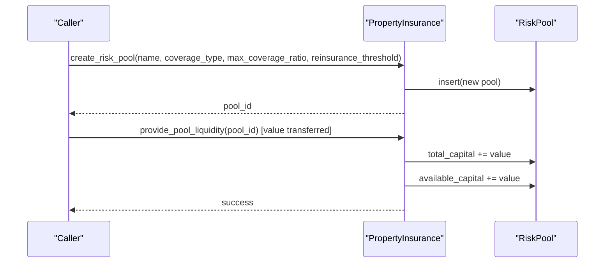
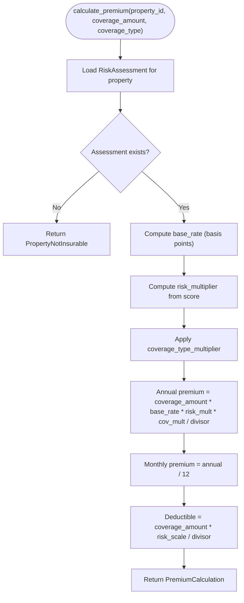
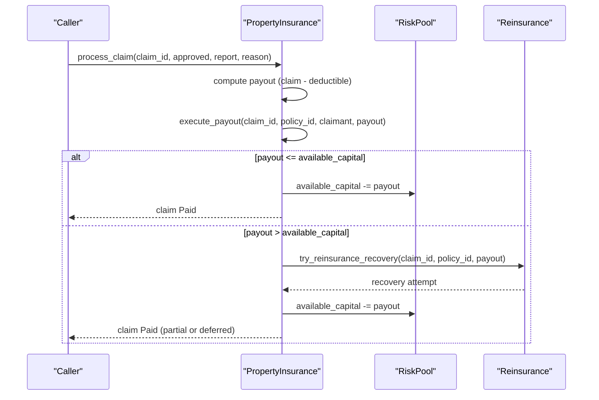
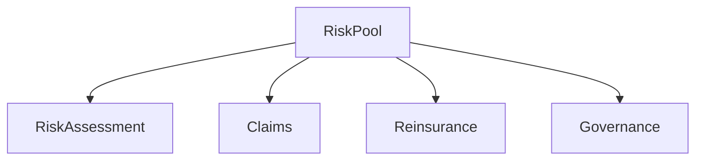

# Risk Pool Contract

<cite>
**Referenced Files in This Document**
- [lib.rs](file://stellar-insured-contracts/contracts/insurance/src/lib.rs)
- [README.md](file://README.md)
- [contracts.md](file://stellar-insured-contracts/docs/contracts.md)
</cite>

## Table of Contents
1. [Introduction](#introduction)
2. [Project Structure](#project-structure)
3. [Core Components](#core-components)
4. [Architecture Overview](#architecture-overview)
5. [Detailed Component Analysis](#detailed-component-analysis)
6. [Dependency Analysis](#dependency-analysis)
7. [Performance Considerations](#performance-considerations)
8. [Troubleshooting Guide](#troubleshooting-guide)
9. [Conclusion](#conclusion)

## Introduction
This document provides comprehensive documentation for the Risk Pool contract within the Stellar Insured ecosystem. The Risk Pool serves as the centralized insurance fund that manages liquidity, risk exposure, and claims settlement capacity for specific coverage types. It enables:
- Membership-based liquidity provisioning with share tracking
- Risk exposure calculations against pool capital
- Premium collection and claims payout coordination
- Reinsurance integration for large claims
- Governance-managed parameters such as coverage ratios and thresholds

The Risk Pool is implemented as part of the PropertyInsurance contract, which orchestrates policy issuance, claims processing, and risk assessment workflows.

## Project Structure
The Risk Pool functionality resides in the PropertyInsurance contract module. The relevant components include:
- RiskPool data structure and storage
- Pool management functions (create, liquidity provisioning)
- Risk assessment integration for premium calculation
- Claims settlement logic with reinsurance fallback
- Governance parameters controlling pool behavior

**Diagram sources**
- [lib.rs:203-216](file://stellar-insured-contracts/contracts/insurance/src/lib.rs#L203-L216)
- [lib.rs:326-395](file://stellar-insured-contracts/contracts/insurance/src/lib.rs#L326-L395)

**Section sources**
- [lib.rs:203-216](file://stellar-insured-contracts/contracts/insurance/src/lib.rs#L203-L216)
- [lib.rs:326-395](file://stellar-insured-contracts/contracts/insurance/src/lib.rs#L326-L395)

## Core Components
This section outlines the primary data structures and functions that define the Risk Pool contract.

- RiskPool struct fields:
  - pool_id: Unique identifier for the pool
  - name: Human-readable pool name
  - coverage_type: Target coverage category (e.g., Fire, Flood)
  - total_capital: Total liquidity contributed to the pool
  - available_capital: Liquid funds ready for claims payouts
  - total_premiums_collected: Premium income allocated to the pool
  - total_claims_paid: Aggregate claims payouts from the pool
  - active_policies: Count of active policies backed by the pool
  - max_coverage_ratio: Maximum allowed exposure as a percentage of pool capital (basis points)
  - reinsurance_threshold: Claim size threshold that triggers reinsurance
  - created_at: Pool creation timestamp
  - is_active: Operational status flag

- Pool management functions:
  - create_risk_pool(name, coverage_type, max_coverage_ratio, reinsurance_threshold): Creates a new pool with initial parameters
  - provide_pool_liquidity(pool_id): Accepts deposits and updates provider shares
  - get_pool(pool_id): Retrieves pool details

- Risk and premium integration:
  - calculate_premium(property_id, coverage_amount, coverage_type): Computes annual and monthly premiums based on risk assessment
  - risk_score_to_multiplier(score): Converts risk scores to multipliers
  - coverage_type_multiplier(type): Applies coverage-type-specific factors

- Claims settlement and reinsurance:
  - execute_payout(claim_id, policy_id, recipient, amount): Processes approved claims and deducts from available capital
  - try_reinsurance_recovery(claim_id, policy_id, amount): Attempts reinsurance recovery for claims exceeding threshold

- Governance parameters:
  - set_platform_fee_rate(rate): Sets platform fee percentage (basis points)
  - set_claim_cooldown(period_seconds): Configures minimum time between claims per property
  - set_dispute_window(window_seconds): Defines dispute resolution window
  - set_arbiter(arbiter): Assigns a designated arbiter for disputes

**Section sources**
- [lib.rs:203-216](file://stellar-insured-contracts/contracts/insurance/src/lib.rs#L203-L216)
- [lib.rs:603-634](file://stellar-insured-contracts/contracts/insurance/src/lib.rs#L603-L634)
- [lib.rs:636-700](file://stellar-insured-contracts/contracts/insurance/src/lib.rs#L636-L700)
- [lib.rs:755-800](file://stellar-insured-contracts/contracts/insurance/src/lib.rs#L755-L800)
- [lib.rs:1732-1754](file://stellar-insured-contracts/contracts/insurance/src/lib.rs#L1732-L1754)
- [lib.rs:1787-1848](file://stellar-insured-contracts/contracts/insurance/src/lib.rs#L1787-L1848)
- [lib.rs:1850-1886](file://stellar-insured-contracts/contracts/insurance/src/lib.rs#L1850-L1886)
- [lib.rs:1393-1410](file://stellar-insured-contracts/contracts/insurance/src/lib.rs#L1393-L1410)
- [lib.rs:1416-1430](file://stellar-insured-contracts/contracts/insurance/src/lib.rs#L1416-L1430)

## Architecture Overview
The Risk Pool integrates with the broader insurance ecosystem as follows:
- Policy issuance allocates premiums to the pool and increases active policy counts
- Risk assessments inform premium calculations and coverage eligibility
- Claims processing draws from pool capital; large claims trigger reinsurance
- Governance controls operational parameters that influence pool stability and risk tolerance

**Diagram sources**
- [lib.rs:806-929](file://stellar-insured-contracts/contracts/insurance/src/lib.rs#L806-L929)
- [lib.rs:972-1079](file://stellar-insured-contracts/contracts/insurance/src/lib.rs#L972-L1079)
- [lib.rs:1081-1162](file://stellar-insured-contracts/contracts/insurance/src/lib.rs#L1081-L1162)
- [lib.rs:1787-1848](file://stellar-insured-contracts/contracts/insurance/src/lib.rs#L1787-L1848)

## Detailed Component Analysis

### RiskPool Data Model
The RiskPool struct encapsulates the financial and operational state of a risk pool. It tracks liquidity, exposure, and governance parameters that govern pool behavior.

**Diagram sources**
- [lib.rs:203-216](file://stellar-insured-contracts/contracts/insurance/src/lib.rs#L203-L216)

**Section sources**
- [lib.rs:203-216](file://stellar-insured-contracts/contracts/insurance/src/lib.rs#L203-L216)

### Pool Management Functions
- create_risk_pool: Initializes a new pool with provided parameters and increments pool identifiers.
- provide_pool_liquidity: Accepts XLM deposits, updates pool capital, and maintains provider share records.
- get_pool: Returns the current state of a pool for querying and monitoring.

**Diagram sources**
- [lib.rs:603-634](file://stellar-insured-contracts/contracts/insurance/src/lib.rs#L603-L634)
- [lib.rs:636-700](file://stellar-insured-contracts/contracts/insurance/src/lib.rs#L636-L700)

**Section sources**
- [lib.rs:603-634](file://stellar-insured-contracts/contracts/insurance/src/lib.rs#L603-L634)
- [lib.rs:636-700](file://stellar-insured-contracts/contracts/insurance/src/lib.rs#L636-L700)

### Premium Calculation and Risk Assessment
Premiums are calculated using risk assessment inputs and coverage characteristics. The calculation considers:
- Base rate (basis points)
- Risk multiplier derived from overall risk score
- Coverage-type multiplier
- Deductible computation scaled by risk

**Diagram sources**
- [lib.rs:755-800](file://stellar-insured-contracts/contracts/insurance/src/lib.rs#L755-L800)
- [lib.rs:1732-1754](file://stellar-insured-contracts/contracts/insurance/src/lib.rs#L1732-L1754)

**Section sources**
- [lib.rs:755-800](file://stellar-insured-contracts/contracts/insurance/src/lib.rs#L755-L800)
- [lib.rs:1732-1754](file://stellar-insured-contracts/contracts/insurance/src/lib.rs#L1732-L1754)

### Claims Settlement and Reinsurance
Approved claims are processed by:
- Applying policy deductibles
- Checking available pool capital
- Executing payouts and updating pool state
- Triggering reinsurance for claims exceeding the threshold

**Diagram sources**
- [lib.rs:1081-1162](file://stellar-insured-contracts/contracts/insurance/src/lib.rs#L1081-L1162)
- [lib.rs:1787-1848](file://stellar-insured-contracts/contracts/insurance/src/lib.rs#L1787-L1848)
- [lib.rs:1850-1886](file://stellar-insured-contracts/contracts/insurance/src/lib.rs#L1850-L1886)

**Section sources**
- [lib.rs:1787-1848](file://stellar-insured-contracts/contracts/insurance/src/lib.rs#L1787-L1848)
- [lib.rs:1850-1886](file://stellar-insured-contracts/contracts/insurance/src/lib.rs#L1850-L1886)

### Governance Parameters and Risk Tolerance
Governance controls key risk parameters:
- Platform fee rate: Percentage of premiums retained by the platform
- Claim cooldown: Minimum interval between claims per property
- Dispute window: Timeframe for raising and resolving disputes
- Arbiter designation: Authorized party for dispute resolution
- Reinsurance threshold: Claim size requiring reinsurance
- Max coverage ratio: Maximum exposure allowed relative to pool capital

These parameters are managed via administrative functions and influence pool stability and risk tolerance.

**Section sources**
- [lib.rs:1393-1410](file://stellar-insured-contracts/contracts/insurance/src/lib.rs#L1393-L1410)
- [lib.rs:1416-1430](file://stellar-insured-contracts/contracts/insurance/src/lib.rs#L1416-L1430)
- [lib.rs:203-216](file://stellar-insured-contracts/contracts/insurance/src/lib.rs#L203-L216)

## Dependency Analysis
The Risk Pool interacts with several core modules:
- RiskAssessment: Provides risk scores used in premium calculations
- Claims: Drives fund withdrawals upon approved claims
- Reinsurance: Offers recovery mechanisms for large claims
- Governance: Controls operational parameters impacting pool behavior

**Diagram sources**
- [lib.rs:203-216](file://stellar-insured-contracts/contracts/insurance/src/lib.rs#L203-L216)
- [lib.rs:706-753](file://stellar-insured-contracts/contracts/insurance/src/lib.rs#L706-L753)
- [lib.rs:972-1079](file://stellar-insured-contracts/contracts/insurance/src/lib.rs#L972-L1079)
- [lib.rs:1168-1202](file://stellar-insured-contracts/contracts/insurance/src/lib.rs#L1168-L1202)

**Section sources**
- [lib.rs:706-753](file://stellar-insured-contracts/contracts/insurance/src/lib.rs#L706-L753)
- [lib.rs:972-1079](file://stellar-insured-contracts/contracts/insurance/src/lib.rs#L972-L1079)
- [lib.rs:1168-1202](file://stellar-insured-contracts/contracts/insurance/src/lib.rs#L1168-L1202)

## Performance Considerations
- Prefer batch operations where feasible to minimize storage writes
- Use efficient data structures (Mappings) for frequent queries
- Monitor pool capital utilization and adjust max_coverage_ratio to maintain solvency
- Ensure adequate liquidity provisioning to meet expected claims distributions
- Regularly review reinsurance thresholds to optimize risk transfer effectiveness

## Troubleshooting Guide
Common issues and resolutions:
- InsufficientPoolFunds: Occurs when available capital is less than requested payout. Increase liquidity or reduce claim sizes.
- PoolNotFound: Attempted operation on a deactivated or non-existent pool. Verify pool_id and is_active status.
- PropertyNotInsurable: Risk assessment missing or expired. Recreate or refresh assessment.
- PremiumTooLow: Calculated premium below minimum threshold. Adjust coverage or risk profile.
- Unauthorized: Non-admin attempted governance function. Ensure caller authorization.
- ContractPaused: Administrative pause prevents state changes. Resume operations after maintenance.

**Section sources**
- [lib.rs:835-843](file://stellar-insured-contracts/contracts/insurance/src/lib.rs#L835-L843)
- [lib.rs:1432-1460](file://stellar-insured-contracts/contracts/insurance/src/lib.rs#L1432-L1460)

## Conclusion
The Risk Pool contract provides a robust foundation for managing centralized insurance liquidity, integrating risk assessment, premium calculation, and claims settlement. Its governance parameters enable dynamic risk tolerance adjustments, while reinsurance mechanisms protect against large exposures. Proper configuration and ongoing monitoring are essential to maintain pool health and ensure timely claims payouts.