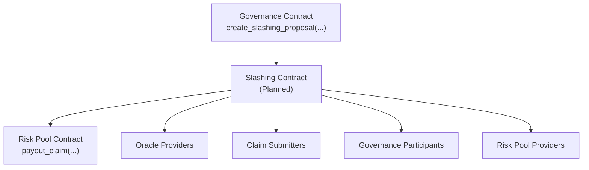
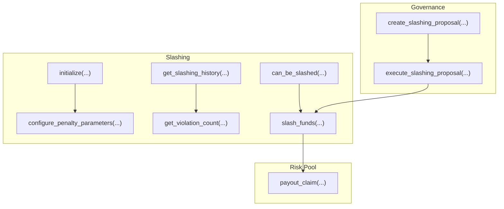
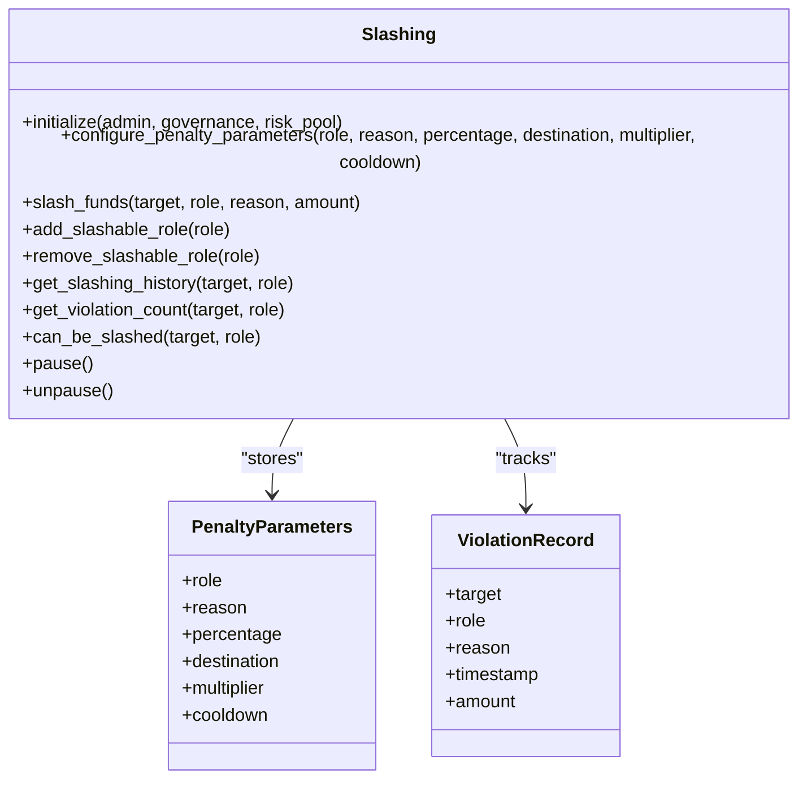
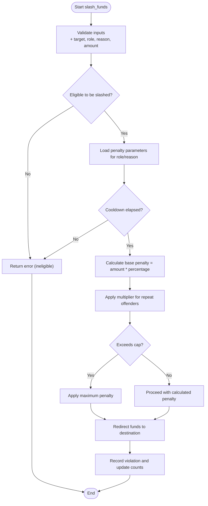
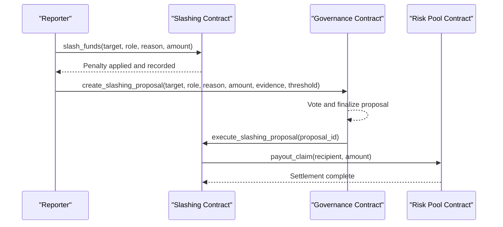
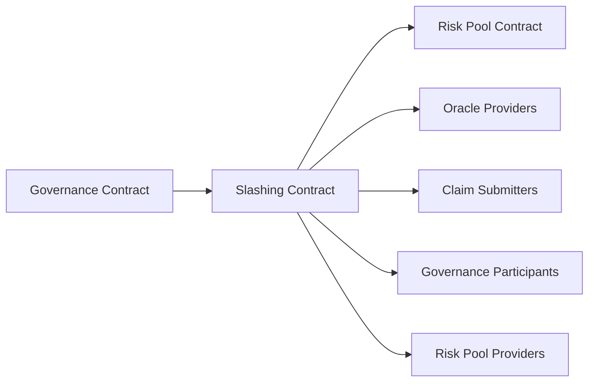

# Slashing Contract

<cite>
**Referenced Files in This Document**
- [README.md](file://README.md)
- [lib.rs](file://stellar-insured-contracts/contracts/lib/src/lib.rs)
</cite>

## Table of Contents
1. [Introduction](#introduction)
2. [Project Structure](#project-structure)
3. [Core Components](#core-components)
4. [Architecture Overview](#architecture-overview)
5. [Detailed Component Analysis](#detailed-component-analysis)
6. [Dependency Analysis](#dependency-analysis)
7. [Performance Considerations](#performance-considerations)
8. [Troubleshooting Guide](#troubleshooting-guide)
9. [Conclusion](#conclusion)

## Introduction
This document describes the Slashing contract as designed for the Stellar Insured ecosystem. The Slashing contract implements a professional on-chain penalty mechanism to maintain system integrity by deterring malicious or negligent behavior across slashable roles. It integrates with Governance and Risk Pool contracts to enforce due process, configure penalties, and manage fund redirection.

The Slashing contract supports:
- Slashable roles: Oracle providers, claim submitters, governance participants, risk pool providers
- Configurable penalties controlled by the DAO
- Fund redirection to Risk Pool, treasury, or compensation fund
- Repeat offender system with progressive penalties
- Cooldown periods to prevent excessive slashing
- Due process via appeals and governance proposals

## Project Structure
The repository organizes contracts under a unified structure. The Slashing contract is documented as part of the contracts suite alongside Policy, Claims, Risk Pool, and Governance. While the Slashing contract implementation is not present in the current codebase snapshot, the Governance contract includes a dedicated function for creating slashing proposals, indicating integration points.

**Diagram sources**
- [README.md:68-85](file://README.md#L68-L85)
- [README.md:86-106](file://README.md#L86-L106)

**Section sources**
- [README.md:11-141](file://README.md#L11-L141)

## Core Components
The Slashing contract is designed around a structured approach to violation detection, penalty calculation, and punishment execution, coordinated with Governance and Risk Pool.

- Violation detection and reporting: Integrate with other contracts to detect and report violations (e.g., fraudulent claims, policy manipulation, governance abuse).
- Penalty configuration: DAO-controlled penalty parameters define percentages, destinations, multipliers, and cooldowns per role and reason.
- Penalty execution: slash_funds validates eligibility and applies penalties, redirecting funds to the Risk Pool or designated destinations.
- Due process: Appeals and governance proposals provide fair review and execution channels.
- Repeat offender system: Progressive penalties increase with violation frequency and recency.
- Cooldown periods: Time-based protections prevent repeated slashing for the same incident.

Key functions (as documented):
- initialize(admin, governance_contract, risk_pool_contract)
- configure_penalty_parameters(role, reason, percentage, destination, multiplier, cooldown)
- slash_funds(target, role, reason, amount)
- add_slashable_role(role) / remove_slashable_role(role)
- get_slashing_history(target, role)
- get_violation_count(target, role)
- can_be_slashed(target, role)
- pause() / unpause()

**Section sources**
- [README.md:68-85](file://README.md#L68-L85)

## Architecture Overview
The Slashing contract architecture centers on three pillars: Governance, Risk Pool, and the Slashing contract itself. Governance defines penalties and executes slashing actions via proposals. Risk Pool manages fund redirection and settlement. The Slashing contract enforces penalties and tracks violation history.

**Diagram sources**
- [README.md:68-85](file://README.md#L68-L85)
- [README.md:86-106](file://README.md#L86-L106)

## Detailed Component Analysis

### Slashing Struct and Data Model
The Slashing contract maintains:
- Penalty parameters per role and reason (percentage, destination, multiplier, cooldown)
- Violation tracking (history, counts, recency)
- Eligibility checks (cooldown enforcement, role membership)
- Governance integration (proposal-based execution)

[No sources needed since this diagram shows conceptual model, not actual code structure]

### Violation Types and Severity Tiers
- Fraudulent claims: Misrepresentation of facts or forged evidence
- Policy manipulation: Attempted exploitation of policy terms or pricing
- Governance abuse: Vote buying, bribery, or malicious proposals
- Risk pool provider misconduct: Misbehavior affecting liquidity or solvency

Severity tiers:
- Low: First-time, minor infractions; lower penalty percentage
- Medium: Recidivism within a short timeframe; moderate penalty
- High: Pattern of misconduct; higher penalty percentage and multiplier
- Extreme: Malicious intent or systemic abuse; severe penalty and extended cooldown

[No sources needed since this section provides conceptual categorization]

### Penalty Calculation Algorithm
The penalty calculation combines configured parameters with repeat offense adjustments and cooldown enforcement.

[No sources needed since this diagram shows conceptual algorithm, not actual code structure]

### Appeals and Due Process
- Appeals: Affected parties can submit appeals for penalties; governance resolves them.
- Governance proposals: Create and execute slashing actions with quorum and thresholds.
- Stakeholder participation: Verifiers, DAO members, and Risk Pool participants influence outcomes.

**Diagram sources**
- [README.md:68-85](file://README.md#L68-L85)
- [README.md:86-106](file://README.md#L86-L106)

### Example Scenarios
- Scenario A: Fraudulent claims
  - Detection: Claims contract flags suspicious activity
  - Reporting: Governance creates a slashing proposal with evidence
  - Execution: Slashing contract applies penalty and redirects funds to Risk Pool
- Scenario B: Governance abuse
  - Detection: Governance detects vote manipulation
  - Proposal: DAO creates and executes a slashing proposal
  - Outcome: Penalty reduces stake and increases cooldown
- Scenario C: Risk pool provider misconduct
  - Detection: Risk Pool monitors provider behavior
  - Action: Slashing contract enforces penalty and updates eligibility

[No sources needed since this section provides conceptual scenarios]

### Safeguards Against Malicious Slashing
- DAO oversight: Proposals require quorum and thresholds
- Evidence requirements: Slashing proposals demand verifiable evidence
- Cooldown enforcement: Prevents repetitive penalties for the same incident
- Appeal mechanism: Provides due process for affected parties
- Role-based permissions: Only authorized reporters trigger penalties

[No sources needed since this section provides general safeguards]

## Dependency Analysis
The Slashing contract depends on Governance and Risk Pool for execution and fund management. Governance defines penalties and executes actions; Risk Pool receives redirected funds.

**Diagram sources**
- [README.md:68-85](file://README.md#L68-L85)
- [README.md:86-106](file://README.md#L86-L106)

**Section sources**
- [README.md:68-85](file://README.md#L68-L85)
- [README.md:86-106](file://README.md#L86-L106)

## Performance Considerations
- Batch operations: Group similar slashing actions to reduce overhead
- Gas optimization: Minimize storage writes by consolidating violation records
- Event logging: Emit structured events for off-chain indexing and monitoring
- Early exits: Validate eligibility and cooldowns before heavy computation

[No sources needed since this section provides general guidance]

## Troubleshooting Guide
Common issues and resolutions:
- Unauthorized slashing: Ensure only authorized reporters trigger penalties
- Excessive penalties: Verify maximum caps and multipliers are enforced
- Duplicate penalties: Confirm cooldown periods prevent repeated actions
- Appeal errors: Validate appeal status and required evidence
- Governance failures: Check proposal quorum and thresholds

[No sources needed since this section provides general troubleshooting]

## Conclusion
The Slashing contract is a critical component for maintaining integrity across the Stellar Insured ecosystem. By integrating with Governance and Risk Pool, it ensures fair, transparent, and configurable penalties while protecting against malicious or negligent behavior. As implemented, it establishes a robust framework for due process, repeat offender management, and fund redirection to support system stability.