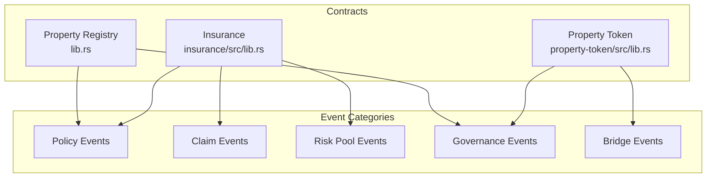
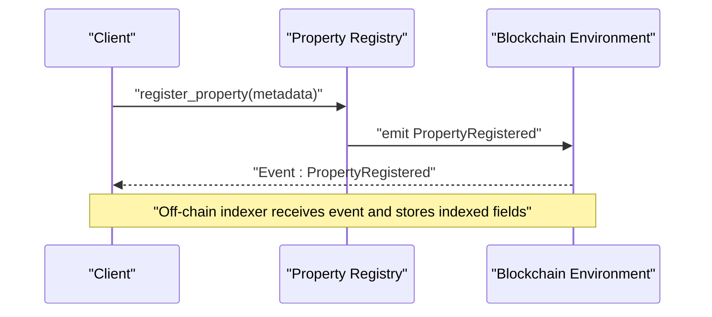
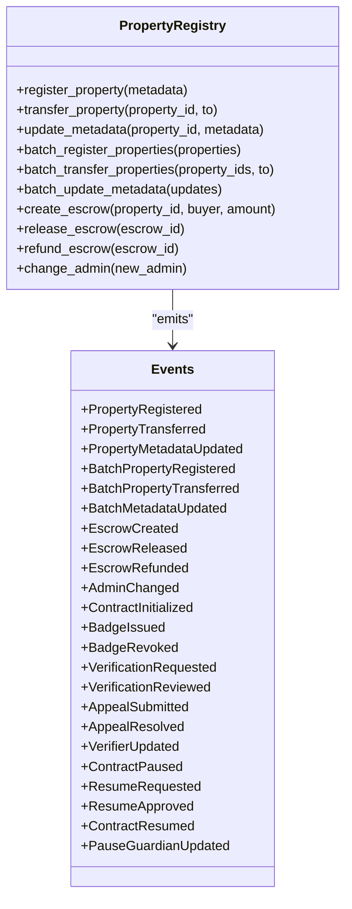
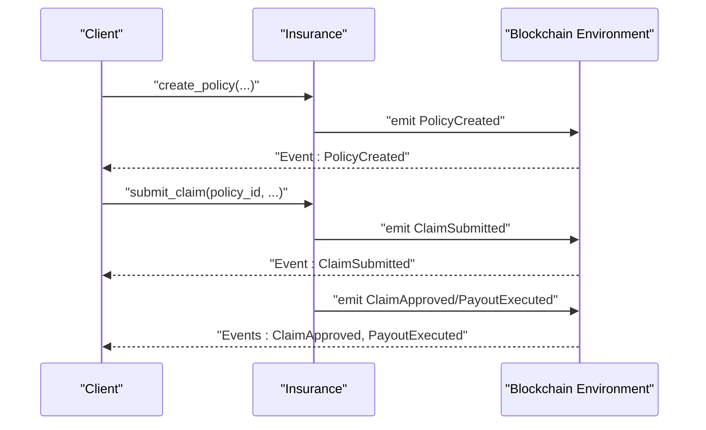
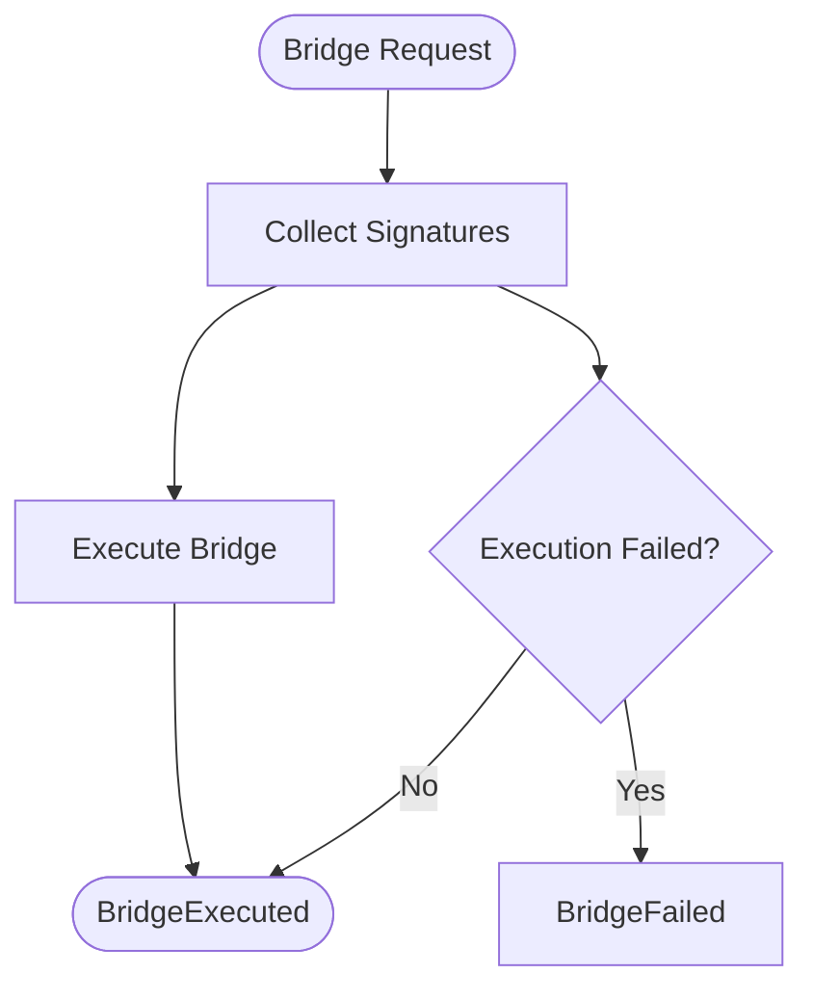
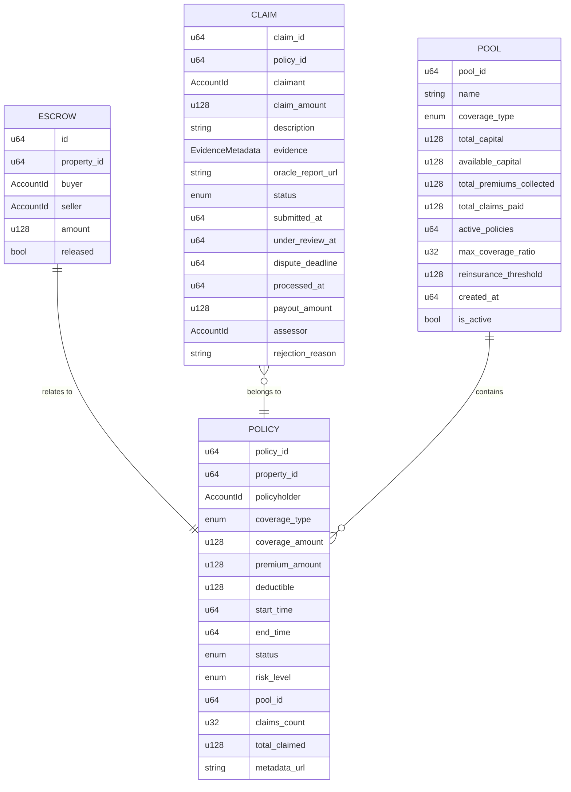
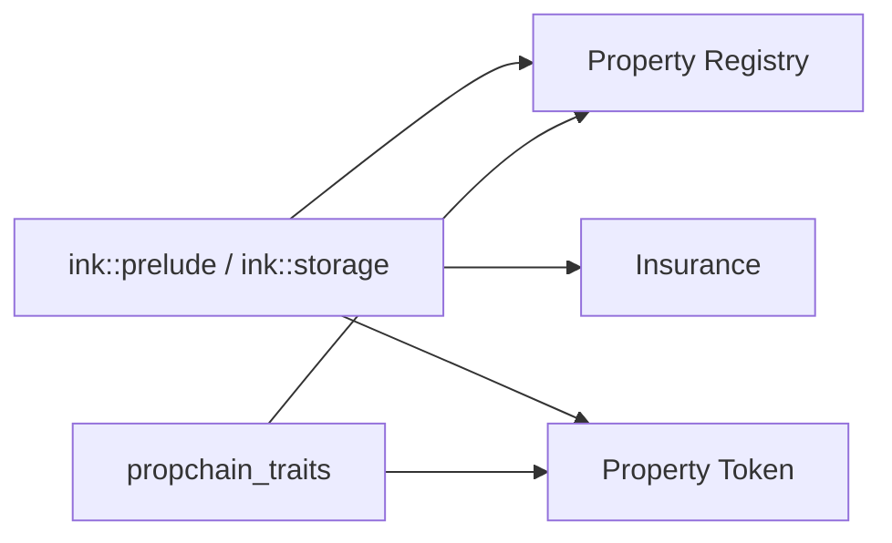

# Event System & Data Structures

<cite>
**Referenced Files in This Document**
- [EVENT_IMPLEMENTATION_SUMMARY.md](file://stellar-insured-contracts/docs/EVENT_IMPLEMENTATION_SUMMARY.md)
- [Cargo.toml](file://stellar-insured-contracts/Cargo.toml)
- [lib.rs](file://stellar-insured-contracts/contracts/lib/src/lib.rs)
- [insurance_lib.rs](file://stellar-insured-contracts/contracts/insurance/src/lib.rs)
- [property_token_lib.rs](file://stellar-insured-contracts/contracts/property-token/src/lib.rs)
</cite>

## Table of Contents
1. [Introduction](#introduction)
2. [Project Structure](#project-structure)
3. [Core Components](#core-components)
4. [Architecture Overview](#architecture-overview)
5. [Detailed Component Analysis](#detailed-component-analysis)
6. [Dependency Analysis](#dependency-analysis)
7. [Performance Considerations](#performance-considerations)
8. [Troubleshooting Guide](#troubleshooting-guide)
9. [Conclusion](#conclusion)

## Introduction
This document provides a comprehensive overview of the event emission system and data structures across the PropChain ecosystem. It focuses on:
- Event-driven architecture and how events enable real-time monitoring and off-chain processing
- Event schemas, parameter structures, and data types for policy, claim, risk pool, and governance events
- Data structures used throughout the system including policy information, claim states, provider stakes, and proposal data
- Event filtering, subscription patterns, and integration with external systems
- Event indexing strategies and performance considerations for event-heavy applications

## Project Structure
The event system spans multiple contracts:
- Property Registry (core property lifecycle events)
- Insurance (policy, claim, risk pool, governance events)
- Property Token (cross-chain bridge, fractional ownership, governance events)

**Diagram sources**
- [lib.rs](file://stellar-insured-contracts/contracts/lib/src/lib.rs)
- [insurance_lib.rs](file://stellar-insured-contracts/contracts/insurance/src/lib.rs)
- [property_token_lib.rs](file://stellar-insured-contracts/contracts/property-token/src/lib.rs)

**Section sources**
- [Cargo.toml:1-45](file://stellar-insured-contracts/Cargo.toml#L1-L45)

## Core Components
This section outlines the event-driven architecture and standardized event format used across contracts.

- Standardized Event Format
  - Indexed fields (topics) for efficient querying
  - Event versioning for compatibility
  - Timestamps and block numbers for historical tracking
  - Transaction hashes for transaction-level correlation

- Event Filtering and Subscription Patterns
  - Filter by property ID, account addresses, event type, time ranges, and block numbers
  - WebSocket-compatible streaming for real-time notifications

- Off-Chain Indexing Compatibility
  - Events structured for database indexing
  - Indexed fields optimized for queries
  - Historical event queries via timestamps, blocks, and transaction hashes

**Section sources**
- [EVENT_IMPLEMENTATION_SUMMARY.md:43-143](file://stellar-insured-contracts/docs/EVENT_IMPLEMENTATION_SUMMARY.md#L43-L143)

## Architecture Overview
The event-driven architecture enables:
- Real-time notifications for property registration, transfers, metadata updates, approvals, and escrow operations
- Governance visibility for admin changes, pause/resume actions, and verifier updates
- Insurance lifecycle tracking for policy creation, claims, payouts, and risk pool capitalization
- Cross-chain bridging events for token minting, request creation, signatures, execution, failure, and recovery

**Diagram sources**
- [lib.rs](file://stellar-insured-contracts/contracts/lib/src/lib.rs)

## Detailed Component Analysis

### Property Registry Events
Property Registry emits comprehensive events for property lifecycle and governance actions.

- Property Registration Events
  - PropertyRegistered: property_id, owner, event_version, location, size, valuation, timestamp, block_number, transaction_hash
  - BatchPropertyRegistered: owner, event_version, property_ids, count, timestamp, block_number, transaction_hash

- Ownership Transfer Events
  - PropertyTransferred: property_id, from, to, event_version, timestamp, block_number, transaction_hash, transferred_by
  - BatchPropertyTransferred: from, to, event_version, property_ids, count, timestamp, block_number, transaction_hash, transferred_by
  - BatchPropertyTransferredToMultiple: from, event_version, transfers, count, timestamp, block_number, transaction_hash, transferred_by

- Metadata Update Events
  - PropertyMetadataUpdated: property_id, owner, event_version, old_location, new_location, old_valuation, new_valuation, timestamp, block_number, transaction_hash
  - BatchMetadataUpdated: owner, event_version, property_ids, count, timestamp, block_number, transaction_hash

- Permission Change Events
  - ApprovalGranted: property_id, owner, approved, event_version, timestamp, block_number, transaction_hash
  - ApprovalCleared: property_id, owner, event_version, timestamp, block_number, transaction_hash

- Escrow Events
  - EscrowCreated: escrow_id, property_id, buyer, seller, event_version, amount, timestamp, block_number, transaction_hash
  - EscrowReleased: escrow_id, property_id, buyer, event_version, amount, timestamp, block_number, transaction_hash, released_by
  - EscrowRefunded: escrow_id, property_id, seller, event_version, amount, timestamp, block_number, transaction_hash, refunded_by

- Governance Events
  - ContractInitialized: admin, contract_version, timestamp, block_number
  - AdminChanged: old_admin, new_admin, event_version, timestamp, block_number, transaction_hash, changed_by

- Badge and Verification Events
  - BadgeIssued: property_id, badge_type, issued_by, event_version, expires_at, metadata_url, timestamp, block_number, transaction_hash
  - BadgeRevoked: property_id, badge_type, revoked_by, event_version, reason, timestamp, block_number, transaction_hash
  - VerificationRequested: request_id, property_id, badge_type, requester, event_version, evidence_url, timestamp, block_number, transaction_hash
  - VerificationReviewed: request_id, property_id, reviewer, approved, event_version, timestamp, block_number, transaction_hash
  - AppealSubmitted: appeal_id, property_id, badge_type, appellant, event_version, reason, timestamp, block_number, transaction_hash
  - AppealResolved: appeal_id, property_id, resolved_by, approved, event_version, resolution, timestamp, block_number, transaction_hash
  - VerifierUpdated: verifier, authorized, updated_by, event_version, timestamp, block_number, transaction_hash

- Pause/Resume Governance Events
  - ContractPaused: by, reason, timestamp, auto_resume_at
  - ResumeRequested: requester, timestamp
  - ResumeApproved: approver, current_approvals, required_approvals, timestamp
  - ContractResumed: by, timestamp
  - PauseGuardianUpdated: guardian, is_guardian, updated_by

**Diagram sources**
- [lib.rs](file://stellar-insured-contracts/contracts/lib/src/lib.rs)

**Section sources**
- [lib.rs:341-750](file://stellar-insured-contracts/contracts/lib/src/lib.rs#L341-L750)

### Insurance Events
Insurance contract emits events for policy lifecycle, claims processing, payouts, risk pool capitalization, and governance actions.

- Policy Events
  - PolicyCreated: policy_id, policyholder, property_id, coverage_type, coverage_amount, premium_amount, start_time, end_time
  - PolicyCancelled: policy_id, policyholder, cancelled_at

- Claim Events
  - ClaimSubmitted: claim_id, policy_id, claimant, claim_amount, submitted_at
  - ClaimApproved: claim_id, policy_id, payout_amount, approved_by, timestamp
  - ClaimRejected: claim_id, policy_id, reason, rejected_by, timestamp
  - PayoutExecuted: claim_id, recipient, amount, timestamp

- Risk Pool Events
  - PoolCapitalized: pool_id, provider, amount, timestamp

- Governance Events
  - RiskAssessmentUpdated: property_id, overall_score, risk_level, timestamp

- Dispute Events
  - ClaimDisputed: claim_id, raised_by, dispute_deadline, timestamp
  - DisputeResolved: claim_id, resolved_by, approved, timestamp

- Reinsurance Events
  - ReinsuranceActivated: claim_id, agreement_id, recovery_amount, timestamp

- Token Events
  - InsuranceTokenMinted: token_id, policy_id, owner, face_value
  - InsuranceTokenTransferred: token_id, from, to, price

**Diagram sources**
- [insurance_lib.rs](file://stellar-insured-contracts/contracts/insurance/src/lib.rs)

**Section sources**
- [insurance_lib.rs:385-523](file://stellar-insured-contracts/contracts/insurance/src/lib.rs#L385-L523)

### Property Token Events
Property Token contract emits events for cross-chain bridging, fractional ownership, governance, and marketplace activities.

- Cross-Chain Bridge Events
  - PropertyTokenMinted: token_id, property_id, owner
  - LegalDocumentAttached: token_id, document_hash, document_type
  - ComplianceVerified: token_id, verified, verifier
  - TokenBridged: token_id, destination_chain, recipient, bridge_request_id
  - BridgeRequestCreated: request_id, token_id, source_chain, destination_chain, requester
  - BridgeRequestSigned: request_id, signer, signatures_collected, signatures_required
  - BridgeExecuted: request_id, token_id, transaction_hash
  - BridgeFailed: request_id, token_id, error
  - BridgeRecovered: request_id, recovery_action

- Fractional Ownership Events
  - SharesIssued: token_id, to, amount
  - SharesRedeemed: token_id, from, amount
  - DividendsDeposited: token_id, amount, per_share
  - DividendsWithdrawn: token_id, account, amount

- Governance Events
  - ProposalCreated: token_id, proposal_id, quorum
  - Voted: token_id, proposal_id, voter, support, weight
  - ProposalExecuted: token_id, proposal_id, passed

- Marketplace Events
  - AskPlaced: token_id, seller, price_per_share, amount
  - AskCancelled: token_id, seller
  - SharesPurchased: token_id, seller, buyer, amount, price_per_share

**Diagram sources**
- [property_token_lib.rs](file://stellar-insured-contracts/contracts/property-token/src/lib.rs)

**Section sources**
- [property_token_lib.rs:260-476](file://stellar-insured-contracts/contracts/property-token/src/lib.rs#L260-L476)

### Data Structures Overview
This section summarizes key data structures used across contracts.

- Property Registry Data Structures
  - EscrowInfo: id, property_id, buyer, seller, amount, released
  - PortfolioSummary: property_count, total_valuation, average_valuation, total_size, average_size
  - PortfolioDetails: owner, properties, total_count
  - PortfolioProperty: id, location, size, valuation, registered_at
  - FractionalInfo: total_shares, enabled, created_at
  - GlobalAnalytics: total_properties, total_valuation, average_valuation, total_size, average_size, unique_owners
  - GasMetrics: last_operation_gas, average_operation_gas, total_operations, min_gas_used, max_gas_used
  - GasTracker: total_gas_used, operation_count, last_operation_gas, min_gas_used, max_gas_used
  - Badge: badge_type, issued_at, issued_by, expires_at, metadata_url, revoked, revoked_at, revocation_reason
  - VerificationRequest: id, property_id, badge_type, requester, requested_at, evidence_url, status, reviewed_by, reviewed_at
  - Appeal: id, property_id, badge_type, appellant, reason, submitted_at, status, resolved_by, resolved_at, resolution
  - PauseInfo: paused, paused_at, paused_by, reason, auto_resume_at, resume_request_active, resume_requester, resume_approvals, required_approvals

- Insurance Data Structures
  - InsurancePolicy: policy_id, property_id, policyholder, coverage_type, coverage_amount, premium_amount, deductible, start_time, end_time, status, risk_level, pool_id, claims_count, total_claimed, metadata_url
  - InsuranceClaim: claim_id, policy_id, claimant, claim_amount, description, evidence, oracle_report_url, status, submitted_at, under_review_at, dispute_deadline, processed_at, payout_amount, assessor, rejection_reason
  - RiskPool: pool_id, name, coverage_type, total_capital, available_capital, total_premiums_collected, total_claims_paid, active_policies, max_coverage_ratio, reinsurance_threshold, created_at, is_active
  - RiskAssessment: property_id, location_risk_score, construction_risk_score, age_risk_score, claims_history_score, overall_risk_score, risk_level, assessed_at, valid_until
  - PremiumCalculation: base_rate, risk_multiplier, coverage_multiplier, annual_premium, monthly_premium, deductible
  - ReinsuranceAgreement: agreement_id, reinsurer, coverage_limit, retention_limit, premium_ceded_rate, coverage_types, start_time, end_time, is_active, total_ceded_premiums, total_recoveries
  - InsuranceToken: token_id, policy_id, owner, face_value, is_tradeable, created_at, listed_price
  - ActuarialModel: model_id, coverage_type, loss_frequency, average_loss_severity, expected_loss_ratio, confidence_level, last_updated, data_points
  - UnderwritingCriteria: max_property_age_years, min_property_value, max_property_value, excluded_locations, required_safety_features, max_previous_claims, min_risk_score
  - PoolLiquidityProvider: provider, pool_id, deposited_amount, share_percentage, deposited_at, last_reward_claim, accumulated_rewards

- Property Token Data Structures
  - OwnershipTransfer: from, to, timestamp, transaction_hash
  - ComplianceInfo: verified, verification_date, verifier, compliance_type
  - DocumentInfo: document_hash, document_type, upload_date, uploader
  - BridgedTokenInfo: original_chain, original_token_id, destination_chain, destination_token_id, bridged_at, status
  - BridgingStatus: Locked, Pending, InTransit, Completed, Failed, Recovering, Expired
  - ErrorLogEntry: error_code, message, account, timestamp, context
  - Proposal: id, token_id, description_hash, quorum, for_votes, against_votes, status, created_at
  - ProposalStatus: Open, Executed, Rejected, Closed
  - Ask: token_id, seller, price_per_share, amount, created_at
  - TaxRecord: dividends_received, shares_sold, proceeds

**Diagram sources**
- [lib.rs](file://stellar-insured-contracts/contracts/lib/src/lib.rs)
- [insurance_lib.rs](file://stellar-insured-contracts/contracts/insurance/src/lib.rs)

**Section sources**
- [lib.rs:99-199](file://stellar-insured-contracts/contracts/lib/src/lib.rs#L99-L199)
- [insurance_lib.rs:155-212](file://stellar-insured-contracts/contracts/insurance/src/lib.rs#L155-L212)
- [property_token_lib.rs:110-186](file://stellar-insured-contracts/contracts/property-token/src/lib.rs#L110-L186)

## Dependency Analysis
The contracts depend on shared traits and ink! framework for event emission and storage.

**Diagram sources**
- [lib.rs:10-11](file://stellar-insured-contracts/contracts/lib/src/lib.rs#L10-L11)
- [Cargo.toml:28-31](file://stellar-insured-contracts/Cargo.toml#L28-L31)

**Section sources**
- [lib.rs:10-11](file://stellar-insured-contracts/contracts/lib/src/lib.rs#L10-L11)
- [Cargo.toml:28-31](file://stellar-insured-contracts/Cargo.toml#L28-L31)

## Performance Considerations
- Event indexing strategies
  - Use indexed fields (topics) for efficient filtering
  - Limit non-indexed fields to essential data
  - Batch events reduce gas costs for multiple operations
- Event versioning
  - Maintain event_version for backward compatibility
- Off-chain indexing
  - Timestamps enable time-range queries
  - Block numbers enable block-range queries
  - Transaction hashes enable transaction-specific queries

**Section sources**
- [EVENT_IMPLEMENTATION_SUMMARY.md:180-205](file://stellar-insured-contracts/docs/EVENT_IMPLEMENTATION_SUMMARY.md#L180-L205)

## Troubleshooting Guide
- Event filtering and subscription
  - Use indexed fields to filter by property ID, account addresses, and event type
  - Subscribe to WebSocket streams for real-time notifications
- Integration with external systems
  - Parse events with off-chain indexers
  - Maintain database schemas aligned with event structures
- Migration considerations
  - Update event parsing for new event structure
  - Add support for new events and migrate existing data

**Section sources**
- [EVENT_IMPLEMENTATION_SUMMARY.md:219-234](file://stellar-insured-contracts/docs/EVENT_IMPLEMENTATION_SUMMARY.md#L219-L234)

## Conclusion
The PropChain event emission system provides a robust, standardized, and extensible foundation for real-time monitoring and off-chain processing. By adopting consistent event schemas, indexed fields, and versioning, the system ensures efficient querying, reliable integrations, and maintainable evolution across contracts.