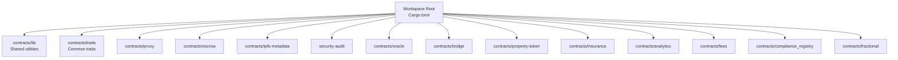
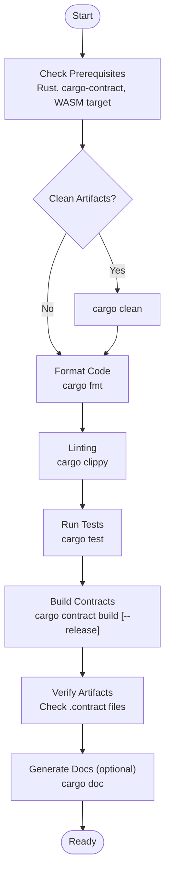
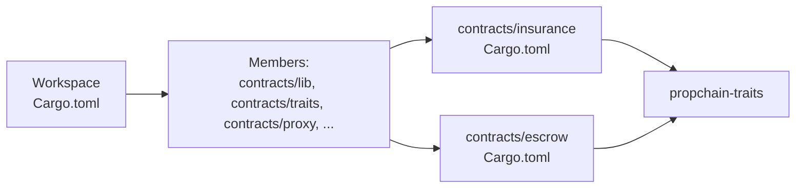

# Getting Started

<cite>
**Referenced Files in This Document**
- [README.md](file://README.md)
- [Cargo.toml](file://stellar-insured-contracts/Cargo.toml)
- [rust-toolchain.toml](file://stellar-insured-contracts/rust-toolchain.toml)
- [setup.sh](file://stellar-insured-contracts/scripts/setup.sh)
- [build.sh](file://stellar-insured-contracts/scripts/build.sh)
- [deployment.md](file://stellar-insured-contracts/docs/deployment.md)
- [testing-guide.md](file://stellar-insured-contracts/docs/testing-guide.md)
- [troubleshooting-faq.md](file://stellar-insured-contracts/docs/troubleshooting-faq.md)
- [contracts/insurance/Cargo.toml](file://stellar-insured-contracts/contracts/insurance/Cargo.toml)
- [contracts/escrow/Cargo.toml](file://stellar-insured-contracts/contracts/escrow/Cargo.toml)
</cite>

## Table of Contents
1. [Introduction](#introduction)
2. [Project Structure](#project-structure)
3. [Core Components](#core-components)
4. [Architecture Overview](#architecture-overview)
5. [Detailed Component Analysis](#detailed-component-analysis)
6. [Dependency Analysis](#dependency-analysis)
7. [Performance Considerations](#performance-considerations)
8. [Troubleshooting Guide](#troubleshooting-guide)
9. [Conclusion](#conclusion)
10. [Appendices](#appendices)

## Introduction
This guide helps you set up a local development environment for the Stellar Insured contracts and start building, testing, and deploying on Soroban. It covers prerequisites, environment setup, building contracts, running tests, configuring networks, and verifying your installation. The content is designed for developers new to Soroban and blockchain development.

## Project Structure
The repository is a Rust workspace containing multiple contracts and shared libraries. The top-level workspace configuration defines common dependencies and profiles, while individual contracts define their own dependencies and features.

**Diagram sources**
- [Cargo.toml:1-18](file://stellar-insured-contracts/Cargo.toml#L1-L18)

**Section sources**
- [Cargo.toml:1-45](file://stellar-insured-contracts/Cargo.toml#L1-L45)

## Core Components
- Workspace configuration defines Rust edition, license, and shared dependencies across contracts.
- Toolchain configuration pins the Rust channel, adds formatting and linting tools, and enables the WebAssembly target required for Soroban.
- Scripts automate environment setup, building, testing, and verification.

Key setup and build commands:
- Build contracts: cargo contract build (development) or cargo contract build --release (optimized)
- Run tests: cargo test --all-features
- Verify environment: use the provided setup and build scripts

Verification steps:
- Confirm Rust and cargo-contract are installed and the wasm32-unknown-unknown target is available.
- Run the setup script to install dependencies and build contracts.
- Execute tests to validate the environment.

**Section sources**
- [README.md:143-154](file://README.md#L143-L154)
- [rust-toolchain.toml:4-8](file://stellar-insured-contracts/rust-toolchain.toml#L4-L8)
- [setup.sh:37-65](file://stellar-insured-contracts/scripts/setup.sh#L37-L65)
- [build.sh:42-63](file://stellar-insured-contracts/scripts/build.sh#L42-L63)

## Architecture Overview
The development workflow centers around building contracts for the Soroban virtual machine and testing them locally before deployment. The scripts coordinate prerequisite checks, formatting, linting, testing, building, and verification.

**Diagram sources**
- [build.sh:42-63](file://stellar-insured-contracts/scripts/build.sh#L42-L63)
- [build.sh:80-98](file://stellar-insured-contracts/scripts/build.sh#L80-L98)
- [build.sh:100-122](file://stellar-insured-contracts/scripts/build.sh#L100-L122)
- [build.sh:124-148](file://stellar-insured-contracts/scripts/build.sh#L124-L148)
- [build.sh:150-172](file://stellar-insured-contracts/scripts/build.sh#L150-L172)
- [build.sh:174-187](file://stellar-insured-contracts/scripts/build.sh#L174-L187)

## Detailed Component Analysis

### Prerequisites and Environment Setup
- Install Rust (latest stable) and ensure cargo-contract is available.
- Add the wasm32-unknown-unknown target for WebAssembly compilation.
- Optionally install pre-commit hooks for automated checks.

Setup script highlights:
- Installs Rust if missing, adds WASM target, installs cargo-contract, and sets up pre-commit hooks.
- Builds contracts and runs tests to validate the environment.

Verification checklist:
- rustc --version
- cargo --version
- rustup target list | grep wasm32-unknown-unknown
- cargo contract --version

**Section sources**
- [setup.sh:37-65](file://stellar-insured-contracts/scripts/setup.sh#L37-L65)
- [setup.sh:100-122](file://stellar-insured-contracts/scripts/setup.sh#L100-L122)
- [rust-toolchain.toml:4-8](file://stellar-insured-contracts/rust-toolchain.toml#L4-L8)

### Building Contracts
- Use cargo contract build for development builds.
- Use cargo contract build --release for optimized production builds.
- The build script automates building all contracts in the workspace and supports a release mode flag.

Build modes:
- Development: cargo contract build
- Release: cargo contract build --release

Artifacts:
- Compiled contract files (.contract) are placed under target directories per contract.

**Section sources**
- [deployment.md:14-32](file://stellar-insured-contracts/docs/deployment.md#L14-L32)
- [build.sh:124-148](file://stellar-insured-contracts/scripts/build.sh#L124-L148)

### Running Tests
- Run all tests with cargo test --all-features.
- The testing guide outlines test organization, coverage targets, and best practices.
- Scripts also support running contract-specific tests.

Test categories:
- Unit tests for individual functions
- Edge case tests for boundary conditions
- Property-based tests for randomized inputs
- Integration tests for cross-contract interactions
- Performance benchmarks

**Section sources**
- [testing-guide.md:258-282](file://stellar-insured-contracts/docs/testing-guide.md#L258-L282)
- [build.sh:100-122](file://stellar-insured-contracts/scripts/build.sh#L100-L122)

### Network Configuration and Wallets
- The repository focuses on Substrate-based deployments in its documentation. For Soroban/Testnet usage, align with the general prerequisites and network configuration described in the root README.
- Network: Stellar Testnet
- Execution: Soroban VM
- Wallets: Non-custodial Stellar wallets

Note: The deployment documentation references Substrate networks and tools. For Soroban/Testnet, ensure you have the appropriate Soroban CLI and wallet configured according to the general prerequisites.

**Section sources**
- [README.md:155-161](file://README.md#L155-L161)
- [deployment.md:60-98](file://stellar-insured-contracts/docs/deployment.md#L60-L98)

### Quick Start: Deploying Contracts with Soroban CLI
While the repository’s deployment guide references Substrate, the general workflow for Soroban/Testnet follows these steps:
- Build contracts in release mode using cargo contract build --release.
- Upload the compiled contract code to the network.
- Instantiate the contract with constructor arguments and salt.
- Verify the deployment and initialize contract state as needed.

Reference commands:
- Build: cargo contract build --release
- Upload: cargo contract upload
- Instantiate: cargo contract instantiate
- Info: cargo contract info

**Section sources**
- [README.md:187-196](file://README.md#L187-L196)
- [deployment.md:80-98](file://stellar-insured-contracts/docs/deployment.md#L80-L98)

### Verification Steps
After setting up:
- Confirm Rust and WASM target are installed.
- Run cargo contract build and cargo test to validate the environment.
- Use cargo contract info to inspect deployed contracts locally if applicable.

**Section sources**
- [setup.sh:100-122](file://stellar-insured-contracts/scripts/setup.sh#L100-L122)
- [build.sh:150-172](file://stellar-insured-contracts/scripts/build.sh#L150-L172)

## Dependency Analysis
The workspace aggregates multiple contracts and shared modules. Dependencies are declared at the workspace level and inherited by member crates. Individual contracts specify their own dependencies and features.

**Diagram sources**
- [Cargo.toml:1-18](file://stellar-insured-contracts/Cargo.toml#L1-L18)
- [contracts/insurance/Cargo.toml:15-22](file://stellar-insured-contracts/contracts/insurance/Cargo.toml#L15-L22)
- [contracts/escrow/Cargo.toml:14-21](file://stellar-insured-contracts/contracts/escrow/Cargo.toml#L14-L21)

**Section sources**
- [Cargo.toml:1-45](file://stellar-insured-contracts/Cargo.toml#L1-L45)
- [contracts/insurance/Cargo.toml:15-37](file://stellar-insured-contracts/contracts/insurance/Cargo.toml#L15-L37)
- [contracts/escrow/Cargo.toml:14-37](file://stellar-insured-contracts/contracts/escrow/Cargo.toml#L14-L37)

## Performance Considerations
- Use cargo contract build --release for optimized builds suitable for production.
- Keep tests focused and isolated to minimize CI time.
- Prefer fixtures and generators to reduce test setup overhead.
- Monitor gas usage and optimize heavy operations.

[No sources needed since this section provides general guidance]

## Troubleshooting Guide
Common issues and resolutions:
- Compliance verification failures: Ensure accounts are verified and consent is granted.
- Bridge timeouts and insufficient signatures: Confirm operator thresholds and monitor statuses.
- IPFS CID validation errors: Validate CID format and length.
- Premium calculation discrepancies: Align risk parameters and check oracle updates.

FAQ highlights:
- Token compatibility standards
- Data privacy mechanisms
- Un-tokenization process
- Malicious operator safeguards
- Property valuation frequency

**Section sources**
- [troubleshooting-faq.md:7-38](file://stellar-insured-contracts/docs/troubleshooting-faq.md#L7-L38)
- [troubleshooting-faq.md:40-56](file://stellar-insured-contracts/docs/troubleshooting-faq.md#L40-L56)

## Conclusion
You now have the essentials to set up your development environment, build and test contracts, configure networks, and deploy on Soroban/Testnet. Use the provided scripts and documentation to streamline your workflow and maintain high-quality, secure contracts.

[No sources needed since this section summarizes without analyzing specific files]

## Appendices

### Appendix A: Step-by-Step Setup Checklist
- Install Rust (latest stable) and cargo-contract.
- Add wasm32-unknown-unknown target.
- Run the setup script to install pre-commit hooks and build contracts.
- Execute cargo test to verify the environment.
- Build contracts in release mode for deployment.

**Section sources**
- [setup.sh:37-65](file://stellar-insured-contracts/scripts/setup.sh#L37-L65)
- [setup.sh:86-98](file://stellar-insured-contracts/scripts/setup.sh#L86-L98)
- [build.sh:42-63](file://stellar-insured-contracts/scripts/build.sh#L42-L63)

### Appendix B: Build and Test Commands Reference
- Build: cargo contract build
- Build (release): cargo contract build --release
- Test: cargo test --all-features
- Coverage: cargo tarpaulin (as referenced in testing guide)

**Section sources**
- [deployment.md:14-32](file://stellar-insured-contracts/docs/deployment.md#L14-L32)
- [testing-guide.md:258-282](file://stellar-insured-contracts/docs/testing-guide.md#L258-L282)
- [testing-guide.md:236-247](file://stellar-insured-contracts/docs/testing-guide.md#L236-L247)