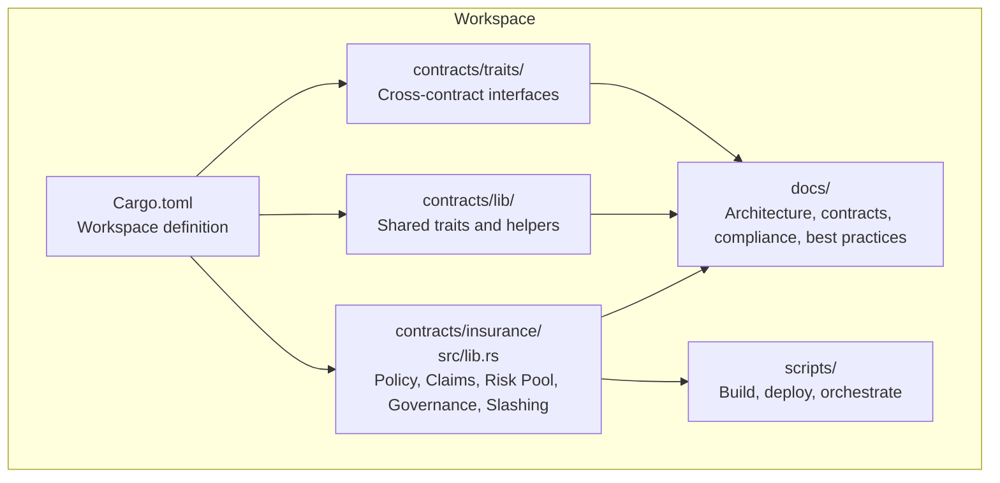
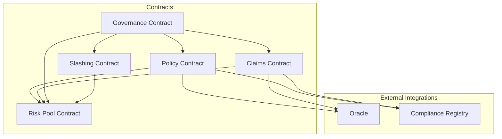
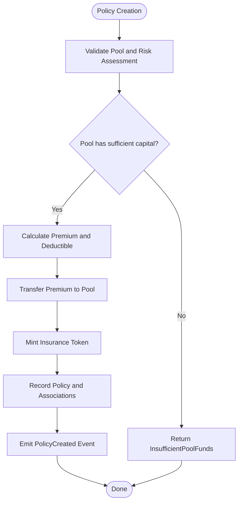
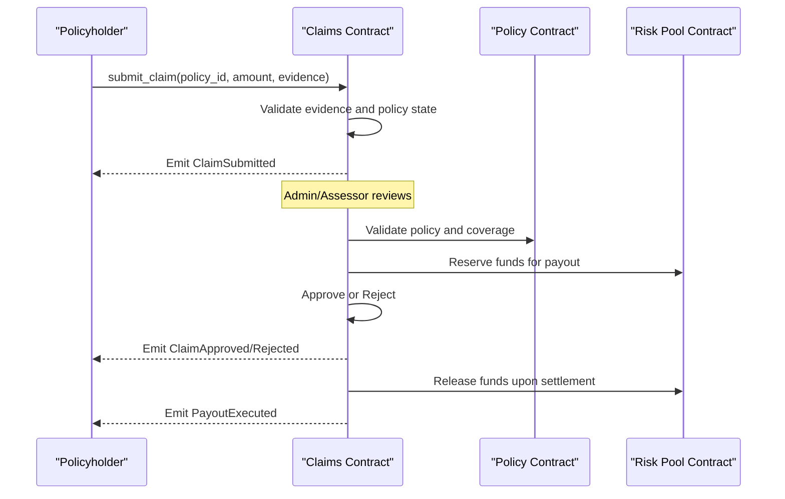
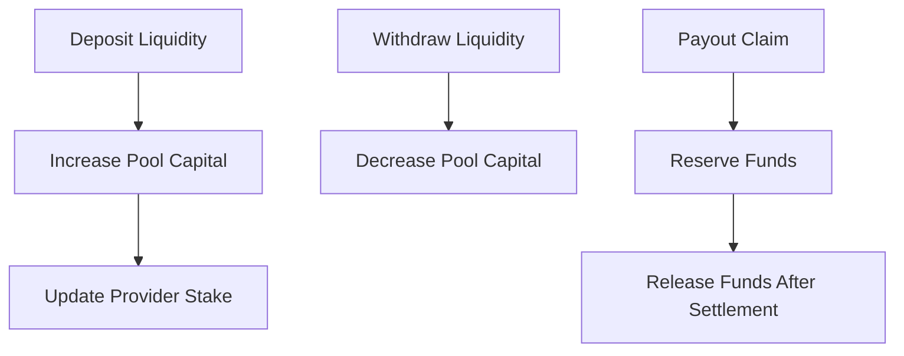
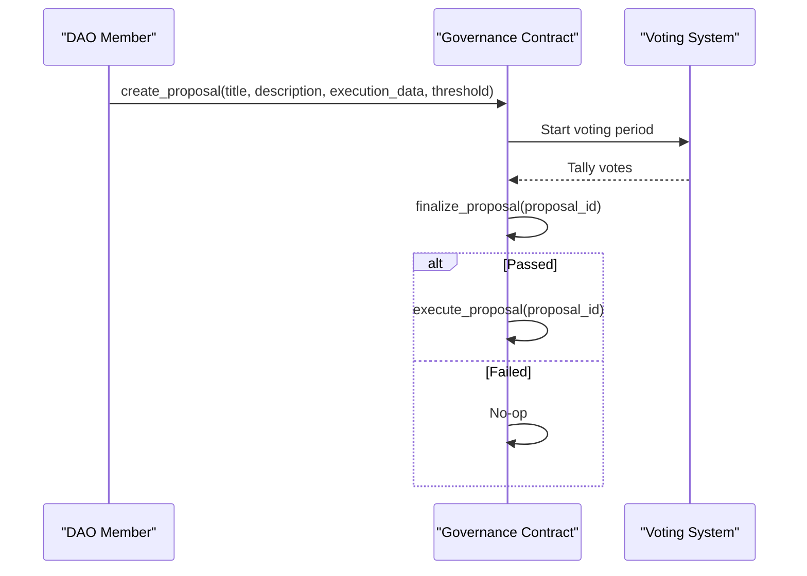
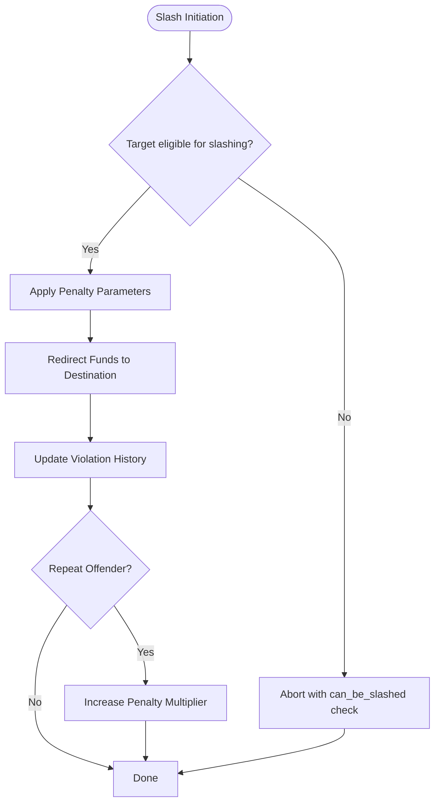
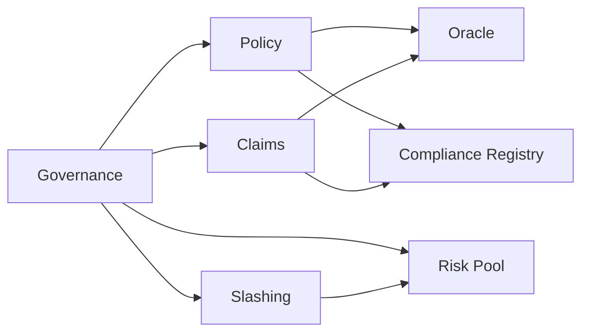

# Project Overview

<cite>
**Referenced Files in This Document**
- [README.md](file://README.md)
- [architecture.md](file://stellar-insured-contracts/docs/architecture.md)
- [contracts.md](file://stellar-insured-contracts/docs/contracts.md)
- [security_pipeline.md](file://stellar-insured-contracts/docs/security_pipeline.md)
- [best-practices.md](file://stellar-insured-contracts/docs/best-practices.md)
- [compliance-integration.md](file://stellar-insured-contracts/docs/compliance-integration.md)
- [Cargo.toml](file://stellar-insured-contracts/Cargo.toml)
- [lib.rs](file://stellar-insured-contracts/contracts/insurance/src/lib.rs)
</cite>

## Table of Contents
1. [Introduction](#introduction)
2. [Project Structure](#project-structure)
3. [Core Components](#core-components)
4. [Architecture Overview](#architecture-overview)
5. [Detailed Component Analysis](#detailed-component-analysis)
6. [Dependency Analysis](#dependency-analysis)
7. [Performance Considerations](#performance-considerations)
8. [Troubleshooting Guide](#troubleshooting-guide)
9. [Conclusion](#conclusion)
10. [Appendices](#appendices)

## Introduction
Stellar Insured is a decentralized insurance platform built on the Stellar Soroban blockchain. It provides a trustless, immutable, and transparent system for issuing policies, processing claims, operating risk pools, and governing protocol changes via a Decentralized Autonomous Organization (DAO). The platform targets policyholders, DAO members, auditors, and developers who require verifiable, deterministic, and secure insurance logic deployed on the Stellar network.

Key value propositions:
- Policyholders: Automated, transparent policy lifecycle with instant premium calculations and claims processing.
- DAO Members: Decentralized governance with proposal creation, voting, and execution workflows.
- Auditors: Deterministic execution, explicit authorization checks, and comprehensive event logging for full auditability.
- Developers: Upgradable, modular contracts, shared traits, and extensive documentation for integration.

Trustless and immutable characteristics:
- All logic is encoded on-chain with deterministic execution.
- State transitions are validated to prevent invalid flows.
- Admin-only authorization for sensitive operations and explicit checks for all privileged actions.

Security and compliance:
- Automated static analysis, dependency scanning, and formal verification in CI.
- Configurable slashing for malicious actors with penalty parameters and repeat-offender controls.
- Compliance integration patterns for KYC/AML and sanctions screening.

**Section sources**
- [README.md:1-216](file://README.md#L1-L216)

## Project Structure
The repository organizes contracts and documentation in a workspace layout supporting multiple interconnected modules. The insurance domain is implemented in a dedicated contract module with supporting libraries, traits, and documentation.

**Diagram sources**
- [Cargo.toml:1-45](file://stellar-insured-contracts/Cargo.toml#L1-L45)
- [lib.rs:1-200](file://stellar-insured-contracts/contracts/insurance/src/lib.rs#L1-L200)

**Section sources**
- [Cargo.toml:1-45](file://stellar-insured-contracts/Cargo.toml#L1-L45)
- [README.md:141-141](file://README.md#L141-L141)

## Core Components
The system comprises five primary components:

- Policy Contract: Manages policy issuance, lifecycle, and tokenization.
- Claims Contract: Processes claims with a multi-stage workflow and dispute resolution.
- Risk Pool Contract: Operates liquidity pools for claims settlement and reward distribution.
- Governance Contract: Enables DAO proposals, voting, and execution of protocol changes.
- Slashing Contract: Applies on-chain penalties for malicious or negligent behavior.

Each component exposes a well-defined API with constructors, state-changing messages, and read-only queries. Authorization and state validation are enforced across all sensitive operations.

**Section sources**
- [README.md:11-86](file://README.md#L11-L86)
- [contracts.md:1-372](file://stellar-insured-contracts/docs/contracts.md#L1-L372)

## Architecture Overview
The architecture follows a modular, contract-centric design with clear separation of concerns. Contracts interact through explicit interfaces and emit events for observability. Governance and risk pooling are integrated to ensure economic alignment and protocol sustainability.

**Diagram sources**
- [README.md:11-86](file://README.md#L11-L86)
- [architecture.md:1-432](file://stellar-insured-contracts/docs/architecture.md#L1-L432)

## Detailed Component Analysis

### Policy Contract
Responsibilities:
- Create and manage insurance policies with coverage amounts, premiums, and durations.
- Track policyholder ownership and property associations.
- Mint tradable insurance tokens representing policy ownership.
- Enforce underwriting criteria and risk assessments.

Key capabilities:
- Policy creation with premium validation and pool capital allocation.
- Policy cancellation and lifecycle transitions.
- Premium calculation based on risk scores and coverage types.
- Tokenization for secondary market trading.

**Diagram sources**
- [lib.rs:757-865](file://stellar-insured-contracts/contracts/insurance/src/lib.rs#L757-L865)

**Section sources**
- [lib.rs:568-865](file://stellar-insured-contracts/contracts/insurance/src/lib.rs#L568-L865)
- [contracts.md:87-105](file://stellar-insured-contracts/docs/contracts.md#L87-L105)

### Claims Contract
Responsibilities:
- Accept claims with structured evidence metadata.
- Route claims through a multi-stage workflow: Pending → UnderReview → Approved/Rejected → Disputed → DisputeResolved.
- Execute payouts for approved claims after deductibles.
- Integrate with risk pools for fund settlement.

**Diagram sources**
- [lib.rs:908-1076](file://stellar-insured-contracts/contracts/insurance/src/lib.rs#L908-L1076)
- [lib.rs:1346-1450](file://stellar-insured-contracts/contracts/insurance/src/lib.rs#L1346-L1450)

**Section sources**
- [lib.rs:908-1076](file://stellar-insured-contracts/contracts/insurance/src/lib.rs#L908-L1076)
- [README.md:28-52](file://README.md#L28-L52)

### Risk Pool Contract
Responsibilities:
- Manage liquidity deposits and withdrawals.
- Reserve funds for pending claims and release after settlement.
- Track provider stakes and reward accumulation.

**Diagram sources**
- [lib.rs:601-651](file://stellar-insured-contracts/contracts/insurance/src/lib.rs#L601-L651)

**Section sources**
- [lib.rs:601-651](file://stellar-insured-contracts/contracts/insurance/src/lib.rs#L601-L651)
- [README.md:53-67](file://README.md#L53-L67)

### Governance Contract
Responsibilities:
- Enable DAO members to create proposals, vote, and execute changes.
- Enforce voting periods, quorum, and threshold requirements.
- Facilitate slashing proposals and execution.

**Diagram sources**
- [README.md:86-106](file://README.md#L86-L106)

**Section sources**
- [README.md:86-106](file://README.md#L86-L106)

### Slashing Contract
Responsibilities:
- Define and apply penalties for slashable roles (e.g., oracles, claim submitters, governance participants).
- Configure penalty parameters, cooldowns, and fund destinations.
- Track violation history and repeat offenders.

**Diagram sources**
- [README.md:68-85](file://README.md#L68-L85)

**Section sources**
- [README.md:68-85](file://README.md#L68-L85)

## Dependency Analysis
The contracts form a cohesive ecosystem with explicit dependencies:
- Claims rely on Policy and Risk Pool contracts for validation and settlement.
- Governance orchestrates upgrades and parameter changes across all contracts.
- Slashing integrates with Governance and Risk Pool to enforce economic discipline.
- Oracles and Compliance Registry augment risk assessment and regulatory adherence.

**Diagram sources**
- [README.md:11-86](file://README.md#L11-L86)
- [architecture.md:1-432](file://stellar-insured-contracts/docs/architecture.md#L1-L432)

**Section sources**
- [README.md:11-86](file://README.md#L11-L86)
- [architecture.md:1-432](file://stellar-insured-contracts/docs/architecture.md#L1-L432)

## Performance Considerations
- Storage efficiency: Prefer compact data structures and minimize on-chain writes.
- Gas optimization: Batch operations where feasible and avoid redundant state reads.
- Off-chain metadata: Store large documents on IPFS and reference them on-chain.
- Event-driven UX: Subscribe to contract events to provide real-time feedback.

Best practices:
- Validate inputs rigorously and fail fast on invalid parameters.
- Use shared traits and consistent interfaces across integrations.
- Monitor contract events and implement proactive troubleshooting.

**Section sources**
- [best-practices.md:25-57](file://stellar-insured-contracts/docs/best-practices.md#L25-L57)
- [contracts.md:359-372](file://stellar-insured-contracts/docs/contracts.md#L359-L372)

## Troubleshooting Guide
Common issues and resolutions:
- Unauthorized operations: Ensure callers have proper roles (admin, authorized oracle, authorized assessor).
- State validation failures: Confirm policy status, claim workflow stage, and time-based constraints (e.g., dispute window).
- Insufficient funds: Verify pool capital availability and premium calculations.
- Compliance requirements: Enforce preconditions using compliance registry checks before high-value actions.

Security and audit tips:
- Review emitted events for anomaly detection.
- Use descriptive error codes to diagnose failures quickly.
- Implement rate limiting and input sanitization in client applications.

**Section sources**
- [README.md:163-178](file://README.md#L163-L178)
- [security_pipeline.md:1-58](file://stellar-insured-contracts/docs/security_pipeline.md#L1-L58)
- [compliance-integration.md:286-320](file://stellar-insured-contracts/docs/compliance-integration.md#L286-L320)

## Conclusion
Stellar Insured delivers a robust, transparent, and trustless insurance ecosystem on Soroban. Its modular architecture, deterministic execution, and strong security posture enable policyholders to manage coverage confidently, DAO members to govern the protocol effectively, auditors to verify outcomes, and developers to build integrations securely. The combination of risk pooling, governance, and on-chain slashing ensures economic resilience and accountability across the platform.

[No sources needed since this section summarizes without analyzing specific files]

## Appendices

### Compliance Integration Patterns
- Hybrid on-chain/off-chain verification with event-driven workflows.
- Batch processing for AML and sanctions checks.
- GDPR consent management and audit logging.

**Section sources**
- [compliance-integration.md:1-387](file://stellar-insured-contracts/docs/compliance-integration.md#L1-L387)

### Security Pipeline
- Static analysis with Clippy and custom security tool.
- Dependency scanning with Trivy and cargo-audit.
- Formal verification using Kani Rust Verifier.

**Section sources**
- [security_pipeline.md:1-58](file://stellar-insured-contracts/docs/security_pipeline.md#L1-L58)