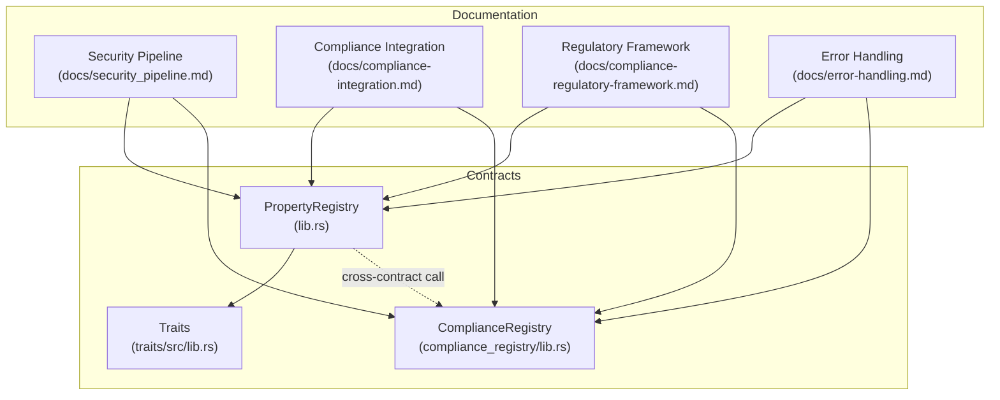
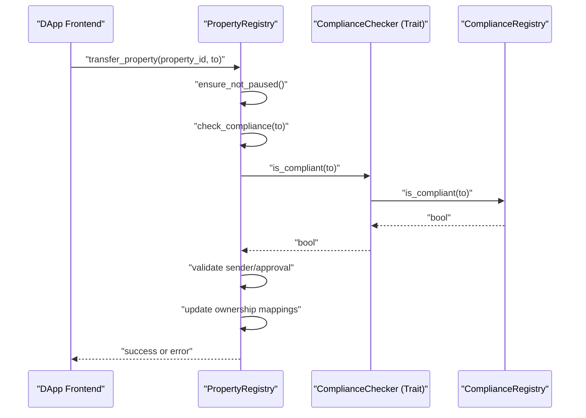
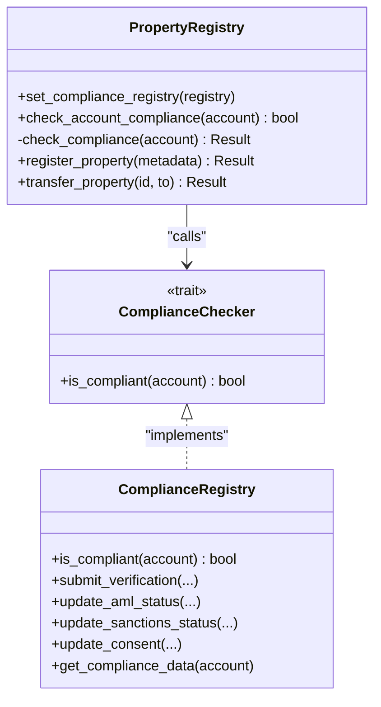
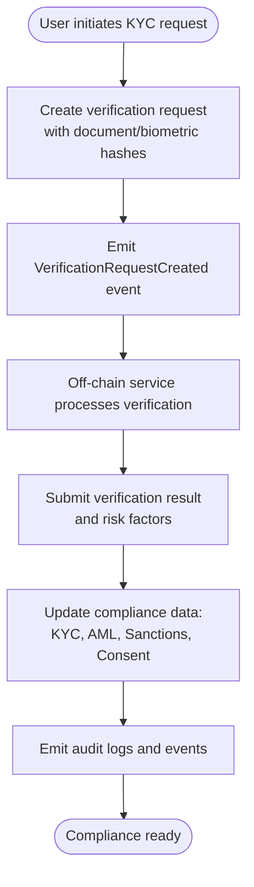
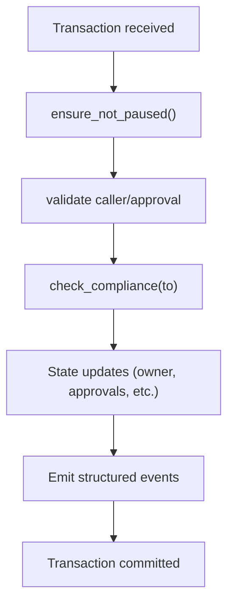
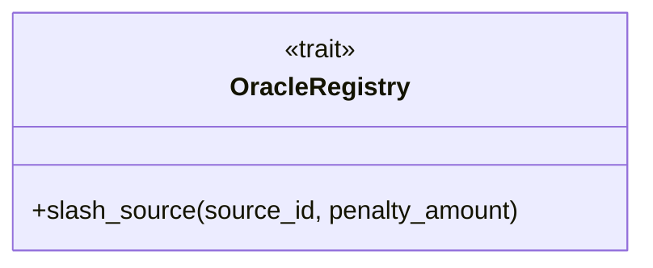
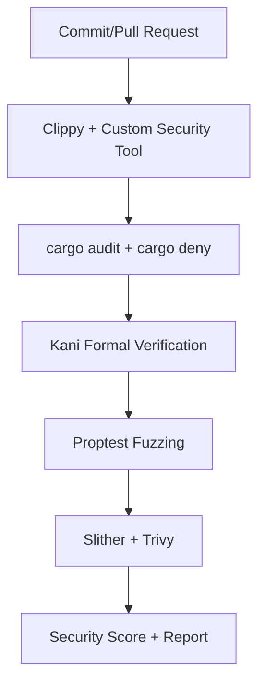
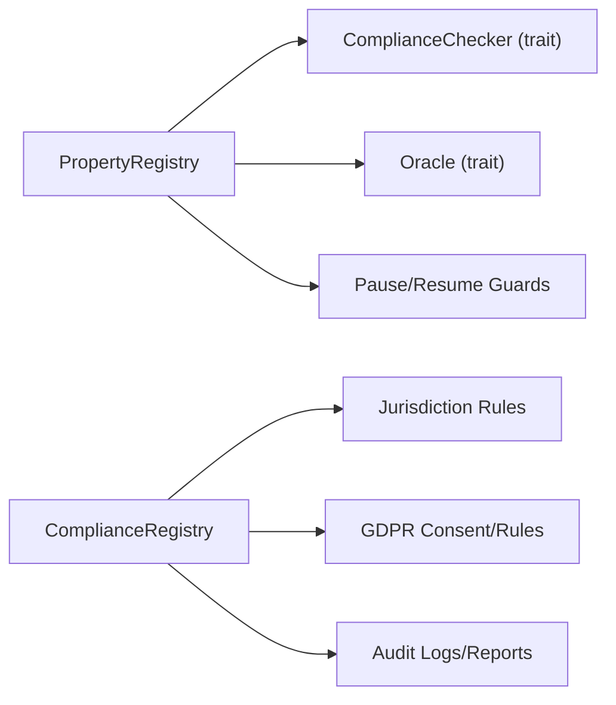

# Security & Compliance

<cite>
**Referenced Files in This Document**
- [SECURITY.md](file://SECURITY.md)
- [security_pipeline.md](file://docs/security_pipeline.md)
- [compliance-integration.md](file://docs/compliance-integration.md)
- [compliance-regulatory-framework.md](file://docs/compliance-regulatory-framework.md)
- [compliance-completion-checklist.md](file://docs/compliance-completion-checklist.md)
- [error-handling.md](file://docs/error-handling.md)
- [lib.rs](file://contracts/lib/src/lib.rs)
- [traits lib.rs](file://contracts/traits/src/lib.rs)
- [compliance_registry lib.rs](file://contracts/compliance_registry/lib.rs)
- [compliance_registry README.md](file://contracts/compliance_registry/README.md)
- [Cargo.toml](file://Cargo.toml)
</cite>

## Table of Contents
1. [Introduction](#introduction)
2. [Project Structure](#project-structure)
3. [Core Components](#core-components)
4. [Architecture Overview](#architecture-overview)
5. [Detailed Component Analysis](#detailed-component-analysis)
6. [Dependency Analysis](#dependency-analysis)
7. [Performance Considerations](#performance-considerations)
8. [Troubleshooting Guide](#troubleshooting-guide)
9. [Conclusion](#conclusion)
10. [Appendices](#appendices)

## Introduction
This document provides comprehensive security and compliance documentation for the insurance and property contracts ecosystem. It details the multi-layered security architecture, including authorization checks, state validation, and the professional on-chain compliance enforcement model. It also outlines the compliance framework integrating KYC/AML and regulatory reporting, along with determinism, error handling, and rate-limiting strategies. Finally, it includes audit readiness and transparency features of the immutable contract logic.

## Project Structure
The repository organizes security and compliance assets across:
- Contracts implementing on-chain logic (PropertyRegistry, ComplianceRegistry, Traits)
- Documentation covering security pipelines, compliance integration, regulatory frameworks, and error handling
- Workspace configuration enabling deterministic builds and release profiles

**Diagram sources**
- [lib.rs:940-972](file://contracts/lib/src/lib.rs#L940-L972)
- [traits lib.rs:715-721](file://contracts/traits/src/lib.rs#L715-L721)
- [compliance_registry lib.rs:603-635](file://contracts/compliance_registry/lib.rs#L603-L635)
- [compliance-integration.md:1-387](file://docs/compliance-integration.md#L1-L387)
- [compliance-regulatory-framework.md:1-89](file://docs/compliance-regulatory-framework.md#L1-L89)
- [security_pipeline.md:1-58](file://docs/security_pipeline.md#L1-L58)
- [error-handling.md:1-452](file://docs/error-handling.md#L1-L452)

**Section sources**
- [Cargo.toml:1-45](file://Cargo.toml#L1-L45)
- [compliance-integration.md:1-387](file://docs/compliance-integration.md#L1-L387)
- [compliance-regulatory-framework.md:1-89](file://docs/compliance-regulatory-framework.md#L1-L89)
- [security_pipeline.md:1-58](file://docs/security_pipeline.md#L1-L58)
- [error-handling.md:1-452](file://docs/error-handling.md#L1-L452)

## Core Components
- PropertyRegistry enforces compliance via cross-contract calls to a configured ComplianceRegistry and validates state transitions.
- ComplianceRegistry centralizes multi-jurisdictional rules, KYC/AML/sanctions checks, audit logs, and GDPR consent management.
- Traits define the ComplianceChecker interface and compliance operations used by PropertyRegistry.
- Security pipeline automates static analysis, dependency scanning, formal verification, fuzzing, and vulnerability scanning.
- Error handling categorizes and recovers from user/system/network/validation/authorization/state errors with structured messages and monitoring.

**Section sources**
- [lib.rs:921-972](file://contracts/lib/src/lib.rs#L921-L972)
- [compliance_registry lib.rs:603-635](file://contracts/compliance_registry/lib.rs#L603-L635)
- [traits lib.rs:715-721](file://contracts/traits/src/lib.rs#L715-L721)
- [SECURITY.md:1-30](file://SECURITY.md#L1-L30)
- [security_pipeline.md:1-58](file://docs/security_pipeline.md#L1-L58)
- [error-handling.md:1-452](file://docs/error-handling.md#L1-L452)

## Architecture Overview
The system enforces compliance at transaction boundaries and supports off-chain verification flows with on-chain auditability.

**Diagram sources**
- [lib.rs:1234-1290](file://contracts/lib/src/lib.rs#L1234-L1290)
- [lib.rs:943-959](file://contracts/lib/src/lib.rs#L943-L959)
- [traits lib.rs:715-721](file://contracts/traits/src/lib.rs#L715-L721)
- [compliance_registry lib.rs:603-635](file://contracts/compliance_registry/lib.rs#L603-L635)

## Detailed Component Analysis

### Compliance Enforcement Layer
- PropertyRegistry stores an optional ComplianceRegistry address and delegates compliance checks to it.
- ComplianceRegistry defines jurisdiction-specific rules, verification levels, risk scoring, and GDPR consent.
- Cross-contract call uses the ComplianceChecker trait to gate transfers and registrations.

**Diagram sources**
- [lib.rs:921-972](file://contracts/lib/src/lib.rs#L921-L972)
- [traits lib.rs:715-721](file://contracts/traits/src/lib.rs#L715-L721)
- [compliance_registry lib.rs:603-635](file://contracts/compliance_registry/lib.rs#L603-L635)

**Section sources**
- [lib.rs:921-972](file://contracts/lib/src/lib.rs#L921-L972)
- [traits lib.rs:715-721](file://contracts/traits/src/lib.rs#L715-L721)
- [compliance_registry lib.rs:603-635](file://contracts/compliance_registry/lib.rs#L603-L635)

### KYC/AML/Sanctions Integration
- Verification request lifecycle: create, off-chain processing, and result submission.
- Batch processing for AML and sanctions checks.
- Jurisdiction-aware rules and risk scoring.
- GDPR consent and data retention controls.

**Diagram sources**
- [compliance-integration.md:19-42](file://docs/compliance-integration.md#L19-L42)
- [compliance_registry lib.rs:488-562](file://contracts/compliance_registry/lib.rs#L488-L562)
- [compliance_registry lib.rs:643-709](file://contracts/compliance_registry/lib.rs#L643-L709)
- [compliance_registry lib.rs:732-759](file://contracts/compliance_registry/lib.rs#L732-L759)

**Section sources**
- [compliance-integration.md:1-387](file://docs/compliance-integration.md#L1-L387)
- [compliance-regulatory-framework.md:29-35](file://docs/compliance-regulatory-framework.md#L29-L35)
- [compliance_registry lib.rs:488-562](file://contracts/compliance_registry/lib.rs#L488-L562)
- [compliance_registry lib.rs:643-709](file://contracts/compliance_registry/lib.rs#L643-L709)
- [compliance_registry lib.rs:732-759](file://contracts/compliance_registry/lib.rs#L732-L759)

### Deterministic Execution and State Validation
- Determinism is ensured by strict build profiles and controlled runtime assumptions.
- State validation occurs via:
  - Pause/resume guardrails
  - Access control checks
  - Cross-contract compliance checks
  - Gas tracking and limits

**Diagram sources**
- [lib.rs:974-995](file://contracts/lib/src/lib.rs#L974-L995)
- [lib.rs:1183-1290](file://contracts/lib/src/lib.rs#L1183-L1290)
- [lib.rs:1360-1560](file://contracts/lib/src/lib.rs#L1360-L1560)

**Section sources**
- [Cargo.toml:33-44](file://Cargo.toml#L33-L44)
- [lib.rs:974-995](file://contracts/lib/src/lib.rs#L974-L995)
- [lib.rs:1183-1290](file://contracts/lib/src/lib.rs#L1183-L1290)

### Professional On-Chain Slashing System
- The repository defines a slashing-capable oracle registry trait with a dedicated slash method for invalid data sources.
- While not directly used in compliance, the slashing pattern is present and can be adapted for compliance-related misbehavior if needed.

**Diagram sources**
- [traits lib.rs:285-311](file://contracts/traits/src/lib.rs#L285-L311)

**Section sources**
- [traits lib.rs:285-311](file://contracts/traits/src/lib.rs#L285-L311)

### Security Pipeline and Automated Checks
- Static analysis, dependency scanning, formal verification, fuzzing, and vulnerability scanning are integrated into CI and local workflows.
- Security score derived from audit tool feedback.

**Diagram sources**
- [security_pipeline.md:1-58](file://docs/security_pipeline.md#L1-L58)
- [SECURITY.md:3-11](file://SECURITY.md#L3-L11)

**Section sources**
- [security_pipeline.md:1-58](file://docs/security_pipeline.md#L1-L58)
- [SECURITY.md:1-30](file://SECURITY.md#L1-L30)

### Error Handling and Recovery
- Comprehensive error categories and severity levels.
- Structured error messages with recovery guidance.
- Error rate monitoring and event emission for debugging.

**Section sources**
- [error-handling.md:1-452](file://docs/error-handling.md#L1-L452)

## Dependency Analysis
- PropertyRegistry depends on:
  - ComplianceChecker trait for cross-contract compliance checks
  - Oracle trait for valuation updates
  - Pause/resume guards for operational safety
- ComplianceRegistry depends on:
  - Jurisdiction rules and risk models
  - GDPR consent and retention policies
  - Audit logging and reporting structures

**Diagram sources**
- [lib.rs:921-972](file://contracts/lib/src/lib.rs#L921-L972)
- [traits lib.rs:715-721](file://contracts/traits/src/lib.rs#L715-L721)
- [compliance_registry lib.rs:412-478](file://contracts/compliance_registry/lib.rs#L412-L478)

**Section sources**
- [lib.rs:921-972](file://contracts/lib/src/lib.rs#L921-L972)
- [traits lib.rs:715-721](file://contracts/traits/src/lib.rs#L715-L721)
- [compliance_registry lib.rs:412-478](file://contracts/compliance_registry/lib.rs#L412-L478)

## Performance Considerations
- Deterministic builds and optimized release profile reduce variability and improve predictability.
- Gas tracking and structured events enable monitoring and tuning.
- Batch operations minimize gas costs for multi-property workflows.

[No sources needed since this section provides general guidance]

## Troubleshooting Guide
- Use documented error categories and recovery steps for common failures.
- Leverage compliance reports and audit logs for diagnostics.
- Validate jurisdiction rules and consent status before operations.

**Section sources**
- [error-handling.md:326-452](file://docs/error-handling.md#L326-L452)
- [compliance-regulatory-framework.md:37-41](file://docs/compliance-regulatory-framework.md#L37-L41)

## Conclusion
The contracts implement a robust, multi-layered security and compliance architecture with deterministic execution, strict access control, and comprehensive auditability. The compliance framework integrates KYC/AML/sanctions with GDPR controls and provides automated reporting. The security pipeline and error handling ensure resilience and operability, while the audit-ready design supports transparency and regulatory readiness.

[No sources needed since this section summarizes without analyzing specific files]

## Appendices

### Compliance Completion Checklist
- KYC integration, AML screening, sanctions list checks, privacy protection, and integration features are implemented and documented.
- PropertyRegistry integration with ComplianceRegistry is complete and tested.

**Section sources**
- [compliance-completion-checklist.md:1-117](file://docs/compliance-completion-checklist.md#L1-L117)

### Regulatory Framework Integration
- Multi-jurisdictional rules, transaction compliance checks, workflow management, and regulatory reporting are defined and implemented.

**Section sources**
- [compliance-regulatory-framework.md:1-89](file://docs/compliance-regulatory-framework.md#L1-L89)

### Security Best Practices and Incident Response
- Follow the documented security policy, incident response workflow, and best practices for safe development and deployment.

**Section sources**
- [SECURITY.md:12-29](file://SECURITY.md#L12-L29)

### Audit Readiness and Transparency
- Immutable contract logic, structured events, audit logs, and compliance reports support transparent and auditable operations.

**Section sources**
- [compliance_registry lib.rs:171-182](file://contracts/compliance_registry/lib.rs#L171-L182)
- [compliance-integration.md:254-284](file://docs/compliance-integration.md#L254-L284)