# Testing & Deployment

<cite>
**Referenced Files in This Document**
- [test.yml](file://.github/workflows/test.yml)
- [ci.yml](file://.github/workflows/ci.yml)
- [release.yml](file://.github/workflows/release.yml)
- [Cargo.toml](file://stellar-insured-contracts/Cargo.toml)
- [docker-compose.yml](file://stellar-insured-contracts/docker-compose.yml)
- [lib.rs](file://stellar-insured-contracts/tests/lib.rs)
- [test_utils.rs](file://stellar-insured-contracts/tests/test_utils.rs)
- [performance_benchmarks.rs](file://stellar-insured-contracts/tests/performance_benchmarks.rs)
- [testing-guide.md](file://stellar-insured-contracts/docs/testing-guide.md)
- [deployment.md](file://stellar-insured-contracts/docs/deployment.md)
</cite>

## Table of Contents
1. [Introduction](#introduction)
2. [Project Structure](#project-structure)
3. [Core Components](#core-components)
4. [Architecture Overview](#architecture-overview)
5. [Detailed Component Analysis](#detailed-component-analysis)
6. [Dependency Analysis](#dependency-analysis)
7. [Performance Considerations](#performance-considerations)
8. [Troubleshooting Guide](#troubleshooting-guide)
9. [Conclusion](#conclusion)
10. [Appendices](#appendices)

## Introduction
This document provides comprehensive guidance for testing and deploying the PropChain smart contracts. It covers the testing framework (unit, integration, and performance benchmarks), test utilities and patterns, local sandbox orchestration, contract compilation and deployment via cargo-contract, CI/CD pipelines with GitHub Actions, environment-specific deployment strategies (testnet, mainnet), upgrade and rollback mechanisms, and troubleshooting procedures.

## Project Structure
The repository organizes contracts, tests, documentation, and CI/CD workflows under a single workspace. Key areas:
- Workspace definition and profiles in Cargo.toml
- Contract modules under contracts/
- Shared test utilities and benchmarks under tests/
- Documentation under docs/
- CI/CD workflows under .github/workflows/

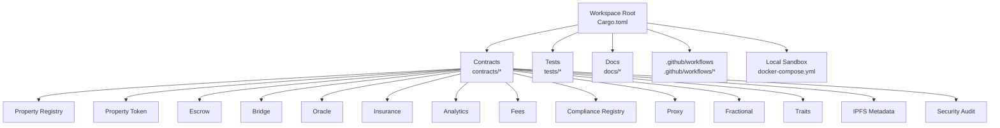

**Diagram sources**
- [Cargo.toml:1-45](file://stellar-insured-contracts/Cargo.toml#L1-L45)
- [docker-compose.yml:1-70](file://stellar-insured-contracts/docker-compose.yml#L1-L70)

**Section sources**
- [Cargo.toml:1-45](file://stellar-insured-contracts/Cargo.toml#L1-L45)
- [docker-compose.yml:1-70](file://stellar-insured-contracts/docker-compose.yml#L1-L70)

## Core Components
- Testing utilities and fixtures for consistent test data and environment manipulation
- Performance benchmarks to detect regressions and enforce latency budgets
- CI/CD workflows for automated testing, building, and deployment across environments
- Local sandbox orchestration using Docker Compose for off-chain services

Key capabilities:
- Shared test accounts and environment helpers
- Property metadata fixtures (minimal, standard, large, edge cases)
- Assertions and generators for property-based testing
- Performance measurement and benchmark suites
- CI jobs for unit tests, integration tests, security checks, and release builds
- Local node, IPFS, PostgreSQL, and Redis orchestration

**Section sources**
- [lib.rs:1-12](file://stellar-insured-contracts/tests/lib.rs#L1-L12)
- [test_utils.rs:1-288](file://stellar-insured-contracts/tests/test_utils.rs#L1-L288)
- [performance_benchmarks.rs:1-260](file://stellar-insured-contracts/tests/performance_benchmarks.rs#L1-L260)
- [ci.yml:10-89](file://.github/workflows/ci.yml#L10-L89)
- [docker-compose.yml:1-70](file://stellar-insured-contracts/docker-compose.yml#L1-L70)

## Architecture Overview
The testing and deployment architecture integrates local development, CI automation, and multi-environment deployments.

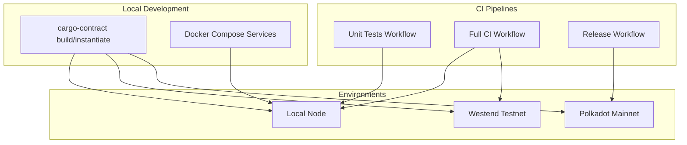

**Diagram sources**
- [ci.yml:235-272](file://.github/workflows/ci.yml#L235-L272)
- [release.yml:76-105](file://.github/workflows/release.yml#L76-L105)
- [deployment.md:34-132](file://stellar-insured-contracts/docs/deployment.md#L34-L132)
- [docker-compose.yml:1-70](file://stellar-insured-contracts/docker-compose.yml#L1-L70)

## Detailed Component Analysis

### Testing Framework
- Unit tests: executed per contract library and workspace-wide
- Integration tests: cross-contract and end-to-end scenarios
- Performance benchmarks: latency budgets and regression detection
- Test utilities: fixtures, environment helpers, assertions, generators, and performance measurement

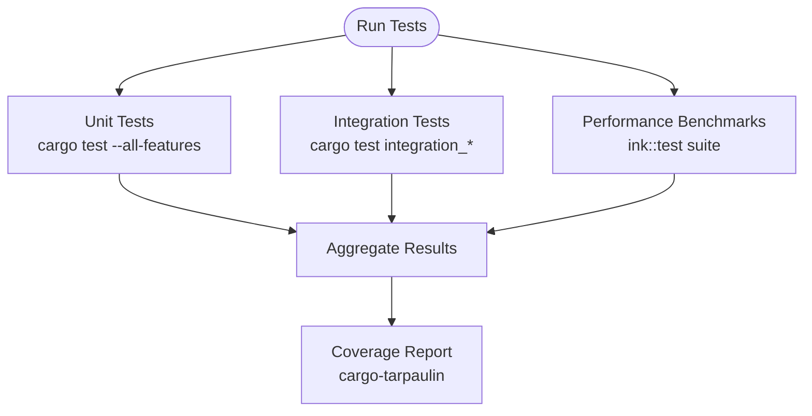

**Diagram sources**
- [ci.yml:50-66](file://.github/workflows/ci.yml#L50-L66)
- [performance_benchmarks.rs:10-260](file://stellar-insured-contracts/tests/performance_benchmarks.rs#L10-L260)
- [testing-guide.md:234-247](file://stellar-insured-contracts/docs/testing-guide.md#L234-L247)

**Section sources**
- [test.yml:23-50](file://.github/workflows/test.yml#L23-L50)
- [ci.yml:10-89](file://.github/workflows/ci.yml#L10-L89)
- [lib.rs:1-12](file://stellar-insured-contracts/tests/lib.rs#L1-L12)
- [test_utils.rs:1-288](file://stellar-insured-contracts/tests/test_utils.rs#L1-L288)
- [performance_benchmarks.rs:1-260](file://stellar-insured-contracts/tests/performance_benchmarks.rs#L1-L260)
- [testing-guide.md:371-387](file://stellar-insured-contracts/docs/testing-guide.md#L371-L387)

### Test Utilities and Mock Contracts
- TestAccounts: default accounts for deterministic testing
- PropertyMetadataFixtures: reusable fixtures for property metadata
- TestEnv: helpers to manipulate caller, timestamps, and transferred value
- Assertions and generators for property-based testing
- Performance measurement utilities for benchmarking

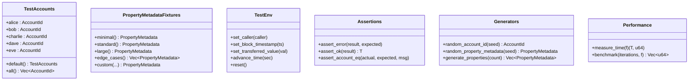

**Diagram sources**
- [test_utils.rs:13-158](file://stellar-insured-contracts/tests/test_utils.rs#L13-L158)
- [test_utils.rs:161-192](file://stellar-insured-contracts/tests/test_utils.rs#L161-L192)
- [test_utils.rs:195-225](file://stellar-insured-contracts/tests/test_utils.rs#L195-L225)
- [test_utils.rs:228-254](file://stellar-insured-contracts/tests/test_utils.rs#L228-L254)

**Section sources**
- [test_utils.rs:13-158](file://stellar-insured-contracts/tests/test_utils.rs#L13-L158)
- [test_utils.rs:161-192](file://stellar-insured-contracts/tests/test_utils.rs#L161-L192)
- [test_utils.rs:195-225](file://stellar-insured-contracts/tests/test_utils.rs#L195-L225)
- [test_utils.rs:228-254](file://stellar-insured-contracts/tests/test_utils.rs#L228-L254)

### Performance Benchmarks
- Registration, transfer, and query operations are benchmarked with explicit time budgets
- Stress tests validate scalability under high load
- Benchmarks use the test environment’s timestamp mechanism to measure execution time

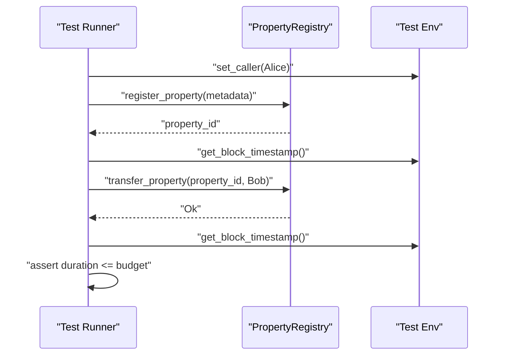

**Diagram sources**
- [performance_benchmarks.rs:29-121](file://stellar-insured-contracts/tests/performance_benchmarks.rs#L29-L121)

**Section sources**
- [performance_benchmarks.rs:20-85](file://stellar-insured-contracts/tests/performance_benchmarks.rs#L20-L85)
- [performance_benchmarks.rs:127-189](file://stellar-insured-contracts/tests/performance_benchmarks.rs#L127-L189)
- [performance_benchmarks.rs:195-258](file://stellar-insured-contracts/tests/performance_benchmarks.rs#L195-L258)

### CI/CD Pipelines
- Unit tests workflow: focused on library-level tests
- Full CI workflow: formatting, linting, unit tests, integration tests, contract builds, and security checks
- Bridge-specific tests job: targeted integration tests for the bridge module
- Security job: cargo-audit and cargo-deny checks
- Build job: release builds and artifact verification
- Deploy jobs: testnet and mainnet deployments via scripts and environment secrets
- Release workflow: creates GitHub releases and uploads build artifacts

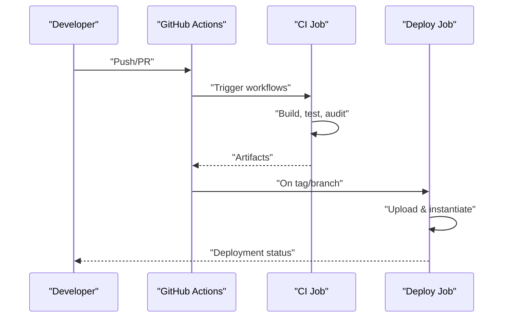

**Diagram sources**
- [test.yml:1-50](file://.github/workflows/test.yml#L1-L50)
- [ci.yml:9-349](file://.github/workflows/ci.yml#L9-L349)
- [release.yml:1-105](file://.github/workflows/release.yml#L1-L105)

**Section sources**
- [test.yml:1-50](file://.github/workflows/test.yml#L1-L50)
- [ci.yml:9-349](file://.github/workflows/ci.yml#L9-L349)
- [release.yml:1-105](file://.github/workflows/release.yml#L1-L105)

### Local Sandbox Orchestration
- Docker Compose provisions a local Substrate node, IPFS, PostgreSQL, and Redis
- Useful for end-to-end testing and local development without external dependencies

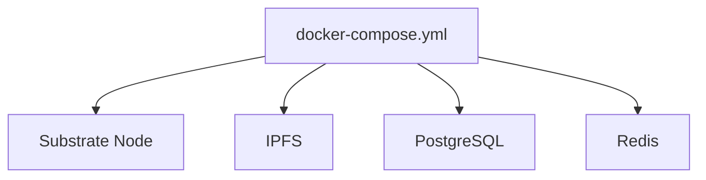

**Diagram sources**
- [docker-compose.yml:1-70](file://stellar-insured-contracts/docker-compose.yml#L1-L70)

**Section sources**
- [docker-compose.yml:1-70](file://stellar-insured-contracts/docker-compose.yml#L1-L70)

### Deployment Process
- Build contracts in debug or release mode
- Upload code and instantiate contracts on the chosen network
- Verify deployments and monitor post-deployment health
- Use environment-specific configuration and secrets

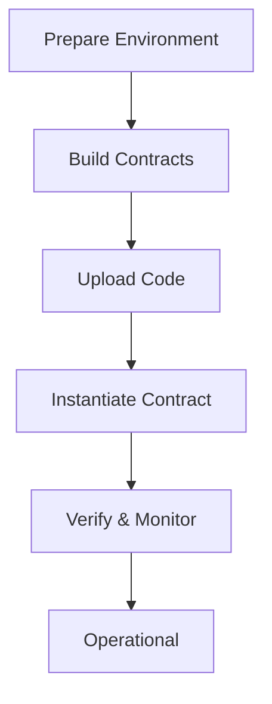

**Diagram sources**
- [deployment.md:12-132](file://stellar-insured-contracts/docs/deployment.md#L12-L132)

**Section sources**
- [deployment.md:12-132](file://stellar-insured-contracts/docs/deployment.md#L12-L132)

### Environment-Specific Strategies
- Testnet (Westend): automated deployment via CI on develop branch pushes
- Mainnet (Polkadot): manual trigger after release creation; requires multi-signature and emergency procedures

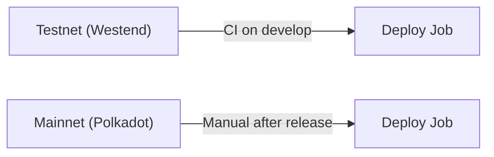

**Diagram sources**
- [ci.yml:235-272](file://.github/workflows/ci.yml#L235-L272)
- [release.yml:76-105](file://.github/workflows/release.yml#L76-L105)

**Section sources**
- [ci.yml:235-272](file://.github/workflows/ci.yml#L235-L272)
- [release.yml:76-105](file://.github/workflows/release.yml#L76-L105)

### Upgrade Mechanisms and Rollback
- Upgrade process: upload new code and migrate to new contract
- Emergency procedures: pause and emergency upgrade scripts referenced in documentation
- Post-deployment verification ensures successful migration

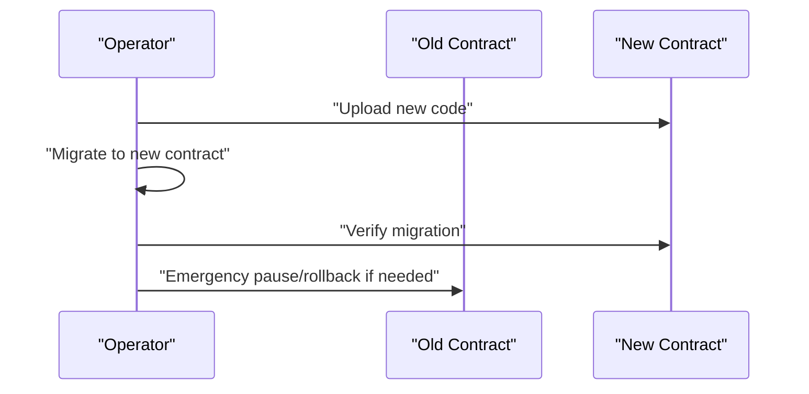

**Diagram sources**
- [deployment.md:190-201](file://stellar-insured-contracts/docs/deployment.md#L190-L201)
- [deployment.md:272-280](file://stellar-insured-contracts/docs/deployment.md#L272-L280)

**Section sources**
- [deployment.md:190-201](file://stellar-insured-contracts/docs/deployment.md#L190-L201)
- [deployment.md:272-280](file://stellar-insured-contracts/docs/deployment.md#L272-L280)

## Dependency Analysis
- Workspace members define all contract modules and shared libraries
- Profiles configure release vs dev builds
- CI workflows depend on cargo-contract and Rust toolchains
- Deployment scripts depend on environment variables and network URLs

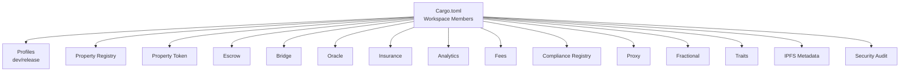

**Diagram sources**
- [Cargo.toml:1-45](file://stellar-insured-contracts/Cargo.toml#L1-L45)

**Section sources**
- [Cargo.toml:1-45](file://stellar-insured-contracts/Cargo.toml#L1-L45)

## Performance Considerations
- Use release builds for production deployments and performance-sensitive tests
- Enforce latency budgets in benchmarks to prevent regressions
- Prefer fixtures and generators to reduce test setup overhead
- Monitor gas usage and adjust limits when necessary

[No sources needed since this section provides general guidance]

## Troubleshooting Guide
Common issues and resolutions:
- Insufficient balance: check and top up account balances
- Gas limit exceeded: estimate gas and increase limits
- Transaction failures: inspect transaction status and re-run with verbose logs
- Coverage gaps: add tests for uncovered paths
- Non-deterministic test failures: avoid global state and reset environment between tests

**Section sources**
- [deployment.md:203-246](file://stellar-insured-contracts/docs/deployment.md#L203-L246)
- [testing-guide.md:388-408](file://stellar-insured-contracts/docs/testing-guide.md#L388-L408)

## Conclusion
The repository provides a robust testing and deployment framework for PropChain smart contracts. The combination of shared test utilities, performance benchmarks, CI/CD automation, and environment-specific deployment strategies ensures reliable development, validation, and operational procedures across local, testnet, and mainnet environments.

## Appendices
- Additional resources and references are documented in the testing and deployment guides.

[No sources needed since this section summarizes without analyzing specific files]