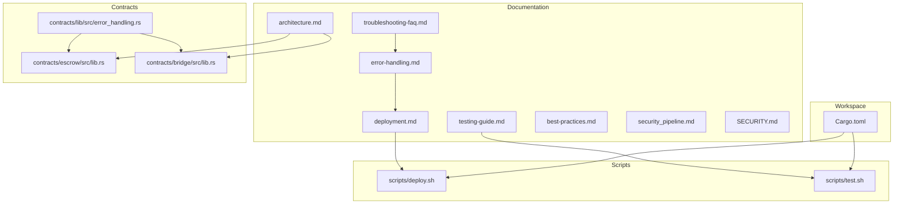
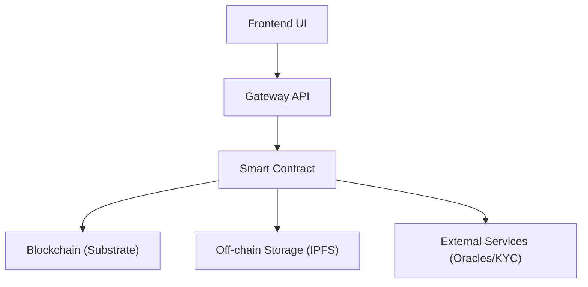
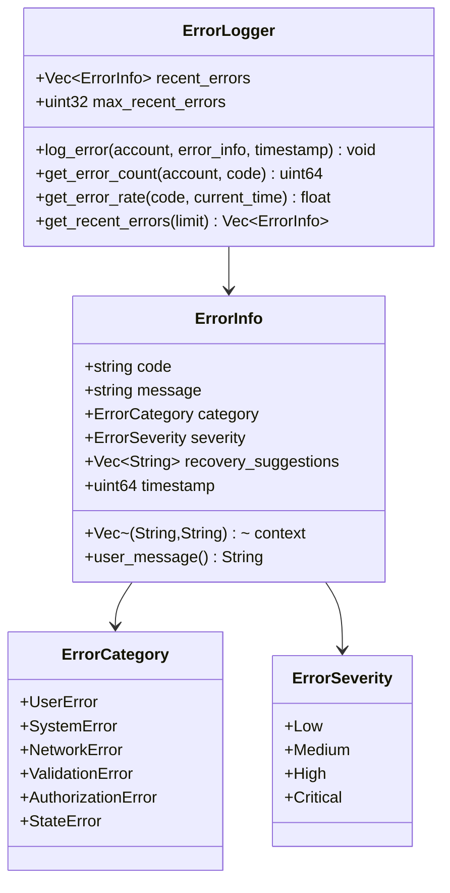
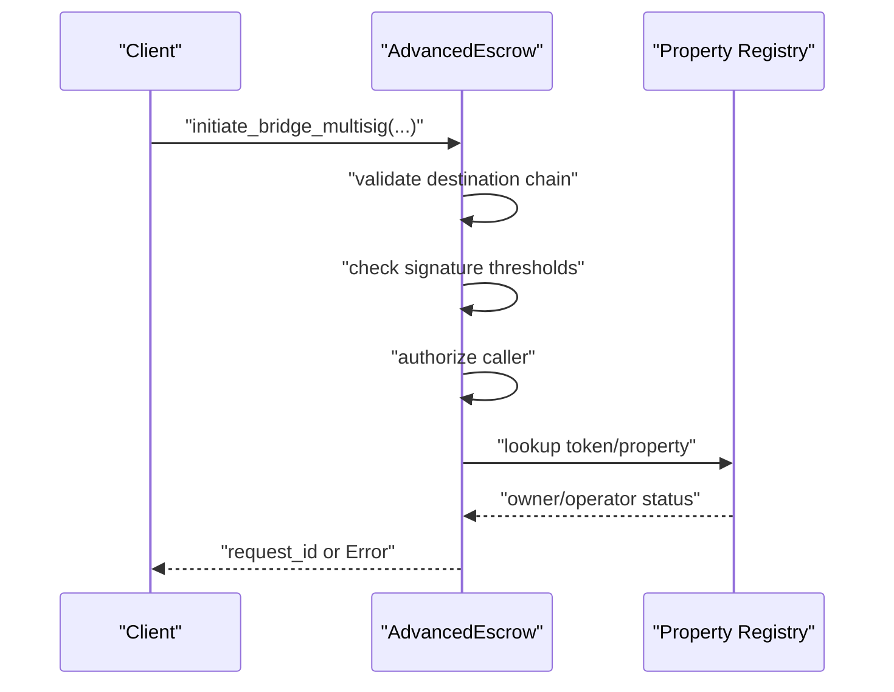
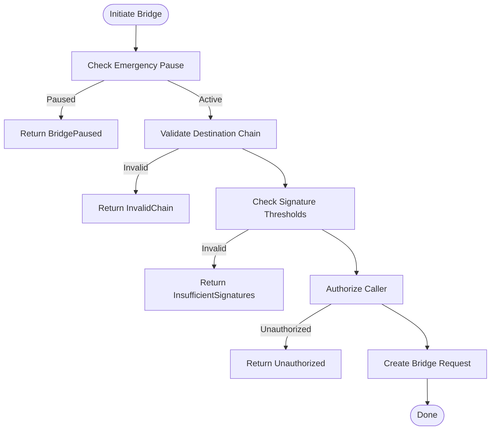
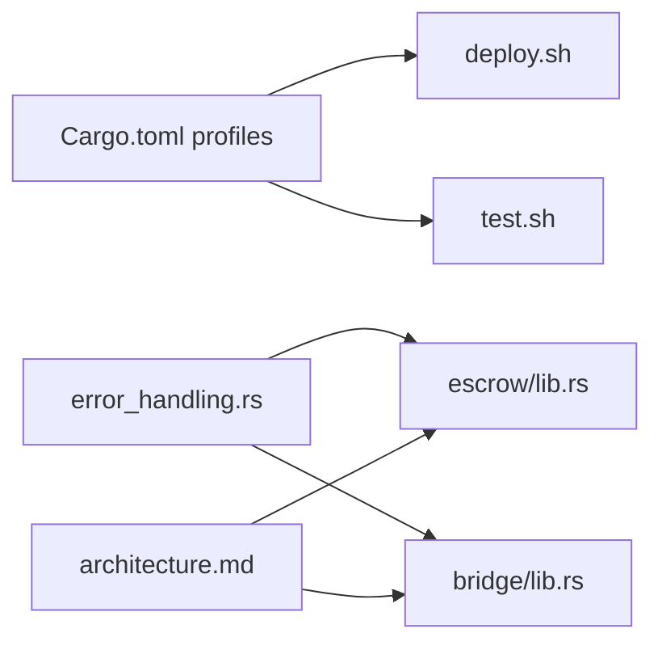

# Troubleshooting & FAQ

<cite>
**Referenced Files in This Document**
- [troubleshooting-faq.md](file://stellar-insured-contracts/docs/troubleshooting-faq.md)
- [error-handling.md](file://stellar-insured-contracts/docs/error-handling.md)
- [deployment.md](file://stellar-insured-contracts/docs/deployment.md)
- [testing-guide.md](file://stellar-insured-contracts/docs/testing-guide.md)
- [best-practices.md](file://stellar-insured-contracts/docs/best-practices.md)
- [architecture.md](file://stellar-insured-contracts/docs/architecture.md)
- [security_pipeline.md](file://stellar-insured-contracts/docs/security_pipeline.md)
- [SECURITY.md](file://stellar-insured-contracts/SECURITY.md)
- [Cargo.toml](file://stellar-insured-contracts/Cargo.toml)
- [deploy.sh](file://stellar-insured-contracts/scripts/deploy.sh)
- [test.sh](file://stellar-insured-contracts/scripts/test.sh)
- [error_handling.rs](file://stellar-insured-contracts/contracts/lib/src/error_handling.rs)
- [escrow/lib.rs](file://stellar-insured-contracts/contracts/escrow/src/lib.rs)
- [bridge/lib.rs](file://stellar-insured-contracts/contracts/bridge/src/lib.rs)
</cite>

## Table of Contents
1. [Introduction](#introduction)
2. [Project Structure](#project-structure)
3. [Core Components](#core-components)
4. [Architecture Overview](#architecture-overview)
5. [Detailed Component Analysis](#detailed-component-analysis)
6. [Dependency Analysis](#dependency-analysis)
7. [Performance Considerations](#performance-considerations)
8. [Troubleshooting Guide](#troubleshooting-guide)
9. [Conclusion](#conclusion)
10. [Appendices](#appendices)

## Introduction
This document consolidates troubleshooting and frequently asked questions for the PropChain smart contract system. It focuses on practical solutions for development, testing, and deployment issues; error handling and recovery workflows; debugging strategies for contract interactions and state validation; network connectivity and wallet authentication pitfalls; contract deployment failures; performance and gas optimization; memory considerations; upgrade and migration patterns; monitoring and logging; and escalation procedures.

## Project Structure
The repository organizes documentation, scripts, and contracts to support robust development and operations:
- Documentation: Troubleshooting, error handling, deployment, testing, best practices, architecture, security pipeline, and security policy.
- Scripts: Automated deployment and testing workflows.
- Contracts: Ink! smart contracts with shared libraries and error handling utilities.
- Workspace configuration: Cargo profiles and workspace metadata.

**Diagram sources**
- [troubleshooting-faq.md:1-56](file://stellar-insured-contracts/docs/troubleshooting-faq.md#L1-L56)
- [error-handling.md:1-452](file://stellar-insured-contracts/docs/error-handling.md#L1-L452)
- [deployment.md:1-372](file://stellar-insured-contracts/docs/deployment.md#L1-L372)
- [testing-guide.md:1-432](file://stellar-insured-contracts/docs/testing-guide.md#L1-L432)
- [best-practices.md:1-57](file://stellar-insured-contracts/docs/best-practices.md#L1-L57)
- [architecture.md:1-432](file://stellar-insured-contracts/docs/architecture.md#L1-L432)
- [security_pipeline.md:1-58](file://stellar-insured-contracts/docs/security_pipeline.md#L1-L58)
- [SECURITY.md:1-30](file://stellar-insured-contracts/SECURITY.md#L1-L30)
- [Cargo.toml:1-45](file://stellar-insured-contracts/Cargo.toml#L1-L45)
- [deploy.sh:1-373](file://stellar-insured-contracts/scripts/deploy.sh#L1-L373)
- [test.sh:1-409](file://stellar-insured-contracts/scripts/test.sh#L1-L409)
- [error_handling.rs:1-449](file://stellar-insured-contracts/contracts/lib/src/error_handling.rs#L1-L449)
- [escrow/lib.rs:1-200](file://stellar-insured-contracts/contracts/escrow/src/lib.rs#L1-L200)
- [bridge/lib.rs:1-200](file://stellar-insured-contracts/contracts/bridge/src/lib.rs#L1-L200)

**Section sources**
- [Cargo.toml:1-45](file://stellar-insured-contracts/Cargo.toml#L1-L45)
- [deploy.sh:1-373](file://stellar-insured-contracts/scripts/deploy.sh#L1-L373)
- [test.sh:1-409](file://stellar-insured-contracts/scripts/test.sh#L1-L409)

## Core Components
- Error handling and recovery: Structured categories, severity levels, recovery suggestions, and error logging utilities.
- Deployment automation: Multi-network deployment, verification, and emergency procedures.
- Testing framework: Coverage goals, test types, utilities, and CI integration.
- Best practices: Security-first design, gas efficiency, UX, and code quality guidelines.
- Architecture: Contract layer, data flow, integration points, security measures, and upgrade patterns.
- Security pipeline: Static analysis, dependency scanning, formal verification, and CI integration.

**Section sources**
- [error-handling.md:1-452](file://stellar-insured-contracts/docs/error-handling.md#L1-L452)
- [deployment.md:1-372](file://stellar-insured-contracts/docs/deployment.md#L1-L372)
- [testing-guide.md:1-432](file://stellar-insured-contracts/docs/testing-guide.md#L1-L432)
- [best-practices.md:1-57](file://stellar-insured-contracts/docs/best-practices.md#L1-L57)
- [architecture.md:1-432](file://stellar-insured-contracts/docs/architecture.md#L1-L432)
- [security_pipeline.md:1-58](file://stellar-insured-contracts/docs/security_pipeline.md#L1-L58)

## Architecture Overview
The system integrates frontend/UI, gateway/API, smart contracts, and off-chain storage/services. Contracts emit events for observability, and the architecture supports multi-signature, time locks, and proxy-based upgrades.

**Diagram sources**
- [architecture.md:33-45](file://stellar-insured-contracts/docs/architecture.md#L33-L45)

**Section sources**
- [architecture.md:1-432](file://stellar-insured-contracts/docs/architecture.md#L1-L432)

## Detailed Component Analysis

### Error Handling and Recovery
- Categories: UserError, SystemError, NetworkError, ValidationError, AuthorizationError, StateError.
- Severity: Low, Medium, High, Critical.
- Utilities: ErrorInfo builder, error logging, error rate tracking, safe unwrap/expect helpers.
- Recovery workflows: Categorized recovery suggestions and remediation steps.

**Diagram sources**
- [error_handling.rs:16-124](file://stellar-insured-contracts/contracts/lib/src/error_handling.rs#L16-L124)
- [error_handling.rs:127-195](file://stellar-insured-contracts/contracts/lib/src/error_handling.rs#L127-L195)
- [error_handling.rs:197-288](file://stellar-insured-contracts/contracts/lib/src/error_handling.rs#L197-L288)

**Section sources**
- [error-handling.md:7-84](file://stellar-insured-contracts/docs/error-handling.md#L7-L84)
- [error-handling.md:265-325](file://stellar-insured-contracts/docs/error-handling.md#L265-L325)
- [error_handling.rs:1-449](file://stellar-insured-contracts/contracts/lib/src/error_handling.rs#L1-L449)

### Escrow Contract Interactions
- Key errors: EscrowNotFound, Unauthorized, InsufficientFunds, ConditionsNotMet, SignatureThresholdNotMet, TimeLockActive.
- Multi-signature approvals, time locks, and dispute handling.
- Events: EscrowCreated, FundsDeposited, FundsReleased, FundsRefunded, DisputeRaised, DocumentUploaded.

**Diagram sources**
- [escrow/lib.rs:16-56](file://stellar-insured-contracts/contracts/escrow/src/lib.rs#L16-L56)
- [escrow/lib.rs:135-162](file://stellar-insured-contracts/contracts/escrow/src/lib.rs#L135-L162)
- [bridge/lib.rs:16-30](file://stellar-insured-contracts/contracts/bridge/src/lib.rs#L16-L30)
- [bridge/lib.rs:166-200](file://stellar-insured-contracts/contracts/bridge/src/lib.rs#L166-L200)

**Section sources**
- [escrow/lib.rs:1-200](file://stellar-insured-contracts/contracts/escrow/src/lib.rs#L1-L200)
- [bridge/lib.rs:1-200](file://stellar-insured-contracts/contracts/bridge/src/lib.rs#L1-L200)

### Bridge Contract Interactions
- Key errors: Unauthorized, TokenNotFound, InvalidChain, BridgeNotSupported, InsufficientSignatures, RequestExpired, AlreadySigned, InvalidRequest, BridgePaused, InvalidMetadata, DuplicateRequest, GasLimitExceeded.
- Multi-signature bridge requests, timeouts, and recovery actions.

**Diagram sources**
- [bridge/lib.rs:16-30](file://stellar-insured-contracts/contracts/bridge/src/lib.rs#L16-L30)
- [bridge/lib.rs:166-200](file://stellar-insured-contracts/contracts/bridge/src/lib.rs#L166-L200)

**Section sources**
- [bridge/lib.rs:1-200](file://stellar-insured-contracts/contracts/bridge/src/lib.rs#L1-L200)

### Testing and Coverage
- Coverage targets: 95%+ across modules.
- Test types: Unit, edge case, property-based, integration, performance.
- Utilities: Fixtures, test accounts, environment helpers.
- CI integration and reporting.

**Section sources**
- [testing-guide.md:7-16](file://stellar-insured-contracts/docs/testing-guide.md#L7-L16)
- [testing-guide.md:158-232](file://stellar-insured-contracts/docs/testing-guide.md#L158-L232)
- [test.sh:1-409](file://stellar-insured-contracts/scripts/test.sh#L1-L409)

### Deployment and Verification
- Multi-network support: local, testnet, mainnet.
- Build and verification steps, gas estimation, and emergency procedures.
- CI/CD pipeline automation.

**Section sources**
- [deployment.md:12-32](file://stellar-insured-contracts/docs/deployment.md#L12-L32)
- [deployment.md:203-246](file://stellar-insured-contracts/docs/deployment.md#L203-L246)
- [deploy.sh:1-373](file://stellar-insured-contracts/scripts/deploy.sh#L1-L373)

### Security Pipeline and Best Practices
- Static analysis, dependency scanning, formal verification, fuzzing, gas optimization analysis.
- Security incident response workflow and best practices.

**Section sources**
- [security_pipeline.md:1-58](file://stellar-insured-contracts/docs/security_pipeline.md#L1-L58)
- [SECURITY.md:1-30](file://stellar-insured-contracts/SECURITY.md#L1-L30)
- [best-practices.md:5-57](file://stellar-insured-contracts/docs/best-practices.md#L5-L57)

## Dependency Analysis
- Workspace profile tuning affects build characteristics (optimization, panic strategy).
- Scripts orchestrate deployment and testing across networks.
- Contracts share error handling utilities and event-driven architecture.

**Diagram sources**
- [Cargo.toml:33-44](file://stellar-insured-contracts/Cargo.toml#L33-L44)
- [deploy.sh:1-373](file://stellar-insured-contracts/scripts/deploy.sh#L1-L373)
- [test.sh:1-409](file://stellar-insured-contracts/scripts/test.sh#L1-L409)
- [error_handling.rs:1-449](file://stellar-insured-contracts/contracts/lib/src/error_handling.rs#L1-L449)
- [escrow/lib.rs:1-200](file://stellar-insured-contracts/contracts/escrow/src/lib.rs#L1-L200)
- [bridge/lib.rs:1-200](file://stellar-insured-contracts/contracts/bridge/src/lib.rs#L1-L200)
- [architecture.md:1-432](file://stellar-insured-contracts/docs/architecture.md#L1-L432)

**Section sources**
- [Cargo.toml:33-44](file://stellar-insured-contracts/Cargo.toml#L33-L44)
- [deploy.sh:1-373](file://stellar-insured-contracts/scripts/deploy.sh#L1-L373)
- [test.sh:1-409](file://stellar-insured-contracts/scripts/test.sh#L1-L409)

## Performance Considerations
- Gas optimization: efficient data structures, minimal storage operations, batch processing, lazy evaluation.
- Memory: avoid large allocations; use mappings; off-chain storage for heavy metadata.
- Benchmarks and coverage: continuous measurement to detect regressions.

**Section sources**
- [architecture.md:261-321](file://stellar-insured-contracts/docs/architecture.md#L261-L321)
- [best-practices.md:25-34](file://stellar-insured-contracts/docs/best-practices.md#L25-L34)
- [testing-guide.md:317-341](file://stellar-insured-contracts/docs/testing-guide.md#L317-L341)

## Troubleshooting Guide

### Common Issues and Resolutions
- Compliance verification failures: Ensure KYC/AML verification, check expiration, and confirm GDPR consent.
- Bridge request timeouts: Operators offline or congestion; unlock tokens via recovery or retry with higher gas/timeout.
- Insufficient signatures on bridge execution: Verify required signatures and monitor bridge status.
- IPFS CID validation errors: Validate CID format and length.
- Premium calculation discrepancies: Match parameters, check valuation updates, consider pool utilization and reinsurance.

**Section sources**
- [troubleshooting-faq.md:7-55](file://stellar-insured-contracts/docs/troubleshooting-faq.md#L7-L55)

### Error Handling and Recovery Workflows
- Categorize errors (User/System/Network/Validation/Authorization/State).
- Apply recovery suggestions and escalate based on severity.
- Monitor error rates and recent errors for patterns.

**Section sources**
- [error-handling.md:71-84](file://stellar-insured-contracts/docs/error-handling.md#L71-L84)
- [error-handling.md:311-325](file://stellar-insured-contracts/docs/error-handling.md#L311-L325)
- [error_handling.rs:127-195](file://stellar-insured-contracts/contracts/lib/src/error_handling.rs#L127-L195)

### Contract Interaction Debugging
- Use events to track state changes and operation outcomes.
- Validate authorization and state transitions before invoking messages.
- For bridge operations, confirm chain support, signature thresholds, and request expiration.

**Section sources**
- [architecture.md:369-391](file://stellar-insured-contracts/docs/architecture.md#L369-L391)
- [escrow/lib.rs:164-200](file://stellar-insured-contracts/contracts/escrow/src/lib.rs#L164-L200)
- [bridge/lib.rs:63-113](file://stellar-insured-contracts/contracts/bridge/src/lib.rs#L63-L113)

### Network Connectivity and Wallet Authentication
- Ensure SURI/environment variables are set for non-local networks.
- Use network-specific RPC endpoints and verify connectivity.
- For multi-signature deployments, coordinate signers and thresholds.

**Section sources**
- [deployment.md:62-98](file://stellar-insured-contracts/docs/deployment.md#L62-L98)
- [deploy.sh:58-92](file://stellar-insured-contracts/scripts/deploy.sh#L58-L92)
- [deployment.md:262-280](file://stellar-insured-contracts/docs/deployment.md#L262-L280)

### Contract Deployment Failures
- Insufficient balances: check and top up accounts.
- Gas limit exceeded: estimate gas usage and increase limits.
- Transaction failures: inspect transaction status and enable verbose output.

**Section sources**
- [deployment.md:207-246](file://stellar-insured-contracts/docs/deployment.md#L207-L246)

### Performance, Gas Optimization, and Memory
- Batch operations to reduce gas costs.
- Store large metadata off-chain and reference via IPFS.
- Minimize state changes and use efficient data structures.
- Monitor gas usage and error rates; run benchmarks and coverage.

**Section sources**
- [best-practices.md:25-34](file://stellar-insured-contracts/docs/best-practices.md#L25-L34)
- [architecture.md:261-321](file://stellar-insured-contracts/docs/architecture.md#L261-L321)
- [testing-guide.md:317-341](file://stellar-insured-contracts/docs/testing-guide.md#L317-L341)

### Contract Upgrades, State Migrations, and Integration Patterns
- Proxy pattern for upgrades; maintain backward compatibility.
- Migration strategy: snapshot, transform, validate, deploy, migrate, verify.
- Integration patterns: event-driven monitoring, health checks, and graceful degradation.

**Section sources**
- [architecture.md:323-364](file://stellar-insured-contracts/docs/architecture.md#L323-L364)
- [architecture.md:365-406](file://stellar-insured-contracts/docs/architecture.md#L365-L406)

### Monitoring and Logging Best Practices
- Enable error logging and rate tracking.
- Subscribe to contract events for real-time feedback.
- Set up alerts for high error rates and anomalies.
- Maintain logs for debugging and trend analysis.

**Section sources**
- [error-handling.md:311-325](file://stellar-insured-contracts/docs/error-handling.md#L311-L325)
- [best-practices.md:36-45](file://stellar-insured-contracts/docs/best-practices.md#L36-L45)

### Escalation Procedures and Support Resources
- Report issues with error code/message, contract address, transaction hash, reproduction steps, and expected vs actual behavior.
- Follow security incident response workflow for vulnerabilities.
- Utilize CI/CD and security pipeline outputs for diagnostics.

**Section sources**
- [error-handling.md:433-452](file://stellar-insured-contracts/docs/error-handling.md#L433-L452)
- [SECURITY.md:18-29](file://stellar-insured-contracts/SECURITY.md#L18-L29)
- [security_pipeline.md:45-58](file://stellar-insured-contracts/docs/security_pipeline.md#L45-L58)

## Conclusion
This guide consolidates actionable troubleshooting steps, error handling patterns, and operational best practices for the PropChain smart contract system. By leveraging structured error categories, comprehensive testing and deployment scripts, security pipeline outputs, and observability through events and logging, teams can accelerate development, improve reliability, and maintain secure, performant operations across networks.

## Appendices

### Frequently Asked Questions
- Standards compatibility: PropChain tokens are compatible with ERC-721 and ERC-1155.
- Data privacy: Encrypted hashes and ZK proofs protect compliance data.
- Un-tokenization: Tokens can be burned and property status updated accordingly.
- Malicious bridge operators: Multi-signature threshold prevents single-operator compromise.
- Valuation frequency: Depends on oracle configuration; high-volatility markets update more frequently.

**Section sources**
- [troubleshooting-faq.md:40-55](file://stellar-insured-contracts/docs/troubleshooting-faq.md#L40-L55)